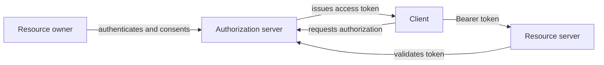
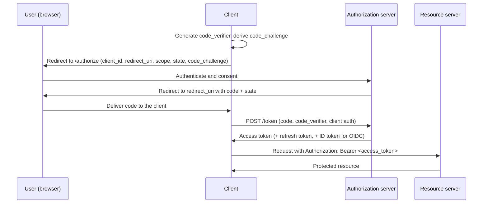
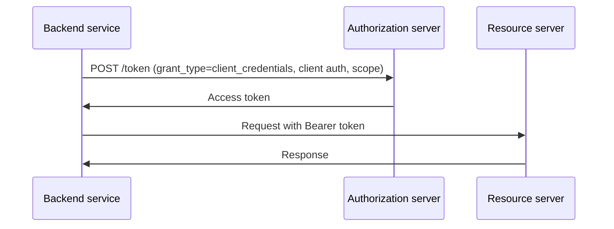
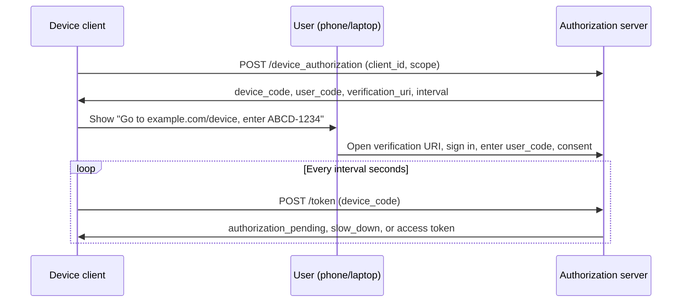

# OAuth 2.0

OAuth 2.0 is an authorization framework that lets a client access a user's resources without ever handling the user's password.

A user delegates limited access to a third-party app (for example, "Sign in with Google" or "Connect your GitHub account").

**Core idea**: The client gets an **access token** covering a narrow slice of the user's permissions, never the user's credentials.

This document covers the framework, its flows, and how a resource server enforces the tokens it issues. For the HTTP conventions those tokens ride on, see [REST API](../fundamentals/05-rest-api.md).

## Authentication vs authorization

These are related but different:

- **Authentication**: "Who are you?" (identity verification)
- **Authorization**: "What are you allowed to do?" (permission check)

OAuth 2.0 is an **authorization** protocol. It issues tokens whose scopes define what a client may access, and it deliberately says nothing about how the user proved their identity to the authorization server.

Login identity is layered on top by **OpenID Connect (OIDC)**, which extends OAuth 2.0 with ID tokens and standardized identity claims.

The classic mistake is treating a successful access token as proof of who the user is. An access token is addressed to the resource server, not to the client, so a client that infers identity from one can be fooled by a token minted for a different app. When you need identity, use OIDC.

## OAuth 2.0 roles

| Role                 | Description                        | Example                              |
| -------------------- | ---------------------------------- | ------------------------------------ |
| Resource owner       | User who owns the data             | End user                             |
| Client               | App requesting access              | Web app, mobile app, backend service |
| Authorization server | Issues tokens after consent        | Google, Auth0, Okta, Keycloak        |
| Resource server      | API that holds protected resources | Gmail API, GitHub API                |

The authorization server and resource server are often run by the same organization, but they are separate responsibilities: one mints tokens, the other enforces them.

## Tokens and other artifacts

| Artifact           | Typical lifetime    | Held by                 | Purpose                                                 |
| ------------------ | ------------------- | ----------------------- | ------------------------------------------------------- |
| Authorization code | Seconds, single use | Client, briefly         | Exchanged at the token endpoint for tokens              |
| Access token       | 5 to 60 minutes     | Client, sent to the API | Calls protected APIs as `Authorization: Bearer <token>` |
| Refresh token      | Days to months      | Client, stored securely | Gets new access tokens without user interaction         |
| ID token (OIDC)    | Minutes             | Client only             | Proves who the user is, never sent to an API            |

**Scope** is not a token but a parameter that rides along with them: a permission boundary such as `read:profile` or `write:repo`, requested at `/authorize` and stamped into the issued token.

Access tokens come in two shapes, **opaque** (a random string the resource server must ask about) and **JWT** (self-contained and signed). That choice drives how the resource server validates them, covered below.

## Front channel vs back channel

Two transport paths, and the difference explains most of OAuth's design:

- **Front channel**: Data passed through the user's browser via redirects, in the query string or URL fragment. Convenient, but visible in browser history, referrer headers, and access logs, and reachable by anything that can register the redirect target.
- **Back channel**: A direct server-to-server HTTPS call between the client and the authorization server. The browser never sees it.

OAuth sends a low-value, single-use **authorization code** over the front channel and exchanges it for tokens over the **back channel**. The flow that failed historically (implicit) is the one that put tokens on the front channel.

## Choosing a flow

| Situation                                                 | Flow                      |
| --------------------------------------------------------- | ------------------------- |
| Any app with a user present: web app, SPA, mobile, native | Authorization code + PKCE |
| No user at all: service to service, cron job, ETL         | Client credentials        |
| Input-constrained device: TV, CLI, IoT                    | Device authorization      |
| Access token expired, user should not be re-prompted      | Refresh token             |
| Anything else (implicit, password grant)                  | Avoid, legacy             |

The in-progress OAuth 2.1 consolidation formalizes exactly this shortlist: authorization code with PKCE, client credentials, and device authorization, with the legacy grants removed.

## Authorization code flow with PKCE

The default for anything with a user in front of it, and the flow you should reach for unless the prompt rules it out.

PKCE (Proof Key for Code Exchange) was originally designed for public clients such as SPAs and mobile apps that cannot keep a client secret. Current guidance (the OAuth 2.0 Security Best Current Practice, and OAuth 2.1) applies it to confidential clients too, so treat "authorization code" and "authorization code + PKCE" as the same flow rather than as a base flow plus a variant.

**Step by step:**

1. Client generates a random `code_verifier` and derives `code_challenge = BASE64URL(SHA-256(code_verifier))`
2. Client redirects the browser to `/authorize` with `response_type=code`, `client_id`, `redirect_uri`, `scope`, `state`, `code_challenge`, and `code_challenge_method=S256`
3. User authenticates at the authorization server and approves the requested scopes
4. Authorization server redirects back to the registered `redirect_uri` with `code` and the original `state`
5. Client checks that `state` matches the value it stored for this browser session
6. Client calls `/token` with `grant_type=authorization_code`, `code`, `redirect_uri`, `code_verifier`, plus client authentication if it is a confidential client
7. Authorization server checks the code is unused, unexpired, issued to this `client_id` and `redirect_uri`, and that SHA-256 of `code_verifier` matches the stored `code_challenge`
8. Client receives the tokens and calls APIs with `Authorization: Bearer <access_token>`

**What each protection buys you:**

- **`state`**: Binds the callback to the browser session that started the flow. Without it, an attacker can feed their own authorization code into your callback URL and get the victim's account silently linked to the attacker's account at the provider (login CSRF).
- **PKCE**: Binds the code to the client instance that requested it. An attacker who steals the code from the redirect (a malicious app registered for the same custom URI scheme, a leaked referrer, shared browser history) cannot exchange it, because they do not hold the `code_verifier`.
- **Exact redirect URI matching**: The authorization server compares against registered URIs by exact string, not by prefix or wildcard, so a code cannot be steered to an attacker-controlled path on an otherwise trusted host.
- **Back-channel exchange**: Tokens are returned on a direct server-to-server call, so they never appear in a URL.

Use `code_challenge_method=S256`. The `plain` method sends the verifier itself in the authorization request and protects against nothing that can read that request.

**Why this flow is preferred:**

- The user's password never reaches the client app
- The access token is obtained over the back channel, not through the browser
- A refresh token can stay on the backend only

## Client credentials flow

For machine-to-machine communication where no user is involved. The token's subject is the client itself, so there is no consent step and no user context.

**Use cases:**

- Cron jobs calling internal APIs
- Microservice-to-microservice access
- ETL pipelines

No refresh token is issued: the client holds its own credentials and can simply request a new token when the old one expires. Cache the token until shortly before `exp` rather than fetching one per request.

Scopes still matter here. A single all-powerful service client that every internal caller shares is the machine equivalent of a shared root password; issue one client per service with only the scopes that service needs.

When a service must call another service **on behalf of the calling user**, client credentials loses that context, since the downstream service only sees the caller. The options are to forward the user's original access token (simple, but widens that token's audience) or to use token exchange (RFC 8693) to swap it for a token scoped to the downstream service.

## Device authorization flow

For input-constrained devices (TV, CLI, IoT) where typing credentials or following a browser redirect is awkward.

The device polls the token endpoint at the `interval` the server returned. It receives `authorization_pending` until the user finishes, `slow_down` if it polls too aggressively, and `expired_token` if the user never completes the approval. Because the `user_code` is short enough for a person to retype, it must be short-lived and rate-limited, or it becomes guessable.

## Refresh tokens and session lifetime

Short access token lifetimes limit the damage of a leaked token, but on their own they would force the user to log in again every few minutes. Refresh tokens resolve that tension: the access token is short-lived and widely presented, while the long-lived session lives in a refresh token that only ever travels between the client and the authorization server.

**Typical pattern:**

1. Access token expires (for example, after 1 hour)
2. Client calls `/token` with `grant_type=refresh_token`
3. Authorization server returns a new access token, and usually a new refresh token

**Rotation and reuse detection**: With rotation, every refresh returns a fresh refresh token and invalidates the previous one. If an already-used refresh token is ever presented again, two parties hold it, so the authorization server revokes the entire token family and forces re-authentication. Current guidance is that public clients must either rotate refresh tokens this way or bind them to the client (mTLS, DPoP).

A refresh token is a long-lived credential, so where it is kept matters far more than where the access token is kept. Storage per client type is covered under *Storing tokens on the client* below.

Revoking a refresh token (RFC 7009) is what actually ends a session. Revoking a self-contained JWT access token usually does nothing until it expires, which is why short access token lifetimes matter.

## Deprecated or discouraged flows

### Implicit flow (legacy)

Returns the access token directly in the redirect URI fragment, with no code exchange.
It existed because browsers could not make cross-origin calls to a token endpoint before CORS was widely supported.
It has three problems:

- Puts the token on the front channel
- Cannot deliver a refresh token safely
- Gives the authorization server no way to authenticate the client at exchange time

Replaced by authorization code + PKCE, which every major provider now supports for browser apps.

### Resource owner password credentials (legacy)

The client collects the username and password and posts them to the token endpoint. This defeats the point of OAuth: the client sees the password, and the flow cannot support MFA, step-up authentication, or federated login, because the authorization server never gets to interact with the user directly. Acceptable only for highly trusted first-party clients during a migration, never for third-party integrations. Removed in OAuth 2.1.

## Scopes and least privilege

Scopes limit what a token can do. They express **delegated consent**: what the user allowed this app to attempt.

They are not a complete authorization system. Scope answers "did the user let this app do this?"; the resource server's own access control still has to answer "is this user allowed to touch this particular record?". A token carrying `write:repo` for Alice must still not be able to write to Bob's repository.

**Good practice:**

- Request the minimum scope needed (`read:profile`, not `admin:*`), and request incrementally: ask for calendar access the first time the user opens the calendar feature, not during signup
- Name scopes after an action and a resource (`read:repo`, `write:repo`), and keep the vocabulary stable, since scopes are a public API contract
- Enforce scopes at the resource server on every request; never assume the client only calls what it asked for
- Keep the consent screen honest about what each scope actually grants

**Example check:**

- **Token scope**: `read:repo`
- **Request**: `DELETE /repos/123`
- **Result**: `403 Forbidden` with `WWW-Authenticate: Bearer error="insufficient_scope", scope="write:repo"`

## Validating tokens at the resource server

The resource server is where authorization is actually enforced, and how it validates depends on the token format.

| Aspect     | Opaque token                                               | JWT access token                                                |
| ---------- | ---------------------------------------------------------- | --------------------------------------------------------------- |
| Format     | Random string, meaningless on its own                      | Signed JSON with claims, readable by anyone holding it          |
| Validation | Call the introspection endpoint (RFC 7662)                 | Verify the signature locally against the issuer's public keys   |
| Cost       | A network call per request unless results are cached       | Local check, no hot-path network call                           |
| Revocation | Immediate, the authorization server is the source of truth | Not until `exp`, unless you add a revocation check              |
| Leakage    | Reveals nothing about the user or the grant                | Claims are signed, not encrypted, so anything inside is exposed |

Checks a resource server must make on a JWT access token:

1. **Signature**, against the key whose `kid` matches, fetched from the issuer's `jwks_uri`
2. **`iss`** matches the expected authorization server exactly
3. **`aud`** names this resource server. Skipping this is the confused deputy bug: a token issued for a low-value API gets replayed against a high-value one
4. **`exp`** and `nbf`, with a small allowance for clock skew
5. **`scope`** (or `scp`) contains what this endpoint requires
6. Application-level authorization on `sub`: does this user actually own the object being touched?

Cache the JWKS key set rather than fetching it per request, and refresh it when an unknown `kid` appears so that provider key rotation does not cause an outage.

A common hybrid is to introspect an opaque token once at the API gateway and pass a short-lived internal JWT to the services behind it, which keeps revocation immediate at the edge while avoiding an introspection call per internal hop.

**Revoking JWT access tokens** is the awkward case, and the reason "log out everywhere" is hard. The usual answers: keep access tokens short so the window is small, revoke the refresh token so no new access tokens are issued, and for high-value operations check a small denylist of revoked token IDs (`jti`) or a per-user "tokens issued before this timestamp are invalid" marker.

**Sender-constrained tokens** are the next step up. A bearer token is usable by anyone who holds it; mTLS-bound tokens (RFC 8705) and DPoP (RFC 9449) bind a token to a key the client proves it holds, so a stolen token alone is useless. Worth raising for payments, banking, or any high-value API.

## OAuth and API design

How tokens surface in an HTTP API. See [REST API](../fundamentals/05-rest-api.md) for the status code and error-shape conventions this builds on.

- **Transport**: `Authorization: Bearer <token>`, header only. Never a query parameter, since URLs end up in logs, referrers, and browser history.
- **401 vs 403**: Return `401 Unauthorized` when the token is missing, expired, or invalid, and `403 Forbidden` when the token is valid but lacks the required scope or permission. Both should carry `WWW-Authenticate: Bearer` with an `error` value (`invalid_token`, `insufficient_scope`) so a client can tell "refresh my token" from "ask the user for more scope".
- **Client retry behavior**: A `401 invalid_token` justifies exactly one refresh and one retry; a second failure means re-authenticate. A `403` should never be retried with the same token.
- **Where to validate**: An API gateway can check signature, issuer, audience, expiry, and coarse scope once for every service behind it. Per-resource authorization ("is this Alice's order?") has to stay in the service that owns the data.
- **Scope granularity**: Map scopes to endpoint groups, not to individual routes. `read:orders` and `write:orders` scale; a scope per endpoint produces a consent screen nobody reads.
- **Rate limiting**: Once requests carry a token, `client_id` and `sub` are far better rate-limit keys than IP address. See [Rate limiting](../fundamentals/32-rate-limiting.md).
- **Caching**: Responses to authenticated requests must not land in a shared cache. Set `Cache-Control: private` (or `no-store`) so a gateway or CDN never serves one user's data to another.

## OAuth 2.0 vs OpenID Connect

- **OAuth 2.0**: Authorization. "This app may read my calendar."
- **OIDC**: Authentication and identity on top of OAuth 2.0. "This is user X, and here is their profile."

OIDC reuses the same authorization code flow and adds:

- The `openid` scope, which is what triggers ID token issuance
- An **ID token**: a JWT of identity claims (`sub`, `iss`, `aud` set to the `client_id`, `exp`, `iat`, `nonce`, plus profile claims unlocked by scopes like `profile` and `email`)
- A **userinfo endpoint**, called with the access token, for claims not embedded in the ID token
- A **discovery document** at `/.well-known/openid-configuration` listing endpoints, supported scopes, and the `jwks_uri`
- A **`nonce`** parameter, echoed back inside the ID token so the client can reject a replayed one

**Validating an ID token**: check the signature, `iss`, that `aud` equals your own `client_id`, `exp`, and that `nonce` matches the value you sent.

**Two mistakes worth naming:**

- Sending the ID token to an API as if it were an access token. The ID token's audience is the client; a correctly implemented API rejects it.
- Using `email` as the user's primary key. `sub` is the stable identifier; email addresses change, and unless `email_verified` is true the provider never checked it.

In interviews, reach for OAuth when the problem is delegated API access, and OIDC when the problem is login, single sign-on, or "Sign in with X".

## Storing tokens on the client

- **Server-rendered web app**: Tokens stay on the server, keyed by an `HttpOnly`, `Secure`, `SameSite` session cookie. The browser never holds a token. Simplest and safest.
- **SPA**: Prefer the [Backend-for-frontend](../patterns/13-backend-for-frontend.md) (BFF) pattern, where a thin server-side component runs the OAuth flow, holds the tokens, and exposes cookie-authenticated endpoints to the SPA. If tokens must live in the browser, keep the access token in memory only, and never put a refresh token in `localStorage`, where any injected script can read it.
- **Mobile and native**: Use the platform secure store and run the flow in the system browser (`ASWebAuthenticationSession`, Android Custom Tabs), not an embedded WebView. An embedded WebView can read the user's credentials and breaks single sign-on with other apps.
- **Machine clients**: Keep client secrets in a secret manager and rotate them. Where the provider supports it, prefer mTLS or private-key JWT client authentication over a shared secret.

Any cross-site scripting flaw in a browser app compromises whatever that page can reach. `HttpOnly` cookies at least prevent exfiltration of the credential itself, though an attacker with script execution can still make requests as the user.

## Security best practices

- Require HTTPS everywhere; the only conventional exception is a loopback redirect URI for native apps
- Register exact redirect URIs, with no wildcards, and keep open redirects off any registered host
- Use PKCE on every authorization code flow, with `S256` only
- Validate `state` on the callback, and `nonce` inside the ID token
- Keep client secrets out of anything shipped to a user: mobile bundles, JavaScript, and public repositories
- Prefer short-lived access tokens paired with rotating refresh tokens
- Validate signature, `iss`, `aud`, and `exp` on every JWT access token; never accept `alg: none` or a signing key referenced by the token itself
- Revoke refresh tokens on logout, password change, and suspicious activity
- Keep tokens out of URLs, logs, and error reports; redact `Authorization` headers in tracing and crash reporting

## Common failure modes

- **Redirect URI mismatch**: The value sent to `/authorize` and `/token` must be identical and exactly match a registered URI. The most common first-integration error.
- **Reused or expired authorization code**: Codes are single-use and short-lived. A double-submitted callback (a page refresh, a double-invoked effect in a frontend framework) burns the code, and the second exchange fails.
- **Missing audience validation**: The confused deputy problem. A token minted for API A is accepted by API B because B never checks `aud`.
- **Clock skew**: A resource server with a drifting clock rejects valid tokens on `exp` or `nbf`. Allow a small tolerance and keep hosts time-synced.
- **Stale JWKS cache**: The provider rotates signing keys and every token fails validation. Refresh the key set on an unknown `kid`.
- **Scope creep**: The app asks for everything up front, users refuse consent, and a leaked token does far more damage than it needed to.
- **Token leakage**: Tokens in URLs, logs, analytics payloads, or browser storage.
- **Refresh storms**: Many clients, or many browser tabs, refresh at the same instant when a common token lifetime expires. Jitter refresh timing and de-duplicate concurrent refreshes per session.

## Interview talking points

- OAuth 2.0 delegates authorization; identity is OIDC's job, and an access token is not proof of who the user is.
- Default to authorization code + PKCE for anything user-facing, client credentials for service-to-service, and the device flow for constrained input.
- Explain the access/refresh split clearly: a short-lived bearer credential plus a long-lived, revocable session.
- Know the JWT versus opaque trade-off: local validation with no hot-path network call, paid for with weak revocation.
- Name the checks the resource server makes: signature, `iss`, `aud`, `exp`, scope, then object-level ownership.
- Call out `state`, exact redirect URI matching, HTTPS, short TTLs, and refresh token rotation as the baseline security posture.

## Reference materials

- [RFC 6749 - OAuth 2.0 Authorization Framework](https://datatracker.ietf.org/doc/html/rfc6749)
- [RFC 6750 - Bearer Token Usage](https://datatracker.ietf.org/doc/html/rfc6750)
- [RFC 7009 - Token Revocation](https://datatracker.ietf.org/doc/html/rfc7009)
- [RFC 7636 - PKCE](https://datatracker.ietf.org/doc/html/rfc7636)
- [RFC 7662 - Token Introspection](https://datatracker.ietf.org/doc/html/rfc7662)
- [RFC 8628 - Device Authorization Grant](https://datatracker.ietf.org/doc/html/rfc8628)
- [OpenID Connect Core 1.0](https://openid.net/specs/openid-connect-core-1_0.html)
- [OAuth 2.0 Security Best Current Practice](https://datatracker.ietf.org/doc/html/draft-ietf-oauth-security-topics)
- [OAuth 2.1 Authorization Framework (draft)](https://datatracker.ietf.org/doc/html/draft-ietf-oauth-v2-1)
