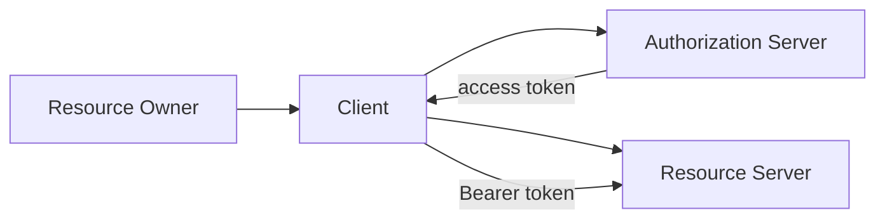
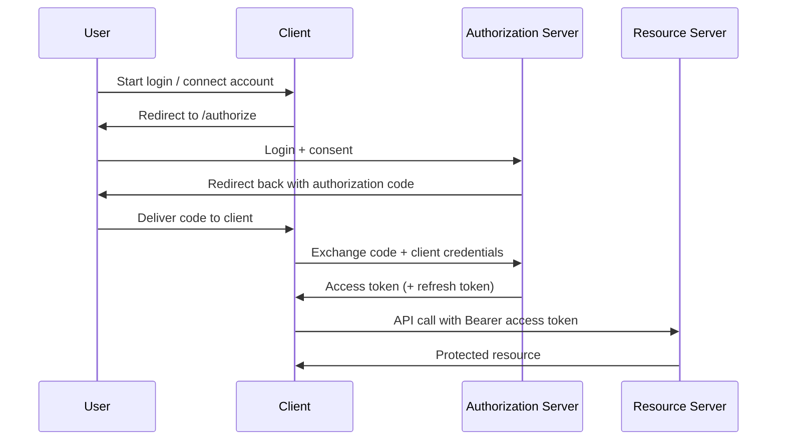
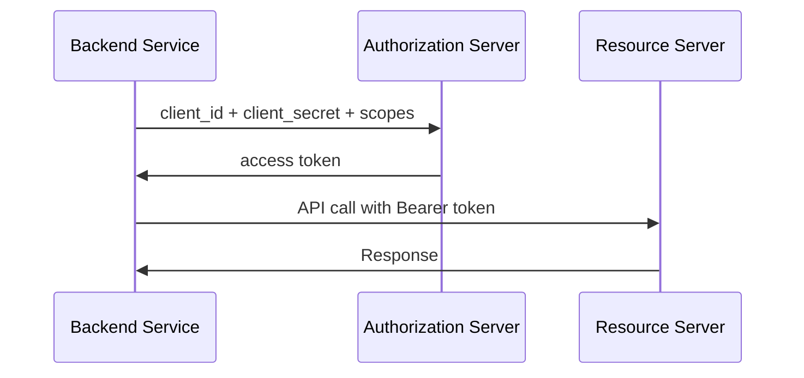
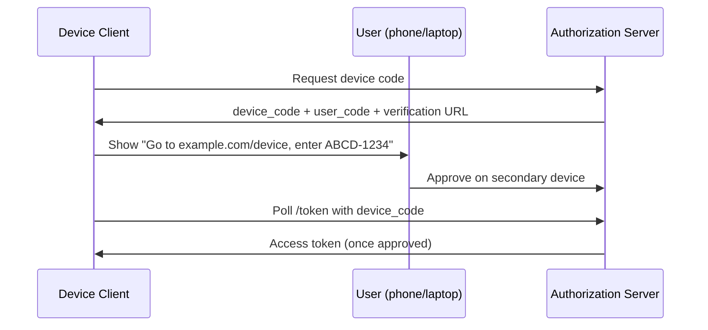

# OAuth 2.0

OAuth 2.0 is an authorization framework that lets a client access a user's resources without handling the user's password.

A user delegates limited access to a third-party app (for example, "Sign in with Google" or "Connect your GitHub account").

**Core idea**: The client gets an **access token**, not the user's credentials.

## Authentication vs authorization

These are related but different:

- **Authentication**: "Who are you?" (identity verification)
- **Authorization**: "What are you allowed to do?" (permission check)

OAuth 2.0 is primarily an **authorization** protocol. It issues tokens with scopes that define what a client can access.

Login identity is often layered on top via **OpenID Connect (OIDC)**, which builds on OAuth 2.0 and adds ID tokens and standardized user profile claims.

## OAuth 2.0 roles

| Role                 | Description                        | Example                              |
| -------------------- | ---------------------------------- | ------------------------------------ |
| Resource Owner       | User who owns the data             | End user                             |
| Client               | App requesting access              | Web app, mobile app, backend service |
| Authorization Server | Issues tokens after consent        | Google OAuth, Auth0, Okta            |
| Resource Server      | API that holds protected resources | Gmail API, GitHub API                |

## Key artifacts

- **Authorization code**: Short-lived, one-time code exchanged for tokens (authorization code flow)
- **Access token**: Used to call protected APIs (usually short-lived)
- **Refresh token**: Used to obtain new access tokens without re-prompting the user
- **Scope**: Permission boundary (for example, `read:email`, `repo:write`)

Access tokens can be **opaque** (validated by introspection) or **JWT** (self-contained, verifiable with public keys).

## Authorization code flow (most common)

Best for server-side web apps and mobile apps with a secure backend. This is the default choice in modern systems.

**Step-by-step example:**

1. User clicks "Sign in with Provider"
2. Client redirects to provider authorize URL with `client_id`, `redirect_uri`, `scope`, `state`
3. User authenticates and approves scopes
4. Provider redirects back with `code` and matching `state`
5. Client backend exchanges `code` for tokens at `/token` endpoint
6. Client calls APIs using `Authorization: Bearer <access_token>`

**Why this flow is preferred:**

- User password never reaches the client app
- Access token is obtained server-side (not exposed in browser history)
- Refresh token can stay on backend only

## Authorization code + PKCE

PKCE (Proof Key for Code Exchange) protects public clients that cannot safely store a client secret (SPAs, mobile apps).

**How it works:**

1. Client generates random `code_verifier`
2. Client sends `code_challenge = hash(code_verifier)` in authorize request
3. Client exchanges authorization code with original `code_verifier`
4. Authorization server verifies challenge/verifier match

Without PKCE, intercepted authorization codes can be replayed by malicious apps.

## Client credentials flow

For machine-to-machine communication where no user is involved.

**Use cases:**

- Cron jobs calling internal APIs
- Microservice-to-microservice access
- ETL pipelines

No refresh token is usually needed if the service can request a new token on demand.

## Device authorization flow

For input-constrained devices (TV, CLI, IoT) where browser redirect UX is awkward.

The device polls until the user completes authorization elsewhere.

## Refresh token flow

When an access token expires, clients can exchange a refresh token for a new access token without forcing user login again.

**Typical pattern:**

1. Access token expires (for example, after 1 hour)
2. Client calls `/token` with `grant_type=refresh_token`
3. Authorization server returns new access token (and optionally rotates refresh token)

**Refresh tokens should be:**

- Stored securely (server-side vault, secure enclave on mobile)
- Rotated and revoked on suspicious activity
- Bound to client/device when possible

## Deprecated or discouraged flows

### Implicit flow (legacy)

Returns the access token directly in the URL fragment. Avoid this for new apps — it has been replaced by Authorization Code + PKCE.

### Resource owner password credentials (legacy)

The client collects the username and password directly. This is only acceptable for highly trusted, first-party migration scenarios — not third-party integrations.

## Scopes and least privilege

Scopes limit what a token can do.

**Good practice:**

- Request minimum scopes needed (`read:profile`, not `admin:*`)
- Show clear consent UI to users
- Enforce scopes at resource server on every request

**Example check:**

- **Token scope**: `repo:read`
- **Request**: `DELETE /repo/123`
- **Result**: `403 Forbidden`

## Security best practices

- Always use HTTPS
- Validate `state` parameter to prevent CSRF in OAuth redirects
- Use PKCE for public clients
- Keep client secrets on backend only
- Prefer short-lived access tokens
- Rotate/revoke refresh tokens on logout or compromise
- Validate audience (`aud`), issuer (`iss`), and expiration (`exp`) for JWT access tokens
- Do not store tokens in localStorage for high-risk apps if avoidable

## OAuth 2.0 vs OpenID Connect

- **OAuth 2.0**: Authorization ("this app can access my calendar")
- **OIDC**: Authentication + identity profile on top of OAuth 2.0 ("this is user X")

**OIDC adds:**

- `openid` scope
- ID token (JWT with identity claims)
- Standard userinfo endpoint

In interviews, mention OAuth for delegated API access and OIDC when the problem is login/identity.

## Common failure modes

- **Redirect URI mismatch**: Token exchange rejected
- **Expired authorization code**: Code is single-use and short-lived
- **Scope escalation**: Client requests excessive permissions
- **Token leakage**: Tokens exposed in logs, URLs, or browser storage
- **Confused deputy**: Client uses token against wrong resource server without audience checks

## Interview talking points

- OAuth 2.0 delegates authorization; it is not a username/password replacement by itself.
- Default to Authorization Code + PKCE for user-facing apps.
- Use Client Credentials for service-to-service workloads.
- Explain access vs refresh token responsibilities clearly.
- Mention OIDC when the prompt is "Sign in with X".
- Call out `state`, HTTPS, short TTL, and scope enforcement as baseline security.

## Reference materials

- [RFC 6749 - OAuth 2.0 Authorization Framework](https://datatracker.ietf.org/doc/html/rfc6749)
- [RFC 7636 - PKCE](https://datatracker.ietf.org/doc/html/rfc7636)
- [RFC 8628 - Device Authorization Grant](https://datatracker.ietf.org/doc/html/rfc8628)
- [OpenID Connect Core 1.0](https://openid.net/specs/openid-connect-core-1_0.html)
- [OAuth 2.0 Security Best Current Practice](https://datatracker.ietf.org/doc/html/draft-ietf-oauth-security-topics)
