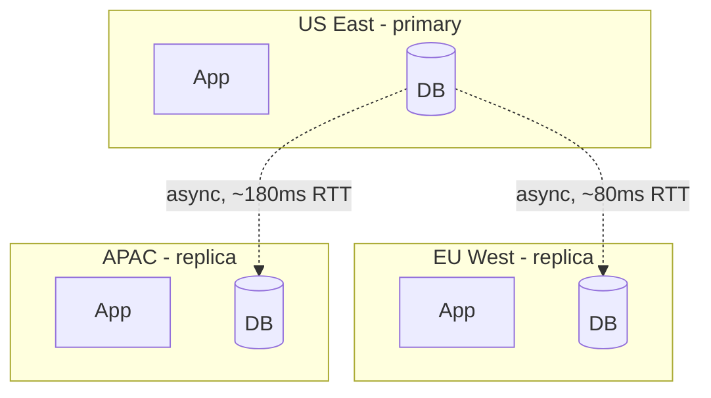
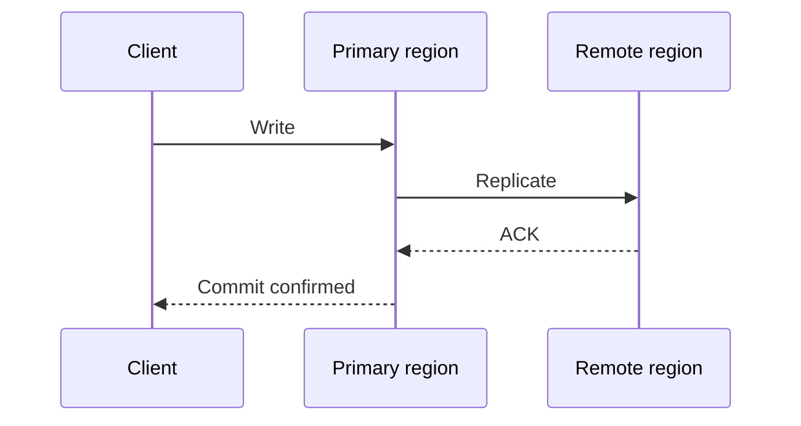
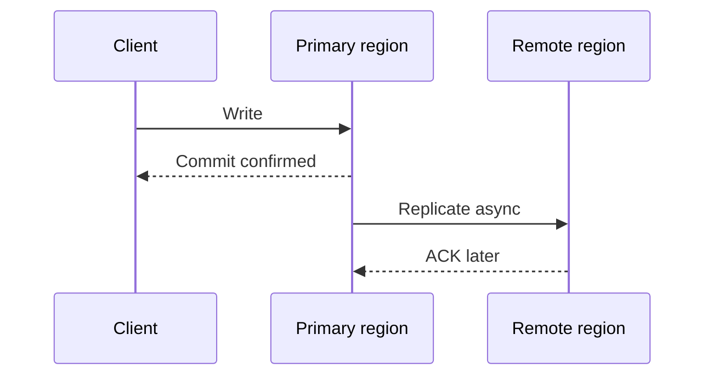
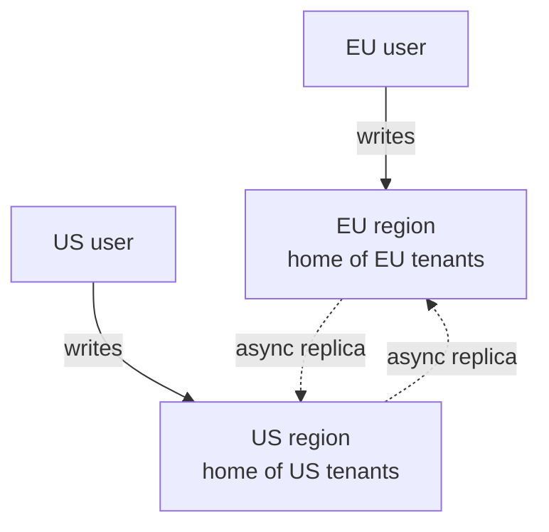
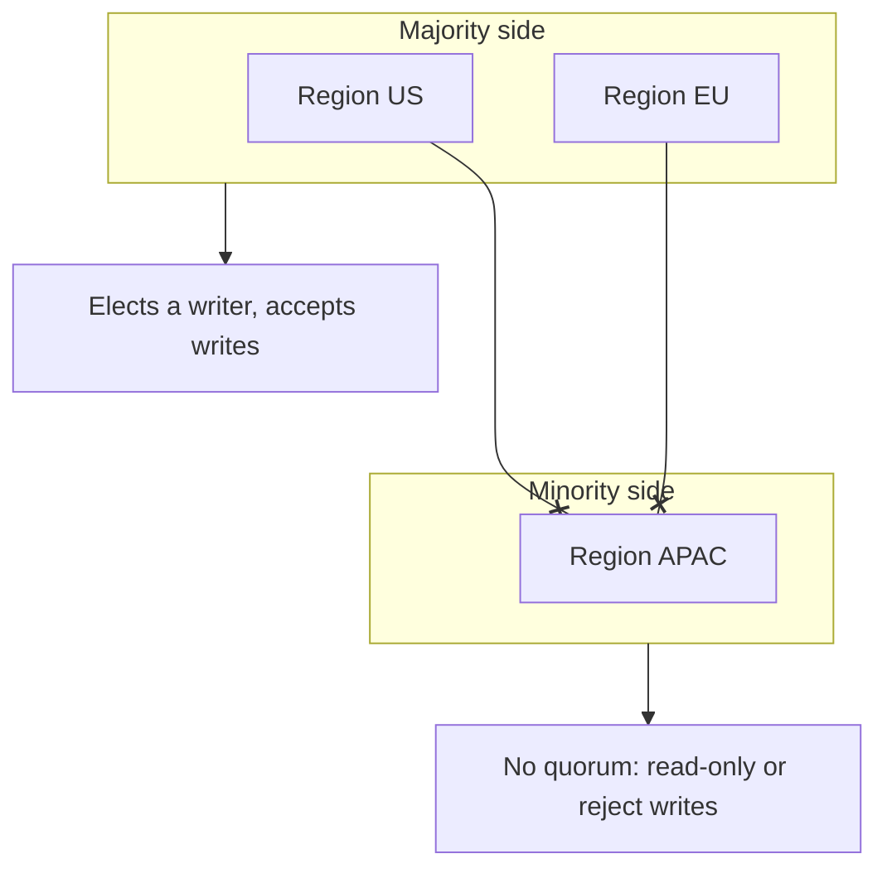

# Multi-region replication

Multi-region replication serves the same data from geographically separated regions.

It is [database replication](../fundamentals/23-database-replication.md) with the replication link stretched across a WAN.
The three choices are the same ones as in a single-region replica set:

- How many copies you wait for
- How many nodes may accept writes
- What a replica read is allowed to return

But the link between the copies is now two orders of magnitude slower, fails independently of the machines at either end, and cannot be arbitrated from inside either region.

**What it buys:**

- **Lower read latency**: Serve users from a nearby region instead of across an ocean
- **Regional fault tolerance**: Survive the loss of a whole region, not just a node or an availability zone
- **Disaster recovery**: Keep a copy far enough away that one event cannot destroy both
- **Data residency**: Keep records in the jurisdiction that requires them

**What it does not buy:** write throughput. Extra copies of a row still serialize on whoever owns that row. Scaling writes is [partitioning](../fundamentals/24-database-partitioning.md), a different axis, and multi-region does not change that.

## Why multi-region is hard

Round trips run from a few milliseconds inside a region to roughly 80ms between the US and Europe and 150-250ms between the US and Asia-Pacific. Nothing you do removes that; it is the speed of light plus routing. A synchronous cross-region commit therefore adds at least one of those round trips to **every** write, on top of local disk flush time.

The other three problems follow from the same link:

- **Partitions are routine, not exceptional.** Inter-region connectivity degrades or drops for minutes at a time, and the two sides cannot distinguish "the other region is down" from "I am the one that is cut off".
- **Concurrent writes.** If two regions both accept writes, the same row can be updated in both before either sees the other.
- **Lag is user-visible.** A replica seconds behind is fine for a feed and wrong for "did my payment go through?".

## RPO and RTO

Every multi-region decision below collapses into these two numbers, defined in [Availability](../fundamentals/08-availability.md):

- **RPO (Recovery Point Objective)**: How much acknowledged data you accept losing when a region disappears.
- **RTO (Recovery Time Objective)**: How long you accept being unable to serve writes while another region takes over.

In a multi-region design both are computable rather than aspirational:

- **RPO comes from the ack policy.** With asynchronous replication, RPO is the replication lag *at the moment of failure* - which is the p99 lag, not the average, because regions usually fail while they are already struggling. Waiting for a remote acknowledgement before commit drives RPO to zero for acknowledged writes, and pays the round trip above.
- **RTO comes from the failover path.** Detection window, plus promotion, plus DNS or global load balancer convergence, plus application reconnection. The last two are frequently larger than the database step and are frequently forgotten.

| Setup                                    | Typical RPO                  | Typical RTO                       |
| ---------------------------------------- | ---------------------------- | --------------------------------- |
| Async replica, manual promotion          | Seconds to minutes of writes | 15-60 minutes (human in the loop) |
| Async replica, automated promotion       | Seconds to minutes of writes | 1-5 minutes                       |
| Wait for one remote region before commit | Zero for acknowledged writes | Minutes (still a promotion)       |
| Consensus group spanning three regions   | Zero                         | Seconds (automatic election)      |

The bottom row is the only one that gets both numbers near zero, and it pays a cross-region majority round trip on every write forever — see [consensus](../fundamentals/29-consensus.md). Most systems buy that guarantee for a small slice of critical state and accept RPO > 0 for the bulk.

State both numbers explicitly in a design interview. "We replicate to another region" without an RPO is not an answer.

## Deployment patterns

### Active-passive (primary plus DR)

One primary region accepts all writes. Other regions hold a copy that serves nothing until failover.

Pros:

- Single write order, so no merge rules and no conflict semantics to design
- The failure story is one runbook: promote, repoint, verify

Cons:

- Standby capacity is paid for and idle
- Write latency is whatever the distance to the primary is, for every user
- RTO is dominated by how well-rehearsed the promotion is

Use when strong write consistency and operational simplicity matter more than write locality.

### Active-passive with global read replicas

Primary handles all writes; every region serves local reads from a replica of it.

Pros:

- Read latency is local, which is what most read-heavy products actually need
- Still one writer, so still no conflict resolution

Cons:

- Reads are stale by the replication lag, so read-your-writes needs explicit handling
- Every region now has a promotion candidate, and picking the right one is part of the runbook

This is the common default for global SaaS.

### Active-active (multi-primary)

More than one region accepts writes for the same data set.

Pros:

- Write latency is local as well as read latency
- A region can keep serving its own users through a partition

Cons:

- Concurrent writes to the same row conflict, and something has to merge them
- Testing, observability, and reasoning about "what does the data look like right now" all get harder

Use only when local writes are a stated product requirement and you can name the merge rule per entity. As [database replication](../fundamentals/23-database-replication.md) puts it: multi-primary is not "HA without a failover" — you have traded a failover problem for a conflict problem.

## How many regions you wait for

This is the same ack-policy knob as in single-region replication, with a much larger unit of latency attached.

### Synchronous cross-region replication

The primary waits for a remote acknowledgement before it confirms the commit.

Pros:

- RPO of zero: an acknowledged write exists in at least two regions

Cons:

- Write latency is bounded below by the round trip to the remote region
- A remote outage blocks writes unless the policy degrades, which is the CAP choice made explicit

Best for a small, critical write set — account balances, inventory holds, tenant-to-region assignments — not for all application data.

### Asynchronous cross-region replication

The primary commits locally and ships the changes afterwards.

Pros:

- Write latency is local
- The primary keeps accepting writes through a transient link failure

Cons:

- RPO > 0: whatever is still in flight is lost if the primary region dies
- Remote reads are stale, by an amount that varies with load

This is what almost every global system uses for bulk application data.

### Wait for one remote region

The compromise: commit once **any one** remote region has the write, rather than all of them.

- Bounds RPO to zero for acknowledged writes without waiting for the slowest region on the planet
- Degrades gracefully if you allow the ack to come from a nearby region rather than a specific one
- Needs a policy for what happens when no remote region answers: stall (consistency) or ack locally (availability, RPO > 0)

That last bullet is the whole of [CAP](../fundamentals/27-cap-and-pacelc-theorems.md) in one configuration flag.

## Consistency models

Multi-region systems mix models by workload rather than picking one globally.

| Model            | What the user sees      | Typical use                       |
| ---------------- | ----------------------- | --------------------------------- |
| Strong (global)  | Always the latest write | Control metadata, inventory locks |
| Eventual         | Converges over time     | Profiles, feeds, analytics        |
| Read-your-writes | Sees own updates        | Account settings after save       |
| Monotonic reads  | Never time-travels back | Timeline and session views        |

The last two are session guarantees, and the mechanisms are the same as in single-region replica reads: route the session to the primary after a write, pin it to one replica, or wait until the local replica has applied the write's log position. See [reading from replicas](../fundamentals/23-database-replication.md) for the details; the multi-region version is only more visible because the lag is larger.

The interview point to have ready: "strongly consistent globally" and "low-latency writes everywhere" do not coexist. One of them is paying a cross-region round trip.

## Conflicts in active-active

### Avoid them first: home regions

The cheapest conflict resolution is a design where concurrent writes to the same row cannot happen. Assign every entity a **home region** — the one region allowed to write it — and route writes for that entity there, while every region still serves local reads.

The cluster is active-active — both regions take writes — but each **row** still has exactly one writer, so there is nothing to merge. This is [geographic partitioning](../fundamentals/24-database-partitioning.md) applied at region granularity, and it is what most production "active-active" systems really are.

It works when the data partitions naturally by user, tenant, or account, which covers most SaaS. It does not work for genuinely global state such as a single inventory count or a global username namespace, which needs either a single writer or the merge rules below. Moving an entity between home regions is a small migration (fence writes, drain replication, flip ownership), not a config change.

### Resolving the rest

When two regions do write the same row concurrently, the merge strategies are the ones described under [multi-primary replication](../fundamentals/23-database-replication.md), with one multi-region-specific caveat each:

- **Last-write-wins**: Highest timestamp wins. Across regions this is worse than it looks, because the clocks being compared are on different continents; a few hundred milliseconds of skew silently discards a valid write.
- **Version vectors and causality**: Detect that two writes were concurrent rather than ordered. This turns a silent loss into an explicit decision, but something still has to make that decision.
- **Application merge rules**: Merge by domain semantics — union the tags, take `max(last_login)`, ask the user about a conflicting shipping address. Written per entity type.
- **CRDTs**: Types that commute by construction, so any merge order converges. Real for counters, sets, and collaborative text; not for an orders table.

Design rule: state the conflict policy per entity in the design, and do not let the database default decide it for you. "The database handles it" almost always means last-write-wins.

## Traffic routing

Getting a user to the right region, and to the right copy inside it:

- **Geo-DNS**: Resolve to the nearest healthy region. Cheap, but TTL caching makes failover slow and stale resolvers linger.
- **Anycast**: One IP announced from many regions; the network picks. Fast failover, less control over which region a user lands on.
- **Global load balancer**: Health-aware steering at the edge, and the fastest thing to repoint during failover. See [load balancing](../fundamentals/13-load-balancing.md).
- **Session affinity**: Keep a user in one region while they hold region-local state, so their reads stay monotonic.

Read routing needs its own rule, not just write routing:

- Serve reads locally where lag is acceptable
- Route reads that must see the latest write (checkout, admin actions, anything just written by this user) to the writer
- Make lag a routing input: when a replica exceeds its lag budget, fail its reads over to the writer instead of serving stale data silently

## Network partitions and split-brain

During a partition, isolated regions may each believe they should be writable. If both act on that belief, you get two divergent histories that no merge rule was designed for — [split-brain](../fundamentals/28-leader-election.md).

Mitigations, in the order they should be reached for:

- **Majority quorum for write eligibility.** Only the side holding a majority of voting members may write. The minority side must refuse rather than guess.
- **A coordination service that is itself multi-region.** etcd, ZooKeeper, or a control plane holds the "who is primary" record. An arbiter that lives entirely in the primary region is useless precisely when it is needed.
- **[Fencing tokens](../fundamentals/28-leader-election.md) on promotion.** Every promotion mints a monotonically increasing token, and storage rejects writes carrying an older one. The check has to be enforced by the resource being written to — an old primary checking whether it is still primary can be paused between the check and the write.
- **Idempotent writes with version or ETag preconditions**, so a retry across a failover cannot double-apply.

**Two regions cannot arbitrate themselves.**
With exactly two voting sites, a broken link leaves each side holding half, so neither can claim a majority and automatic failover is impossible without risking split-brain.
The standard fixes are a third region holding a witness or voting-only member (cheap, since it stores no bulk data), or an explicit human decision as part of the runbook.
This is the [odd cluster size](../fundamentals/29-consensus.md) rule applied to regions instead of nodes.

## Failover and failback

1. **Detect.** Health checks, error-budget burn, or a declared incident. Guard against flapping: a spurious regional failover is far more expensive than a spurious node failover.
2. **Stop routing.** Pull the failed region out of the global load balancer or DNS first, so nothing new lands on it.
3. **Choose a successor.** Promote the replica with the most complete log. Promoting a far-behind replica because it is the only one left is a deliberate data-loss decision — the general form of what Kafka calls [unclean leader election](./05-kafka-architecture.md), and it should be an explicit, logged choice rather than a default.
4. **Fence the old primary.** Verify no stale writer can still commit. This is the step that gets skipped and the one that causes split-brain.
5. **Reconcile.** After recovery, replicas that were ahead of the new primary on an abandoned fork must rewind or be rebuilt, and whatever was lost inside the RPO window has to be reported, not quietly dropped.
6. **Fail back deliberately.** Failback is a second planned failover, not an automatic snap-back. Verify replication has caught up first.

A runbook should name who is allowed to trigger a failover, how a stale writer is proven dead, and what happens to in-flight transactions. Rehearse it: an untested failover path is an outage with extra steps.

## Operating multi-region

- Keep strongly consistent writes on a small, explicitly enumerated coordination path
- Cache read-heavy data regionally, and give the cache its own staleness budget
- Batch and compress the replication stream; cross-region egress is a real cost line as well as a latency one
- Monitor replication lag per region as a distribution (p50/p95/p99), not an average, and alert on the trend
- Alert on failover readiness itself: a replica that has been unable to apply the log for an hour is not a failover candidate
- Run partition and region-loss game days, including the failback

## Design guidelines

- Start active-passive; move to active-active only for a stated requirement, and prefer home regions over merge rules when you do
- Separate critical metadata (strong consistency, small volume) from bulk user data (eventual, large volume) and give them different replication policies
- Write down RPO and RTO per data set before choosing a topology
- Make every write idempotent with a version or ETag precondition
- Give every failover path a fencing story before you give it an automation story
- Document conflict behavior per entity type, not per database

## Interview talking points

- Clarify first whether the system needs global **writes** or mostly global **reads**. The answer changes the entire topology.
- Quote the sync-versus-async trade-off in latency and RPO numbers, not adjectives.
- For active-active, lead with home regions and only then discuss merge rules — it shows you would rather avoid conflicts than resolve them.
- Raise split-brain before the interviewer does: majority quorum for who may write, fencing tokens enforced at the resource, and the fact that two regions cannot arbitrate without a third voting site.
- Tie routing, replication, and consistency into one story: where the user lands, which copy answers, and what happens when that copy is behind.

## Reference materials

- [Dynamo: Amazon's Highly Available Key-value Store](https://www.allthingsdistributed.com/files/amazon-dynamo-sosp2007.pdf)
- [Google Spanner: TrueTime and External Consistency](https://research.google/pubs/pub39966/)
- [Jepsen Analyses of Distributed Databases](https://jepsen.io/analyses)
- [AWS Route 53 Health Checks and Failover Routing](https://docs.aws.amazon.com/Route53/latest/DeveloperGuide/dns-failover.html)
