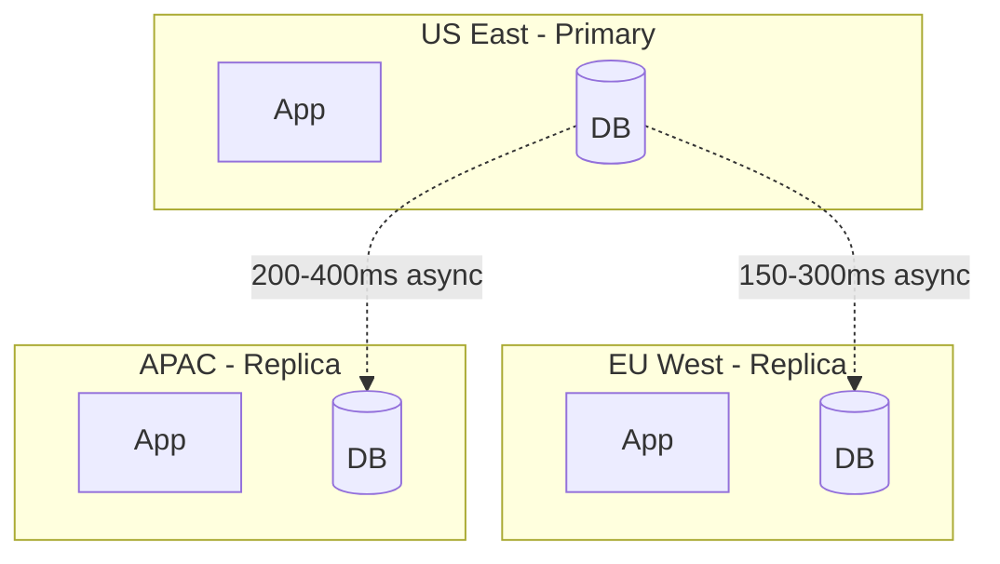
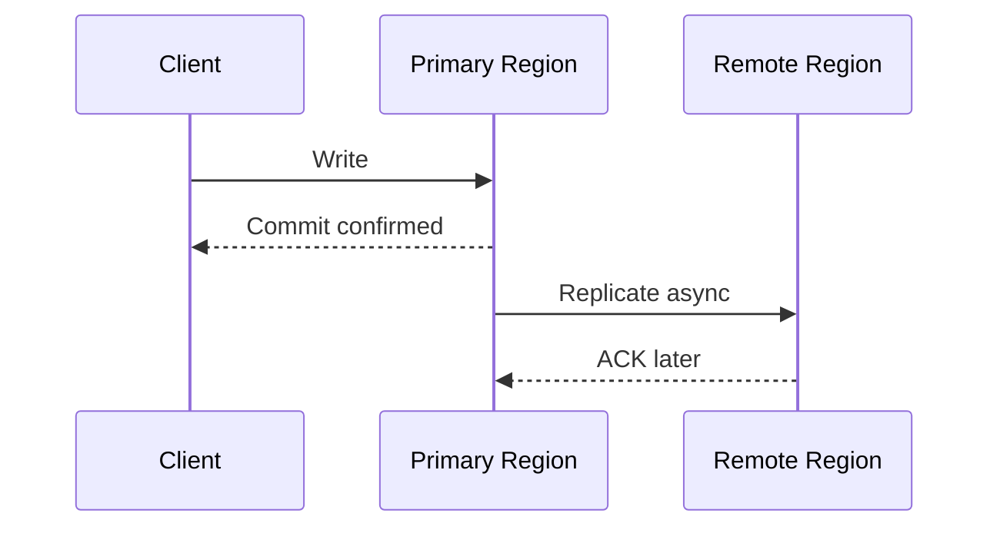
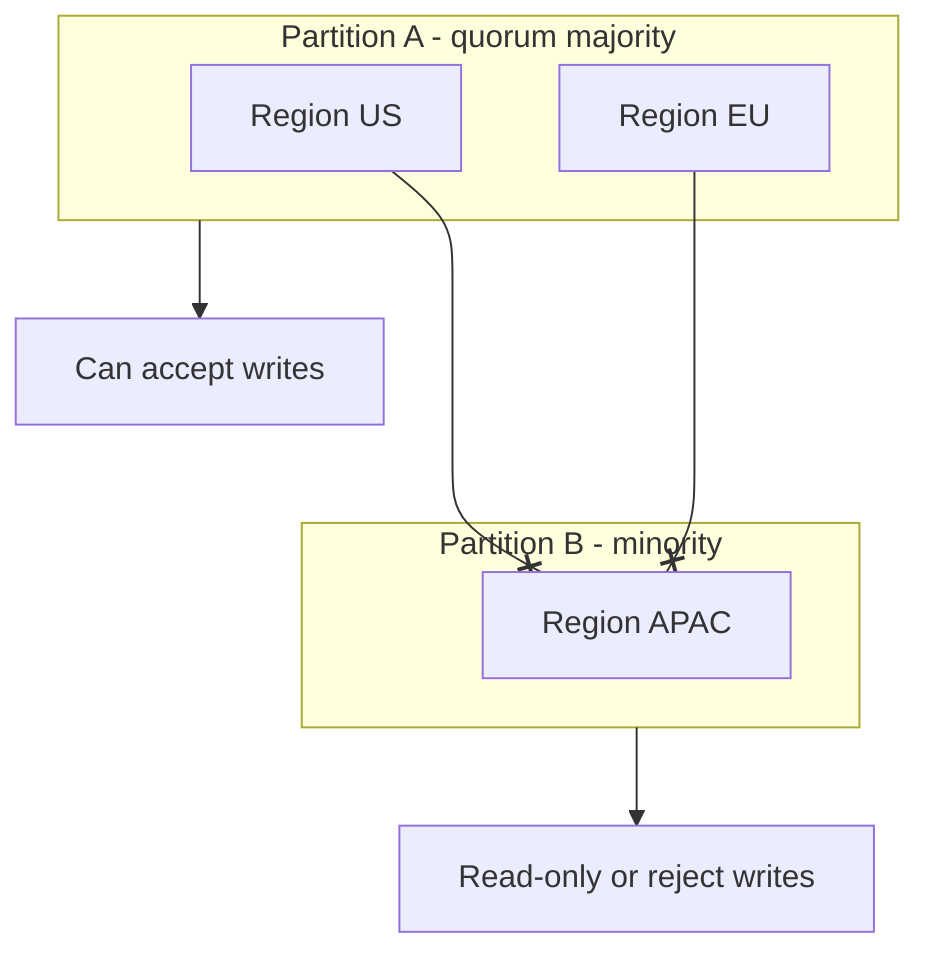

# Multi-Region Replication

Multi-region replication copies and serves data across geographically separated regions.

It extends [database replication](../fundamentals/21-database-replication.md) with cross-continent latency, partition risk, and global traffic routing concerns.

**Primary goals:**

- **Lower latency**: Serve users from nearby regions
- **High availability**: Survive regional outages
- **Disaster recovery**: Recover from large-scale failures
- **Data residency/compliance**: Keep data in required jurisdictions

## Why Multi-Region Is Hard

Cross-region round trips are often 100-400ms, so synchronous replication directly impacts write latency.

Additional challenges:

- Temporary network partitions between regions
- Concurrent writes in active-active setups
- Replication lag and stale reads
- Failover complexity and split-brain risk

## Deployment Patterns

### Active-Passive (Primary + DR)

One primary region accepts writes; other regions are standby/read-only.

- ✅ Simpler consistency story
- ✅ Easier conflict handling
- ❌ Standby region may be underutilized
- ❌ Failover time affects RTO

Use when strong write consistency and simpler operations matter more than write locality.

### Active-Passive with Global Read Replicas

Primary handles writes; replicas serve read traffic locally.

- ✅ Better read latency globally
- ❌ Reads may be stale during lag
- ❌ Promote/replica role changes need runbooks

Common default for global SaaS with read-heavy workloads.

### Active-Active (Multi-Master)

Multiple regions accept writes.

- ✅ Best write locality and regional availability
- ❌ Conflict resolution required
- ❌ Harder testing and observability

Use only when business needs local writes and team can handle merge semantics.

## Sync vs Async Across Regions

### Synchronous Cross-Region Replication

Primary waits for remote acknowledgment before commit.

- ✅ Stronger durability across regions
- ❌ Write latency tied to slowest region
- ❌ Remote outage can block writes

Best for small, critical write sets (metadata, financial invariants), not all app data.

### Asynchronous Cross-Region Replication

Primary commits locally, then replicates in background.

- ✅ Low write latency
- ✅ Primary remains writable during transient link issues
- ❌ Possible data loss window (RPO > 0)
- ❌ Temporary inconsistency across regions

Most global systems use async for bulk application data.

### Semi-Sync Compromise

Require acknowledgment from at least one additional region/site before commit.

- Better durability than pure async
- Lower latency than full multi-region sync

## Consistency Models

Multi-region systems usually combine models by workload.

| Model            | User experience         | Typical use                       |
|------------------|-------------------------|-----------------------------------|
| Strong (global)  | Always latest write     | Control metadata, inventory locks |
| Eventual         | Converges over time     | Profiles, feeds, analytics        |
| Read-your-writes | User sees own updates   | Account settings after save       |
| Monotonic reads  | No time-travel backward | Timeline/session views            |

Important interview point: "strong consistency globally" and "low-latency writes everywhere" rarely coexist at scale.

## Conflict Resolution (Active-Active)

When two regions write the same key concurrently, replicas diverge.

Common strategies:

- **Last-write-wins (LWW)**: Pick highest timestamp
  - Simple, but clock skew can drop valid updates
- **Version vectors / causality checks**: Detect concurrent updates
  - Better correctness, more application logic
- **Application merge rules**: Merge fields by domain semantics
  - Example: union tags, max(`last_login`), user prompt for conflicting names
- **CRDTs**: Data structures designed for commutative merges
  - Good for counters, sets, collaborative text in specific domains

Design rule: push conflict policy to the business layer when possible; do not rely on DB defaults alone.

## Network Partitions and Split-Brain

During partition, isolated regions may both think they are writable.

Mitigations:

- Quorum-based write eligibility (only majority partition writes)
- External failover coordinator (etcd/consul/control plane)
- Fencing tokens to prevent stale primary writes after promotion
- Idempotent writes and version checks on all mutations

## Traffic Routing

How users reach the right region:

- **Geo-DNS / Geo routing**: Route by client location
- **Anycast**: Same IP announced in multiple regions
- **Global load balancer**: Health-aware regional steering
- **Sticky sessions**: Keep user on one region when stateful

Also plan read routing:

- Local reads for latency
- Global reads for strongly consistent admin operations (route to primary)

## RPO and RTO

- **RPO (Recovery Point Objective)**: Max acceptable data loss window
- **RTO (Recovery Time Objective)**: Max acceptable downtime

Examples:

- Async replication with 30s lag -> potential RPO up to ~30s
- Manual failover runbook in 20 minutes -> RTO ~20 minutes
- Automated health-checked failover -> RTO in minutes or less

State these explicitly in design interviews.

## Failover Strategies

1. Detect regional failure (health checks, error budget burn, manual incident)
2. Stop routing traffic to failed region
3. Promote replica/control plane role if needed
4. Reconcile backlog/replication lag after recovery
5. Fail back deliberately with validation

Runbooks should include:

- Who can trigger failover
- How to verify no stale writer remains active
- How to handle in-flight transactions

## Performance Optimization

- Keep strongly consistent writes on a small coordination path
- Use regional caches for read-heavy data
- Batch cross-region replication where possible
- Compress replication streams
- Monitor replication lag per region (p50/p95/p99)
- Define lag-based read routing rules (serve local vs redirect)

## Design Guidelines

- Start active-passive unless active-active is a clear requirement
- Separate critical metadata (strong consistency) from bulk user data (eventual)
- Measure and alert on replication lag and failover readiness
- Make writes idempotent with version/etag checks
- Test partition and regional failure scenarios regularly (game days)
- Document conflict behavior per entity type

## Interview Talking Points

- Clarify whether the prompt needs global writes or mostly global reads.
- Explain sync vs async trade-offs with latency and RPO numbers.
- For active-active, always discuss conflict resolution strategy.
- Mention split-brain prevention (quorum, fencing, promotion workflow).
- Tie routing + replication + consistency into one coherent story.

## Reference Materials

- [Dynamo: Amazon's Highly Available Key-value Store](https://www.allthingsdistributed.com/files/amazon-dynamo-sosp2007.pdf)
- [Google Spanner: TrueTime and External Consistency](https://research.google/pubs/pub39966/)
- [Jepsen Analyses of Distributed Databases](https://jepsen.io/analyses)
- [AWS Route 53 Health Checks and Failover Routing](https://docs.aws.amazon.com/Route53/latest/DeveloperGuide/dns-failover.html)
