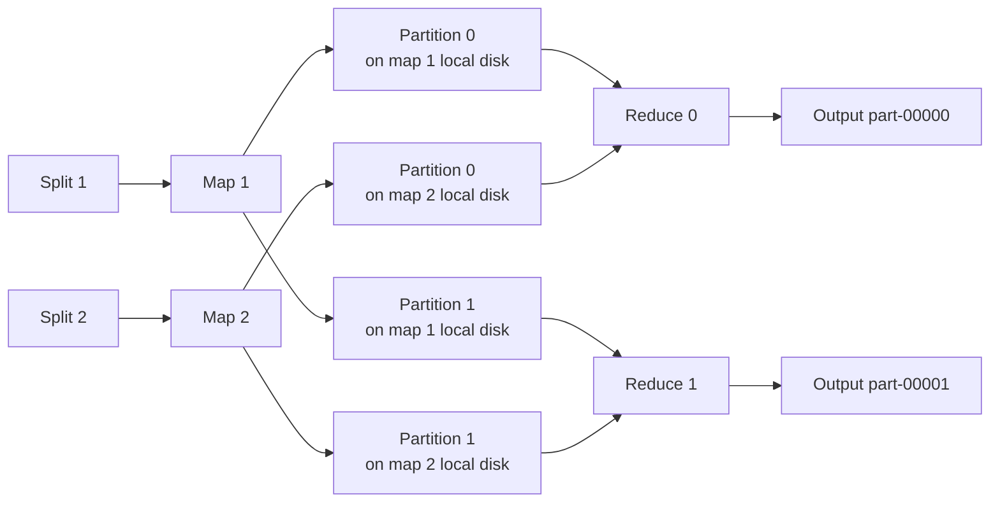

# MapReduce

MapReduce is a programming model for processing large datasets in parallel across many machines, introduced by Google in 2004 and popularized by Apache Hadoop.

Almost nobody writes new MapReduce jobs today.
It is still worth knowing because it is the ancestor of every distributed data system you *would* reach for now, and because its middle phase — the **shuffle** — is the piece that survived unchanged into Spark, Flink, Trino, and every cloud data warehouse.
This note treats MapReduce as a **case study**: the problem it solved, the mechanics of each phase, what the model costs, and why the industry moved past it.

## The problem MapReduce was built to solve

Google needed to run crawl, index, and log-analysis jobs over petabytes on thousands of unreliable commodity machines. The data processing itself was usually trivial — count something, invert something, sort something. Everything around it was not:

- Split the input and decide which machine gets which piece
- Move computation near the data instead of moving terabytes over the network
- Detect a machine that died mid-job and redo only its work
- Detect a machine that is merely *slow* and stop the job waiting on it
- Get the intermediate data grouped by key so an aggregation is even possible

Before MapReduce, every job re-implemented all of that by hand. The insight was to invert the responsibility: **restrict what a program is allowed to express**, and the framework can then parallelize, place, retry, and re-run it generically.

A MapReduce program supplies only two functions:

1. **Map**: Take one input record, emit zero or more intermediate `(key, value)` pairs
2. **Reduce**: Take one key and the full list of values emitted for it, emit the final output

Because `map` is per-record and `reduce` is per-key, neither can depend on the order tasks run or on any state outside its own input. That restriction is what makes a task safe to retry, safe to run twice, and safe to schedule anywhere — which is what buys the fault tolerance.

## The execution model

A job is submitted with an input path, a `map` function, a `reduce` function, and a reducer count `R`. The framework does the rest.

- **Input splits**: The input is divided into fixed-size splits (a 128 MB HDFS block is the usual unit). One map task per split, so `M` is set by the data size
- **Map tasks**: `M` tasks run the map function over their split, typically many more tasks than machines so that work can be rebalanced
- **Reduce tasks**: `R` tasks, chosen by the developer, each responsible for one partition of the key space. `R` also fixes the number of output files
- **Master (coordinator)**: Assigns tasks to workers, tracks their state, reassigns on failure, and knows where every completed map task left its output



Every reduce task pulls from every map task, so the shuffle is `M x R` transfers. That fan-out is the dominant cost of most real jobs.

**Data locality.** The master knows which machines hold a replica of each input split and schedules the map task on one of them, falling back to the same rack. Most map input is therefore read from local disk and never crosses the network. This only works for the map phase — the shuffle is network-bound by construction, which is exactly why so much effort goes into shrinking it.

## Anatomy of a job

### Map

Each map task reads its split record by record and calls the user's `map` function. Output is not sent anywhere yet: it accumulates in a bounded in-memory buffer (on the order of 100 MB). When the buffer fills, its contents are **spilled** to the worker's local disk, already partitioned and sorted. At the end of the task, the spill files are merged into a single file that is partitioned by reducer and sorted by key within each partition.

Two things are worth noticing:

- Intermediate data goes to **local disk**, not to the replicated filesystem. It is cheap to write and cheap to discard, at the price of having to recompute it if the machine dies
- The sort happens on the map side, spread across `M` machines, so no single node ever sorts the whole dataset

### Shuffle and sort

The shuffle is the framework's only real algorithm, and the phase interviewers actually probe.

**Partitioning.** Before a pair is buffered, the framework decides which reducer owns it:

```plaintext
partition = hash(key) % R
```

This is plain [modulo hashing](../fundamentals/16-hashing.md), and here it is the *right* choice: `R` is fixed for the lifetime of the job, so the usual objection — that changing `N` remaps almost every key — never applies.
All pairs with the same key land in the same partition, which is the entire point: **the shuffle is a repartition of the dataset by key**, the same operation a sharded database performs when it routes a row to a shard by [partition key](../fundamentals/24-database-partitioning.md).

**Combiner (optional).** A combiner is a reducer run locally on a map task's output before it is written out — `(hello, 1), (hello, 1)` becomes `(hello, 2)` on the mapper. It must be commutative and associative, because the framework may call it zero, one, or many times. For an aggregation like word count this can cut shuffle volume by orders of magnitude; for something like a median it is simply invalid.

**Copy.** Each reducer fetches *its* partition from *every* map task. Copying overlaps with the map phase — a reducer starts pulling from mappers as they finish — but the reduce function itself cannot begin until every map task has completed, because until then the reducer cannot know it has seen all values for any key. That barrier is structural, and it is why one straggler mapper stalls an entire job.

**Merge.** The reducer merge-sorts the sorted runs it fetched into one stream ordered by key. Values for a key are now contiguous, so the reducer can hand the user's function one key and an iterator over its values without ever holding the whole partition in memory.

### Reduce

The reduce function runs once per key, in key order, and writes its output to the distributed filesystem. Each task writes to a temporary file that is **atomically renamed** into place on success, so a task that dies halfway through leaves no partial output and a retry cannot double-write. The job produces `R` output files, and because each reducer emits keys in sorted order, the concatenation of those files is globally sorted.

## Word count, end to end

Input, two records:

- `"hello world hello"`
- `"world hello mapreduce"`

Map output, one pair per occurrence:

- Map 1: `(hello, 1)`, `(world, 1)`, `(hello, 1)`
- Map 2: `(world, 1)`, `(hello, 1)`, `(mapreduce, 1)`

With a combiner, each mapper pre-aggregates locally before writing: `(hello, 2)`, `(world, 1)` and `(world, 1)`, `(hello, 1)`, `(mapreduce, 1)`.

Shuffle groups by key across both mappers (assume `R = 2`):

- Partition 0: `(hello, [2, 1])`
- Partition 1: `(world, [1, 1])`, `(mapreduce, [1])`

Reduce output:

- `(hello, 3)`, `(world, 2)`, `(mapreduce, 1)`

This is the canonical teaching example because the map and reduce roles are obvious — but note that the interesting work happened in the middle, in the step nobody wrote any code for.

## Fault tolerance

At the scale MapReduce targets, a machine failing during a job is normal, not exceptional. The model handles it by making every task re-runnable:

- **Task failure**: The master reschedules the task on another worker. Because tasks are deterministic and side-effect free, a re-run produces the same result
- **Completed map tasks are re-run too**: Their output lives on the failed machine's local disk and is now unreachable, so any map task that ran there is redone even though it had succeeded
- **Completed reduce tasks are not**: Their output is already in the replicated filesystem, so it survives the worker
- **Output commit**: The temp-file-plus-rename protocol means a retried task never leaves duplicate or partial results
- **Master failure**: The single coordinator is the one component whose loss aborts the job. Hadoop's original JobTracker had the same weakness; YARN later made the per-job coordinator restartable

**Speculative execution** handles the other failure mode. A worker that is not dead but is slow — a failing disk, a noisy neighbor, an over-subscribed machine — would otherwise hold the whole job at the barrier. Near the end of a phase the master launches duplicate copies of the remaining tasks and takes whichever finishes first, killing the loser. This is only safe because tasks are idempotent and commit atomically.

## Skew and stragglers

Uniform partitioning is not the same as uniform work, and this is where real jobs fail.

Hashing distributes *distinct* keys evenly; it cannot split a *single* hot key. If 30% of your records share one key, one reducer gets 30% of the data and the job is as slow as that reducer — the same trap as a [hot partition key](../fundamentals/24-database-partitioning.md) in a sharded database, and the reason [hashing fixes uniform distribution but not hot keys](../fundamentals/16-hashing.md).

Usual mitigations:

- **Combiner**: Collapses a hot key's values on the map side, so the reducer receives aggregates instead of millions of raw pairs
- **Salting plus a second pass**: Emit `(key + random_bucket, value)`, reduce per bucket, then run a small second job to combine the buckets
- **Custom partitioner**: Sample the keys and split ranges by observed frequency instead of by hash
- **More reducers**: Helps when many keys are moderately heavy; does nothing at all when one key is heavy

## Patterns beyond word count

The two-function model covers more than counting, and naming a second example is a cheap way to show you understand the shape:

| Job                | Map emits                                | Reduce does                                   |
| ------------------ | ---------------------------------------- | --------------------------------------------- |
| Inverted index     | `(term, doc_id)` per term in a document  | Sorts and compacts the posting list per term  |
| Distributed sort   | `(sort_key, record)`                     | Nothing — the shuffle's sort *is* the job     |
| Group-by aggregate | `(group_key, measure)`                   | Sums, averages, or otherwise folds the values |
| Reduce-side join   | `(join_key, tagged_row)` from both sides | Sees both tables' rows for the key, joins     |

The reduce-side join is worth dwelling on: shuffling both inputs on the join key is how a distributed system manufactures the [colocation](../fundamentals/24-database-partitioning.md) it did not have to begin with. When one side is small enough to fit in memory, a **map-side (broadcast) join** skips the shuffle entirely by shipping that side to every mapper — the same optimization every modern query engine still makes.

## Why MapReduce fell out of favor

The model is sound; the classic implementation is expensive, and the API is narrow.

- **Everything is materialized between stages**: Map output hits local disk, reduce output hits the replicated filesystem. A job that reads its predecessor's output pays a full write-plus-replicate-plus-read round trip at every step
- **Iteration is brutal**: An algorithm that loops until convergence — PageRank, k-means, gradient descent — reloads the same dataset from disk on every iteration, which is the cost Spark's in-memory model was designed to eliminate
- **Only two stages**: Anything real is a chain of jobs, hand-wired and hand-scheduled. There is no plan spanning the pipeline, so there is no cross-stage optimization
- **Latency floor**: Per-task JVM startup, the all-maps-must-finish barrier, and disk round trips put the floor at minutes. Interactive querying was never on the table
- **The wrong interface**: Most consumers of this data wanted SQL, not two Java classes. Hive existed precisely to compile SQL down to MapReduce jobs, which was a strong hint about where the abstraction actually belonged

## What replaced it

- **Spark**: Models a job as a DAG of transformations rather than a fixed two stages, keeps intermediate results in memory, and recovers lost partitions by recomputing them from recorded lineage instead of by replicating them. Same fault-tolerance guarantee, far less I/O
- **Flink**: Treats streaming as the primary case and batch as a bounded stream, with event-time windows and watermarks for out-of-order data
- **SQL engines and cloud warehouses**: Trino, BigQuery, Snowflake, and Spark SQL took over the analytics workload behind a query planner, so users express intent and the engine picks the join strategy and partitioning
- **Stream-first architectures**: Where the old answer was a nightly batch job over yesterday's logs, the modern answer is often a durable log such as [Kafka](./05-kafka-architecture.md) with continuous consumers, turning a periodic recompute into an incremental update

Google itself moved its indexing pipeline off MapReduce onto incremental and dataflow-style systems, and Hadoop MapReduce is now legacy code in most places that still run Hadoop at all.

None of this retired the ideas. Spark, Flink, and every distributed SQL engine still partition by a hash of the key, still write shuffle files, still merge sorted runs on the read side, still fight skew with combiners and salting, and still run speculative copies of stragglers. Their shuffle *is* MapReduce's shuffle with better plumbing — which is why the phase, not the API, is what to know.

## When a MapReduce-shaped answer still fits

Reach for batch, key-partitioned processing when:

- The dataset is large enough that a single machine is genuinely out of the question
- The job is periodic and offline, and minutes-to-hours latency is acceptable
- The work is expressible as per-record transformation followed by per-key aggregation
- You need a full recompute — a backfill, a reindex, a correction of historical data

Prefer something else when:

- Results are needed in seconds, or continuously as events arrive
- The algorithm iterates over the same dataset many times
- The pipeline has many stages whose intermediate results are never used again
- The question is really an ad-hoc analytical query, which a warehouse answers better and cheaper

In a design interview, "a nightly MapReduce-style batch job" remains a perfectly good answer for a recompute path — just say Spark or a warehouse job if you mean the implementation, and reserve MapReduce for the model.

## Interview talking points

- Walk map, shuffle, and reduce with one example, and spend most of the time on the shuffle — it is where the distributed-systems content lives.
- Say `partition = hash(key) % R` out loud and note that modulo is fine here because `R` is fixed for the job.
- Explain the barrier: reducers cannot run until all mappers finish, which is why stragglers, not failures, usually dominate job time.
- Cover both failure modes: dead workers get task retries, slow workers get speculative duplicates, and both are safe only because tasks are deterministic and commit atomically.
- Raise skew before you are asked. Hashing spreads distinct keys, not hot ones; reach for a combiner or salting.
- Position MapReduce as foundational rather than current: name Spark, Flink, or a warehouse as what you would actually run, and note that they still shuffle the same way.

## Reference materials

- [MapReduce Paper (Google, 2004)](https://static.googleusercontent.com/media/research.google.com/en//archive/mapreduce-osdi04.pdf)
- [Apache Hadoop MapReduce Tutorial](https://hadoop.apache.org/docs/current/hadoop-mapreduce-client/hadoop-mapreduce-client-core/MapReduceTutorial.html)
- [Resilient Distributed Datasets Paper (Spark, 2012)](https://www.usenix.org/system/files/conference/nsdi12/nsdi12-final138.pdf)
