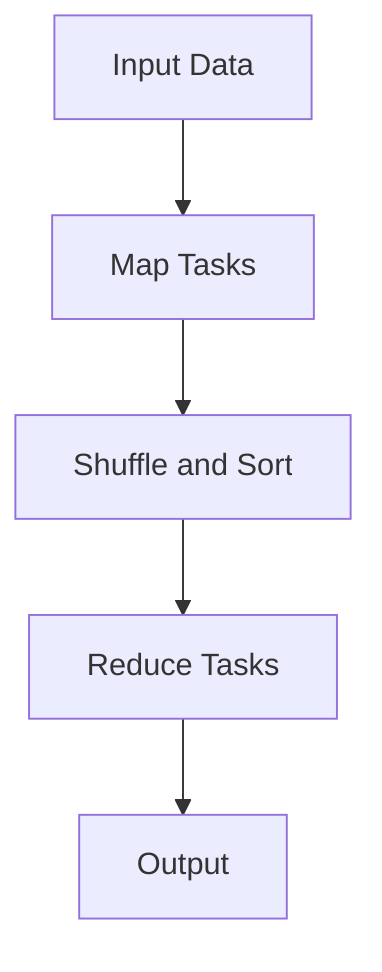

# MapReduce

MapReduce is a programming model for processing large datasets in parallel across many machines.

It breaks work into:

1. **Map**: Transform records into intermediate key-value pairs
2. **Shuffle/Sort**: Group values by key
3. **Reduce**: Aggregate/process each key's values

## Why MapReduce Exists

- Process massive batch datasets (logs, indexes, analytics)
- Scale horizontally by adding workers
- Hide fault tolerance and task retry complexity from developers

## Core Workflow

1. Input split into chunks
2. Each map task emits `(key, value)` pairs
3. Framework groups all values by key
4. Reduce tasks compute final output per key
5. Results written to distributed storage

## Word Count Example

Input:

- `"hello world hello"`
- `"world hello mapreduce"`

Map output:

- `(hello, 1)`, `(world, 1)`, `(hello, 1)`, ...

Reduce output:

- `(hello, 3)`, `(world, 2)`, `(mapreduce, 1)`

This is the canonical teaching example because map/reduce roles are obvious.

## Strengths

- Simple model for embarrassingly parallel batch jobs
- Good data locality (process near stored data)
- Built-in retry/speculative execution for failed/slow tasks
- Proven at very large scale (historically Hadoop ecosystem)

## Limitations

- Batch-only; high latency between stages
- Many disk/network round trips in classic implementations
- Poor fit for iterative or interactive workloads
- Multi-step pipelines can become complex chains of jobs

## Modern Alternatives

- **Spark**: In-memory + richer APIs (batch, streaming, ML)
- **Flink**: Strong streaming and event-time processing
- **Cloud data warehouses + SQL engines**: For analytics at scale

MapReduce concepts still matter even if Spark/Flink are used in practice.

## When to Use

Use MapReduce-style batch processing when:

- Dataset is very large
- Job is batch-oriented (not real-time)
- Work can be expressed as map + reduce/group-by logic

Prefer alternatives when:

- You need low-latency or streaming
- Workloads are iterative/interactive
- Complex graph/ML pipelines dominate

## Interview Talking Points

- Explain map, shuffle, reduce clearly with one example.
- Mention fault tolerance via task retries and input replication.
- Call out batch latency trade-offs honestly.
- Position MapReduce as foundational, not always the best modern choice.

## Reference Materials

- [MapReduce Paper (Google, 2004)](https://static.googleusercontent.com/media/research.google.com/en//archive/mapreduce-osdi04.pdf)
- [Apache Hadoop MapReduce Tutorial](https://hadoop.apache.org/docs/current/hadoop-mapreduce-client/hadoop-mapreduce-client-core/MapReduceTutorial.html)
