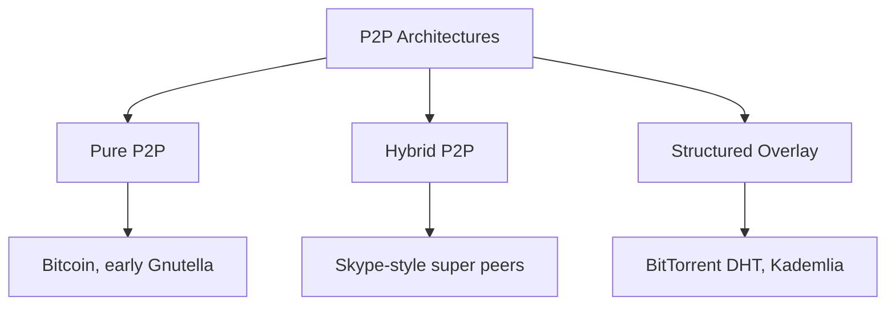
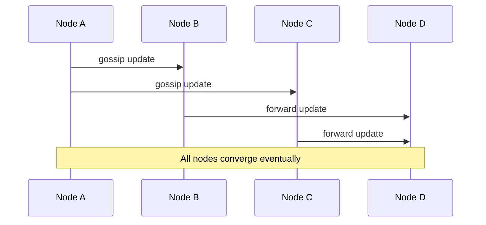

# Peer-to-peer (P2P) networks

In P2P networks, nodes act as both clients and servers. There is no fixed central authority; peers share resources directly.

This model powers file sharing, decentralized storage, blockchain networks, and large-scale gossip-based coordination.

**Core characteristics:**

- **Decentralization**: No single control point
- **Symmetry**: Peers can consume and contribute resources
- **Self-organization**: Network adapts as nodes join and leave
- **Fault tolerance**: Survives individual node failures

## Why use P2P?

- Distribute bandwidth/storage load across participants
- Avoid central bottlenecks for large file distribution
- Improve resilience against single-server outages
- Enable censorship-resistant or offline-first designs

Trade-off: coordination, security, and consistency become harder than in client-server systems.

## P2P architectures

### Pure P2P

All peers are equal; no dedicated coordinator.

Pros:

- High resilience and decentralization

Cons:

- Hard peer discovery and bootstrapping
- Unpredictable routing/search cost

Examples: early file-sharing networks, blockchain full nodes.

### Hybrid P2P

Uses super peers (or trackers) to help with discovery/routing while data transfer stays peer-to-peer.

Pros:

- Easier discovery and better performance

Cons:

- Super peers become partial bottlenecks
- Less fully decentralized than pure P2P

Examples: historical Skype architecture, tracker-assisted BitTorrent.

### Structured overlay (DHT-based)

Builds a logical routing layer (often a ring/tree) on top of the physical network.

Pros:

- Predictable lookup cost (typically `O(log N)`)
- Scales to very large networks

Cons:

- More complex maintenance during churn (frequent joins/leaves)

Examples: BitTorrent DHT, Kademlia, Chord.

## Distributed hash tables (DHT)

DHTs map keys to responsible nodes so peers can find data without central indexes.

**Core operations:**

- **PUT(key, value)**: Store at node responsible for key hash
- **GET(key)**: Lookup responsible node and fetch value
- **JOIN/LEAVE**: Rebalance key ownership as membership changes

### Common DHT designs

**Chord**

- Ring topology with finger tables
- Simple model, good teaching example

**Kademlia**

- XOR distance metric and k-buckets
- Used widely (BitTorrent DHT, IPFS-style systems)

**Pastry**

- Prefix-based routing with locality awareness

In interviews, Kademlia is the most common practical reference.

## Gossip protocol

Gossip spreads information by having each node periodically share updates with random peers.

**Why it is useful:**

- Simple membership/state dissemination at scale
- Robust to node failures
- Converges in `O(log N)` rounds with high probability

**Variants:**

- **Anti-entropy**: Exchange full/partitioned state (stronger consistency, higher bandwidth)
- **Rumor mongering**: Propagate only new events (more efficient, less durable)

Used in Cassandra, Consul, Dynamo-style systems, and failure detection.

## Typical use cases

- Large file distribution (BitTorrent-style swarms)
- Decentralized content networks (IPFS-like designs)
- Blockchain transaction/block propagation
- Cluster membership and failure detection via gossip

## Security challenges

- **Sybil attacks**: Attacker creates many fake nodes
- **Eclipse attacks**: Isolate a node with malicious neighbors
- **Data integrity**: Need hashes/signatures because no central trust anchor
- **Availability attacks**: Poisoned or unavailable peers

Mitigations include reputation systems, proof-of-work/stake, signed metadata, and redundant source verification.

## P2P vs client-server

| Dimension      | P2P               | Client-Server            |
| -------------- | ----------------- | ------------------------ |
| Control        | Decentralized     | Centralized              |
| Discovery      | Harder            | Simple (DNS/LB)          |
| Consistency    | Eventual/local    | Easier strong guarantees |
| Scale-out cost | Shared by peers   | Paid infra               |
| Security model | Trust-by-protocol | Trust provider boundary  |

## Design guidelines

- Define bootstrap strategy (seed nodes/trackers/DHT join path)
- Plan for churn: nodes fail and rejoin constantly
- Use content addressing (hash of file/key) for integrity
- Bound fan-out and gossip frequency to control bandwidth
- Prefer structured overlays when predictable lookup matters

## Interview talking points

- Explain pure vs hybrid vs DHT-based P2P clearly.
- Use DHT as "distributed index" with `O(log N)` routing.
- Mention gossip for membership/state propagation, not just file sharing.
- Call out Sybil/eclipse risks and integrity checks.
- Position P2P as bandwidth/resilience trade-off against operational simplicity.

## Reference materials

- [Chord: A Scalable Peer-to-peer Lookup Service](https://pdos.csail.mit.edu/papers/chord:sigcomm01/chord_sigcomm.pdf)
- [Kademlia: A Peer-to-peer Information System](https://pdos.csail.mit.edu/~petar/papers/maymounkov-kademlia-lncs.pdf)
- [BitTorrent Protocol Specification (BEP 3)](https://www.bittorrent.org/beps/bep_0003.html)
- [SWIM: Scalable Weakly-consistent Infection-style Membership Protocol](https://www.cs.cornell.edu/projects/Quicksilver/public_pdfs/SWIM.pdf)
