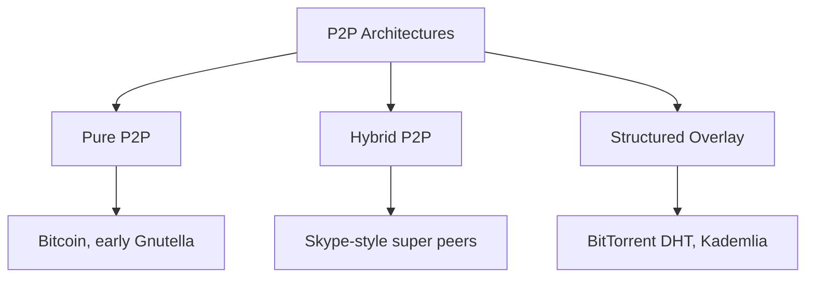
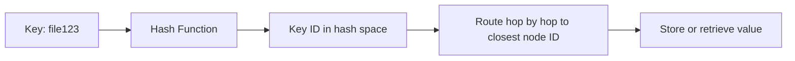
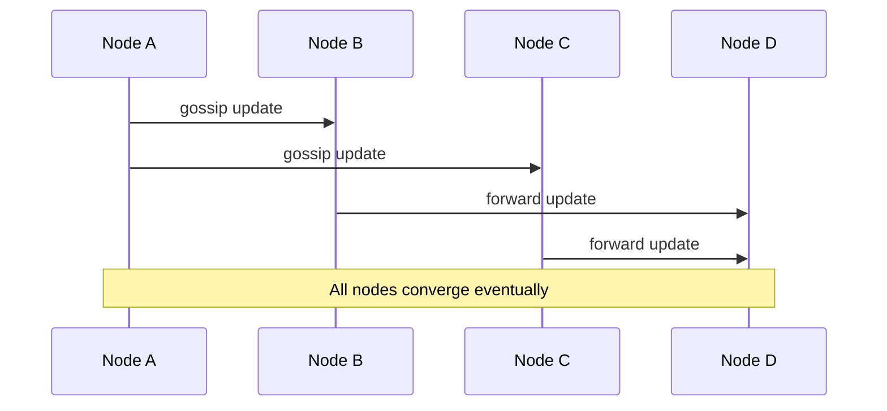

# Peer-to-peer (P2P) networks

In a P2P network every node is both client and server. There is no fixed central authority: peers find each other, route requests on each other's behalf, and exchange data directly.

The interesting question is never "what is P2P" but how a network with no membership list and no coordinator still answers *where does this key live* and *who is still alive*. That is what this note covers, and it is what an interviewer is probing when the topic comes up.

**Core characteristics:**

- **Decentralization**: There is no single control point whose failure or seizure stops the network.
- **Symmetry**: Every peer both consumes and contributes bandwidth, storage, and routing work.
- **Self-organization**: Membership changes constantly, and the overlay repairs its own structure without an operator.
- **Partial knowledge**: No peer knows the full membership. Every decision is made from a small local view.

Partial knowledge is the property that drives everything else. It is why lookups take several hops, why failure detection is lazy, and why the coordination mechanisms from [consensus](../fundamentals/29-consensus.md) do not transfer directly.

## Why use P2P?

- **Bandwidth economics**: Serving capacity grows with the audience rather than with the operator's infrastructure bill.
- **No central bottleneck**: A popular file is served by everyone who already holds it, instead of by an origin that has to be provisioned for the peak.
- **Resilience**: There is no single server whose outage takes the system down.
- **Trust independence**: Censorship-resistant, offline-first, and trustless designs need a network that keeps working with nobody operating it.

In practice that means large file distribution (BitTorrent-style swarms), decentralized content networks (IPFS-like designs), blockchain block and transaction propagation, and gossip-based membership inside otherwise conventional systems such as Cassandra and Consul.

The trade-off is that discovery, security, and consistency all get harder, and that peers are untrusted, unreliable, and often unreachable. For plain content delivery, a [CDN](../fundamentals/34-cdn.md) buys the same bandwidth relief with none of these problems; P2P earns its place when the distribution cost, the absence of a trusted operator, or censorship resistance is the dominant constraint.

## P2P architectures



### Pure P2P

All peers are equal and there is no dedicated coordinator. Discovery is done by flooding a query to neighbors, who forward it until a hop limit is reached.

Pros:

- High resilience and no privileged node to attack or subpoena
- Trivial to join: any live peer is as good as any other

Cons:

- Search cost is unpredictable and scales badly, since a flood touches a large share of the network per query
- A flood with a hop limit can fail to find data that is present, so "not found" is not authoritative

Examples: early Gnutella, blockchain full nodes.

### Hybrid P2P

A small set of super peers (or trackers) handles discovery and indexing while the bulk data transfer stays peer-to-peer. Super peers are elected from ordinary peers with good uptime and bandwidth, or run by the operator.

Pros:

- Fast, predictable lookups against a real index
- Ordinary peers keep a tiny routing state and can be behind slow links

Cons:

- Super peers are partial bottlenecks and obvious attack, failure, and takedown targets
- The operator, if there is one, becomes a point of control the pure model was meant to remove

Examples: historical Skype architecture, tracker-assisted BitTorrent.

### Structured overlay (DHT-based)

Peers arrange themselves into a logical topology (a ring, a tree, or a metric space) in which each peer's position determines which keys it owns and which peers it keeps in its routing table. Lookups follow the structure instead of flooding.

Pros:

- Bounded lookup cost, typically `O(log N)` hops with `O(log N)` routing state per peer
- A negative answer is meaningful: if the responsible peers do not have the key, nobody does
- Scales to millions of peers

Cons:

- More machinery to maintain, and the structure has to be repaired continuously under churn
- Exact-key lookups only; range and keyword search need an extra index layer on top

Examples: BitTorrent DHT (Kademlia), IPFS, Chord, Pastry.

## Distributed hash tables (DHT)

A DHT maps keys to the peers responsible for them, so any peer can locate data without a central index.



**Core operations:**

- **PUT(key, value)**: Route to the peers responsible for `hash(key)` and store the value there.
- **GET(key)**: Route to the same peers and fetch the value.
- **JOIN/LEAVE**: Transfer key ownership and repair routing tables as membership changes.

### A DHT is consistent hashing without a global view

Node IDs and key IDs are drawn from the same large hash space, and a key belongs to the peer whose ID is "closest" to it. That is exactly the placement rule from [consistent hashing](../fundamentals/16-hashing.md#consistent-hashing), and it gives the same property: a peer joining or leaving only disturbs the keys in its immediate neighborhood, not the whole keyspace.

The one difference changes everything about the implementation:

| Aspect            | Consistent hashing in a cluster                       | DHT in a P2P network                                        |
| ----------------- | ----------------------------------------------------- | ----------------------------------------------------------- |
| Membership view   | Every client knows the full ring                      | Each peer knows `O(log N)` other peers                      |
| Lookup            | Local computation, zero network hops                  | `O(log N)` hops of routing                                  |
| Membership source | A config service or coordinator publishes the ring    | Learned peer by peer, always slightly stale                 |
| Load balancing    | Virtual nodes, weighted by hardware                   | Uniform IDs plus replication; peers are not operator-owned  |
| Failure detection | Health checks from a known member list                | Lazy: a peer is dead when a request to it times out         |

Two consequences worth stating in an interview:

- **Virtual nodes do not carry over.** They exist so an operator can spread one machine's share around the ring and weight heterogeneous hardware. In an open P2P network there is no operator, peers are interchangeable, and churn already reshuffles arcs constantly, so classic DHTs give each peer one ID and rely on replication for balance instead.
- **Rendezvous hashing does not carry over either.** Scoring the key against every node is `O(N)` per lookup and needs the full node list, which is precisely what no peer has.

### How a lookup actually resolves a key

Kademlia is the design worth being able to walk through, because it is what BitTorrent's DHT, IPFS, and Ethereum's discovery layer use.

- Every peer and every key has a 160-bit ID. Distance between two IDs is `A XOR B` read as an integer, so "closest" is a pure function of the IDs and needs no network measurement.
- A peer's routing table is a set of **k-buckets**: bucket `i` holds up to `k` contacts (commonly `k = 20`) whose distance from the peer falls in `[2^i, 2^(i+1))`. The peer therefore knows many nearby peers and very few distant ones, which is what makes the table `O(log N)` in size.
- Lookups are **iterative**: the searching peer stays in control and asks progressively closer peers itself, rather than handing the request off.

```plaintext
target key K, my ID N, distance(A, B) = A XOR B

step 1  ask the 3 closest contacts I know (alpha = 3, queried in parallel)
        each replies with the k closest contacts it knows to K -- it does not forward

step 2  merge the replies, sort by XOR distance to K, ask the closest ones not yet queried
        each round at least halves the remaining distance, so the shortlist converges

step 3  stop when a full round returns nobody closer than what is already in the shortlist
        the surviving closest peers are the ones responsible for K

GET     one of them returns the value and the lookup terminates early
PUT     store the value on all k of them
```

Halving the distance per round is why the hop count is `O(log N)`: roughly 20 hops for a million-peer network, each hop a single round trip.

Chord and Pastry reach the same bound differently. Chord puts peers on a ring and gives each a **finger table** whose `i`-th entry points at the peer succeeding `n + 2^(i-1)`, so every hop jumps at least half the remaining arc. Pastry routes by matching one more digit of the key's ID per hop, and fills each routing-table slot with the network-closest peer that qualifies, so its hops are short in latency and not just in ID distance.

| Design       | Routing metric              | State per peer | Notable property                                      |
| ------------ | --------------------------- | -------------- | ----------------------------------------------------- |
| **Chord**    | Ring successor distance     | `O(log N)`     | Simplest to reason about; explicit stabilization loop |
| **Kademlia** | XOR distance                | `O(log N)`     | Symmetric metric, parallel iterative lookups          |
| **Pastry**   | ID prefix length            | `O(log N)`     | Locality-aware routing table, lower latency per hop   |

In interviews, Kademlia is the one to reach for: it is the design actually deployed at scale, and its symmetric distance metric means a peer learns useful routing entries just by being queried.

### Bootstrapping

A new peer needs one live contact to get started. The usual sources, in the order most clients try them:

- **A cached peer list** from the previous run, which covers the common case of a client restarting.
- **Hardcoded seed nodes or DNS seeds**: a hostname that resolves to a rotating set of long-lived peers, as Bitcoin does.
- **A tracker or rendezvous server** for hybrid designs.
- **Local network discovery** (mDNS) for peers on the same LAN.

Once connected, a Kademlia peer performs a lookup **for its own ID**. That single operation populates its routing table with exactly the peers it will need most, and, because every peer it queries learns about it in return, it announces its arrival to its future neighbors at the same time.

Bootstrapping is the one genuinely centralized dependency in most "fully decentralized" systems, and it is worth naming as such: seed lists are a censorship and attack surface, which is why clients ship several and fall back between them.

### Replication and repair

A single owner per key would lose data every time a laptop closes, so a key is stored on the `k` peers closest to it — in Kademlia, exactly the `k = 20` peers the lookup converged on. Two mechanisms keep that replica set populated:

- **Publisher republishing**: The original publisher re-announces the key on a fixed interval (tens of minutes in BitTorrent's DHT, an hour in the Kademlia paper). Because the republish is itself a lookup, it lands on whichever peers are closest *now*, silently repairing the replica set after churn.
- **Expiry**: Stored values time out if nobody republishes them, so a departed publisher's data eventually ages out instead of accumulating forever.

**Which kind of quorum applies here matters, and the two are easy to conflate:**

- The **majority quorum** used by Raft, Paxos, and Zab presumes a known, fixed member set — you cannot count a majority of a network whose membership nobody enumerates. It does not apply to an open DHT.
- What DHTs can use is the other kind: **tunable read and write quorums** over a replica set, the `R + W > N` rule described in [Consensus](../fundamentals/29-consensus.md#read-and-write-quorums-r--w--n). Dynamo-style stores took consistent hashing from this lineage and added exactly that, plus version metadata and read repair.
- Classic Kademlia does neither. Writes are best-effort to the `k` closest peers, reads return the first value found, and correctness comes from **content addressing** instead: the key *is* the hash of the value, so a peer can verify what it received and discard anything that does not match. Under content addressing a wrong answer is detectable locally, which removes most of the reason to run a quorum at all.

That last point is the design lesson to carry out of this section. When values are immutable and self-verifying, replication only has to provide availability. Mutable P2P state — IPNS records, DHT-published addresses, blockchain state — is where signatures, sequence numbers, and conflict resolution become unavoidable.

### Churn: joins, leaves, and failures

Churn is the defining operating condition of a P2P network. Public DHT peers routinely have session lifetimes measured in minutes, and there is no shutdown hook to depend on: most departures are ungraceful.

**Walkthrough — a replica disappears:**

1. Peer `D` is one of the `k` replicas for key `K`. Its user closes the laptop. No message is sent and nobody is notified.
2. The next `GET(K)` still succeeds, because the lookup converges on `k` peers and the other `k - 1` answer. Redundancy absorbs the loss with no repair step.
3. Peers holding `D` in a k-bucket discover the failure only when a request to `D` times out. `D` is marked stale and replaced by a live contact from a recent lookup. Detection is lazy and costs no dedicated traffic.
4. On the next republish interval, the publisher's lookup for `K` converges on the current closest peers — now including some peer `E` that has since joined — and the replica count is restored without anyone having run a repair job.

**Walkthrough — a peer joins:**

1. The new peer `E` generates an ID, contacts a bootstrap peer, and looks up its own ID.
2. The lookup fills `E`'s routing table with its neighborhood, and every peer it queried adds `E` to a bucket.
3. `E` is now among the closest peers for a slice of the keyspace, but it holds none of those keys yet. In Kademlia it acquires them passively at the next republish; in Chord the join explicitly transfers the affected range from the successor.

Two design points fall out of this:

- **Prefer long-lived contacts.** Kademlia only evicts the least-recently-seen contact in a bucket if it fails to respond to a ping, so peers that have been up a long time are kept. Uptime is strongly predictive of further uptime, and the same rule incidentally makes it hard for a flood of fresh nodes to displace an established routing table.
- **Repair on a timer, not on an event.** With no reliable failure notification, periodic republishing plus lazy eviction is the only repair mechanism that works. Budget for that background traffic.

### Consistency and partition behavior

An open P2P network is **AP** in [CAP terms](../fundamentals/27-cap-and-pacelc-theorems.md), and not by choice. The CP option requires a side that can tell it holds a majority of a known member set, and there is no such member set. Partition a DHT and both halves simply keep answering from the peers each can still reach; when the partition heals, routing tables merge and republishing pushes keys back onto the correct owners.

Using the framing from that note: AP here does not mean "no consistency", it means consistency is restored after the fact. What differs from a Dynamo-style store is *how*. There is no operator-run repair job, so convergence relies on publishers republishing, values expiring, and content addressing making stale or forged copies detectable by the reader.

The exception worth naming is blockchains.
They do reach agreement over open membership, but only by replacing majority voting with a costly leader lottery (proof of work or stake) and accepting **probabilistic finality** — a block is not committed so much as increasingly expensive to reverse.
That is the Byzantine, open-membership corner referenced in [Consensus](../fundamentals/29-consensus.md#what-consensus-cannot-do), and it buys agreement at a throughput and latency cost several orders of magnitude worse than a Raft group.

## Gossip protocol

Gossip spreads information by having each peer periodically send what it knows to a few randomly chosen peers, who do the same. Nobody coordinates it and no peer needs the full membership list — the same partial-knowledge constraint as a DHT, applied to state instead of routing.



**Why it works well:**

- With a fan-out of a few peers per round, an update reaches the whole network in `O(log N)` rounds with high probability.
- Per-peer load is constant regardless of cluster size, because each peer talks to a fixed number of others per round.
- It is robust by construction: any single dropped message is compensated by the many other paths an update takes.

**Variants:**

- **Anti-entropy**: Peers compare and reconcile full state, usually via Merkle trees so only the differing ranges are transferred. Slower and heavier, but it eventually repairs anything, including updates that were missed entirely. This is Cassandra's repair path.
- **Rumor mongering**: Peers forward only recent updates and stop forwarding one after seeing it repeated a few times. Far cheaper, but an update can miss peers permanently, so it is normally paired with anti-entropy as a backstop.

Gossip is also the standard way to do **failure detection**. SWIM is the protocol most systems copy: each peer periodically pings one random peer, and on a timeout asks a few other peers to ping it indirectly before declaring it suspect, then dead. The indirect probe is what keeps a single congested link from producing false positives, and separating detection from dissemination is what keeps per-peer load constant.

Used in Cassandra, Consul, Redis Cluster, and Dynamo-style systems — note that these are conventional server clusters, not P2P networks. Gossip is the piece of the P2P toolbox that shows up most often in ordinary system designs, which makes it a good thing to bring up unprompted.

## Connectivity and NAT traversal

A P2P design assumes any peer can connect to any other. On the real internet most peers sit behind NATs and firewalls that only allow outbound connections, so this is the part that quietly sinks naive designs.

- **STUN**: The peer asks a lightweight public server "what address and port do you see me coming from?" and learns its external mapping.
- **Hole punching**: Both peers learn each other's external mappings through a signalling channel and send packets to each other simultaneously. Each side's outbound packet opens the pinhole its NAT needs to accept the other's inbound packet. This works for most NAT types and is why UDP is preferred over TCP.
- **TURN**: When hole punching fails — symmetric NATs and strict corporate firewalls being the usual cause — traffic is relayed through a server. The connection works, but the operator is now paying for that bandwidth.
- **ICE**: The framework that ties these together. Each peer gathers candidate addresses (local, STUN-derived, TURN-relayed), the two exchange candidate lists, and they probe pairs until one works, preferring the cheapest.

Two consequences for a design discussion: a "fully decentralized" system still needs public signalling and relay infrastructure, and relayed connections are a real cost line, so a relay tier has to be capacity-planned rather than treated as an edge case.

## Worked example: a BitTorrent swarm

BitTorrent is the clearest end-to-end illustration, because it combines every mechanism above.

1. **Content addressing**: A torrent's metadata splits the file into fixed-size pieces (typically a few hundred KB to a few MB) and lists the hash of each piece. The hash of that metadata is the torrent's infohash, which serves as its DHT key. A downloader can verify every piece the moment it arrives, so a malicious peer can waste bandwidth but cannot corrupt the result.
2. **Peer discovery**: A tracker returns a peer list (hybrid P2P), or the client looks up the infohash in the DHT (structured overlay) and, once connected, learns more peers from the ones it has via peer exchange. Magnet links skip the metadata file entirely and start from the infohash alone.
3. **Piece selection**: Peers exchange bitfields of which pieces they hold and request **rarest first**. This deliberately spreads the scarcest pieces before the common ones, so the swarm does not end up with thousands of peers all missing the same block when the last seeder leaves.
4. **Incentives**: Each peer uploads to a small number of peers that are reciprocating (tit-for-tat choking) and rotates one **optimistic unchoke** slot to a random peer, which is how newcomers with nothing to offer get their first piece and how better partners are discovered.
5. **Churn**: Peers arriving and leaving mid-transfer is normal. Because pieces are independently verifiable and available from many peers, a departure just means requesting the missing pieces elsewhere.

The generalizable lesson is that the incentive layer is not an add-on. A P2P system whose peers gain nothing by contributing degrades into a client-server system with unusually bad servers, which is the failure mode that killed most open file-sharing networks.

## Security challenges

The threat model is the sharpest difference from client-server: peers are anonymous, unaccountable, and may be adversarial by default.

- **Sybil attacks**: One attacker creates many identities cheaply and takes a disproportionate share of the ID space, routing table slots, or votes.
- **Eclipse attacks**: A targeted variant. The attacker fills a victim's routing table with nodes it controls, so every lookup the victim makes is answered by the attacker. The victim is not disconnected; it sees a fabricated network, which is what makes it dangerous for wallets and consensus clients.
- **Content and index poisoning**: Peers serve corrupt data or advertise themselves as holders of content they do not have, wasting bandwidth and connections.
- **Amplification and abuse**: Open UDP-based DHT nodes can be used as reflectors in DDoS attacks, and peers leak their IP addresses to everyone in the swarm by design.

**Mitigations:**

- **Make identities expensive**: Derive node IDs from a scarce resource rather than letting a peer choose them freely. BitTorrent's DHT constrains node IDs to values derived from the node's external IP address, and blockchains use proof of work or stake for the same reason.
- **Diversify the routing table**: Enforce diversity across IP ranges, prefer long-lived contacts, and use parallel disjoint lookup paths, so eclipsing a peer means controlling many independent positions rather than one.
- **Verify everything locally**: Content addressing for immutable data and signatures for mutable records mean a peer never has to trust the peer it received data from — the strongest single defense, and the reason it is worth designing content as immutable and hash-named.
- **Harden the bootstrap path**: Ship multiple independent seed sources, since a peer fed a poisoned initial peer list is eclipsed from its first packet.

## P2P vs client-server

[Client-server](../fundamentals/01-client-server.md#client-server-vs-peer-to-peer) covers the role and scaling comparison. The dimensions that matter once you are actually designing a P2P system are these:

| Aspect            | P2P                                                     | Client-server                                   |
| ----------------- | ------------------------------------------------------- | ----------------------------------------------- |
| Discovery         | Bootstrap, then multi-hop routing or gossip             | DNS plus a load balancer                        |
| Membership        | Partial, stale, and constantly changing                 | Known and monitored from a service registry     |
| Consistency       | Eventual; convergence by republish and repair           | Strong guarantees are available at a known cost |
| Failure detection | Lazy, on timeout of a real request                      | Active health checks against a member list      |
| Trust boundary    | Every peer is untrusted; verify data, not the source    | The provider is trusted inside its perimeter    |
| Cost model        | Borne by participants; operator pays only for the seams | Paid infrastructure that scales with traffic    |

## Design guidelines

- **Pick the architecture from the search requirement**: Exact-key lookup points to a structured overlay; keyword or range search needs an index layer, which in practice means a hybrid design.
- **Define the bootstrap strategy explicitly**: Seed nodes, DNS seeds, trackers, and a cached peer list — including what happens when they are all unreachable.
- **Design for churn from the start**: Assume ungraceful departure, size replication for it, detect failure lazily, and repair on a timer.
- **Make data self-verifying**: Content addressing for immutable objects, signatures and sequence numbers for mutable records. It removes trust from the routing layer entirely.
- **Bound fan-out and gossip frequency**: These directly set per-peer bandwidth, and the defaults that work at a thousand peers do not at a million.
- **Plan for NAT**: Signalling, STUN, and a capacity-planned relay tier are part of the design, not an implementation detail.
- **Give peers a reason to contribute**: Without an incentive or reciprocity mechanism, free-riding collapses the swarm.
- **Do not use P2P for coordination**: Ownership, configuration, and locks belong in a small consensus group. Use the P2P layer for the bulk data path.

## Interview talking points

- Distinguish pure, hybrid, and structured P2P by their discovery cost: flooding, an index, and `O(log N)` routing respectively.
- Frame a DHT as consistent hashing where nobody has the full ring, then walk the iterative lookup — each hop halves the XOR distance, so `O(log N)` hops.
- Say what happens under churn concretely: redundancy absorbs the loss, timeouts evict dead contacts, and periodic republishing restores the replica set.
- Be precise about quorums. Majority quorums need a known member set, so an open DHT cannot have them; `R + W > N` over a replica set is the version that applies, and content addressing often removes the need even for that.
- Call P2P AP by necessity, not by preference, and name the convergence mechanism when you do.
- Bring up gossip and SWIM for membership and failure detection — that is the piece of P2P that shows up in ordinary server clusters.
- Raise NAT traversal and free-riding unprompted. Both are where real P2P designs fail, and neither is obvious.
- Compare against a CDN before proposing P2P for content delivery, and say what makes this case different.

## Reference materials

- [Chord: A Scalable Peer-to-peer Lookup Service](https://pdos.csail.mit.edu/papers/chord:sigcomm01/chord_sigcomm.pdf)
- [Kademlia: A Peer-to-peer Information System](https://pdos.csail.mit.edu/~petar/papers/maymounkov-kademlia-lncs.pdf)
- [BitTorrent Protocol Specification (BEP 3)](https://www.bittorrent.org/beps/bep_0003.html)
- [BitTorrent DHT Protocol (BEP 5)](https://www.bittorrent.org/beps/bep_0005.html)
- [SWIM: Scalable Weakly-consistent Infection-style Membership Protocol](https://www.cs.cornell.edu/projects/Quicksilver/public_pdfs/SWIM.pdf)
- [RFC 8445: Interactive Connectivity Establishment (ICE)](https://datatracker.ietf.org/doc/html/rfc8445)
