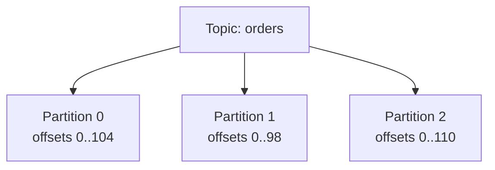
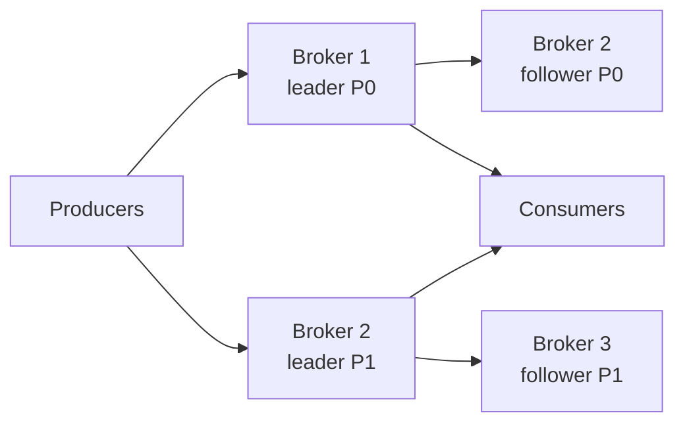
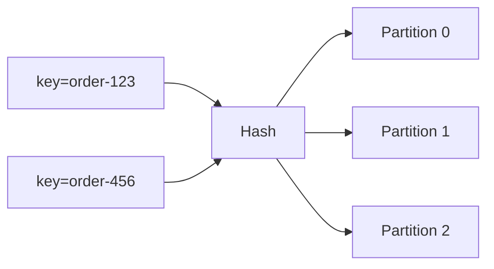
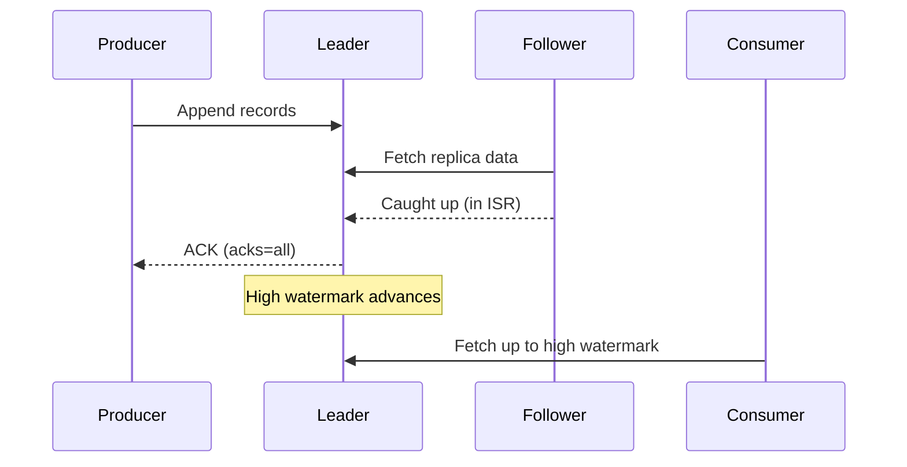
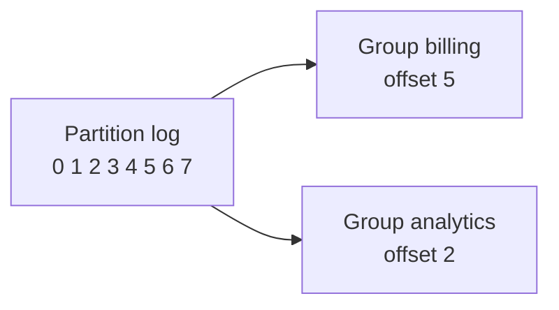
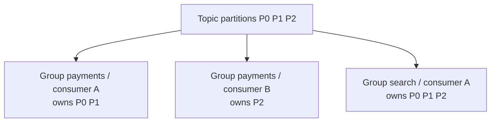
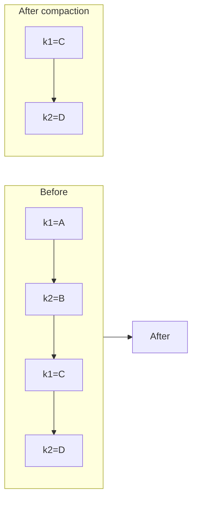
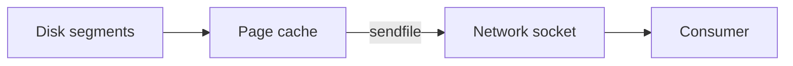
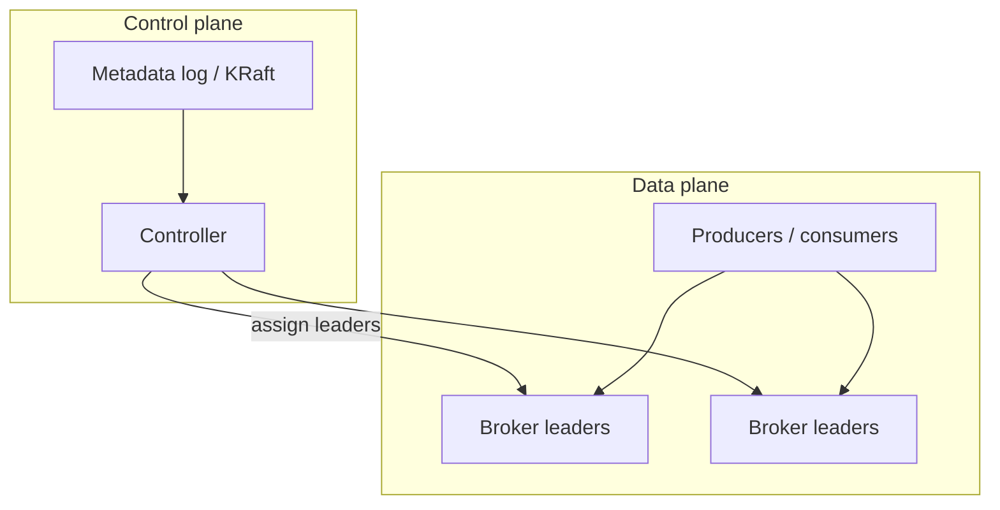
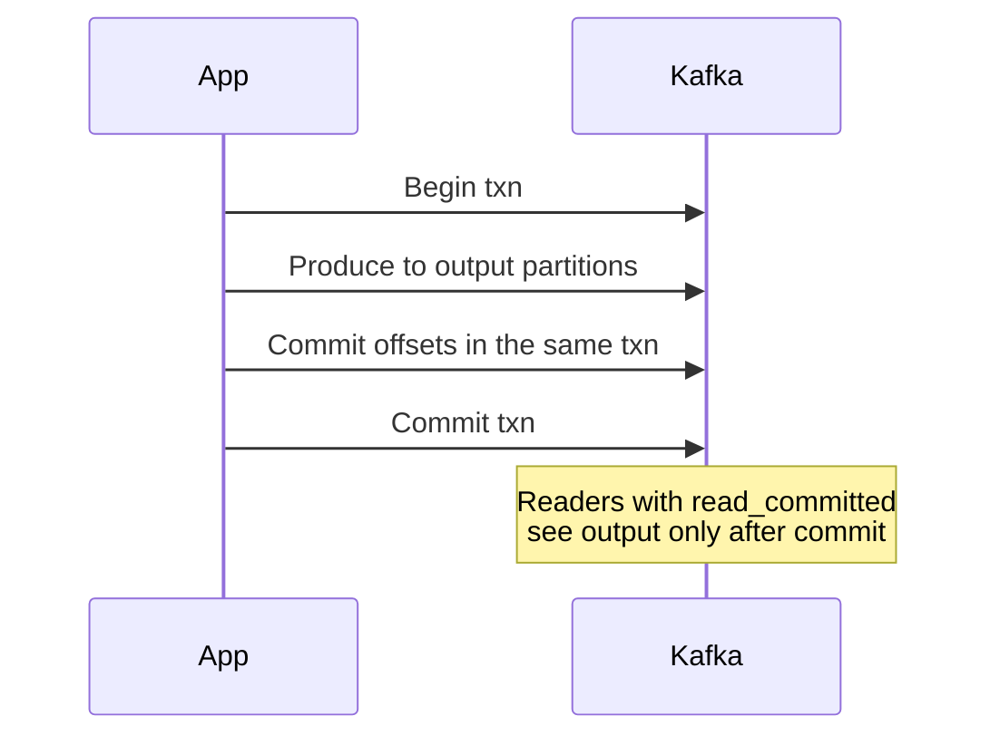

# Kafka architecture

Kafka is a distributed append-only log used as a high-throughput event stream.

This document treats Kafka as a **case study**, not a product manual.

The goal is to understand the problems it was built to solve, why the architecture looks the way it does, what each decision costs, and which of those ideas transfer to other distributed systems.

## The problem Kafka was built to solve

Traditional message queues are designed to **hand work to a worker and forget it**:

- A message is deleted after it is acked
- Fan-out means copying the message into many queues
- Replay is awkward — the broker, not the consumer, owns progress
- Throughput is limited by random I/O, per-message acks, and broker-side routing logic

At scale, the need can be different: a durable, ordered history of events that many independent systems could read, at their own pace, and re-read when they broke or changed.

## Core abstraction: the distributed log

A Kafka **topic** is a named stream. It is split into **partitions**. Each partition is an ordered, immutable sequence of records, addressed by an **offset**.

Producers **append**. Consumers **read from an offset**. Nothing is removed because a consumer finished — records stay until **retention** expires (or compaction rewrites the log).

Why a log?

- Sequential writes are fast on disk — random writes are not
- Immutability makes replication and caching simpler: a written offset never changes
- Many readers can share one copy of the data, each with its own cursor
- The same structure is a natural WAL, changelog, and event source

**Trade-off:** the broker is no longer a work tracker — consumers must store progress, handle duplicates, and catch up after downtime. Disk and retention policy become first-class capacity planning.

The unifying idea (Jay Kreps' "The Log"): an ordered sequence of facts is a general building block for messaging, replication, and data integration.

## Anatomy of a cluster

Enough Kafka vocabulary to talk about the decisions:

- **Broker**: A node that stores partition replicas and serves produce/fetch
- **Topic / partition**: The shard of the log — the unit of ordering, parallelism, and replication
- **Record**: Key, value, timestamp, headers — the key chooses the partition
- **Replica**: A copy of a partition on a broker. One replica is the **leader** and the others are **followers**
- **Controller**: A single elected broker that assigns leaders and reacts to membership changes
- **Consumer group**: A set of consumers that jointly read a topic, with each partition owned by one member

The cluster is a **shared-nothing** collection of partition leaders: scale by adding partitions and brokers, not by making one log bigger.

## Partitioning: parallelism without global order

**Problem:** a single totally ordered log cannot use more than one disk, one leader, or one consumer at a time. Global order is also rarely required.

**Kafka's choice:** hash the record key to a partition (`hash(key) % N`). Order is guaranteed **inside a partition**, not across the topic.

All events for `order-123` land on the same partition, so a consumer sees them in produce order. Events for different orders can be processed in parallel.

Records produced **without a key** are batched across partitions instead, so they get throughput and no ordering guarantee at all. "Kafka preserves order" is only true for records that share a key.

Trade-offs:

- Throughput scales with partition count (and with brokers that host them)
- A hot key creates a hot partition — extra consumers cannot split that key's work
- Changing `N` remaps keys under modulo hashing, so partition count is treated as relatively stable
- Max useful consumers in a group equals the number of partitions

Kafka uses simple modulo hashing for record placement, not [consistent hashing](../fundamentals/16-hashing.md), because partition count is an operator decision rather than a constantly changing node set. Consistent hashing would reduce remapping when `N` changes, at the cost of a more complex mapping and less even load for small `N` — a bad trade when `N` changes once a year.

Design rule: pick a partition key with high cardinality and even access. If you need global order, you have chosen a single partition — and a single-threaded bottleneck.

## Replication: leader, followers, and ISR

**Problem:** a partition on one broker is a single point of failure. Replicating every append synchronously to every replica makes writes as slow as the slowest, most distant disk.

**Kafka's choice:** Producers and consumers talk only to the **leader**. Followers pull the log and catch up. Durability is defined against the **in-sync replica set (ISR)** — replicas that have caught up within a timeout — not against a static majority of all replicas.

Two offsets matter:

- **Log end offset**: The latest record the leader has written
- **High watermark**: The latest record fully replicated to the ISR. Consumers may read only up to this point, so they never see data that could disappear in a leader failover

This is the same idea as a consensus log's commit index: **do not expose uncommitted suffix**.

**ISR vs a quorum:**

[Consensus](../fundamentals/29-consensus.md) separates two things that both get called a quorum: the **majority quorum** a Raft-style protocol needs to commit, and the tunable `R + W > N` quorum of a leaderless store. Kafka's ISR is a third shape.

| Scheme                          | Who must persist a write                   | Membership                                                       |
| ------------------------------- | ------------------------------------------ | ---------------------------------------------------------------- |
| Majority quorum (Raft, etcd)    | Any `floor(N/2) + 1` of the voting members | Fixed set; the responding nodes can differ per write             |
| `R + W > N` (Dynamo, Cassandra) | Any `W` of `N` replicas                    | Fixed set; concurrent writes conflict and are merged later       |
| ISR (Kafka)                     | *All* current members of the in-sync set   | Dynamic: replicas leave when they lag, rejoin when they catch up |

Pros:

- Writes are not blocked by a permanently slow replica — it is removed from ISR
- With `replication.factor=3` and one follower lagging, a write still acks once the leader and the remaining follower have it

Cons:

- If ISR shrinks to one, `acks=all` no longer means "replicated" — it means "the leader has it"
- This is why `min.insync.replicas` exists: a floor on how small ISR may get before the leader rejects writes outright

Kafka's ISR is a **dynamic durability set**: exclude laggards so throughput is not hostage to the slowest replica, then put a floor under it so availability cannot silently eat durability. The usual production setting is `replication.factor=3` with `min.insync.replicas=2`, which tolerates one broker loss without either stalling writes or dropping to a single copy.

One subtlety worth having ready: ISR membership is itself cluster metadata, so shrinking or expanding the ISR is a controller decision recorded in a strongly consistent metadata log. The record path avoids paying for consensus per append, but the *definition of durable* for that path is maintained by consensus — the split described under control plane vs data plane below.

## Acknowledgments: latency vs durability

The producer chooses, per write, how many replicas must persist the record before the send is treated as successful.

- `acks=0`: Fire-and-forget — the record can be lost on any failure and the producer will not know
- `acks=1`: The leader has written locally — lost if the leader dies before a follower catches up
- `acks=all`: Every current ISR member has the record — survives leader failure, subject to `min.insync.replicas`

This is the same choice as [who you wait for](../fundamentals/23-database-replication.md) in database replication, and it sets the same number: the **RPO** of that partition. `acks=all` with `min.insync.replicas=2` means "two copies before I call it durable"; `acks=1` means "one copy, and a loss window the size of the follower's lag". See [multi-region replication](./02-multi-region-replication.md) for the same knob at region scale.

**Unclean leader election** is the failure-mode version of the same trade-off.
When every ISR replica is gone, the controller has two options:

- **Promote an out-of-sync replica**: the partition comes back, but everything after that replica's position is silently dropped.
- **Keep the partition offline** until an ISR member returns: nothing is lost, but the partition stays down.

Kafka refuses unclean election by default, choosing RPO over RTO.
This is exactly the "promote a far-behind replica because it is the only one left" decision from [multi-region failover](./02-multi-region-replication.md), with a config flag attached to it.

## Consumers own the cursor

**Problem:** if the broker deletes a message on ack, only one consumer can see it, and nobody can replay.

**Kafka's choice:** the log stays. Each consumer (or group) stores an **offset** — a checkpoint of "I have processed up to here."

Independent groups read the same partition at different speeds. A buggy consumer rewinds its offset and reprocesses. A new service starts at the latest offset, or at the beginning, without asking producers to change.

Committed offsets live in Kafka itself, in a compacted internal topic keyed by group and partition, so only the latest checkpoint per group survives. That is the compaction pattern below applied to Kafka's own bookkeeping — and it is why offset commits are durable and replicated like any other write.

**Pull, not push:** consumers fetch when they are ready. That is natural [backpressure](../fundamentals/31-messaging-patterns.md). A slow consumer lags; it does not force the broker to buffer per-consumer in memory or block producers (until disk/retention fills).

**Trade-offs:**

- Lag is a first-class metric; "the queue is empty" is the wrong mental model
- At-least-once is the easy default: crash after processing but before committing the offset, and you will see the record again
- Exactly-once requires extra machinery (see below)
- Retention bounds how far you can rewind; after that, the data is gone

**Elsewhere:** Flink/Spark checkpoints, CDC offsets, replica positions in DB replication, any consumer that stores "high-water mark" rather than relying on the broker to forget work.

## Consumer groups: exclusive ownership, not competing consumers

**Problem:** you want both **fan-out** (many systems see every event) and **parallel processing** (one system's work split across workers) without breaking per-key order.

**Kafka's choice:**

- **Different groups** = fan-out. Each group independently reads the full stream
- **Members of one group** = parallelism. Each partition is assigned to **at most one** consumer in that group

This is **partition ownership**, not [competing consumers](../fundamentals/31-messaging-patterns.md) on the same message. Two workers in the same group will never process the same offset. That preserves per-partition order at the cost of a hard parallelism cap: extra consumers in a group sit idle once every partition has an owner.

When membership changes, the group **rebalances** — partitions are reassigned. A rebalance is a correctness event (ownership must be exclusive) and an availability event (processing pauses or stutters). Cooperative / incremental rebalancing reduces the pause, but the invariant stays: one owner per partition per group.

**Elsewhere:** shard ownership in databases, Kubernetes controller-manager leader per object, "sticky" work assignment vs work stealing. If you need finer parallelism than your shard count, you must reshard — the same constraint as a sharded database.

## Retention and compaction

**Problem:** a log that grows forever will fill the cluster. A log that deletes on consume cannot serve new readers.

**Kafka's choice:** retention is a **policy** on the log, independent of consumers.

- **Time or size retention**: Drop whole old segments (typical for event streams)
- **Log compaction**: For keyed data, keep the **latest value per key** and discard older ones

Compaction turns a partition into a replicated changelog: replay it and you reconstruct current state. Kafka Streams state stores and compacted "table" topics use this.

**Trade-offs:**

- Retention is a product decision (how long can we replay?) and a cost decision (disk)
- Compaction is not a general-purpose database: it is last-write-wins per key, with no secondary indexes
- Consumers that lag beyond retention **skip data**; they do not block producers
- Tombstones (null values) exist so compaction can delete keys

**Elsewhere:** LSM-tree compaction, event-sourced snapshots plus a suffix of events, CDC tables that keep current row state, Redis AOF rewrite. Snapshot + log suffix is the general way to bound replay time.

## Why sequential I/O makes it fast

Kafka's throughput is not mainly a clever in-memory data structure. It is a storage design that stays on the fast path of modern kernels and disks.

- **Append-only segments**: Each partition is a sequence of large segment files plus offset and timestamp indexes, so writes are sequential
- **OS page cache**: Kafka treats the kernel cache as its serving layer instead of a large JVM heap. Recently written data is often still in RAM when consumers catch up
- **Zero-copy fetches**: `sendfile` (or an equivalent) moves bytes from page cache to the socket without copying into user space
- **Producer batching and compression**: Many records become one request and one compressed chunk, amortizing syscalls and network round trips

**Trade-off:** sequential throughput assumes consumers mostly read recent data (the cache-friendly case). Cold reads from old segments compete for disk. Huge heaps would fight the page cache; Kafka deliberately keeps the JVM small relative to RAM.

**Elsewhere:** LSM trees (sequential flushes), WAL-first databases, nginx static file serving, any system that asks "can we turn random work into sequential appends and let the OS cache do the rest?"

Batching is the same latency vs throughput trade-off as Nagle's algorithm or Redis pipelining: wait a few milliseconds, send more bytes per round trip.

## Control plane vs data plane

**Problem:** partition placement, leader election, and membership need strong consistency. The data path needs to append millions of records per second. One mechanism is a bad fit for both.

**Kafka's choice:** split the cluster in two.

- **Data plane**: Produce and fetch against partition leaders. Replication is leader-follower plus ISR, optimized for throughput
- **Control plane**: Cluster metadata — topics, replica assignments, leader identity. Historically ZooKeeper; now **KRaft** (Raft inside Kafka)

A single **controller** is elected via that strongly consistent metadata log. It watches broker liveness and moves partition leadership. Producers do not run Raft for every record.

**Why this split:** [consensus](../fundamentals/29-consensus.md) is expensive on the latency path. Use it for a small, critical dataset (who is leader, what is the schema of the cluster), and use cheaper replication for bulk data.

**Trade-off:** two failure domains. If metadata is unavailable, you cannot create topics or elect new leaders, even if existing leaders can still serve produce/fetch for a while. If you put consensus on the data path instead, every append pays majority round-trips.

**Elsewhere:** Kubernetes (etcd vs kubelet), SDN controllers vs switches, Spanner (placement/metadata vs tablet serving), almost every large storage system. "Consensus for control, simpler replication for data" is one of the most reusable architecture rules in this repository.

[Leader election](../fundamentals/28-leader-election.md) here is not decoration: two leaders for one partition means two divergent logs.
Kafka's protection is the fencing token from that document under a different name.
Every leadership change increments a **leader epoch**, each append carries it, and replicas reject anything stamped with an older epoch — so a partitioned-then-revived leader cannot graft its unreplicated tail onto the new history.
The check lives in the replica being written to, not in the old leader's opinion of itself, which is exactly the property fencing requires.
The same mechanism at region scale is a fencing token on [multi-region promotion](./02-multi-region-replication.md).

## Exactly-once as a composition

Kafka's end-to-end default is **at-least-once**: retry produces, retry fetches, commit offsets after processing. Duplicates happen. See [delivery semantics](../fundamentals/31-messaging-patterns.md).

"Exactly-once" is not a broker flag. It is several mechanisms stacked so that a retry cannot create a second visible effect:

1. **Idempotent producer**: Each producer gets an ID and each partition tracks a sequence number, so the broker drops a retry carrying a sequence it has already seen. Network retries stop duplicating records **within a producer session**. This is enabled by default in current Kafka versions
2. **Transactions**: A producer atomically commits writes across several partitions, and can include the consumer offset commit in the same transaction. Readers configured `read_committed` skip aborted data
3. **Fencing**: A new transactional producer with the same `transactional.id` bumps the producer epoch and fences the old one, so a restarted process cannot commit after its successor has taken over — the same epoch trick as leader fencing, one level up

**Trade-offs:**

- Higher latency and more coordinator work than fire-and-forget
- Exactly-once is end-to-end only if **every side effect** is in the transaction (or is idempotent). A send-email call outside Kafka is still at-least-once
- Idempotent producer without transactions still does not make a consumer's external DB write exactly-once

**Elsewhere:** database transactions plus outbox ([Transactional Outbox](../patterns/07-transactional-outbox.md)), idempotency keys on APIs, fencing tokens in leader failover, "effectively once" = at-least-once + idempotent handlers. Always ask *which* hop is exactly-once, not whether the product brochure says the words.

## Mapping Kafka onto the general replication vocabulary

Kafka implements an opinionated version of the trade-offs every replicated system faces. Being able to translate in both directions is worth more than the config names, because an interviewer will ask the general question and expect the specific mechanism, or the reverse.

| General term                           | Kafka mechanism                                         | Notes                                                                      |
| -------------------------------------- | ------------------------------------------------------- | -------------------------------------------------------------------------- |
| Ack policy (RPO)                       | `acks` plus `min.insync.replicas`                       | Wait for more copies, or return sooner and accept a loss window            |
| Write quorum                           | In-sync replica set (ISR)                               | Dynamic membership, not a fixed majority; floored by `min.insync.replicas` |
| Commit point                           | High watermark                                          | Consumers never see an uncommitted suffix                                  |
| Promote the most caught-up replica     | Controller elects from the ISR                          | A normal election cannot lose an acknowledged record                       |
| Unclean promotion (accepted data loss) | `unclean.leader.election.enable`                        | Off by default; turning it on trades RPO for RTO                           |
| Fencing token                          | Leader epoch, and producer epoch per `transactional.id` | A stale leader or producer is rejected, not merged                         |
| Split-brain                            | Two leaders for one partition                           | Forks the log; prevented by epochs, not by longer timeouts                 |
| RTO                                    | Controller detection, election, metadata propagation    | Seconds; clients re-fetch metadata on a not-leader error                   |
| Conflict resolution                    | Not applicable                                          | One leader per partition, so no concurrent writers to merge                |

Two rows are genuinely different rather than renamed:

- **The durability set is dynamic.** Other schemes fix the membership and let the responding subset vary; Kafka varies the membership itself. That is why `min.insync.replicas` has to exist — without a floor, a shrinking ISR quietly turns `acks=all` into `acks=1`
- **Conflict resolution has no entry.** A partition has one leader and one log, so there is no Kafka equivalent of last-write-wins or CRDTs. The price is paid earlier instead: you have to partition by a key, and per-key order is all you get

## Kafka across regions

Putting replicas in another region is the same decision as [synchronous cross-region replication](./02-multi-region-replication.md): a better RPO, paid for with WAN latency on every acknowledged write. There are two shapes, and they line up with the two multi-region deployment patterns.

**Stretch cluster** — one cluster, replicas spread across regions:

- Rack awareness places a partition's replicas in different regions, so `acks=all` means the record exists in more than one region: a regional RPO of zero
- Every acknowledged produce pays the cross-region round trip, and the KRaft controller quorum still needs a majority, so it needs **three** regions rather than two — the same "two sites cannot arbitrate" rule as in multi-region databases
- Consumers can be configured to fetch from a nearby follower instead of the leader, so reads do not also cross the WAN
- Practical when regions are tens of milliseconds apart. Across an ocean, produce latency usually rules it out

**Cluster per region with asynchronous mirroring** — independent clusters, records copied between them by MirrorMaker 2 or a vendor cluster-linking equivalent:

- Mirroring is asynchronous, so RPO > 0, exactly like an async cross-region database replica
- The clusters have independent offset spaces: the same record can be offset 900 in one and 1204 in the other. Failing consumers over therefore needs **offset translation**, which the mirroring tool maintains in checkpoint topics — the offset number itself does not carry across
- Mirrored topics are prefixed with the source cluster name by default, which is what stops active-active mirroring from looping records back and forth forever
- Making the *same* logical topic writable in both regions reintroduces the multi-primary conflict problem, and the answer is the one from [multi-region replication](./02-multi-region-replication.md): give each key a home region and treat the mirrored copy as read-only

## What Kafka is not

Using Kafka as a case study also means knowing when the architecture is the wrong template.

- **Not a work queue.** No competing consumers on the same offset, no per-message visibility timeout as the primary API. Use a queue when a *task* must be processed once by any worker
- **Not a request-reply bus.** You can build request-reply on topics; you fight the model. RPC is still the right tool for low-latency, strongly consistent answers
- **Not a database.** Compacted topics are changelogs. They do not give you ad-hoc queries, secondary indexes, or multi-row transactions across arbitrary keys
- **Not cheap to operate at small scale.** Partition count, retention, rebalances, and consumer lag are operational surface area that a managed queue may not earn

## Pattern catalog

These are the transferable decisions, independent of Kafka APIs.

| Pattern                        | What Kafka does                              | Use the same idea when                                       |
| ------------------------------ | -------------------------------------------- | ------------------------------------------------------------ |
| Append-only log                | Partition = immutable sequence               | You need replay, replication, or an audit of facts           |
| Shard by key                   | Hash key to partition                        | You need per-entity order and horizontal scale               |
| Leader-follower + commit index | Leader writes, ISR defines high watermark    | You want one writer per shard and lagging replicas           |
| Dynamic durability set         | ISR shrinks; `min.insync.replicas` floors it | Slow replicas should not stall writes, but RPO still matters |
| Consumer-owned cursor          | Offset commits                               | Multiple readers, replay, independent progress               |
| Exclusive shard ownership      | One consumer per partition per group         | Parallelism without breaking order                           |
| Retention policy               | Time/size/compaction                         | Bound storage without coupling to consumers                  |
| Sequential I/O + page cache    | Segments, sendfile, small heap               | Throughput is the goal and the workload can be append-heavy  |
| Control vs data plane          | KRaft/controller vs produce/fetch            | Metadata must be consistent; bulk data must be fast          |
| Fencing                        | Leader epochs, transactional IDs             | Failover must stop the old primary from writing              |
| Composed exactly-once          | Idempotent produce + txn + offset commit     | Retries exist and side effects must not double-apply         |
| Pull + lag                     | Consumers fetch; monitor lag                 | Backpressure should sit at the consumer, not in broker RAM   |

## Design guidelines

- Start from the workload: event history and fan-out (log) vs one-shot tasks (queue)
- Choose a partition key for even load and the ordering you actually need
- Set `acks` and `min.insync.replicas` as an explicit RPO decision, not as defaults you never looked at
- Size partitions for consumer parallelism, then treat that count as hard to change
- Monitor consumer lag, ISR shrinks, and under-replicated partitions as health, not as trivia
- Design consumers as idempotent even if you enable transactions
- Keep consensus off the record path; use it for membership and leadership
- Bound replay with retention or snapshots; do not assume infinite history
- Choose the cross-region shape deliberately: stretch a cluster only when the regions are close, otherwise run a cluster per region and plan for asynchronous mirroring and offset translation

## Interview talking points

- Kafka is a **partitioned, replicated commit log**, not a smart queue. That single choice explains fan-out, replay, and consumer offsets.
- Order is **per partition**. Name the key and the hot-key failure mode.
- Durability is **ISR + acks + min.insync.replicas**, not "replication factor = safe."
- Consumer groups give **ownership-based parallelism**; extra instances do nothing without extra partitions.
- Exactly-once is a **composition** (idempotency, transactions, fencing), and it stops at the boundary of Kafka.
- Call out **control plane vs data plane**: Raft for metadata, leader-follower for the log.
- Translate the general vocabulary out loud: ISR is the write quorum, the leader epoch is the fencing token, and `unclean.leader.election.enable` is the accepted-data-loss promotion.
- Across regions, name the shape: a stretched cluster (RPO of zero, WAN latency on every ack, three regions for the controller quorum) or a cluster per region with asynchronous mirroring (RPO > 0, offset translation on consumer failover).
- Contrast with RabbitMQ/SQS: delete-on-ack vs retain-and-cursor; competing consumers vs partition assignment.

## Reference materials

- [The Log: What every software engineer should know about real-time data's unifying abstraction][the-log]
- [Kafka: a Distributed Messaging System for Log Processing Paper](https://www.microsoft.com/en-us/research/wp-content/uploads/2017/09/Kafka.pdf)
- [Apache Kafka Documentation - Design](https://kafka.apache.org/documentation/#design)

[the-log]: https://www.linkedin.com/blog/engineering/distributed-systems/log-what-every-software-engineer-should-know-about-real-time-datas-unifying
