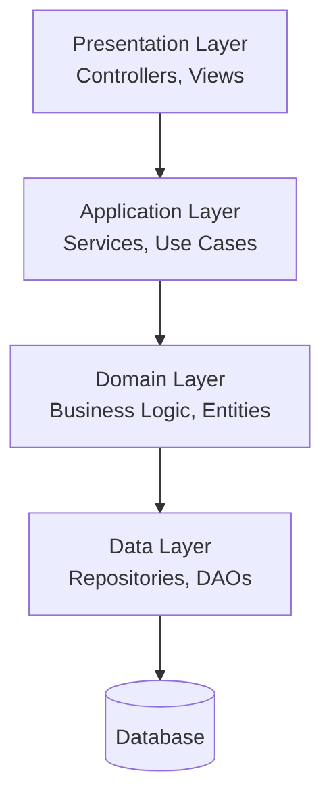
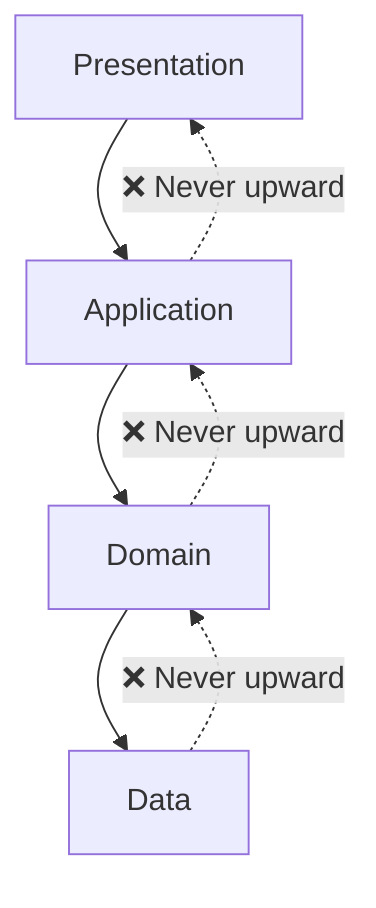

# Layered Architecture (N-Tier Architecture)

Layered architecture organizes software into horizontal layers where each layer provides services to the layer above and uses services from the layer below.

This creates clear separation of concerns and promotes maintainability through well-defined boundaries.

## Core Concept

Also known as **n-tier architecture**, this pattern structures applications into distinct layers with specific responsibilities.

Each layer acts as an abstraction that hides implementation details from other layers.



## Layer Breakdown

### Presentation Layer

- **Purpose**: Manages user interfaces and external communication
- **Responsibilities**: Request handling, response formatting, input validation
- **Examples**: REST controllers, web pages, mobile apps, CLI interfaces

```python
class UserController:
    def __init__(self, user_service):
        self.user_service = user_service

    def create_user(self, request):
        try:
            user = self.user_service.create_user(request.data)
            return {"status": "success", "user_id": user.id}
        except ValidationError as e:
            return {"status": "error", "message": str(e)}
```

### Application Layer

- **Purpose**: Orchestrates business workflows and coordinates between layers
- **Responsibilities**: Transaction management, security, workflow coordination
- **Examples**: Application services, use case handlers, facade patterns

```python
class UserService:
    def __init__(self, user_repository, email_service):
        self.user_repository = user_repository
        self.email_service = email_service

    def create_user(self, user_data):
        user = User.create(user_data)  # Domain logic
        saved_user = self.user_repository.save(user)  # Data persistence
        self.email_service.send_welcome_email(user.email)  # Side effect
        return saved_user
```

### Domain Layer

- **Purpose**: Contains core business rules and domain logic
- **Responsibilities**: Business rules, domain entities, business validations
- **Examples**: Domain models, business rules, domain services

```python
class User:
    def __init__(self, email, name):
        self.email = self._validate_email(email)
        self.name = self._validate_name(name)
        self.id = None
        self.created_at = datetime.now()

    @staticmethod
    def _validate_email(email):
        if '@' not in email or len(email) < 5:
            raise ValidationError("Invalid email format")
        return email

    def change_email(self, new_email):
        old_email = self.email
        self.email = self._validate_email(new_email)
        return EmailChangedEvent(self.id, old_email, new_email)
```

### Data Layer

- **Purpose**: Manages data persistence and retrieval
- **Responsibilities**: Database operations, data mapping, external data sources
- **Examples**: Repository implementations, ORM configurations, data access objects

```python
class UserRepository:
    def __init__(self, database):
        self.db = database

    def save(self, user):
        user_data = {
            'email': user.email,
            'name': user.name,
            'created_at': user.created_at
        }
        user_id = self.db.insert('users', user_data)
        user.id = user_id
        return user

    def find_by_email(self, email):
        row = self.db.query('SELECT * FROM users WHERE email = ?', [email])
        return User(row['email'], row['name']) if row else None
```

## Dependency Flow

### Strict Downward Dependencies

Upper layers depend on lower layers, never the reverse. This maintains clear boundaries and prevents circular dependencies.



### Interface-Based Decoupling

Layers communicate through well-defined interfaces, enabling flexibility and testability.

```python
# Domain layer defines interface
from abc import ABC, abstractmethod

class UserRepository(ABC):
    @abstractmethod
    def save(self, user: User) -> User:
        pass

    @abstractmethod
    def find_by_email(self, email: str) -> User:
        pass

# Data layer implements interface
class DatabaseUserRepository(UserRepository):
    def save(self, user: User) -> User:
        # Implementation details hidden from domain layer
        pass
```

## Architectural Variations

### Closed Architecture (More Common)

Each layer only communicates with the layer immediately below it.

**Benefits:**

- Clear boundaries and predictable data flow
- Better encapsulation of layer responsibilities
- Easier debugging and maintenance

### Open Architecture (Use Cautiously)

Layers can bypass intermediate layers for performance optimizations.

**When to Use:**

- Performance-critical read operations
- Simple data queries that don't require business logic
- Reporting and analytics where bypassing business rules is acceptable

**Trade-offs:**

- Increases coupling between non-adjacent layers
- Can lead to business logic leakage
- Makes the system harder to maintain over time

## Benefits and Challenges

### Benefits

- **Clear Separation**: Each layer has distinct, well-defined responsibilities
- **Maintainability**: Changes in one layer rarely affect others
- **Testability**: Layers can be tested independently through mocking
- **Reusability**: Business logic can be reused across different interfaces
- **Team Structure**: Different teams can work on different layers

### Challenges

- **Performance Overhead**: Multiple layer traversals can introduce overhead
- **Over-Engineering**: Simple operations may become unnecessarily complex
- **Anemic Models**: Risk of putting all logic in services, leaving domain objects as data containers
- **Rigid Structure**: Can be inflexible for rapidly changing requirements

## Guidelines

### Keep Layers Thin and Focused

```python
# Good ✅: Thin controller focused on HTTP concerns
class OrderController:
    def create_order(self, request):
        order_data = request.json
        order = self.order_service.create_order(order_data)
        return jsonify({"order_id": order.id})

# Bad ❌: Fat controller with business logic
class OrderController:
    def create_order(self, request):
        order_data = request.json
        # Business logic in wrong layer!
        if order_data['total'] < 0:
            return {"error": "Invalid total"}
        # Database access in wrong layer!
        db.execute("INSERT INTO orders...")
```

### Use Dependency Injection

```python
# Application composition at startup
def create_app():
    database = Database(connection_string)
    user_repository = DatabaseUserRepository(database)
    email_service = SMTPEmailService()
    user_service = UserService(user_repository, email_service)
    user_controller = UserController(user_service)

    return App(user_controller)
```

### Handle Cross-Cutting Concerns Properly

```python
# Infrastructure layer handles logging, caching, etc.
class LoggingUserService:
    def __init__(self, user_service, logger):
        self.user_service = user_service
        self.logger = logger

    def create_user(self, user_data):
        self.logger.info(f"Creating user with email: {user_data['email']}")
        try:
            user = self.user_service.create_user(user_data)
            self.logger.info(f"User created successfully: {user.id}")
            return user
        except Exception as e:
            self.logger.error(f"Failed to create user: {e}")
            raise
```

## When to Use Layered Architecture

### Ideal Scenarios

- **Traditional Business Applications**: CRUD-heavy applications with clear business workflows
- **Stable Business Domains**: Well-understood business domains with predictable changes

### Consider Alternatives When

- Building highly distributed, event-driven systems (e.g. in microservices, bounded contexts are more important than layers)
- Performance is critical and layers add unnecessary overhead
- Requirements change frequently requiring high flexibility

## Common Anti-Patterns

### Anemic Domain Model

```python
# Anti-pattern ❌: Domain objects with no behavior
class User:
    def __init__(self):
        self.email = None
        self.name = None

class UserService:
    def validate_user(self, user):
        # All logic in service layer
        if not user.email or '@' not in user.email:
            raise ValidationError("Invalid email")

# Better ✅: Rich domain model
class User:
    def __init__(self, email, name):
        self.email = self._validate_email(email)
        self.name = name

    def _validate_email(self, email):
        if not email or '@' not in email:
            raise ValidationError("Invalid email")
        return email
```

### Layer Bypassing

```python
# Anti-pattern ❌: Controller directly accessing data layer
class UserController:
    def get_user(self, user_id):
        # Bypassing application and domain layers
        return self.database.query("SELECT * FROM users WHERE id = ?", [user_id])

# Better ✅: Respect layer boundaries
class UserController:
    def get_user(self, user_id):
        return self.user_service.get_user(user_id)
```

### God Services

Avoid monolithic service classes that handle multiple unrelated concerns. Keep services focused on single business capabilities.

## Reference Materials

- [N-tier Architecture](https://docs.microsoft.com/en-us/azure/architecture/guide/architecture-styles/n-tier)
- [Organizing Layers](https://www.martinfowler.com/bliki/PresentationDomainDataLayering.html)
