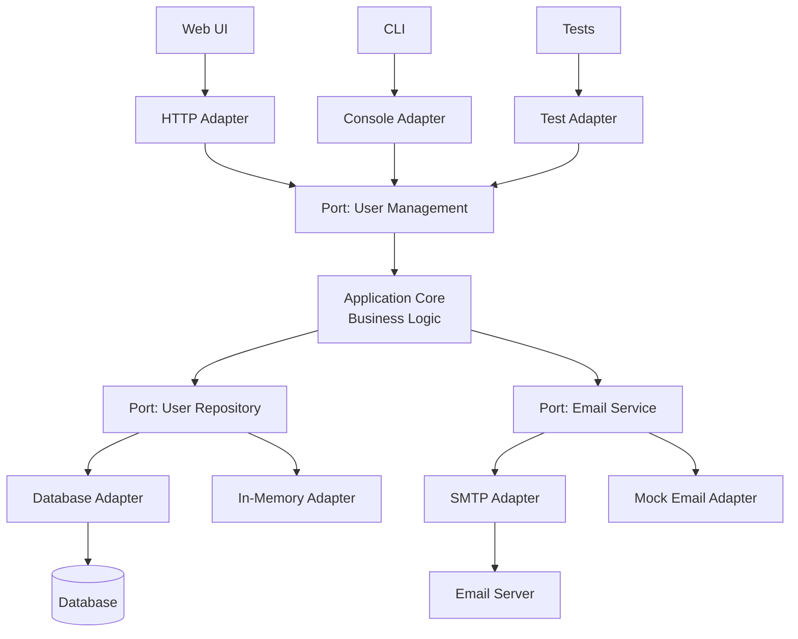
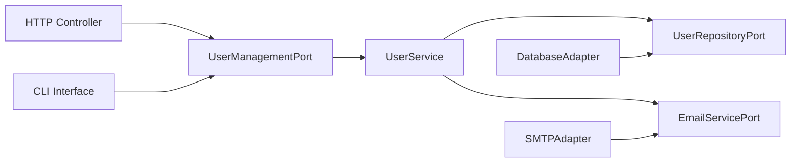

# Hexagonal Architecture (Ports and Adapters)

Hexagonal architecture, also known as the **Ports and Adapters** architecture, isolates the core business logic from external concerns by defining boundaries between internal logic and external systems.

This creates applications that are technology-agnostic, highly testable, and adaptable to change.

## Core Concept

The architecture gets its name from the hexagonal shape used to represent the application core, though the number of sides is arbitrary.

The main components are:

- **Core/Domain**: The business logic of the application, which is agnostic of how it's being used or accessed
- **Ports**: Interfaces that define how the external world interacts with the core (input/driving/primary ports) and how the core interacts with external systems (output/driven/secondary ports)
- **Adapters**: Implementations of the ports. These can be user interfaces or external system integrations (e.g., database repositories, external API clients)



## Architecture Components

### Application Core (Hexagon Center)

The business logic that defines what your application does, independent of how it's implemented or accessed.

```python
class User:
    def __init__(self, email, name):
        if not self._is_valid_email(email):
            raise InvalidEmailError(f"Invalid email: {email}")
        self.email = email
        self.name = name
        self.id = None
        self.created_at = datetime.now()

    def _is_valid_email(self, email):
        return "@" in email and len(email) > 3

    def change_email(self, new_email):
        if not self._is_valid_email(new_email):
            raise InvalidEmailError(f"Invalid email: {new_email}")
        old_email = self.email
        self.email = new_email
        return UserEmailChanged(self.id, old_email, new_email)

class UserService:
    def __init__(self, user_repository, email_service):
        self.user_repository = user_repository
        self.email_service = email_service

    def create_user(self, email, name):
        if self.user_repository.exists_by_email(email):
            raise UserAlreadyExistsError(f"User with email {email} already exists")

        user = User(email, name)
        saved_user = self.user_repository.save(user)
        self.email_service.send_welcome_email(user.email, user.name)
        return saved_user
```

### Ports (Interfaces)

Contracts that define how the application core interacts with the outside world. There are two types:

#### Primary Ports (Driving/Input)

Define operations that external actors can perform on the application.

```python
from abc import ABC, abstractmethod

class UserManagementPort(ABC):
    @abstractmethod
    def create_user(self, email: str, name: str) -> User:
        pass

    @abstractmethod
    def get_user(self, user_id: int) -> User:
        pass

    @abstractmethod
    def update_user_email(self, user_id: int, new_email: str) -> User:
        pass
```

#### Secondary Ports (Driven/Output)

Define operations that the application core needs from external systems.

```python
class UserRepositoryPort(ABC):
    @abstractmethod
    def save(self, user: User) -> User:
        pass

    @abstractmethod
    def find_by_id(self, user_id: int) -> User:
        pass

    @abstractmethod
    def exists_by_email(self, email: str) -> bool:
        pass

class EmailServicePort(ABC):
    @abstractmethod
    def send_welcome_email(self, email: str, name: str) -> None:
        pass
```

### Adapters (Implementations)

Concrete implementations that connect ports to specific technologies or external systems.

#### Primary Adapters (Driving)

Handle input from external sources and translate it to core operations.

```python
# HTTP/REST Adapter
class UserController:
    def __init__(self, user_service: UserManagementPort):
        self.user_service = user_service

    def create_user_endpoint(self, request):
        try:
            data = request.json
            user = self.user_service.create_user(data['email'], data['name'])
            return {"status": "success", "user_id": user.id}, 201
        except (UserAlreadyExistsError, InvalidEmailError) as e:
            return {"status": "error", "message": str(e)}, 400

# CLI Adapter
class UserCLI:
    def __init__(self, user_service: UserManagementPort):
        self.user_service = user_service

    def handle_create_command(self, args):
        try:
            user = self.user_service.create_user(args.email, args.name)
            print(f"User created successfully: {user.id}")
        except Exception as e:
            print(f"Error: {e}")
```

#### Secondary Adapters (Driven)

Implement external system integrations required by the application core.

```python
# Database Adapter
class DatabaseUserRepository(UserRepositoryPort):
    def __init__(self, database):
        self.db = database

    def save(self, user: User) -> User:
        if user.id is None:
            user.id = self.db.insert('users', {
                'email': user.email,
                'name': user.name,
                'created_at': user.created_at
            })
        else:
            self.db.update('users', user.id, {
                'email': user.email,
                'name': user.name
            })
        return user

    def find_by_id(self, user_id: int) -> User:
        row = self.db.query_one('SELECT * FROM users WHERE id = ?', [user_id])
        if not row:
            raise UserNotFoundError(f"User {user_id} not found")
        user = User(row['email'], row['name'])
        user.id = row['id']
        return user

# Email Adapter
class SMTPEmailService(EmailServicePort):
    def __init__(self, smtp_server, port, username, password):
        self.smtp_server = smtp_server
        self.port = port
        self.username = username
        self.password = password

    def send_welcome_email(self, email: str, name: str) -> None:
        subject = "Welcome!"
        body = f"Hello {name}, welcome to our platform!"
        # SMTP implementation details...
```

## Dependency Inversion Principle

The key insight is that dependencies point inward toward the core, and the core depends only on abstractions (ports), never on concrete implementations.



This creates **dependency inversion**: high-level modules (core) don't depend on low-level modules (adapters). Both depend on abstractions (ports).

## Benefits and Trade-offs

### Benefits

- **Technology Independence**: Business logic separated from implementation details, enabling easy technology migration
- **Flexibility**: Multiple interfaces can use the same core logic without modification
- **Clear Boundaries**: Explicit contracts between core and external systems improve maintainability
- **Adaptability**: Easy to add new integrations and support different deployment configurations

### Trade-offs

- **More Abstractions**: Requires additional interfaces and upfront design effort
- **Complexity**: Can seem over-engineered for simple applications
- **Maintenance**: Requires discipline to maintain clear boundaries

## When to Use Hexagonal Architecture

### Ideal Scenarios

- **Changing applications** where technology changes are expected
- **Complex business domains** requiring clear separation of concerns
- **Multiple interfaces** (web, mobile, CLI, API) for the same functionality
- **Integration-heavy applications** connecting to multiple external systems

### Consider Alternatives When

- Building simple CRUD applications with minimal business logic
- Working with well-established, stable technology stacks

## Common Anti-Patterns

### Leaky Abstractions

```python
# Anti-pattern ❌: Port exposing implementation details
class UserRepositoryPort(ABC):
    @abstractmethod
    def execute_sql(self, sql: str) -> List[Dict]:  # Leaks SQL details
        pass

# Better ✅: Domain-focused interface
class UserRepositoryPort(ABC):
    @abstractmethod
    def find_active_users_by_department(self, department: str) -> List[User]:
        pass
```

### Anemic Ports

```python
# Anti-pattern ❌: Generic CRUD ports
class GenericRepository(ABC):
    @abstractmethod
    def create(self, entity): pass

    @abstractmethod
    def read(self, id): pass

# Better ✅: Domain-specific ports
class UserRepositoryPort(ABC):
    @abstractmethod
    def save_new_user(self, user: User) -> User:
        pass

    @abstractmethod
    def find_user_by_email(self, email: str) -> User:
        pass
```

### Fat Adapters

Avoid putting business logic in adapters. Keep them focused on translation and integration concerns.

## Reference Materials

- [The Hexagonal (Ports & Adapters) Architecture](https://alistair.cockburn.us/hexagonal-architecture/)
- [Ports and Adapters Pattern](https://jmgarridopaz.github.io/content/hexagonalarchitecture.html)
- [Ready for Changes with Hexagonal Architecture](https://netflixtechblog.com/ready-for-changes-with-hexagonal-architecture-b315ec967749)
- [Hexagonal Architecture: The What, Why and When](https://www.youtube.com/watch?v=qGp66Oc3zTg)
- [Implementing Hexagonal Architecture](https://medium.com/@matiasvarela/hexagonal-architecture-in-go-cfd4e436faa3)
