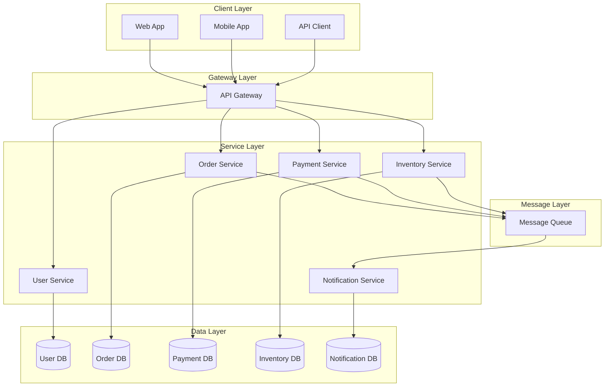
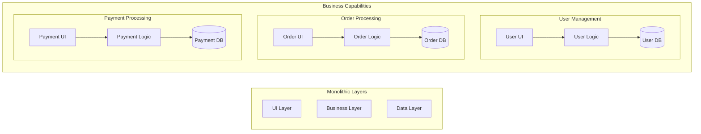
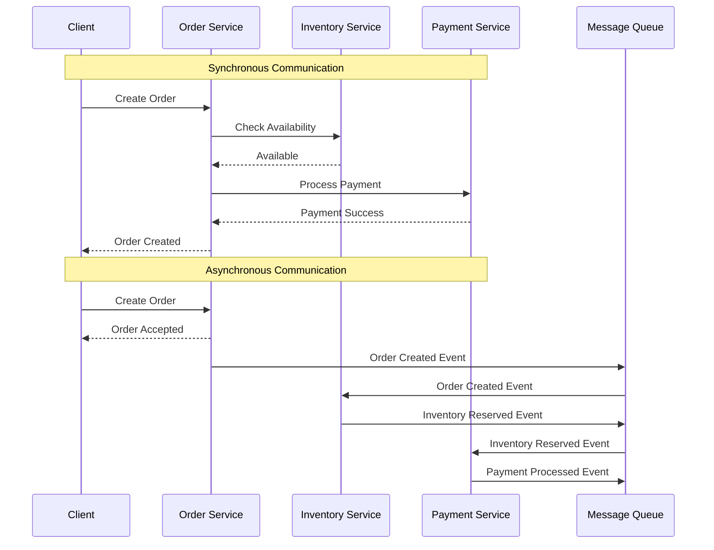
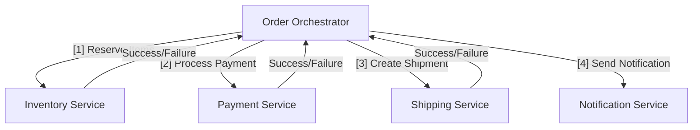
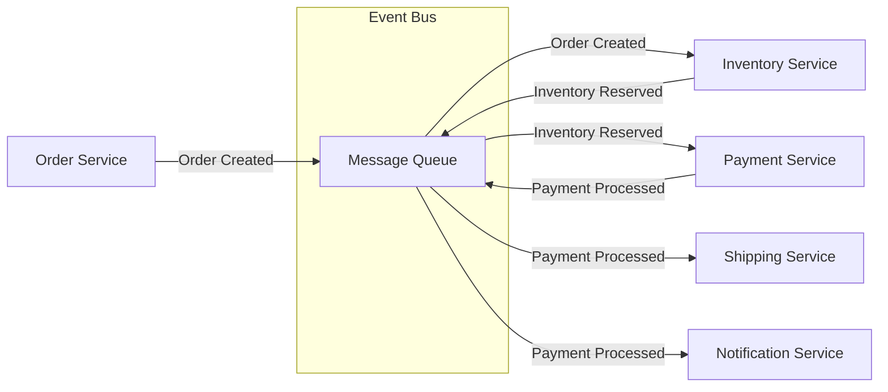
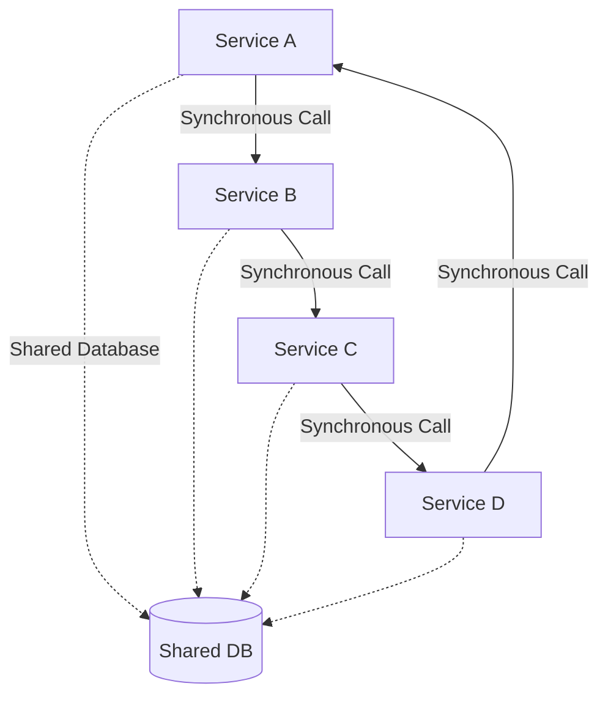
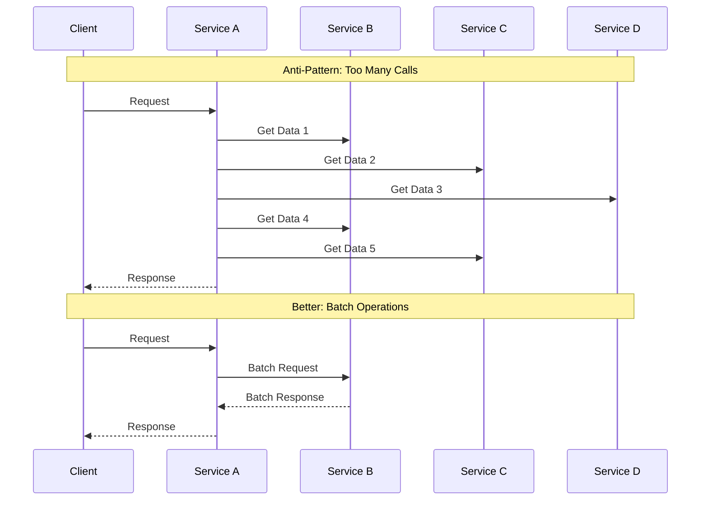

# Microservices Architecture

Microservices architecture breaks down applications into small, independent services that communicate over well-defined APIs.

Each service is owned by a small team and can be developed, deployed, and scaled independently.

## Core Concept

Rather than building applications as single deployable units (monoliths), microservices architecture structures applications as collections of loosely coupled services.

Each service implements specific business capabilities and can be developed using different technologies, programming languages, and data storage systems.

## Key Characteristics

### Business Capability Alignment

Each microservice is organized around a specific business capability rather than technical layers.

This approach, inspired by Conway's Law, ensures that services align with business functions and team structures.

### Decentralized Data Management

One of the most important principles is that each service manages its own database.

This prevents tight coupling through shared data stores and allows services to choose the most appropriate data storage technology for their needs.

## Communication Patterns

### Synchronous vs Asynchronous Communication

### Service Orchestration vs Choreography

**Orchestration Pattern:**

In orchestration, a central service coordinates the entire workflow, making sequential calls to other services and handling the overall transaction logic.

**Choreography Pattern:**

In choreography, services react to events independently without central coordination. Each service publishes events when it completes its local transaction, and other services react to these events to continue the saga.

## Benefits and Challenges

### Benefits

- **Strong Module Boundaries:** Microservices reinforce modular structure
- **Independent Deployment:** Small services are easier to deploy, and since they are autonomous, are less likely to cause system failures when they go wrong
- **Technology Diversity:** Microservices can be developed in multiple languages, development frameworks and data-storage technologies

### Challenges

- **Distributed Systems:** Distributed systems are harder to program, since remote calls are slow and are always at risk of failure
- **Eventual Consistency:** Maintaining strong consistency is extremely difficult for a distributed system, which means every service has to manage eventual consistency
- **Operational Complexity:** Services are redeployed regularly which comes with extra operational overhead requiring robust automation, monitoring, and orchestration tools

## Microservice Granularity

Microservice granularity specifies the scope of business functionality in a service operation.

By definition a coarse-grained service operation has broader scope than a fine-grained service, although the terms are relative.

The former typically requires increased design complexity but can reduce the number of calls required to complete a task.

The guiding principle is that a microservice should be small enough to encapsulate a single business capability but large enough to manage its responsibilities independently.

## Common Anti-Patterns

### Distributed Monolith

A distributed monolith occurs when services are deployed separately but remain tightly coupled through synchronous calls and shared databases.

This anti-pattern combines the worst aspects of both monolithic and microservice architectures,  the complexity of distributed systems without the benefits of loose coupling.

### Chatty Services

Chatty services occur when a service makes excessive calls to other services to complete a single operation.

This creates performance bottlenecks, increases latency, and makes the system fragile due to cascading failures.

## Reference Materials

- [Microservices](https://martinfowler.com/articles/microservices.html)
- [Microservice Patterns](https://microservices.io/patterns/index.html)
- [Microservice Trade-Offs](https://martinfowler.com/articles/microservice-trade-offs.html)
- [Monolith First](https://martinfowler.com/bliki/MonolithFirst.html)
