# Event-Driven Architecture (EDA)

Event-Driven Architecture is a software design pattern where components communicate by producing and consuming events.

Services remain loosely coupled by reacting to state changes rather than directly calling each other, enabling highly scalable and resilient distributed systems.

## Core Concept

In EDA, an **event** represents a change in state or occurrence within the system. This can be anything from a user action to a system notification.

Unlike request-response patterns, events are fire-and-forget notifications that allow multiple consumers to react independently without the producer knowing who (if anyone) is listening.


## Event Patterns

### Event Notification

Services emit lightweight events to notify others of state changes, with minimal data payload.

This pattern minimizes coupling by only sharing the fact that something happened, leaving it to consumers to fetch additional details if needed.

```mermaid
sequenceDiagram
    participant User Service
    participant Event Bus
    participant Email Service
    participant Analytics Service

    Note over User Service,Analytics Service: Event Notification Pattern
    User Service->>Event Bus: User Created Event(userId: 123)
    Event Bus->>Email Service: User Created Event
    Event Bus->>Analytics Service: User Created Event

    Note over Email Service: Fetch additional user details if needed
    Email Service->>User Service: GET /users/123
    User Service-->>Email Service: User details
    Email Service->>Email Service: Send welcome email

    Note over Analytics Service: Record user creation
    Analytics Service->>Analytics Service: Update user metrics
```



```python
# Simple notification event
class UserCreatedEvent:
    def __init__(self, user_id, timestamp=None):
        self.user_id = user_id
        self.timestamp = timestamp or datetime.now()
        self.event_type = "user_created"

class UserService:
    def create_user(self, user_data):
        user = User(user_data)
        saved_user = self.user_repository.save(user)

        # Publish lightweight notification
        event = UserCreatedEvent(saved_user.id)
        self.event_bus.publish(event)

        return saved_user

# Consumers retrieve additional data as needed
class EmailService:
    def handle_user_created(self, event):
        # Fetch additional user details
        user = self.user_service.get_user(event.user_id)
        self.send_welcome_email(user.email, user.name)
```

### Event-Carried State Transfer

Events contain the full state change, allowing consumers to update their local copies without additional queries.

This reduces network calls but increases event payload size and can lead to coupling through shared data structures.


```python
# Rich event with state information
class UserProfileUpdatedEvent:
    def __init__(self, user_id, old_profile, new_profile, timestamp=None):
        self.user_id = user_id
        self.old_profile = old_profile
        self.new_profile = new_profile
        self.timestamp = timestamp or datetime.now()
        self.event_type = "user_profile_updated"

class UserService:
    def update_profile(self, user_id, profile_data):
        user = self.user_repository.find_by_id(user_id)
        old_profile = user.profile.copy()

        user.update_profile(profile_data)
        updated_user = self.user_repository.save(user)

        # Event carries the state change
        event = UserProfileUpdatedEvent(user_id, old_profile, user.profile)
        self.event_bus.publish(event)

        return updated_user

# Consumers update local state directly
class RecommendationService:
    def handle_user_profile_updated(self, event):
        # Update local cache with event data
        self.user_cache.update(event.user_id, event.new_profile)
        self.recalculate_recommendations(event.user_id)
```

### Event Sourcing

System state is derived from a sequence of events rather than storing current state directly.

This provides a complete audit trail and enables temporal queries, but requires careful event schema design and can be complex to implement.


## Communication Patterns

### Choreography (Decentralized)

Services react to events independently without central coordination.


### Orchestration (Centralized)

A central coordinator manages the workflow by listening to events and directing next steps.


## Event Bus Implementation Patterns

### In-Process Event Bus

Simple implementation for monolithic applications or testing where all services run within the same process boundary.

This pattern uses an in-memory event dispatcher that directly invokes registered handlers when events are published.

Events are processed synchronously within the same thread, making debugging easier but limiting scalability.


Common use cases:

- Monolithic applications requiring event-driven communication between modules
- Development and testing environments
- Applications with simple event flows that don't require distributed processing

### Message Queue-Based Event Bus

Distributed implementation using message brokers like RabbitMQ or Apache Kafka.


## Benefits and Challenges

### Benefits

- **Scalability:** services can scale independently, and event queues can buffer load spikes.
- **Loose coupling:** services communicate with each other without needing to know the specifics of their implementation.
- **Fault tolerance and resilience:** since services are decoupled, so failures in one service do not directly impact others.
- **Flexibility:** easy to add new event consumers without modifying existing producers.
- **Asynchronous processing:** improves performance by handling tasks asynchronously.

### Challenges

- **Complexity:** increased architectural complexity and need for reliable event delivery.
- **Losing sight of that larger-scale flow:** it can be hard see such a flow as it's not explicit in any program text.
- **Event ordering and consistency:** events may arrive out of order, and it can be challenging to maintain data consistency across services.


## Implementation Guidelines

- **Events should represent business facts, not technical implementation details**
  - Poor event names focus on technical actions: `DatabaseRecordInserted`,  `CacheUpdated`, `LogEntryCreated`
  - Good event names express business meaning: `OrderPlaced`, `PaymentProcessed`, `CustomerRegistered`
- **Version events** for backward compatibility
- **Ensure event handlers are idempotent** to handle duplicate events, handling at-least-one delivery guarantee, gracefully.
- **Handle failures and retries gracefully**
  - Implement retry logic for transient failures
  - Use dead letter queues (DLQ) for permanent failures
  - Implement alerting for critical failures
- **Implement event store for audit and replay**
  - Store events in a durable event store
  - Provide replay capability for debugging and testing
  - Implement time travel for debugging

## Common Anti-Patterns

### Event Storms

Publishing too many low-level events that overwhelm the event bus and consumers.

This anti-pattern occurs when services emit events for every minor state change or user interaction without considering the downstream impact.


### Tight Coupling Through Events

Events that carry implementation-specific details or require consumers to have deep knowledge of the producer's internals.

This creates implicit dependencies between services, defeating the purpose of loose coupling that events are meant to provide.


## Reference Materials

- [What do you mean by Event-Driven?](https://martinfowler.com/articles/201701-event-driven.html)
- [Event-Driven Architecture Patterns](https://microservices.io/patterns/data/event-driven-architecture.html)
- [Event Sourcing](https://martinfowler.com/eaaDev/EventSourcing.html)
- [What is Event Sourcing?](https://www.kurrent.io/resources/eventsourcing/what-is-event-sourcing/)
- [Commands vs Events](https://codeopinion.com/commands-events-whats-the-difference/)
- [Event-Driven Architecture Pitfalls](https://medium.com/wix-engineering/event-driven-architecture-5-pitfalls-to-avoid-b3ebf885bdb1)
