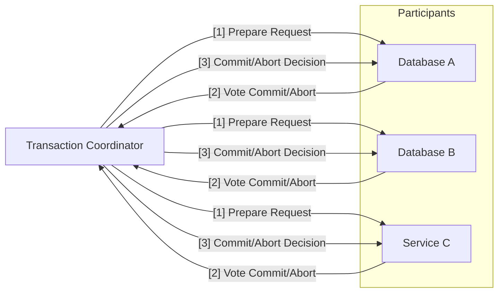
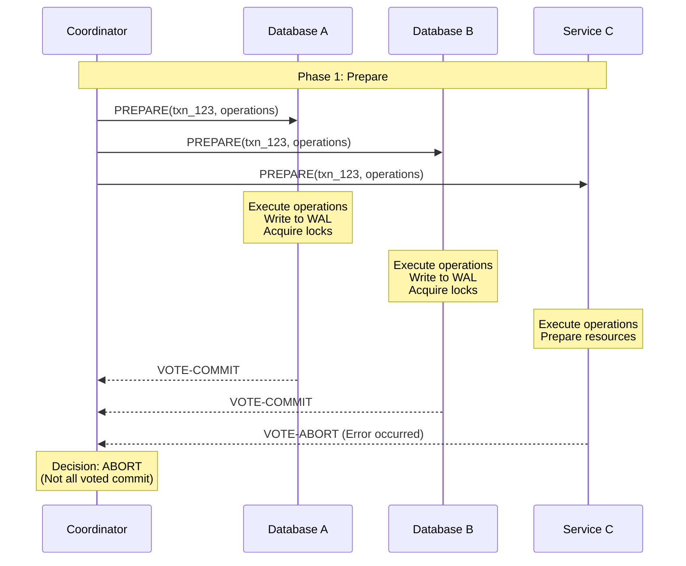
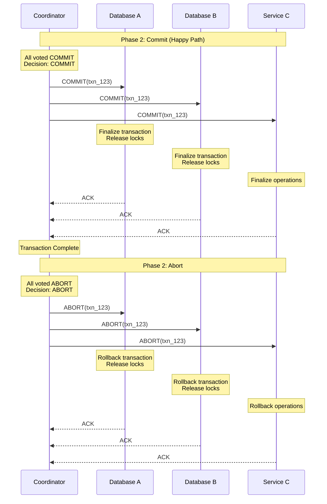
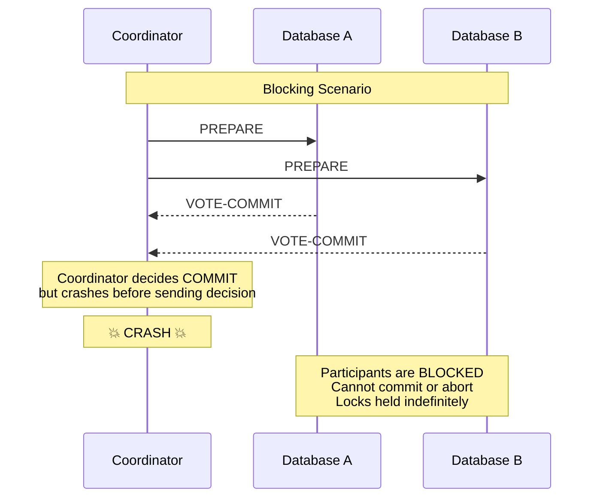

# Two-Phase Commit (2PC)

Two-Phase Commit (2PC) is a distributed protocol that ensures atomicity across multiple participants in a distributed transaction.

It **guarantees that either all participants commit their changes or all participants abort**, maintaining data consistency across distributed systems.

The protocol is particularly important in scenarios where a single business transaction spans multiple databases, services, or partitions, and you need ACID properties across these distributed resources.

## Core Concept

The essence of 2PC is splitting the commit process into two distinct phases: a **prepare phase** where all participants agree to commit, and a **commit phase** where the actual commit occurs.

This separation ensures that once a participant votes to commit, it is guaranteed to be able to complete the commit operation.



## Protocol Roles

### Transaction Coordinator

The coordinator manages the entire transaction lifecycle and makes the final commit/abort decision. It can be a dedicated service or one of the participating nodes.

```python
class TransactionCoordinator:
    def __init__(self):
        self.participants = []
        self.transaction_log = TransactionLog()

    def begin_transaction(self, transaction_id, participants):
        """Start a new distributed transaction."""
        self.participants = participants
        self.transaction_log.log_transaction_start(transaction_id, participants)

        return DistributedTransaction(transaction_id, self)

    def commit_transaction(self, transaction_id, operations):
        """Execute 2PC protocol to commit transaction."""

        # Phase 1: Prepare
        prepare_success = self._prepare_phase(transaction_id, operations)

        if prepare_success:
            # Phase 2: Commit
            return self._commit_phase(transaction_id)
        else:
            # Abort the transaction
            return self._abort_phase(transaction_id)
```

### Participants

Participants are the distributed components (databases, services, message queues) that hold resources involved in the transaction.

```python
class DatabaseParticipant:
    def __init__(self, db_connection):
        self.db_connection = db_connection
        self.prepared_transactions = {}

    def prepare(self, transaction_id, operations):
        """Prepare phase: validate and prepare but don't commit."""
        try:
            # Start local transaction
            local_txn = self.db_connection.begin_transaction()

            # Execute operations in local transaction
            for operation in operations:
                operation.execute(local_txn)

            # Write transaction to WAL but don't commit
            local_txn.prepare()
            self.prepared_transactions[transaction_id] = local_txn

            # Durably log the vote before sending response
            self._log_vote_commit(transaction_id)

            return VoteCommit()

        except Exception as e:
            # Cannot prepare, vote to abort
            self._log_vote_abort(transaction_id, str(e))
            return VoteAbort(reason=str(e))

    def commit(self, transaction_id):
        """Commit phase: finalize the prepared transaction."""
        if transaction_id in self.prepared_transactions:
            txn = self.prepared_transactions[transaction_id]
            txn.commit()
            del self.prepared_transactions[transaction_id]
            self._log_transaction_committed(transaction_id)

    def abort(self, transaction_id):
        """Abort phase: rollback the prepared transaction."""
        if transaction_id in self.prepared_transactions:
            txn = self.prepared_transactions[transaction_id]
            txn.rollback()
            del self.prepared_transactions[transaction_id]
            self._log_transaction_aborted(transaction_id)
```

## Protocol Phases

### Phase 1: Prepare

The coordinator asks all participants whether they can commit the transaction. Each participant must prepare the transaction and vote.



The coordinator needs to send the prepare request to all participants and wait for their responses.

If any participant votes to abort, the coordinator should abort the transaction. Otherwise, it can proceed to the commit phase.

```python
def _prepare_phase(self, transaction_id, operations):
    """Execute the prepare phase of 2PC protocol."""
    votes = []

    # Send prepare requests to all participants
    for participant in self.participants:
        try:
            # Send prepare request with timeout
            vote = participant.prepare(transaction_id, operations[participant.id])
            votes.append(vote)

            # Log participant's vote
            self.transaction_log.log_vote(transaction_id, participant.id, vote)

        except TimeoutException:
            # Treat timeout as vote abort
            votes.append(VoteAbort(reason="Participant timeout"))
            self.transaction_log.log_vote(transaction_id, participant.id, "TIMEOUT")

    # All participants must vote commit for transaction to proceed
    all_committed = all(isinstance(vote, VoteCommit) for vote in votes)

    # Log the prepare phase decision
    decision = "COMMIT" if all_committed else "ABORT"
    self.transaction_log.log_prepare_decision(transaction_id, decision)

    return all_committed
```

### Phase 2: Commit/Abort

Based on the votes from Phase 1, the coordinator makes the final decision and informs all participants.



The coordinator needs to send the commit request to all participants and wait for their responses.

```python
def _commit_phase(self, transaction_id):
    """Execute the commit phase - send final decision to all participants."""

    # Log the final commit decision
    self.transaction_log.log_final_decision(transaction_id, "COMMIT")

    commit_results = []

    for participant in self.participants:
        try:
            # Send commit request
            result = participant.commit(transaction_id)
            commit_results.append(result)
        except Exception as e:
            # Participant failed to commit after voting yes
            # This is a serious issue - log and alert
            self.transaction_log.log_commit_failure(transaction_id, participant.id, str(e))
            self.alert_system.send_alert(f"Participant {participant.id} failed to commit after voting yes")

    # Mark transaction as completed
    self.transaction_log.log_transaction_complete(transaction_id)

    return TransactionResult(status="COMMITTED", transaction_id=transaction_id)
```

In case of failure, the coordinator needs to abort the transaction.

```python
def _abort_phase(self, transaction_id):
    """Execute the abort phase - rollback all participants."""

    # Log the final abort decision
    self.transaction_log.log_final_decision(transaction_id, "ABORT")

    for participant in self.participants:
        try:
            participant.abort(transaction_id)
        except Exception as e:
            # Log but continue - abort should be best effort
            self.transaction_log.log_abort_failure(transaction_id, participant.id, str(e))

    return TransactionResult(status="ABORTED", transaction_id=transaction_id)
```

## Benefits and Guarantees

### ACID Properties Across Distributed Systems

2PC provides the **Atomicity** and **Consistency** guarantees of ACID properties across multiple distributed resources.

- **Atomicity:** Either all participants commit their changes or none do
- **Consistency:** The distributed system moves from one consistent state to another

### Strong Consistency

2PC ensures strong consistency by preventing any participant from committing until all participants are ready to commit.

```python
# Example: Distributed money transfer
class BankTransferService:
    def __init__(self, coordinator):
        self.coordinator = coordinator

    def transfer_money(self, from_account, to_account, amount):
        """Transfer money between accounts that may be in different databases."""

        transaction_id = generate_transaction_id()

        # Define operations for each participant
        operations = {
            'bank_a': [DebitOperation(from_account, amount)],
            'bank_b': [CreditOperation(to_account, amount)]
        }

        # Use 2PC to ensure atomic transfer
        try:
            result = self.coordinator.commit_transaction(transaction_id, operations)

            if result.status == "COMMITTED":
                return TransferResult(success=True, transaction_id=transaction_id)
            else:
                return TransferResult(success=False, reason="Transaction aborted")

        except Exception as e:
            return TransferResult(success=False, reason=str(e))
```

## Challenges and Limitations

### Blocking Problem

The most significant issue with 2PC is that it can block indefinitely if the coordinator fails after some participants have prepared but before the final decision is communicated.

Common workarounds for the blocking problem include:

- **Timeouts**: Participants abort after waiting too long for coordinator response
- **Coordinator replication**: Run 2PC over consensus protocols to replicate coordinator state (but this reduces performance and introduces additional latency)
- **Three-Phase Commit (3PC)**: Add a pre-commit phase to reduce blocking scenarios
- **Presumed abort**: Participants assume abort if coordinator is unreachable



### Performance Impact

2PC introduces significant latency due to the multiple round-trips and the blocking nature of the protocol.

The latency increase is problematic, but worse is that participants must hold locks until they receive the final commit/abort decision, blocking other transactions that might conflict.

### Single Point of Failure

The coordinator becomes a critical single point of failure in the system.

Obvious workaround, yet not so easy to implement, is to use multiple coordinator replicas with leader election to eliminate the single point of failure:

## When to Use Two-Phase Commit

### Ideal Scenarios

- **Financial Transactions:** When you absolutely need ACID guarantees across distributed systems
- **Multi-Database Updates:** When business operations span multiple databases and consistency is critical

### Consider Alternatives When

- **High Performance Requirements:** 2PC latency may be unacceptable
- **Highly Distributed Systems:** Blocking and availability issues become magnified
- **Microservices Architectures:** Saga patterns or eventual consistency may be better

## Common Anti-Patterns

- **Long-Running Transactions:** Using 2PC for transactions that hold locks for extended periods
- **Ignoring Network Partitions:** Not properly handling network partitions that can lead to indefinite blocking

## Reference Materials

- [Two-Phase Commit](https://martinfowler.com/articles/patterns-of-distributed-systems/two-phase-commit.html)
- [Consensus Protocols: Two-Phase Commit](https://www.the-paper-trail.org/post/2008-11-27-consensus-protocols-two-phase-commit/)
- [Starbucks Does Not Use Two-Phase Commit](https://www.enterpriseintegrationpatterns.com/ramblings/18_starbucks.html)
- [It's Time to Move on from Two Phase Commit](https://dbmsmusings.blogspot.com/2019/01/its-time-to-move-on-from-two-phase.html)
