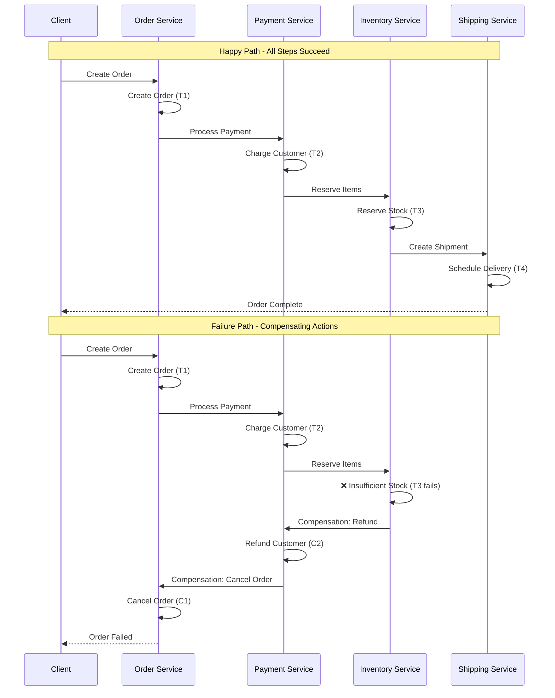
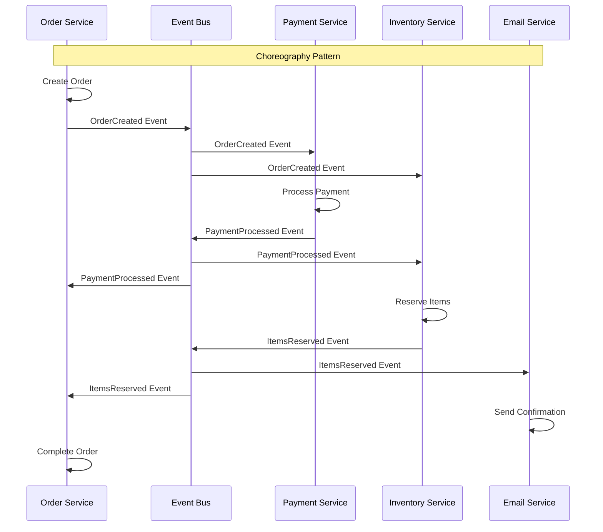
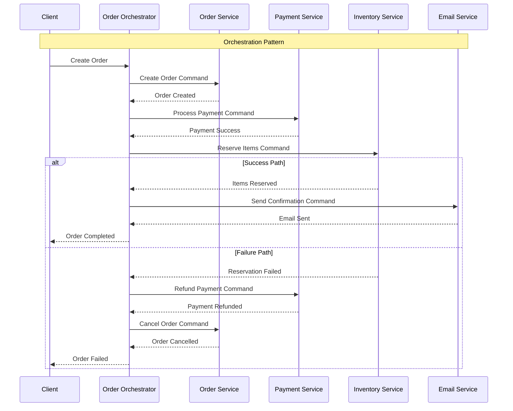
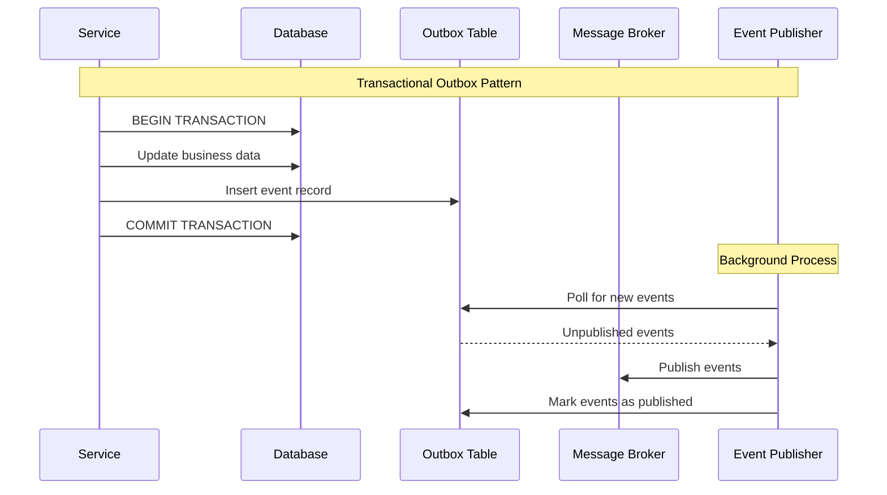

# Saga

The Saga pattern manages distributed transactions across multiple microservices by breaking them into a sequence of local transactions, each with a corresponding compensating action.

Unlike Two-Phase Commit, Sagas achieve eventual consistency through choreographed or orchestrated workflows that can gracefully handle failures while maintaining data integrity across services.

## Core Concept

A **saga** is a sequence of local transactions where each transaction updates data within a single service. If any transaction fails, the saga executes compensating transactions to undo the impact of the preceding transactions.

This approach trades strong consistency for availability and resilience, making it ideal for microservices architectures where services need to remain loosely coupled.



## Saga Implementation Patterns

### Choreography-Based Sagas (Decentralized)

In choreography, services collaborate through events without a central coordinator. Each service publishes events when it completes its local transaction, and other services react to these events to continue the saga.

This creates a decentralized workflow where business logic is distributed across participating services.



```python
class OrderService:
    def __init__(self, event_bus, order_repository):
        self.event_bus = event_bus
        self.order_repository = order_repository

        # Subscribe to saga events
        self.event_bus.subscribe('PaymentProcessed', self.handle_payment_processed)
        self.event_bus.subscribe('PaymentFailed', self.handle_payment_failed)
        self.event_bus.subscribe('PaymentRefunded', self.handle_payment_refunded)

    def create_order(self, order_data):
        order = Order(order_data)
        order.status = 'PENDING'
        self.order_repository.save(order)

        # Publish event to trigger next step
        self.event_bus.publish(OrderCreated(order.id, order.customer_id, order.items))
        return order

    def handle_payment_processed(self, event):
        order = self.order_repository.find_by_id(event.order_id)
        order.payment_id = event.payment_id
        order.status = 'PAYMENT_CONFIRMED'
        self.order_repository.save(order)

    def handle_payment_failed(self, event):
        # Compensating action
        order = self.order_repository.find_by_id(event.order_id)
        order.status = 'CANCELLED'
        order.cancellation_reason = event.reason
        self.order_repository.save(order)

    def handle_payment_refunded(self, event):
        order = self.order_repository.find_by_id(event.order_id)
        order.status = 'REFUNDED'
        order.refund_id = event.refund_id
        order.refund_amount = event.refund_amount
        self.order_repository.save(order)

class PaymentService:
    def __init__(self, event_bus, payment_processor):
        self.event_bus = event_bus
        self.payment_processor = payment_processor

        self.event_bus.subscribe('OrderCreated', self.handle_order_created)
        self.event_bus.subscribe('InventoryReservationFailed', self.handle_inventory_failed)

    def handle_order_created(self, event):
        try:
            payment = self.payment_processor.charge(
                event.customer_id,
                event.calculate_total()
            )

            self.event_bus.publish(PaymentProcessed(
                event.order_id, payment.id, payment.amount
            ))

        except PaymentError as e:
            self.event_bus.publish(PaymentFailed(event.order_id, str(e)))

    def handle_inventory_failed(self, event):
        # Compensating action - refund the payment
        payment = self.payment_processor.find_by_order(event.order_id)
        refund = self.payment_processor.refund(payment.id)

        self.event_bus.publish(PaymentRefunded(event.order_id, refund.id, refund.amount))
```

**Benefits:**

- No single point of failure
- High decoupling between services
- Natural scalability
- Services evolve independently

**Challenges:**

- Complex workflow understanding
- Difficult debugging across services
- Potential for event cycles
- No central monitoring of saga state

### Orchestration-Based Sagas (Centralized)

Orchestration uses a central coordinator (orchestrator) that manages the entire saga workflow. The orchestrator sends commands to participating services and handles their responses.

This creates explicit workflow control with centralized business logic.



```python
class OrderSagaOrchestrator:
    def __init__(self, order_service, payment_service, inventory_service, email_service):
        self.order_service = order_service
        self.payment_service = payment_service
        self.inventory_service = inventory_service
        self.email_service = email_service
        self.saga_repository = SagaRepository()

    def create_order_saga(self, order_data):
        saga_id = generate_saga_id()
        saga_state = SagaState(saga_id, 'ORDER_CREATION', order_data)

        try:
            # Step 1: Create Order
            order = self.order_service.create_order(order_data)
            saga_state.add_completed_step('ORDER_CREATED', {'order_id': order.id})

            # Step 2: Process Payment
            payment = self.payment_service.process_payment(
                order.customer_id, order.total
            )
            saga_state.add_completed_step('PAYMENT_PROCESSED', {
                'payment_id': payment.id,
                'amount': payment.amount
            })

            # Step 3: Reserve Inventory
            reservation = self.inventory_service.reserve_items(order.items)
            saga_state.add_completed_step('INVENTORY_RESERVED', {
                'reservation_id': reservation.id
            })

            # Step 4: Send Confirmation
            self.email_service.send_order_confirmation(order.customer_email)
            saga_state.add_completed_step('EMAIL_SENT', {})

            saga_state.status = 'COMPLETED'
            self.saga_repository.save(saga_state)

            return OrderResult(success=True, order_id=order.id)

        except Exception as e:
            # Execute compensations in reverse order
            self._compensate_saga(saga_state, str(e))
            return OrderResult(success=False, error=str(e))

    def _compensate_saga(self, saga_state, error_reason):
        """Execute compensating actions in reverse order."""
        compensation_steps = []

        # Build compensation plan from completed steps
        for step in reversed(saga_state.completed_steps):
            if step.type == 'EMAIL_SENT':
                # Email can't be unsent, but we can send cancellation
                compensation_steps.append(('SEND_CANCELLATION_EMAIL', step.data))
            elif step.type == 'INVENTORY_RESERVED':
                compensation_steps.append(('RELEASE_INVENTORY', step.data))
            elif step.type == 'PAYMENT_PROCESSED':
                compensation_steps.append(('REFUND_PAYMENT', step.data))
            elif step.type == 'ORDER_CREATED':
                compensation_steps.append(('CANCEL_ORDER', step.data))

        # Execute compensations
        for compensation_type, step_data in compensation_steps:
            try:
                if compensation_type == 'RELEASE_INVENTORY':
                    self.inventory_service.release_reservation(
                        step_data['reservation_id']
                    )
                elif compensation_type == 'REFUND_PAYMENT':
                    self.payment_service.refund_payment(
                        step_data['payment_id']
                    )
                elif compensation_type == 'CANCEL_ORDER':
                    self.order_service.cancel_order(
                        step_data['order_id'], error_reason
                    )
                elif compensation_type == 'SEND_CANCELLATION_EMAIL':
                    # Send cancellation notification
                    pass

            except Exception as comp_error:
                # Log compensation failure but continue
                logger.error(f"Compensation failed: {compensation_type}, {comp_error}")

        saga_state.status = 'COMPENSATED'
        saga_state.error_reason = error_reason
        self.saga_repository.save(saga_state)

class SagaState:
    def __init__(self, saga_id, initial_step, saga_data):
        self.saga_id = saga_id
        self.status = 'IN_PROGRESS'
        self.completed_steps = []
        self.saga_data = saga_data
        self.created_at = datetime.now()

    def add_completed_step(self, step_type, step_data):
        self.completed_steps.append(SagaStep(
            step_type, step_data, datetime.now()
        ))
```

**Benefits:**

- Clear workflow visibility
- Centralized business logic
- Easier debugging and monitoring
- Explicit compensation handling
- Better testability

**Challenges:**

- Single point of failure (orchestrator)
- Orchestrator can become complex
- Tight coupling to orchestrator
- Orchestrator scaling challenges

## Saga vs Two-Phase Commit

- **Performance and Availability:** 2PC's blocking nature creates bottlenecks in high-throughput systems. If the coordinator fails after the prepare phase, participants remain blocked until coordinator recovery

- **Scalability:** 2PC requires all participants to be available simultaneously, limiting system resilience. Sagas allow services to process independently

- **CAP Theorem Alignment:**
  - **2PC:** Prioritizes Consistency over Availability and Partition tolerance
  - **Sagas:** Prioritize Availability and Partition tolerance, accepting eventual consistency

## Atomic Operations in Saga Steps

Each saga step must atomically update local state and publish events to maintain consistency. This dual-write problem requires careful handling and can be handled with the Transactional Outbox pattern.



```python
class SagaStepWithOutbox:
    def __init__(self, db_connection, message_broker):
        self.db = db_connection
        self.message_broker = message_broker

    def process_order_step(self, order_data):
        """Atomically process order and publish event using Transactional Outbox."""

        with self.db.transaction() as tx:
            # Update business state
            order = Order(order_data)
            order_id = tx.execute(
                "INSERT INTO orders (customer_id, items, total) VALUES (?, ?, ?)",
                [order.customer_id, json.dumps(order.items), order.total]
            )

            # Insert event into outbox table (same transaction)
            event = OrderCreatedEvent(order_id, order.customer_id, order.items)
            tx.execute(
                "INSERT INTO outbox_events (event_id, event_type, payload, created_at) VALUES (?, ?, ?, ?)",
                [event.event_id, event.event_type, json.dumps(event.payload), datetime.now()]
            )

            # Transaction commits both business data and outbox event
            tx.commit()

        return order_id

class OutboxEventPublisher:
    """Background service that publishes events from the outbox table."""

    def __init__(self, db_connection, message_broker):
        self.db = db_connection
        self.message_broker = message_broker

    def publish_pending_events(self):
        """Poll outbox table and publish unpublished events."""

        unpublished_events = self.db.execute(
            "SELECT * FROM outbox_events WHERE published = false ORDER BY created_at"
        )

        for event_row in unpublished_events:
            try:
                # Publish event to message broker
                self.message_broker.publish(
                    topic=event_row['event_type'],
                    message=event_row['payload']
                )

                # Mark as published
                self.db.execute(
                    "UPDATE outbox_events SET published = true, published_at = ? WHERE event_id = ?",
                    [datetime.now(), event_row['event_id']]
                )

            except Exception as e:
                logger.error(f"Failed to publish event {event_row['event_id']}: {e}")
                # Event will be retried on next polling cycle
```

## Challenges and Considerations

### Idempotency and Retry Handling

Saga steps must be idempotent to handle duplicate messages and retries safely. When a saga step is retried due to network failures or timeouts, it should produce the same result without causing side effects.

This requires careful design of operations and maintaining operation logs to track completion status.

```python
class IdempotentSagaStep:
    def __init__(self, operation_log):
        self.operation_log = operation_log

    def reserve_inventory(self, order_id, items):
        """Idempotent inventory reservation with retry logic."""

        operation_key = f"reserve_inventory_{order_id}"

        # Check if operation already completed
        existing_result = self.operation_log.get_result(operation_key)
        if existing_result:
            return existing_result

        try:
            # Perform the actual reservation
            reservation = self.inventory_service.reserve_items(items)

            # Log successful operation
            result = ReservationResult(reservation.id, reservation.items)
            self.operation_log.record_success(operation_key, result)

            return result

        except InsufficientInventoryError as e:
            # Log business failure (don't retry)
            self.operation_log.record_business_failure(operation_key, str(e))
            raise

        except TemporaryServiceError as e:
            # Log technical failure (can retry)
            self.operation_log.record_retry_needed(operation_key, str(e))
            raise
```

### Saga Timeout and Recovery

Sagas can get stuck in intermediate states due to service failures, network partitions, or processing delays. Without proper timeout handling, these stuck sagas can accumulate and consume resources indefinitely.

A timeout manager monitors saga execution time and takes corrective action when sagas exceed their expected duration.

```python
class SagaTimeoutManager:
    def __init__(self, saga_repository, timeout_seconds=300):
        self.saga_repository = saga_repository
        self.timeout_seconds = timeout_seconds

    def check_for_timeouts(self):
        """Background process to handle saga timeouts."""

        timeout_threshold = datetime.now() - timedelta(seconds=self.timeout_seconds)

        stuck_sagas = self.saga_repository.find_sagas_older_than(
            status='IN_PROGRESS',
            threshold=timeout_threshold
        )

        for saga in stuck_sagas:
            try:
                # Attempt to determine current state and continue or compensate
                self._handle_stuck_saga(saga)
            except Exception as e:
                logger.error(f"Failed to handle stuck saga {saga.saga_id}: {e}")
                # Move to manual intervention queue
                self._escalate_saga(saga)

    def _handle_stuck_saga(self, saga):
        # Query participating services for current state
        # Decide whether to continue forward or compensate backward
        # Implementation depends on saga type and current step
        pass
```

## When to Use Saga Pattern

### Ideal Scenarios

- **Microservices Architectures:** When business processes span multiple independent services
- **Long-Running Business Processes:** When transactions take significant time to complete
- **High Availability Requirements:** When system availability is more important than immediate consistency
- **Complex Compensation Logic:** When business processes have well-defined rollback procedures

### Consider Alternatives When

- **Strong consistency is mandatory** (financial systems, regulatory compliance)
- **Simple CRUD operations** that don't span service boundaries
- **Low-latency requirements** where eventual consistency adds unacceptable complexity
- **Limited compensating action possibilities** (some operations can't be undone)

## Common Anti-Patterns

### God Saga

A God Saga tries to handle too many business concerns in a single workflow, violating the single responsibility principle and creating a monolithic transaction that's difficult to maintain and scale.

```python
# Anti-pattern ❌: Single saga handling too many concerns
class MegaOrderSaga:
    def execute(self, data):
        # Too many responsibilities in one saga
        self.validate_customer_credit()
        self.check_inventory()
        self.apply_promotions()
        self.process_payment()
        self.schedule_shipping()
        self.update_loyalty_points()
        self.send_marketing_emails()
        self.update_analytics()
        self.sync_with_external_systems()

# Better ✅: Compose smaller, focused sagas
class OrderProcessingSaga:
    def execute(self, order_data):
        # Focus on core order processing
        self.create_order()
        self.reserve_inventory()
        self.process_payment()
        self.create_shipment()

class CustomerEngagementSaga:
    def execute(self, order_completed_event):
        # Separate saga for customer engagement
        self.update_loyalty_points()
        self.send_confirmation_email()
        self.trigger_recommendations()
```

### Synchronous Saga Steps

Executing saga steps synchronously blocks the entire workflow and defeats the purpose of using sagas for resilient, distributed transactions. This creates tight coupling and reduces system availability.

```python
# Anti-pattern ❌: Blocking saga execution
class SynchronousSaga:
    def execute_step(self, step_data):
        # Blocking call defeats the purpose of saga flexibility
        result = self.external_service.process_synchronously(step_data)
        if result.success:
            self.continue_saga()
        else:
            self.compensate_saga()

# Better ✅: Asynchronous saga execution
class AsynchronousSaga:
    def execute_step(self, step_data):
        # Fire and forget with callback handling
        self.external_service.process_async(
            step_data,
            success_callback=self.handle_step_success,
            failure_callback=self.handle_step_failure
        )
```

## Reference Materials

- [Pattern: Saga](https://microservices.io/patterns/data/Saga.html)
- [Sagas: Long Lived Transactions](https://www.cs.cornell.edu/andru/cs711/2002fa/reading/sagas.pdf)
- Managing data consistency in a microservice architecture using Sagas
  - [Part 1: Overview of Sagas](https://microservices.io/post/microservices/2019/07/09/developing-sagas-part-1.html)
  - [Part 2: Coordinating Sagas](https://microservices.io/post/sagas/2019/08/04/developing-sagas-part-2.html)
  - [Part 3: Choreography-based Sagas](https://microservices.io/post/sagas/2019/08/15/developing-sagas-part-3.html)
  - [Part 4: Orchestration-based Sagas](https://microservices.io/post/sagas/2019/12/12/developing-sagas-part-4.html)
- [Applying the Saga Pattern](https://www.youtube.com/watch?v=xDuwrtwYHu8)
