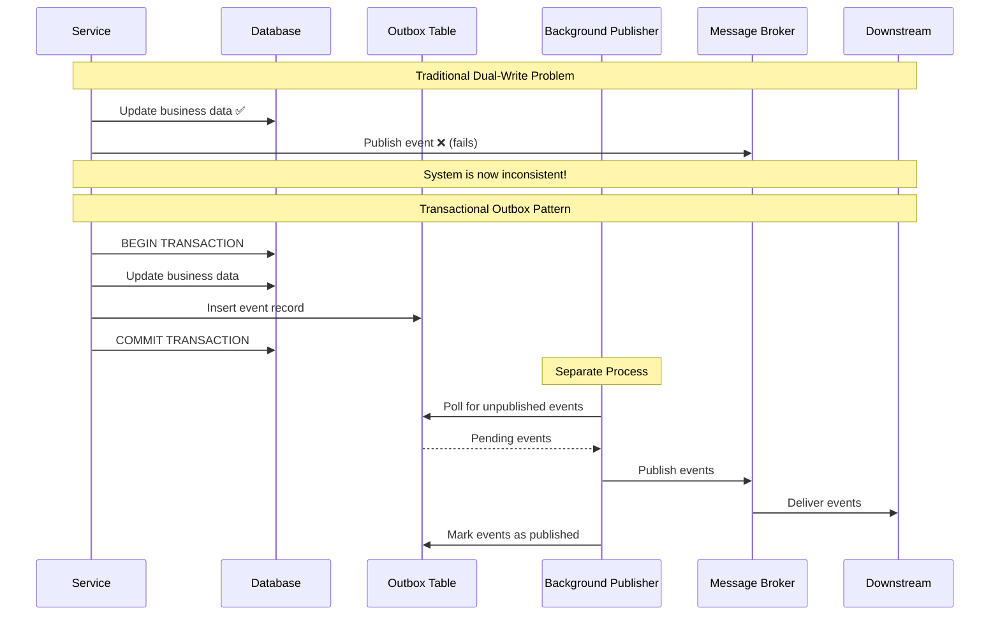

# Transactional Outbox

The Transactional Outbox pattern solves the dual-write problem in distributed systems by ensuring that database updates and message publishing happen atomically within a single transaction.

Instead of directly publishing events to a message broker after database operations, this pattern:

1. **Writes both business data and events to the same database in a single transaction**
2. **Uses a separate process to reliably publish those events**

## Core Concept

The fundamental challenge in distributed systems is achieving atomicity across different systems, there is a need to update the database AND notify other services, but these are separate systems that can fail independently.

The Transactional Outbox pattern addresses this by treating event publishing as another database operation, making the entire process atomic.



## The Dual-Write Problem

The dual-write problem occurs when a single business operation requires updates to multiple systems that must remain consistent with each other.

- If the database update is successful but the event notification or message sending fails, the downstream service will not be aware of the change, and the system can enter an inconsistent state
- If the database update fails but the event notification or message sending is sent, data could get corrupted, which might affect the reliability of the system

### Common Failure Scenarios

- **Database Success, Event Publish Failure:** The most common scenario where business data is updated but downstream services aren't notified
- **Database Failure, Event Publish Success:** Less common but equally problematic
- **Network Partitions and Timeouts:** Uncertainty about whether operations succeeded
- **Process Crashes:** Service crashes between database update and event publishing

## Pattern Implementation

### Step 1: Design the Outbox Table

The outbox table stores events that need to be published, with metadata for reliable processing.

```sql
CREATE TABLE outbox_events (
    id SERIAL PRIMARY KEY,
    aggregate_id VARCHAR(255) NOT NULL,
    event_type VARCHAR(255) NOT NULL,
    event_data JSONB NOT NULL,
    created_at TIMESTAMP DEFAULT CURRENT_TIMESTAMP,
    processed_at TIMESTAMP NULL,
    version INTEGER NOT NULL DEFAULT 1,
    retry_count INTEGER DEFAULT 0,
    status VARCHAR(50) DEFAULT 'PENDING'  -- PENDING, PROCESSED, FAILED
);

CREATE INDEX idx_outbox_status ON outbox_events (status, created_at);
CREATE INDEX idx_outbox_aggregate ON outbox_events (aggregate_id);
```

### Step 2: Atomic Write Operation

Update business data and insert outbox events in the same database transaction.

```python
class OrderService:
    def __init__(self, db_connection, event_factory):
        self.db = db_connection
        self.event_factory = event_factory

    def create_order(self, order_data):
        """Create order with guaranteed event publishing via outbox pattern."""

        with self.db.transaction() as tx:
            try:
                # Step 1: Execute business logic
                order = Order(
                    customer_id=order_data['customer_id'],
                    items=order_data['items'],
                    total=order_data['total']
                )

                # Save order to database
                order_id = tx.execute(
                    """INSERT INTO orders (customer_id, items, total, status, created_at)
                       VALUES (%s, %s, %s, %s, %s) RETURNING id""",
                    [order.customer_id, json.dumps(order.items),
                     order.total, 'PENDING', datetime.now()]
                )

                order.id = order_id

                # Step 2: Create domain events
                events = [
                    self.event_factory.create_order_created_event(order),
                    self.event_factory.create_inventory_reservation_requested_event(order)
                ]

                # Step 3: Insert events into outbox (same transaction)
                for event in events:
                    tx.execute(
                        """INSERT INTO outbox_events
                           (aggregate_id, event_type, event_data, version)
                           VALUES (%s, %s, %s, %s)""",
                        [str(order.id), event.event_type,
                         json.dumps(event.to_dict()), 1]
                    )

                # Step 4: Transaction commits both business data and events
                tx.commit()

                logger.info(f"Order {order_id} created with {len(events)} events queued")
                return order

            except Exception as e:
                # Rollback ensures no partial state
                tx.rollback()
                logger.error(f"Failed to create order: {e}")
                raise OrderCreationError(str(e))
```

### Step 3: Event Publisher Service

A separate service polls the outbox table and publishes events reliably.

```python
class OutboxEventPublisher:
    def __init__(self, db_connection, message_broker, batch_size=100):
        self.db = db_connection
        self.message_broker = message_broker
        self.batch_size = batch_size
        self.is_running = False
```

The main publishing loop runs continuously, polling for pending events every 5 seconds with error handling and backoff.

```python
def start_publishing(self):
    """Start the background publishing process."""
    self.is_running = True

    while self.is_running:
        try:
            self.process_pending_events()
            time.sleep(5)  # Poll interval

        except Exception as e:
            logger.error(f"Error in event publisher: {e}")
            time.sleep(30)  # Back off on errors
```

Fetches pending events from the database in chronological order and processes them in batches.

```python
def process_pending_events(self):
    """Process a batch of pending events."""

    # Fetch pending events in order
    pending_events = self.db.execute(
        """SELECT id, aggregate_id, event_type, event_data, retry_count
           FROM outbox_events
           WHERE status = 'PENDING'
           ORDER BY created_at ASC
           LIMIT %s""",
        [self.batch_size]
    )

    if not pending_events:
        return

    logger.info(f"Processing {len(pending_events)} pending events")

    for event_record in pending_events:
        try:
            self.publish_single_event(event_record)

        except Exception as e:
            self.handle_publish_failure(event_record, e)
```

Individual event publishing includes idempotency headers and marks events as processed only after successful delivery.

```python
def publish_single_event(self, event_record):
    """Publish a single event with idempotency."""

    event_id = event_record['id']

    try:
        # Publish event to message broker
        message_result = self.message_broker.publish(
            topic=self.get_topic_for_event(event_record['event_type']),
            key=event_record['aggregate_id'],
            value=event_record['event_data'],
            headers={
                'event-id': str(event_id),
                'event-type': event_record['event_type'],
                'aggregate-id': event_record['aggregate_id']
            }
        )

        # Mark as processed
        self.db.execute(
            """UPDATE outbox_events
               SET status = 'PROCESSED', processed_at = %s
               WHERE id = %s""",
            [datetime.now(), event_id]
        )

        logger.debug(f"Published event {event_id} to topic {message_result.topic}")

    except Exception as e:
        logger.error(f"Failed to publish event {event_id}: {e}")
        raise
```

Failed events are retried with exponential backoff, and after maximum retries are moved to a dead letter queue for manual investigation.

```python
def handle_publish_failure(self, event_record, error):
    """Handle failed event publishing with retry logic."""

    event_id = event_record['id']
    retry_count = event_record['retry_count']
    max_retries = 5

    if retry_count >= max_retries:
        # Move to dead letter after max retries
        self.db.execute(
            """UPDATE outbox_events
               SET status = 'FAILED', retry_count = %s
               WHERE id = %s""",
            [retry_count + 1, event_id]
        )

        # Alert for manual investigation
        self.send_dead_letter_alert(event_record, error)

    else:
        # Increment retry count with exponential backoff
        backoff_seconds = min(300, 2 ** retry_count * 10)  # Max 5 minutes
        next_retry = datetime.now() + timedelta(seconds=backoff_seconds)

        self.db.execute(
            """UPDATE outbox_events
               SET retry_count = %s, status = 'PENDING'
               WHERE id = %s""",
            [retry_count + 1, event_id]
        )

    logger.warning(f"Event {event_id} failed, retry {retry_count + 1}/{max_retries}")
```

Event types are mapped to specific message broker topics to ensure proper routing and organization of events.

```python
def get_topic_for_event(self, event_type):
    """Map event types to message broker topics."""
    topic_mapping = {
        'order.created': 'orders',
        'order.updated': 'orders',
        'order.cancelled': 'orders',
        'inventory.reservation.requested': 'inventory'
    }

    return topic_mapping.get(event_type, 'default-events')
```

## Alternative Implementation Strategies

### Polling-Based Approach (Shown Above)

The most common implementation using periodic polling of the outbox table.

- **Pros:** Simple, reliable, works with any database
- **Cons:** Polling latency, database overhead

### Change Data Capture (CDC)

Use database change streams to detect new outbox entries in real-time.

```python
class CDCOutboxPublisher:
    def __init__(self, cdc_client, message_broker):
        self.cdc_client = cdc_client
        self.message_broker = message_broker

    def start_cdc_listener(self):
        """Listen to database change events for the outbox table."""

        def handle_outbox_insert(change_event):
            if change_event.table == 'outbox_events' and change_event.operation == 'INSERT':
                event_data = change_event.new_values

                # Publish immediately when new outbox entry detected
                self.message_broker.publish(
                    topic=self.get_topic_for_event(event_data['event_type']),
                    value=event_data['event_data']
                )

                # Mark as processed
                self.mark_event_processed(event_data['id'])

        # Start CDC stream
        self.cdc_client.subscribe_to_changes('outbox_events', handle_outbox_insert)
```

## Benefits and Trade-offs

### Benefits

- **Guaranteed Delivery:** Events will eventually be published, even if the publisher service fails temporarily
- **Exactly-Once Semantics:** When combined with idempotent consumers, ensures exactly-once processing
- **Performance:** Business operations complete quickly without waiting for message publishing, which is basically another network call beside the database operation
- **Decoupling:** Business logic is separated from message publishing concerns

### Challenges and Considerations

- **Message Ordering:** Events may be published out of order if multiple instances run concurrently
- **Duplicate Message Handling:** Network failures may cause message duplication
- **Storage Overhead:** Outbox table grows over time and needs maintenance and archiving for failed events (exceeding the retries threshold) or processed events (exceeding the retention period)

## When to Use Transactional Outbox

### Ideal Scenarios

- **Event-Driven Microservices:** When services need to communicate through events with reliability guarantees
- **Saga Implementations:** Each saga step needs to update local state and trigger next steps atomically
- **Audit and Compliance:** When you need guaranteed event trails for business operations
- **High-Volume Systems:** Where direct synchronous publishing would impact performance

### Consider Alternatives When

- **Simple Systems:** If you have minimal inter-service communication needs
- **Real-Time Requirements:** When sub-second event publishing latency is critical
- **Single Service:** When all operations happen within one service boundary

## Common Anti-Patterns

### Missing Event Metadata

```python
# Anti-pattern ❌: Insufficient event metadata
class InsufficientMetadata:
    def create_outbox_event(self, event_data):
        self.db.insert_outbox_event({
            'data': json.dumps(event_data)  # Missing crucial metadata
        })

# Better ✅: Rich metadata for reliable processing
class RichMetadata:
    def create_outbox_event(self, event_data, aggregate_id, event_type):
        self.db.insert_outbox_event({
            'aggregate_id': aggregate_id,
            'event_type': event_type,
            'event_data': json.dumps(event_data),
            'created_at': datetime.now(),
            'correlation_id': self.get_correlation_id(),
            'causation_id': self.get_causation_id(),
            'version': self.get_aggregate_version(aggregate_id)
        })
```

## Reference Materials

- [Pattern: Transactional Outbox](https://microservices.io/patterns/data/transactional-outbox.html)
- [Pattern: Transaction Log Tailing](https://microservices.io/patterns/data/transaction-log-tailing.html)
- [Outbox, Inbox patterns and delivery guarantees explained](https://event-driven.io/en/outbox_inbox_patterns_and_delivery_guarantees_explained/)
- [Saga Orchestration for Microservices Using the Outbox Pattern](https://www.infoq.com/articles/saga-orchestration-outbox/)
