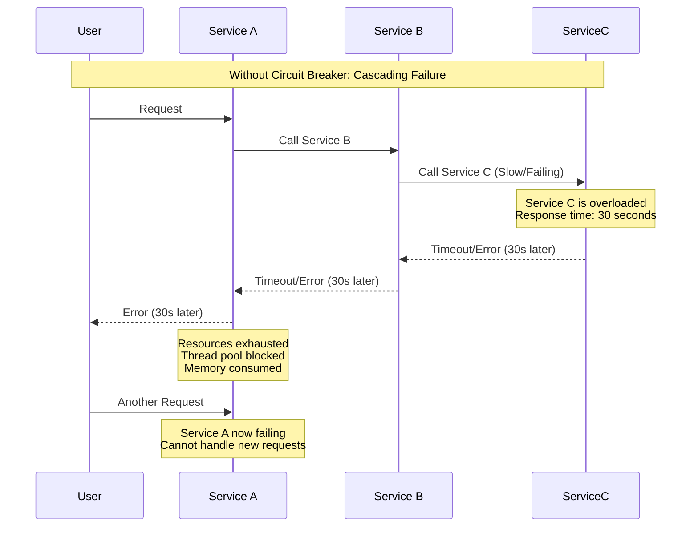
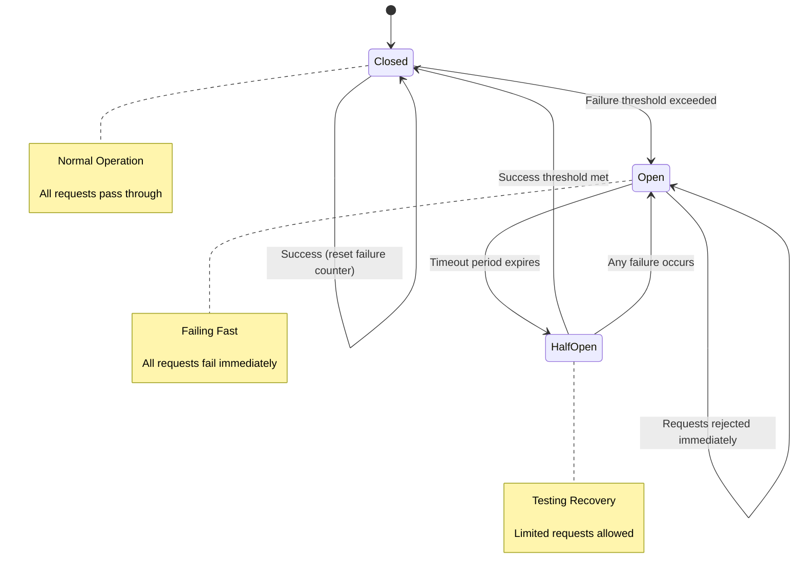
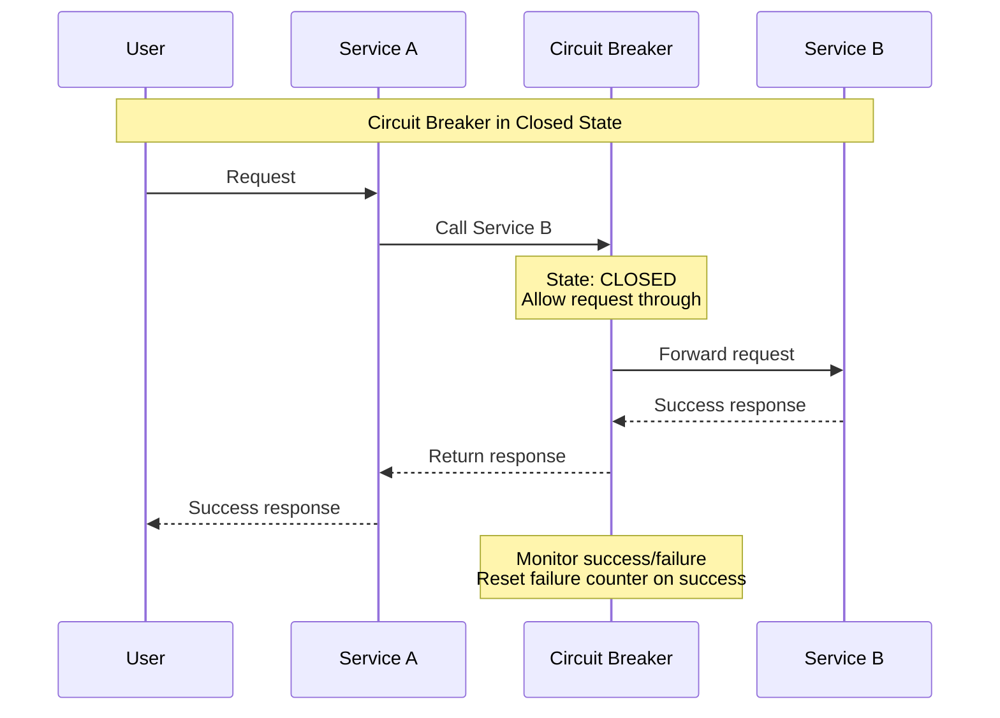
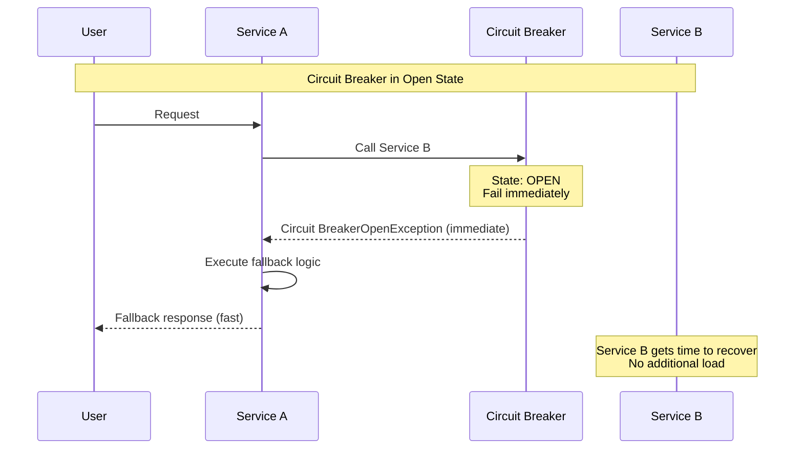
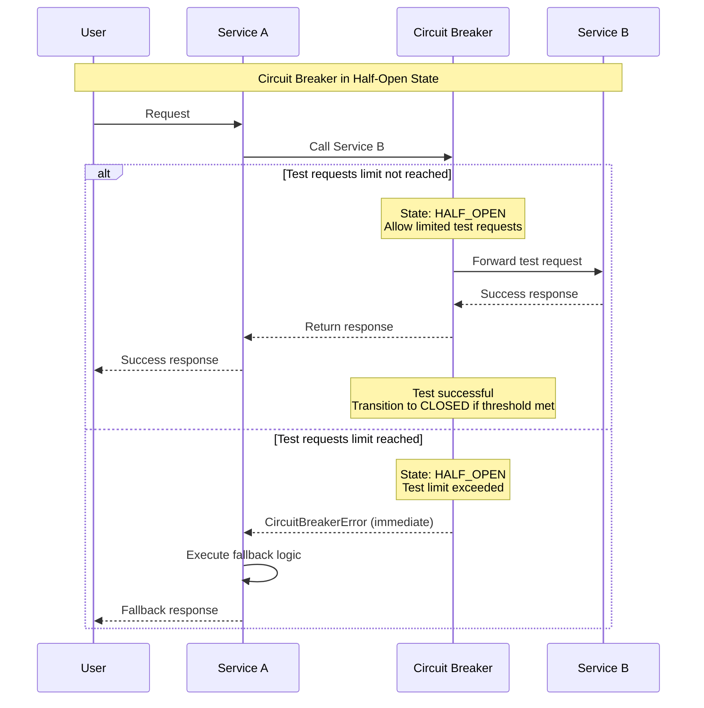

# Circuit Breaker

The Circuit Breaker pattern protects distributed systems from cascading failures by automatically detecting and isolating failing services.

**When a service starts failing, the circuit breaker "trips" and stops calling the failing service**, allowing it time to recover while protecting the calling service from further delays and resource exhaustion.

Like an electrical circuit breaker that protects against electrical overloads, this pattern prevents system overloads by failing fast when a service is in distress.

## Cascading Failures Problem

When services depend on each other, a failure in one service can quickly cascade through the entire system, causing widespread outages.



**Problems with this approach:**

- **Resource Exhaustion:** Threads/connections tied up waiting for failing service
- **Cascading Delays:** Failures propagate through the call chain
- **System Overload:** Healthy services become unhealthy due to downstream failures
- **Poor User Experience:** Long delays before error responses

## Core Concept

In distributed systems, services depend on other services, and when one service fails, it can cause a cascade of failures throughout the system. The Circuit Breaker pattern solves this by:

1. **Monitoring** service calls for failures
2. **Tripping** when failure thresholds are reached
3. **Failing fast** to prevent resource exhaustion
4. **Recovering automatically** when the service becomes healthy



### States

#### Closed State (Normal Operation)

All requests pass through to the downstream service. The circuit breaker monitors for failures and maintains success/failure metrics.



#### Open State (Failing Fast)

All requests fail immediately without calling the downstream service. This gives the failing service time to recover while protecting the calling service.



#### Half-Open State (Testing Recovery)

A limited number of requests are allowed through to test if the downstream service has recovered.



## Implementation

```python
import time
import threading
from enum import Enum
from typing import Callable, Any, Optional
from datetime import datetime, timedelta

class CircuitState(Enum):
    CLOSED = "closed"
    OPEN = "open"
    HALF_OPEN = "half_open"

class CircuitBreakerError(Exception):
    """Raised when circuit breaker is open."""
    pass

class CircuitBreaker:
    def __init__(self,
                 failure_threshold: int = 5,
                 recovery_timeout: int = 60,
                 expected_exception: tuple = (Exception,),
                 name: str = "CircuitBreaker"):
        """
        Initialize circuit breaker.

        Args:
            failure_threshold: Number of failures before opening circuit
            recovery_timeout: Seconds to wait before transitioning to half-open
            expected_exception: Exceptions that count as failures
            name: Circuit breaker name for logging
        """
        self.failure_threshold = failure_threshold
        self.recovery_timeout = recovery_timeout
        self.expected_exception = expected_exception
        self.name = name

        # State tracking
        self.failure_count = 0
        self.success_count = 0
        self.last_failure_time = None
        self.state = CircuitState.CLOSED
        self.half_open_attempts = 0

        # Thread safety
        self.lock = threading.RLock()

        # Monitoring
        self.state_change_listeners = []

    def call(self, func: Callable, *args, **kwargs) -> Any:
        """Execute function with circuit breaker protection."""
        with self.lock:
            current_state = self._get_state()

            if current_state == CircuitState.OPEN:
                raise Circuit BreakerError(
                    f"Circuit breaker '{self.name}' is OPEN"
                )

            elif current_state == CircuitState.HALF_OPEN:
                if self.half_open_attempts >= 3:  # Limit test requests
                    raise Circuit BreakerError(
                        f"Circuit breaker '{self.name}' is testing recovery"
                    )

        # Execute the function
        try:
            start_time = time.time()
            result = func(*args, **kwargs)
            execution_time = time.time() - start_time

            # Record success
            with self.lock:
                self._record_success(execution_time)

            return result
        except self.expected_exception as e:
            # Record failure
            with self.lock:
                self._record_failure(e)
            raise

    def _get_state(self) -> CircuitState:
        """Determine current circuit breaker state."""
        if self.state == CircuitState.CLOSED:
            return CircuitState.CLOSED

        elif self.state == CircuitState.OPEN:
            if self._should_attempt_reset():
                self._transition_to_half_open()
                return CircuitState.HALF_OPEN
            return CircuitState.OPEN

        else:  # HALF_OPEN
            return CircuitState.HALF_OPEN

    def _should_attempt_reset(self) -> bool:
        """Check if enough time has passed to attempt recovery."""
        if self.last_failure_time is None:
            return False

        return (time.time() - self.last_failure_time) >= self.recovery_timeout

    def _record_success(self, execution_time: float):
        """Record successful operation."""
        self.success_count += 1

        if self.state == CircuitState.HALF_OPEN:
            self.half_open_attempts += 1
            # If we've had enough successful tests, close the circuit
            if self.half_open_attempts >= 3:
                self._transition_to_closed()

        # Reset failure counter on success
        self.failure_count = 0

        self._log_event("SUCCESS", {"execution_time": execution_time})

    def _record_failure(self, exception: Exception):
        """Record failed operation."""
        self.failure_count += 1
        self.last_failure_time = time.time()

        if self.state == CircuitState.CLOSED:
            if self.failure_count >= self.failure_threshold:
                self._transition_to_open()

        elif self.state == CircuitState.HALF_OPEN:
            # Any failure in half-open state reopens the circuit
            self._transition_to_open()

        self._log_event("FAILURE", {"exception": str(exception)})

    def _transition_to_open(self):
        """Transition circuit breaker to open state."""
        previous_state = self.state
        self.state = CircuitState.OPEN
        self.half_open_attempts = 0

        self._notify_state_change(previous_state, self.state)
        self._log_event("STATE_CHANGE", {"from": previous_state.value, "to": "open"})

    def _transition_to_half_open(self):
        """Transition circuit breaker to half-open state."""
        previous_state = self.state
        self.state = CircuitState.HALF_OPEN
        self.half_open_attempts = 0

        self._notify_state_change(previous_state, self.state)
        self._log_event("STATE_CHANGE", {"from": previous_state.value, "to": "half_open"})

    def _transition_to_closed(self):
        """Transition circuit breaker to closed state."""
        previous_state = self.state
        self.state = CircuitState.CLOSED
        self.failure_count = 0
        self.half_open_attempts = 0

        self._notify_state_change(previous_state, self.state)
        self._log_event("STATE_CHANGE", {"from": previous_state.value, "to": "closed"})

    def _notify_state_change(self, from_state: CircuitState, to_state: CircuitState):
        """Notify registered listeners of state changes."""
        for listener in self.state_change_listeners:
            try:
                listener(self.name, from_state, to_state)
            except Exception as e:
                print(f"Error notifying state change listener: {e}")

    def _log_event(self, event_type: str, metadata: dict):
        """Log circuit breaker events."""
        log_entry = {
            "timestamp": datetime.now().isoformat(),
            "circuit_breaker": self.name,
            "event_type": event_type,
            "state": self.state.value,
            "failure_count": self.failure_count,
            "success_count": self.success_count,
            **metadata
        }
        print(f"Circuit Breaker[{self.name}]: {log_entry}")

    def add_state_change_listener(self, listener: Callable):
        """Add listener for state change events."""
        self.state_change_listeners.append(listener)

    def get_metrics(self) -> dict:
        """Get current circuit breaker metrics."""
        with self.lock:
            return {
                "name": self.name,
                "state": self.state.value,
                "failure_count": self.failure_count,
                "success_count": self.success_count,
                "failure_threshold": self.failure_threshold,
                "last_failure_time": self.last_failure_time,
                "half_open_attempts": self.half_open_attempts
            }
```

### Example Usage with Fallback Mechanisms

```python
# Usage with fallback mechanisms
class PaymentService:
    def __init__(self):
        # Create circuit breaker for external payment API
        self.payment_api_breaker = CircuitBreaker(
            failure_threshold=3,
            recovery_timeout=30,
            expected_exception=(requests.RequestException, TimeoutError),
            name="PaymentAPI"
        )

        # Add monitoring
        self.payment_api_breaker.add_state_change_listener(
            self._handle_payment_circuit_state_change
        )

    def process_payment(self, payment_data):
        """Process payment with circuit breaker protection."""
        try:
            # Try primary payment method with circuit breaker
            return self.payment_api_breaker.call(
                self._call_primary_payment_api,
                payment_data
            )

        except Circuit BreakerError:
            # Circuit breaker is open, use fallback
            return self._handle_payment_fallback(payment_data)

    def _call_primary_payment_api(self, payment_data):
        """Call external payment API (might fail)."""
        response = requests.post(
            "https://payment-api.com/charge",
            json=payment_data,
            timeout=10
        )

        if response.status_code != 200:
            raise requests.RequestException(f"Payment API error: {response.status_code}")

        return response.json()

    def _handle_payment_fallback(self, payment_data):
        """Fallback when payment API is unavailable."""
        # Option 1: Queue payment for later processing
        self._queue_payment_for_retry(payment_data)

        # Option 2: Use backup payment processor
        return self._call_backup_payment_processor(payment_data)

        # Option 3: Return graceful degradation response
        return {
            "status": "pending",
            "message": "Payment is being processed. You will receive confirmation shortly.",
            "payment_id": self._generate_pending_payment_id()
        }

    def _handle_payment_circuit_state_change(self, circuit_name, from_state, to_state):
        """Handle circuit breaker state changes."""
        if to_state == CircuitState.OPEN:
            # Alert operations team
            self._send_alert(f"Payment API circuit breaker opened: {circuit_name}")

            # Enable backup payment processor
            self._enable_backup_payment_processor()

        elif to_state == CircuitState.CLOSED:
            # Payment API is healthy again
            self._send_notification(f"Payment API recovered: {circuit_name}")
```

## Advanced Circuit Breaker Patterns

### Adaptive Thresholds

Circuit breakers can adjust thresholds based on system behavior and load patterns.

```python
class AdaptiveCircuitBreaker(CircuitBreaker):
    """
    This implementation uses a sliding window to calculate error rates and can trip
    the circuit based on either traditional failure counts or percentage-based
    error rates, providing more nuanced failure detection.
    """
    def __init__(self, *args, **kwargs):
        super().__init__(*args, **kwargs)
        self.error_rate_window = 60  # seconds
        self.min_requests_for_error_rate = 10
        self.error_rate_threshold = 0.5  # 50%

        # Rolling window for error rate calculation
        self.request_times = []
        self.error_times = []

    def _calculate_error_rate(self) -> float:
        """
        Calculate error rate over the recent time window.
        
        Uses a sliding window approach to determine the percentage of failed
        requests within the configured time window. This provides a more
        accurate picture of service health than simple failure counts.
        """
        now = time.time()
        window_start = now - self.error_rate_window

        # Remove old requests and errors
        self.request_times = [t for t in self.request_times if t >= window_start]
        self.error_times = [t for t in self.error_times if t >= window_start]

        if len(self.request_times) < self.min_requests_for_error_rate:
            return 0.0

        return len(self.error_times) / len(self.request_times)

    def _should_trip_circuit(self) -> bool:
        """
        Determine if circuit should trip based on adaptive criteria.
        
        The circuit can trip based on either:
        1. Traditional failure count threshold (absolute failures)
        2. Error rate threshold (percentage of failures over time window)
        
        This dual approach handles both sudden failure spikes and gradual
        degradation patterns effectively.
        """
        # Traditional failure count threshold
        if self.failure_count >= self.failure_threshold:
            return True

        # Adaptive error rate threshold
        error_rate = self._calculate_error_rate()
        if error_rate >= self.error_rate_threshold:
            return True

        return False
```

### Bulkhead Pattern Integration

Combine circuit breakers with resource isolation to prevent resource exhaustion.

```python
import asyncio
from concurrent.futures import ThreadPoolExecutor

class BulkheadCircuitBreaker:
    """
    Combines circuit breaker with bulkhead pattern to prevent resource exhaustion.
    
    The bulkhead pattern isolates resources to prevent one failing component
    from exhausting shared resources. This implementation provides:
    
    - Semaphore-based concurrency limiting (prevents resource exhaustion)
    - Thread pool isolation (prevents blocking the main event loop)

    This dual protection handles both cascading failures and resource starvation.
    """
    def __init__(self, max_concurrent_calls=10, **circuit_breaker_args):
        self.circuit_breaker = CircuitBreaker(**circuit_breaker_args)
        self.semaphore = asyncio.Semaphore(max_concurrent_calls)
        self.thread_pool = ThreadPoolExecutor(max_workers=max_concurrent_calls)

    async def call_async(self, func, *args, **kwargs):
        """Execute function with both circuit breaker and bulkhead protection."""

        # Check circuit breaker first
        if self.circuit_breaker._get_state() == CircuitState.OPEN:
            raise CircuitBreakerError("Circuit breaker is open")

        # Acquire semaphore for bulkhead protection
        async with self.semaphore:
            try:
                # Execute in thread pool to prevent blocking
                loop = asyncio.get_event_loop()
                result = await loop.run_in_executor(
                    self.thread_pool, lambda: func(*args, **kwargs)
                )

                # Record success
                self.circuit_breaker._record_success(0.1)
                return result

            except Exception as e:
                # Record failure
                self.circuit_breaker._record_failure(e)
                raise
```

## When to Use Circuit Breaker Pattern

### Ideal Scenarios

- **External Service Dependencies:** When calling external APIs, payment processors, or third-party services
- **Microservices Communication:** Preventing cascading failures in service-to-service communication
- **Resource-Intensive Operations:** Any operation that could exhaust system resources when failing

### Consider Alternatives When

- **Intra-Process Calls:** For function calls within the same process, circuit breakers add unnecessary overhead
- **One-Time Operations:** For operations that aren't repeated frequently
- **Simple Error Handling:** When basic try-catch error handling is sufficient

## Common Anti-Patterns

### Circuit Breaker for Every Call

```python
# Anti-pattern ❌: Circuit breaker overkill
class OverengineeredService:
    def __init__(self):
        # Don't create circuit breakers for simple operations
        self.validate_email_breaker = CircuitBreaker(name="email_validation")
        self.calculate_tax_breaker = CircuitBreaker(name="tax_calculation")
        self.format_address_breaker = CircuitBreaker(name="address_formatting")

    def process_user(self, user_data):
        # These don't need circuit breakers - they're local operations
        email = self.validate_email_breaker.call(self.validate_email, user_data['email'])
        tax = self.calculate_tax_breaker.call(self.calculate_tax, user_data['income'])
        address = self.format_address_breaker.call(self.format_address, user_data['address'])

# Better ✅: Circuit breakers for external dependencies only
class WellDesignedService:
    def __init__(self):
        # Only for external/unreliable operations
        self.payment_api_breaker = CircuitBreaker(name="payment_api")
        self.email_service_breaker = CircuitBreaker(name="email_service")

    def process_user(self, user_data):
        # Local operations - no circuit breaker needed
        email = self.validate_email(user_data['email'])
        tax = self.calculate_tax(user_data['income'])
        address = self.format_address(user_data['address'])

        # External operations - use circuit breakers
        payment_result = self.payment_api_breaker.call(
            self.charge_payment, user_data['payment']
        )
```

### No Fallback Strategy

```python
# Anti-pattern ❌: Circuit breaker without fallbacks
class NoFallbackService:
    def get_user_recommendations(self, user_id):
        try:
            return self.recommendation_api_breaker.call(
                self.call_recommendation_api, user_id
            )
        except CircuitBreakerError:
            # Just re-raise - no fallback!
            raise

# Better ✅: Meaningful fallbacks
class FallbackService:
    def get_user_recommendations(self, user_id):
        try:
            return self.recommendation_api_breaker.call(
                self.call_recommendation_api, user_id
            )
        except CircuitBreakerError:
            # Provide meaningful fallback
            return self.get_cached_recommendations(user_id) or \
                   self.get_popular_recommendations() or \
                   []
```

## Reference Materials

- [Circuit Breaker](https://martinfowler.com/bliki/CircuitBreaker.html)
- [Pattern: Circuit Breaker](https://microservices.io/patterns/reliability/circuit-breaker.html)
- [Making the Netflix API More Resilient](https://netflixtechblog.com/making-the-netflix-api-more-resilient-a8ec62159c2d)
[Fault Tolerance in a High Volume, Distributed System](https://netflixtechblog.com/fault-tolerance-in-a-high-volume-distributed-system-91ab4faae74a)
