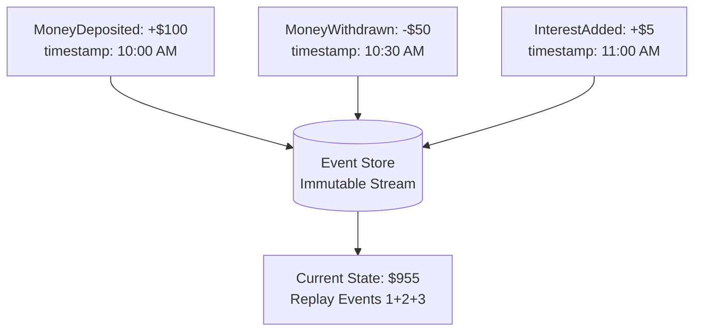
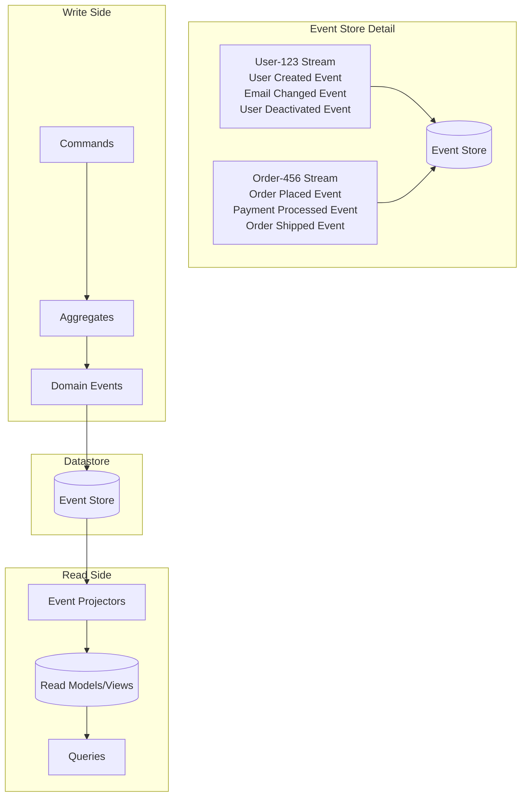

# Event Sourcing

Event Sourcing fundamentally changes how we think about data persistence by storing the complete history of changes as a sequence of immutable events, rather than just the current state.

Instead of updating records in-place, every state change becomes an event that gets appended to an event stream.

The current state is derived by replaying these events, providing a complete audit trail and enabling powerful temporal queries.

## Core Concept

Traditional systems update state by overwriting previous values, losing the history of how that state was reached.

Event Sourcing preserves this history by treating events as the source of truth.



**Key Principles:**

- **Events are immutable:** Once written, they never change
- **Events are append-only:** New events are added to the end of the stream
- **Current state is derived:** By replaying events from the beginning
- **Events represent business facts:** What happened, when, and why

## Architecture Components

Event Sourcing systems consist of several key components:

- **Event Store**: A specialized database optimized for append-only operations and event streaming.
- **Event Stream**: A sequence of events that are stored in the event store that relates to a specific aggregate.
- **Aggregates**: The consistency boundaries that generate and apply events.
- **Event Projections**: Projections transform events into read-optimized views for queries.



### Event Store

The event store is a specialized database optimized for append-only operations and event streaming.

```python
from abc import ABC, abstractmethod
from typing import List, Optional, Iterator
from datetime import datetime
import uuid

class Event:
    """Base event class with metadata."""
    def __init__(self, aggregate_id: str, event_type: str, data: dict,
                 version: int, timestamp: datetime = None):
        self.event_id = str(uuid.uuid4())
        self.aggregate_id = aggregate_id
        self.event_type = event_type
        self.data = data
        self.version = version
        self.timestamp = timestamp or datetime.now()
        self.metadata = {}

    def add_metadata(self, key: str, value: any):
        """Add metadata for tracing, correlation, etc."""
        self.metadata[key] = value

class EventStore(ABC):
    """Abstract event store interface."""

    @abstractmethod
    def append_events(self, aggregate_id: str, expected_version: int,
                     events: List[Event]) -> None:
        """Append events to stream with optimistic concurrency control."""
        pass

    @abstractmethod
    def get_events(self, aggregate_id: str, from_version: int = 0) -> List[Event]:
        """Retrieve events for an aggregate from a specific version."""
        pass

    @abstractmethod
    def get_all_events(self, from_timestamp: datetime = None) -> Iterator[Event]:
        """Get all events across all streams for projections."""
        pass

class InMemoryEventStore(EventStore):
    """Simple in-memory event store for demonstration."""

    def __init__(self):
        self.streams = {}  # aggregate_id -> List[Event]
        self.global_events = []  # All events in order
        self._lock = threading.Lock()

    def append_events(self, aggregate_id: str, expected_version: int,
                     events: List[Event]) -> None:
        with self._lock:
            current_events = self.streams.get(aggregate_id, [])
            current_version = len(current_events)

            # Optimistic concurrency control
            if current_version != expected_version:
                raise ConcurrencyError(f"Expected version {expected_version}, got {current_version}")

            # Append new events
            for event in events:
                event.version = current_version + 1
                current_events.append(event)
                self.global_events.append(event)
                current_version += 1

            self.streams[aggregate_id] = current_events

    def get_events(self, aggregate_id: str, from_version: int = 0) -> List[Event]:
        events = self.streams.get(aggregate_id, [])
        return [e for e in events if e.version > from_version]

class ConcurrencyError(Exception):
    """Raised when optimistic concurrency check fails."""
    pass
```

### Aggregates

Aggregates are the consistency boundaries that generate and apply events.

```python
from abc import ABC, abstractmethod

class Aggregate(ABC):
    """Base class for event-sourced aggregates."""

    def __init__(self, aggregate_id: str):
        self.aggregate_id = aggregate_id
        self.version = 0
        self.uncommitted_events = []

    def apply_event(self, event: Event):
        """Apply event to update internal state."""
        self._handle_event(event)
        self.version = event.version

    def append_event(self, event_type: str, data: dict):
        """Append a new domain event."""
        event = Event(
            aggregate_id=self.aggregate_id,
            event_type=event_type,
            data=data,
            version=self.version + 1
        )

        # Apply event to current state
        self.apply_event(event)

        # Track for persistence
        self.uncommitted_events.append(event)

    def mark_events_as_committed(self):
        """Clear uncommitted events after successful persistence."""
        self.uncommitted_events.clear()

    @abstractmethod
    def _handle_event(self, event: Event):
        """Handle specific event types - implemented by concrete aggregates."""
        pass

# Example aggregate implementation
class BankAccount(Aggregate):
    """Bank account aggregate with event sourcing."""

    def __init__(self, account_id: str):
        super().__init__(account_id)
        self.balance = 0.0
        self.is_active = True
        self.account_holder = None

    @classmethod
    def open_account(cls, account_id: str, account_holder: str, initial_deposit: float):
        """Factory method to create new account."""
        account = cls(account_id)
        account.append_event('AccountOpened', {
            'account_holder': account_holder,
            'initial_deposit': initial_deposit
        })
        return account

    def deposit(self, amount: float, description: str = "Deposit"):
        """Deposit money into the account."""
        if not self.is_active:
            raise ValueError("Cannot deposit to inactive account")
        if amount <= 0:
            raise ValueError("Deposit amount must be positive")

        self.append_event('MoneyDeposited', {
            'amount': amount,
            'description': description,
            'new_balance': self.balance + amount
        })

    def _handle_event(self, event: Event):
        """Apply events to update account state."""
        if event.event_type == 'AccountOpened':
            self.account_holder = event.data['account_holder']
            self.balance = event.data['initial_deposit']
            self.is_active = True

        elif event.event_type == 'MoneyDeposited':
            self.balance += event.data['amount']

        else:
            # Unknown event type - could be from future version
            # Event sourcing systems must handle unknown events gracefully
            pass

class BankAccountRepository:
    """Repository for loading and saving bank accounts."""

    def __init__(self, event_store: EventStore):
        self.event_store = event_store

    def load(self, account_id: str) -> BankAccount:
        """Load account by replaying events."""
        events = self.event_store.get_events(account_id)

        # Reconstruct aggregate from events
        account = BankAccount(account_id)
        for event in events:
            account.apply_event(event)

        return account

    def save(self, account: BankAccount) -> None:
        """Save aggregate by persisting uncommitted events."""
        if not account.uncommitted_events:
            return  # Nothing to save

        self.event_store.append_events(
            aggregate_id=account.aggregate_id,
            expected_version=account.version - len(account.uncommitted_events),
            events=account.uncommitted_events
        )

        account.mark_events_as_committed()
```

### Event Projections

Projections transform events into read-optimized views for queries.

```python
class Projection(ABC):
    """Base class for event projections."""

    @abstractmethod
    def handle_event(self, event: Event):
        """Process an event and update the projection."""
        pass

class AccountBalanceProjection(Projection):
    """Simple projection tracking account balances."""

    def __init__(self):
        self.balances = {}  # account_id -> current_balance
        self.last_processed_version = {}  # account_id -> last_event_version

    def handle_event(self, event: Event):
        """Update balance projection based on events."""
        # Idempotency check
        if (event.aggregate_id in self.last_processed_version and
            event.version <= self.last_processed_version[event.aggregate_id]):
            return  # Already processed

        if event.event_type == 'AccountOpened':
            self.balances[event.aggregate_id] = event.data['initial_deposit']

        elif event.event_type == 'MoneyDeposited':
            current_balance = self.balances.get(event.aggregate_id, 0)
            self.balances[event.aggregate_id] = current_balance + event.data['amount']

        # Track processing
        self.last_processed_version[event.aggregate_id] = event.version

    def get_balance(self, account_id: str) -> float:
        """Get current balance for an account."""
        return self.balances.get(account_id, 0.0)

class ProjectionManager:
    """Manages multiple projections and keeps them up to date."""

    def __init__(self, event_store: EventStore):
        self.event_store = event_store
        self.projections = []
        self.is_running = False

    def add_projection(self, projection: Projection):
        """Add a projection to be managed."""
        self.projections.append(projection)

    def start(self):
        """Start processing events for all projections."""
        self.is_running = True

        # Process all historical events first
        for event in self.event_store.get_all_events():
            if not self.is_running:
                break
            self._process_event(event)

        # In a real system, this would continue processing new events
        # via event subscriptions or polling

    def stop(self):
        """Stop processing events."""
        self.is_running = False

    def _process_event(self, event: Event):
        """Process event through all projections."""
        for projection in self.projections:
            try:
                projection.handle_event(event)
            except Exception as e:
                # Log error but continue processing other projections
                print(f"Error in projection {type(projection).__name__}: {e}")
```

## Benefits and Challenges

### Benefits

- **Complete Audit Trail:** Every state change is preserved with full context
- **Temporal Queries:** Reconstruct system state at any point in time

    ```python
    class TemporalQueries:
        def get_account_balance_at(self, account_id: str, timestamp: datetime) -> float:
            """Get account balance at a specific point in time."""
            events = self.event_store.get_events(account_id)

            # Reconstruct state up to the specified timestamp
            account = BankAccount(account_id)
            for event in events:
                if event.timestamp <= timestamp:
                    account.apply_event(event)
                else:
                    break

            return account.balance

        def get_monthly_snapshots(self, account_id: str, year: int) -> dict:
            """Get account balance at the end of each month."""
            monthly_balances = {}

            for month in range(1, 13):
                end_of_month = datetime(year, month, 28)  # Simplified
                balance = self.get_account_balance_at(account_id, end_of_month)
                monthly_balances[month] = balance

            return monthly_balances
    ```

- **Natural Integration with Event-Driven Architecture:** Events can be published to message brokers for real-time processing

### Challenges

- **Event Schema Evolution:** Managing changes to event structure over time
- **Performance with Large Event Streams:** Many events can slow down aggregate reconstruction
- **Storage Growth:** Event streams grow indefinitely and require management
- **Eventual Consistency:** Read models may be temporarily out of sync with write models

## Performance Optimizations

### Snapshotting

Periodically save aggregate state and instead of replaying thousands of events, restore state from the most recent snapshot and only replay events that occurred after that point.

**Strategy:**

- Taking snapshots at regular intervals (e.g., every 100 events)
- Storing snapshot data alongside the event stream
- Loading from the most recent snapshot and applying subsequent events
- Balancing snapshot frequency against storage overhead

```python
class Snapshot:
    def __init__(self, aggregate_id: str, version: int, data: dict, timestamp: datetime):
        self.aggregate_id = aggregate_id
        self.version = version
        self.data = data
        self.timestamp = timestamp

class SnapshotStore(ABC):
    @abstractmethod
    def save_snapshot(self, snapshot: Snapshot) -> None:
        pass

    @abstractmethod
    def get_latest_snapshot(self, aggregate_id: str) -> Optional[Snapshot]:
        pass

class SnapshotRepository:
    """Repository with snapshot optimization."""

    def __init__(self, event_store: EventStore, snapshot_store, snapshot_frequency: int = 100):
        self.event_store = event_store
        self.snapshot_store = snapshot_store
        self.snapshot_frequency = snapshot_frequency

    def load(self, account_id: str) -> BankAccount:
        """Load aggregate using snapshots for performance."""

        # Try to load latest snapshot
        snapshot = self.snapshot_store.get_latest_snapshot(account_id)

        if snapshot:
            # Reconstruct from snapshot
            account = BankAccount(account_id)
            account.balance = snapshot.data['balance']
            account.version = snapshot.version

            # Load events after snapshot
            events = self.event_store.get_events(account_id, from_version=snapshot.version)
        else:
            # No snapshot, load from beginning
            account = BankAccount(account_id)
            events = self.event_store.get_events(account_id)

        # Apply remaining events
        for event in events:
            account.apply_event(event)

        return account

    def save(self, account: BankAccount) -> None:
        """Save aggregate and create snapshot if needed."""
        # Save events
        self.event_store.append_events(account.aggregate_id, account.uncommitted_events)

        # Create snapshot if we've reached the frequency threshold
        if account.version % self.snapshot_frequency == 0:
            snapshot = Snapshot(
                aggregate_id=account.aggregate_id,
                version=account.version,
                data={
                    'balance': account.balance,
                    'is_active': account.is_active,
                    'account_holder': account.account_holder
                },
                timestamp=datetime.now()
            )
            self.snapshot_store.save_snapshot(snapshot)

        account.mark_events_as_committed()
```

### Event Stream Archival

Archive old events to keep active streams performant while maintaining complete audit trail.

Archival moves old events to separate storage while keeping recent events fast to access. The key is maintaining the ability to reconstruct aggregate state by combining archive and active events when needed.

**Strategy:**

- Define retention policies (e.g., archive events older than 2 years)
- Move archived events to cheaper, slower storage
- Keep metadata for cross-referencing
- Maintain snapshots to avoid archive access for normal operations

### Projection Caching

Cache frequently accessed projections.

```python
class CachedProjection(Projection):
    def __init__(self, base_projection: Projection, cache_ttl: int = 300):
        self.base_projection = base_projection
        self.cache = {}
        self.cache_timestamps = {}
        self.cache_ttl = cache_ttl

    def handle_event(self, event: Event):
        """Update base projection and invalidate cache."""
        self.base_projection.handle_event(event)

        # Invalidate relevant cache entries
        if hasattr(self.base_projection, 'get_balance'):
            cache_key = f"balance_{event.aggregate_id}"
            if cache_key in self.cache:
                del self.cache[cache_key]
                del self.cache_timestamps[cache_key]

    def get_balance(self, account_id: str) -> float:
        """Get balance with caching."""
        cache_key = f"balance_{account_id}"
        now = time.time()

        # Check cache
        if (cache_key in self.cache and
            now - self.cache_timestamps[cache_key] < self.cache_ttl):
            return self.cache[cache_key]

        # Cache miss - get fresh data
        balance = self.base_projection.get_balance(account_id)
        self.cache[cache_key] = balance
        self.cache_timestamps[cache_key] = now

        return balance
```

## Advanced Patterns

### Event Upcasting

Handle event schema evolution by transforming old events to new formats when they're read from the event store.

This allows systems to evolve while maintaining backward compatibility with historical events.

```python
class EventUpcaster:
    """Handle multiple versions of events gracefully."""

    def upgrade_event(self, event: Event) -> Event:
        """Upgrade legacy event formats to current version."""

        if event.event_type == 'MoneyWithdrawn' and 'version' not in event.data:
            # Version 1: Only had amount
            # Version 2: Added description and new_balance
            upgraded_data = event.data.copy()
            upgraded_data['description'] = 'Legacy withdrawal'
            upgraded_data['version'] = 2

            return Event(
                aggregate_id=event.aggregate_id,
                event_type=event.event_type,
                data=upgraded_data,
                version=event.version,
                timestamp=event.timestamp
            )

        return event  # Already current version

class VersionTolerantAggregate(BankAccount):
    """Aggregate that handles multiple event versions."""

    def _handle_event(self, event: Event):
        # Upgrade event if needed
        upcaster = EventUpcaster()
        upgraded_event = upcaster.upgrade_event(event)

        # Handle the upgraded event
        super()._handle_event(upgraded_event)
```

## When to Use Event Sourcing

### Ideal Scenarios

- **Audit-Heavy Domains:** Financial systems, healthcare, legal systems where complete audit trails are required
- **Temporal Analysis:** Systems requiring historical analysis and debugging
- **Event-Driven Systems:** Natural fit for systems already using events for communication

### Consider Alternatives When

- **Simple CRUD Applications:** Basic data management without complex business logic
- **Performance-Critical Systems:** Where the overhead of event replay is unacceptable
- **Limited Storage:** When storage costs are a primary concern

## Common Anti-Patterns

### Using Events as Commands

```python
# Anti-pattern ❌: Events that look like commands
class BadEvent:
    def __init__(self):
        self.event_type = "WithdrawMoney"  # Imperative, like a command

# Better ✅: Events describe what happened
class GoodEvent:
    def __init__(self):
        self.event_type = "MoneyWithdrawn"  # Past tense, describes fact
```

### Large, Complex Events

```python
# Anti-pattern ❌: Kitchen sink events
class OrderProcessedEvent:
    def __init__(self):
        self.customer_data = {...}  # Entire customer object
        self.product_catalog = {...}  # Full product details
        self.shipping_details = {...}  # Everything about shipping
        # Too much data!

# Better ✅: Focused, specific events
class OrderPlacedEvent:
    def __init__(self):
        self.order_id = "123"
        self.customer_id = "456"
        self.product_ids = ["789", "012"]
        self.total_amount = 99.99
        # Just the essential facts
```

### Event Store as Primary Query Interface

```python
# Anti-pattern ❌: Querying event store directly for reads
def get_customer_orders(customer_id):
    all_events = event_store.get_all_events()
    # Scanning all events for customer data - very slow!

# Better ✅: Use projections for queries
def get_customer_orders(customer_id):
    return customer_orders_projection.get_orders(customer_id)
```

## Reference Materials

- [Pattern: Event Sourcing](https://microservices.io/patterns/data/event-sourcing.html)
- [Event Sourcing](https://martinfowler.com/eaaDev/EventSourcing.html)
- [Focusing on Events](https://martinfowler.com/eaaDev/EventNarrative.html)
- [Domain Events](https://martinfowler.com/eaaDev/DomainEvent.html)
- [Domain Events vs. Event Sourcing](https://www.innoq.com/en/blog/2019/01/domain-events-versus-event-sourcing/)
- [Event Sourcing by Greg Young at GOTO Conference](https://www.youtube.com/watch?v=8JKjvY4etTY)
- [CQRS and Event Sourcing by Greg Young](https://www.youtube.com/watch?v=JHGkaShoyNs)
