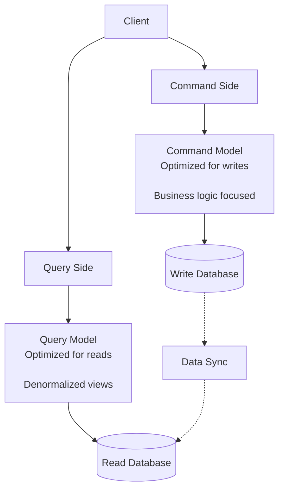
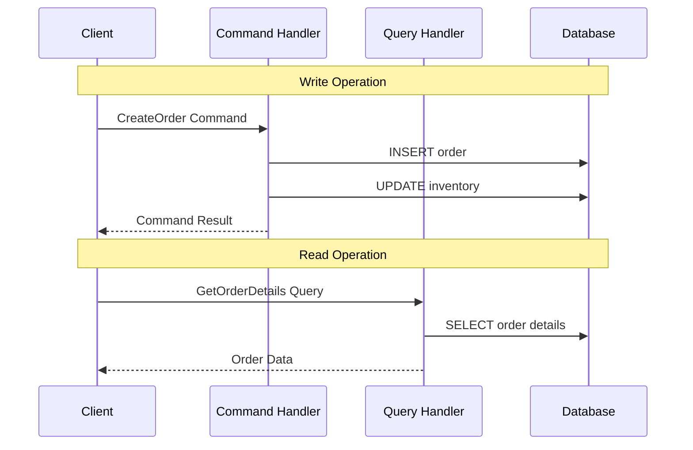
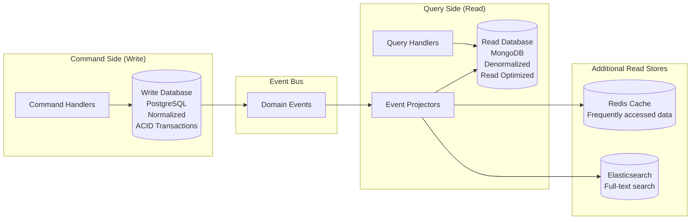
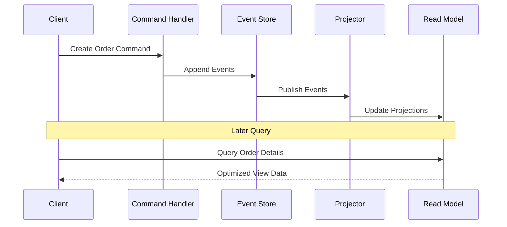

# Command Query Responsibility Segregation (CQRS)

CQRS is an architectural pattern that separates read and write operations into distinct models, allowing each to be optimized independently for their specific use cases.

Rather than using a single model to handle both commands (writes) and queries (reads), CQRS employs separate models:

- **Command Model:** Optimized for writes with business logic
- **Query Model:** Optimized for reads with specific query patterns

## Core Concept

Traditional architectures use the same data model for both reading and writing, which creates compromises in both directions. CQRS removes these compromises by allowing each side to evolve independently.



**Key Benefits:**

- **Independent Optimization:** Read and write sides can be optimized separately
- **Scalability:** Scale read and write operations independently
- **Complexity Isolation:** Complex business logic doesn't affect read performance
- **Technology Flexibility:** Different technologies for different use cases

## Foundation: Command Query Separation (CQS)

CQRS builds on the object-oriented Command Query Separation principle, which states that methods should either modify state (commands) or return data (queries), but never both.

```python
# CQS Principle at the method level
class BankAccount:
    def __init__(self, balance):
        self._balance = balance
        self._transactions = []

    # ✅ Command: Modifies state, returns nothing
    def deposit(self, amount: float) -> None:
        if amount <= 0:
            raise ValueError("Amount must be positive")
        self._balance += amount
        self._transactions.append(f"Deposited {amount}")

    # ✅ Query: Returns data, doesn't modify state
    def get_balance(self) -> float:
        return self._balance

    # ❌ Violates CQS: Both modifies state AND returns data
    def deposit_and_get_balance(self, amount: float) -> float:
        self.deposit(amount) # Modifies state
        return self.get_balance() # Returns data

# ✅ Better approach: Separate the operations
account = BankAccount(1000)
account.deposit(100) # Command
balance = account.get_balance()  # Query
```

**CQRS extends CQS from the method level to the architectural level**, creating separate models and potentially separate storage systems and deployments for commands and queries.

## CQRS Implementation Patterns

### Simple CQRS (Same Database)

The simplest CQRS implementation separates command and query logic while using the same database.



### Commands Example

Commands represent intentions to change state and contain business logic.

```python
class CreateOrderCommand:
    def __init__(self, customer_id, product_ids):
        self.customer_id = customer_id
        self.product_ids = product_ids

class UpdateOrderStatusCommand:
    def __init__(self, order_id, status):
        self.order_id = order_id
        self.status = status

# Command Handler
class OrderCommandHandler:
    def __init__(self, order_repository):
        self.order_repository = order_repository

    def handle_create_order(self, command: CreateOrderCommand):
        order = {
            "customer_id": command.customer_id,
            "products": command.product_ids,
            "status": "PENDING"
        }
        return self.order_repository.save(order)

    def handle_update_status(self, command: UpdateOrderStatusCommand):
        order = self.order_repository.get(command.order_id)
        order["status"] = command.status
        self.order_repository.update(order)

# Repository (write model)
class OrderCommandRepository:
    def save(self, order):
        print("Saving order:", order)
        return "order-id-123"

    def update(self, order):
        print("Updating order:", order)
```

### Queries Example

Queries represent requests for data and are optimized for read performance.

```python
class GetOrderDetailsQuery:
    def __init__(self, order_id):
        self.order_id = order_id

class GetCustomerOrdersQuery:
    def __init__(self, customer_id):
        self.customer_id = customer_id

# Query Handler
class OrderQueryHandler:
    def __init__(self, query_repository):
        self.query_repository = query_repository

    def get_order_with_details(self, query: GetOrderDetailsQuery):
        return self.query_repository.get_order(query.order_id)

    def get_customer_orders_paginated(self, query: GetCustomerOrdersQuery):
        return self.query_repository.get_orders(query.customer_id)

# Repository (read model)
class OrderQueryRepository:
    def get_order(self, order_id):
        # Denormalized view for fast reads
        return self._execute_query("""
            SELECT o.*, c.name as customer_name, c.email,
                   GROUP_CONCAT(p.name) as product_names,
                   GROUP_CONCAT(p.price) as product_prices
            FROM orders o
            JOIN customers c ON o.customer_id = c.id
            JOIN order_items oi ON o.id = oi.order_id
            JOIN products p ON oi.product_id = p.id
            WHERE o.id = ?
            GROUP BY o.id
        """, [order_id])

    def get_orders(self, customer_id):
        # Optimized query with indexes for pagination
        return self._execute_query("""
            SELECT o.id, o.status, o.total, o.created_at,
                   COUNT(oi.product_id) as item_count
            FROM orders o
            LEFT JOIN order_items oi ON o.id = oi.order_id
            WHERE o.customer_id = ?
            GROUP BY o.id
            ORDER BY o.created_at DESC
            LIMIT ? OFFSET ?
        """, [customer_id, limit, offset])
```

### Advanced CQRS (Separate Databases)

For high-scale applications, CQRS can use completely separate databases optimized for their respective use cases.



#### Commands Example (Write Side + Event Publishing)

```python
from datetime import datetime

# Event
class OrderCreatedEvent:
    def __init__(self, order_id, customer_id, products, total):
        self.order_id = order_id
        self.customer_id = customer_id
        self.products = products
        self.total = total
        self.timestamp = datetime.now()

# Command
class CreateOrderCommand:
    def __init__(self, customer_id, product_ids):
        self.customer_id = customer_id
        self.product_ids = product_ids

# Command Handler
class EventDrivenOrderCommandHandler:
    def __init__(self, write_repository, event_bus):
        self.write_repository = write_repository
        self.event_bus = event_bus

    def handle_create_order(self, command: CreateOrderCommand):
        # Save to write database
        order = {"customer_id": command.customer_id, "products": command.product_ids, "status": "PENDING"}
        order_id = self.write_repository.save(order)

        # Publish event for query side
        event = OrderCreatedEvent(order_id, command.customer_id, command.product_ids, total=100.0)
        self.event_bus.publish(event)

        return order_id
```

#### Queries Example (Read Side + Projections)

```python
# Projector - updates read model from events
class OrderProjector:
    def __init__(self, read_repository, cache, search_index):
        self.read_repository = read_repository
        self.cache = cache
        self.search_index = search_index

    def handle_order_created(self, event):
        order_view = {
            "id": event.order_id,
            "customer_id": event.customer_id,
            "products": event.products,
            "total": event.total,
            "status": "PENDING",
            "created_at": event.timestamp
        }
        self.read_repository.save(order_view)
        self.cache.set(f"order:{event.order_id}", order_view)
        self.search_index.index(order_view)

# Query Handler - optimized for reads
class OptimizedOrderQueryHandler:
    def __init__(self, read_repository, cache, search_index):
        self.read_repository = read_repository
        self.cache = cache
        self.search_index = search_index

    def get_order_details(self, order_id):
        order = self.cache.get(f"order:{order_id}")
        if not order:
            order = self.read_repository.get(order_id)
        return order

    def search_orders(self, text, filters):
        return self.search_index.search(text, filters)
```

## Benefits and Challenges

### Benefits

- **Independent Scalability:** Read and write sides can be scaled independently based on their specific load patterns
- **Performance Optimization:** Each side can use data structures and technologies optimized for its use case
- **Complexity Isolation:** Complex business logic doesn't impact read performance
**Technology Flexibility:** Different databases and technologies for different needs

### Challenges

- **Eventual Consistency:** Read models may lag behind write models
- **Increased Complexity:** More moving parts, synchronization concerns, and operational overhead
- **Data Duplication:** Data may be stored in multiple places (denormalized views in read side)

## CQRS with Event Sourcing

CQRS and Event Sourcing are frequently combined to create powerful, auditable systems.



### Commands Example (Event Sourcing + Write Side)

```python
# Command
class CreateOrderCommand:
    def __init__(self, order_id, customer_id, product_ids):
        self.order_id = order_id
        self.customer_id = customer_id
        self.product_ids = product_ids

# Aggregate (simplified)
class OrderAggregate:
    def __init__(self):
        self.events = []

    @classmethod
    def from_events(cls, past_events):
        agg = cls()
        # replay events (simplified: skip actual logic)
        return agg

    def create_order(self, customer_id, product_ids):
        event = {"type": "OrderCreated", "customer_id": customer_id, "products": product_ids}
        self.events.append(event)

    def get_uncommitted_events(self):
        return self.events

# Command Handler using Event Sourcing
class EventSourcedCQRSExample:
    def __init__(self, event_store, projector_manager):
        self.event_store = event_store
        self.projector_manager = projector_manager

    def handle_create_order_command(self, command: CreateOrderCommand):
        # Rebuild aggregate from events
        order_aggregate = OrderAggregate.from_events(
            self.event_store.get_events(command.order_id)
        )

        # Execute business logic → new event
        order_aggregate.create_order(command.customer_id, command.product_ids)

        # Persist events
        new_events = order_aggregate.get_uncommitted_events()
        self.event_store.append_events(command.order_id, new_events)

        # Events are automatically projected to read models
        # by the projector manager (through the event bus, see below)

        return command.order_id
```

### Queries Example (Projections + Read Side)

```python
# Projectors update read models from events
class OrderDetailsProjector:
    def handle(self, event):
        if event["type"] == "OrderCreated":
            print("Updating OrderDetails read model:", event)

class CustomerOrdersProjector:
    def handle(self, event):
        if event["type"] == "OrderCreated":
            print("Updating CustomerOrders read model:", event)

# Projector Manager calls all projectors
class OrderProjectorManager:
    def __init__(self):
        self.projectors = [
            OrderDetailsProjector(),   # Detailed order views
            CustomerOrdersProjector(), # Customer order lists
            OrderAnalyticsProjector(), # Business intelligence
            OrderSearchProjector()     # Full-text search
        ]

    def handle_event(self, event):
        for projector in self.projectors:
            try:
                projector.handle(event)
            except Exception as e:
                logger.error(f"Projector {projector.__class__.__name__} failed: {e}")
                # Continue with other projectors
```

## When to Use CQRS

### Ideal Scenarios

- **High Read/Write Ratio Imbalance:** When read and write loads are very different
- **Multiple Query Patterns:** When you need different views of the same data
- **Performance Requirements:** When read and write performance requirements are very different

### Consider Alternatives When

- **Simple CRUD Applications:** Basic applications with similar read/write patterns
- **Immediate Consistency Required:** When eventual consistency is not acceptable

## Common Anti-Patterns

### CQRS Everywhere

```python
# Anti-pattern ❌: Using CQRS for simple operations
class UserPreferencesService:
    # Overkill for simple user preferences
    def __init__(self):
        self.command_handler = UserPreferencesCommand Handler ()
        self.query_handler = UserPreferencesQuery Handler()

    def update_theme(self, user_id: str, theme: str):
        command = UpdateThemeCommand(user_id, theme)
        self.command_handler.handle(command)

    def get_theme(self, user_id: str):
        query = GetThemeQuery(user_id)
        return self.query_handler.handle(query)

# Better ✅: Simple service for simple operations
class UserPreferencesService:
    def update_theme(self, user_id: str, theme: str):
        self.repository.update_user_theme(user_id, theme)

    def get_theme(self, user_id: str):
        return self.repository.get_user_theme(user_id)
```

### Ignoring Eventual Consistency

```python
# Anti-pattern ❌: Assuming immediate consistency
def process_order_workflow(command):
    order_id = command_handler.create_order(command)

    # This will likely fail due to eventual consistency
    order_details = query_handler.get_order_details(order_id)
    send_confirmation_email(order_details)

# Better ✅: Handle eventual consistency properly
def process_order_workflow(command):
    order_id = command_handler.create_order(command)

    # Use event-driven approach
    event_bus.subscribe('OrderCreated', send_confirmation_email_handler)
    # Or use read-after-write consistency strategies
```

### Complex Command/Query Interfaces

```python
# Anti-pattern ❌: Overly complex command/query objects
class ComplexOrderCommand:
    def __init__(self):
        self.customer_data = {...}      # Full customer object
        self.product_catalog = {...}    # Entire product catalog
        self.business_rules = {...}     # All business rules
        # Too much data and responsibility!

# Better ✅: Focused, specific commands
class CreateOrderCommand:
    def __init__(self, customer_id: str, product_ids: List[str], shipping_address: str):
        self.customer_id = customer_id
        self.product_ids = product_ids
        self.shipping_address = shipping_address
        # Just the essential data needed
```

## Reference Materials

- [Command Query Separation](https://martinfowler.com/bliki/CommandQuerySeparation.html)
- [Pattern: Command Query Responsibility Segregation](https://microservices.io/patterns/data/cqrs.html)
- [CQRS](https://martinfowler.com/bliki/CQRS.html)
- [Clarified CQRS](https://udidahan.com/2009/12/09/clarified-cqrs/)
- [What they don’t tell you about event sourcing](https://medium.com/@hugo.oliveira.rocha/what-they-dont-tell-you-about-event-sourcing-6afc23c69e9a)
