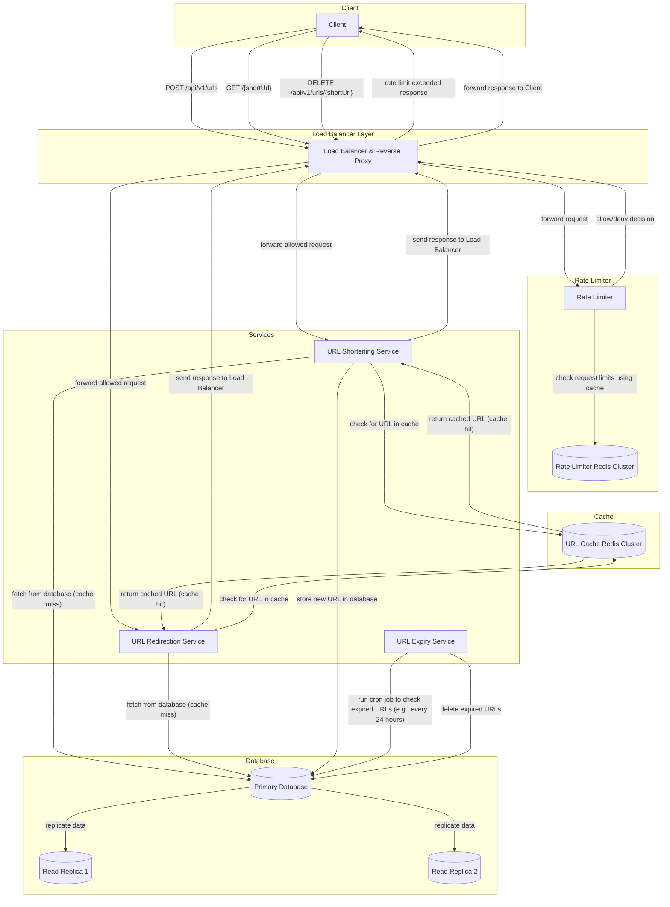
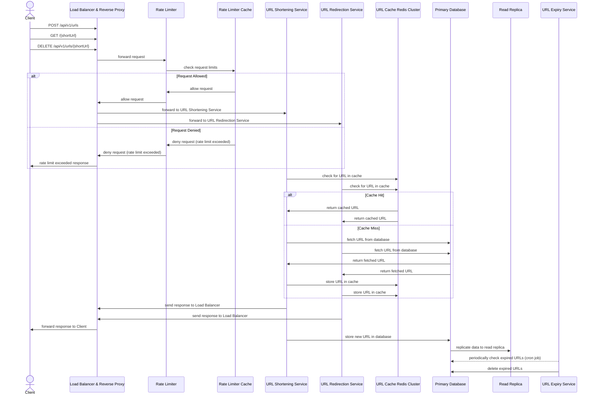

# Design a URL Shortening System

Design a URL shortening system like [TinyURL](https://tinyurl.com/).

## 1. Clarify Requirements

### Functional Requirements

- **Core Features**
  - Generate a shorter alias for any given URL
  - Redirect users to the original URL when they access the short URL
  - Ensure no collisions in URL hashes
  - Support custom expiration times (default: 3 years, max: 5 years)
  - Delete expired short URLs from the system

- **Use Cases**
  - Users submit long URLs and receive short URLs
  - Users click short URLs and get redirected to original URLs
  - Users can delete their short URLs
  - System automatically expires URLs after specified time

- **Data Operations**
  - Store URL mappings (short URL → original URL)
  - Retrieve original URL by short URL
  - Delete URL mappings for expired URLs

### Non-Functional Requirements

- **Scalability**: Support 100 million daily active users
- **Performance**:
  - URL generation: < 100ms response time
  - URL redirection: < 50ms response time
- **Availability**: 99.9% uptime
- **Consistency**: Strong consistency for URL creation, eventual consistency acceptable for reads

### Constraints & Assumptions

- **Technical Constraints**
  - Short URLs should be human-readable (6-8 characters)
  - System should handle 100:1 read-to-write ratio
  - URLs expire after maximum 5 years

- **Assumptions**
  - 1 million new short URLs created daily
  - Average URL entry size: 500 bytes
  - Peak traffic is 3x average traffic

### Out of Scope

- **Features not included**
  - Analytics (click tracking, unique visitors)
  - User authentication and custom short URLs
  - Bulk URL operations
  - URL preview functionality

## 2. Resource Estimation

### Scale Assumptions

- **Daily Active Users (DAU)**: 100 million users
- **Peak Traffic Factor**: Peak traffic is 3x average traffic
- **Geographic Distribution**: Global user base
- **Data Retention**: 5 years maximum

### Traffic Estimation

- **Read-to-Write Ratio**: 100:1 (read-heavy system)
- **Queries Per Second (QPS)**
  - Write QPS: `1,000,000 URLs/day ÷ 86,400 seconds = ~12 writes/second`
  - Read QPS: `12 writes/second × 100 = 1,200 reads/second`
- **Peak Traffic**: `1,200 × 3 = 3,600 reads/second`

### Storage Estimation

- **Data Size per Entity**: 500 bytes per URL entry
- **Daily Storage Growth**: `1,000,000 × 500 bytes = 500 MB/day`
- **Total Storage Requirements**: `500 MB/day × 365 days × 5 years = ~900 GB`

### Bandwidth Estimation

- **Write Bandwidth**: `12 writes/second × 500 bytes = 6 KB/second`
- **Read Bandwidth**: `1,200 reads/second × 500 bytes = 600 KB/second`
- **Total Bandwidth**: `6 KB/s + 600 KB/s = 606 KB/second`

### Cache Estimation

- **Cache Hit Ratio**: 80% (Pareto principle, a.k.a. 80/20 rule: 20% of URLs generate 80% of traffic)
- **Cacheable Data**: Frequently accessed URL mappings
- **Cache Size**: `20% × 1,200 QPS × 500 bytes × 1 hour = ~4.3 MB/hour`

### Server Estimation

- **Requests per Server**: 1,000 RPS capacity per server
- **Number of Servers**: `3,600 peak RPS ÷ 1,000 RPS/server = 4 servers` (with `2x` redundancy: `8 servers`)
- **Resource Requirements**: 4 CPU cores, 8GB RAM, 100GB SSD per server

## 3. Core System Components

### System Components

- **Core Services**
  - URL Shortening Service: Generates short URLs and handles CRUD operations
  - URL Redirection Service: Handles redirects
  - URL Expiration Service: Handles URL expiration and cleanup

- **Data Layer**
  - Primary Database: Stores URL mappings
  - Cache Layer: Redis for frequently accessed URLs

- **Infrastructure**
  - Load Balancer: Distributes traffic
  - CDN: Caches static content globally
  - Rate Limiter: Prevents abuse

### API Design

- **RESTful Endpoints**
  - `POST /api/v1/urls` - Create short URL
  - `GET /{shortUrl}` - Redirect to original URL
  - `DELETE /api/v1/urls/{shortUrl}` - Delete short URL
  - `GET /api/v1/urls/{shortUrl}/info` - Get URL information

- **Request/Response Format**: JSON for API responses

- **Rate Limiting**
  - 100 requests per minute per IP
  - 1000 requests per hour per user

#### API Endpoints Schemas

```plaintext
POST /api/v1/urls

Content-Type: application/json
Status: 201 Created

Request:
{
  "originalUrl": "https://www.example.com/very/long/url/path",
  "expiresAt": "2027-12-31T23:59:59Z"
}

Response:
{
  "shortUrl": "https://short.ly/abc123",
  "originalUrl": "https://www.example.com/very/long/url/path",
  "createdAt": "2024-01-01T00:00:00Z",
  "expiresAt": "2027-12-31T23:59:59Z"
}
```

```plaintext
GET /{shortUrl}

Status: 301 Moved Permanently
Redirects to: `https://www.example.com/very/long/url/path`
```

```plaintext
DELETE /api/v1/urls/{shortUrl}

Content-Type: application/json
Status: 200 OK

Response:
{
  "message": "URL deleted successfully"
}
```

```plaintext
GET /api/v1/urls/{shortUrl}/info

Content-Type: application/json
Status: 200 OK

Response:
{
  "shortUrl": "https://short.ly/abc123",
  "originalUrl": "https://www.example.com/very/long/url/path",
  "createdAt": "2024-01-01T00:00:00Z",
  "expiresAt": "2027-12-31T23:59:59Z"
}
```

## 4. High-Level Design

### Component Diagram



### System Flow

Here is the flow of how the system works:



### Data Flow

- **Request Flow**
  1. Client sends request to load balancer
  2. Rate limiter checks request limits using Redis cluster
  3. Request routed to appropriate service
  4. Service checks cache first, then database
  5. Response sent back through load balancer

- **Response Flow**
  1. Service generates response
  2. Cache updated if needed (write-through)
  3. Response sent to client
  4. CDN caches static responses

- **Background Processing**
  1. Expiration service runs periodically (every 24 hours)
  2. Expired URLs marked for deletion
  3. Cleanup operations performed asynchronously

### Scalability Strategy

- **Horizontal Scaling**: Add more application servers
- **Vertical Scaling**: Increase server resources
- **Database Scaling**: Read replicas, sharding by short URL hash

## 5. Detailed Design

### Database Design

- **Database Choice**: NoSQL (MongoDB) for horizontal scaling and flexible schema
- **Schema Design**: Single collection for URL mappings
- **Indexing Strategy**:
  - Primary index on `shortUrl` (unique)
  - Secondary index on `expiresAt` for cleanup
  - Compound index on `createdAt` and `expiresAt`
- **Data Sharding**: Shard by hash of short URL

#### Example Schema

| Field       | Type     | Description          | Example                 |
|-------------|----------|----------------------|-------------------------|
| shortUrl    | String   | Primary key          | "abc123"                |
| originalUrl | String   | Original URL         | "<https://example.com>" |
| createdAt   | DateTime | Creation timestamp   | "2024-01-01T00:00:00Z"  |
| expiresAt   | DateTime | Expiration timestamp | "2024-12-31T23:59:59Z"  |
| userId      | String   | User identifier      | "user123"               |
| isActive    | Boolean  | URL status           | true                    |

### Core Algorithms

- **URL Shortening Algorithm**
  1. Generate unique ID (using counter or hash)
  2. Encode ID to base62 for human-readable format
  3. Check for collisions (retry if needed)
  4. Store mapping in database

The URL shortening algorithm consists of two main parts:

1. **Hashing**: Generate a unique identifier from the original URL
2. **Encoding**: Convert the identifier to a short, human-readable string

#### Hashing Algorithms

##### Option 1: MD5 Hashing

MD5 generates a 128-bit (32 hexadecimal characters) hash from the input URL.

```python
import hashlib

def md5_hash(url):
    return hashlib.md5(url.encode()).hexdigest()
```

- **Pros**: Fast, widely supported
- **Cons**: Higher collision probability, cryptographically broken
- **Collision Handling**: We can double hash the URL to reduce the collision probability

```python
def md5_double_hash(url):
    _hash = hashlib.md5(url.encode()).hexdigest()
    return hashlib.md5(_hash).hexdigest()
```

##### Option 2: SHA-256 Hashing

SHA-256 generates a 256-bit (64 hexadecimal characters) hash from the input URL.

```python
import hashlib

def sha256_hash(url):
    return hashlib.sha256(url.encode()).hexdigest()
```

- **Pros**: Lower collision probability, cryptographically secure
- **Cons**: Slower than MD5, generates longer hashes

##### Option 3: UUID Generation

UUID v4 generates a random 128-bit identifier (32 hexadecimal characters).

```python
import uuid

def generate_uuid():
    return str(uuid.uuid4().hex)
```

- **Pros**: Extremely low collision probability (2^122 possible values)
- **Cons**: Not deterministic (same input = different output)

UUID v4 generates random hashes, which are unique, given the number of possible combinations (2^122), and has a lower collision probability but are also longer.

##### Option 4: Counter-based (Sequencer)

A sequencer can be used to generate unique sequential IDs for the URLs. The sequencer can be implemented as a separate service that generates unique IDs in a distributed manner.

It can be scaled horizontally on multiple nodes and use a consensus algorithm like Raft or a distributed database like ZooKeeper or etcd for synchronization between the nodes.

Zookeeper can be used to maintain multiple ranges for sequencer servers and once a server reaches its maximum range Zookeeper will assign an unused counter range to the new server.

```plaintext
/sequencer
    /server1
        /range1
            /counter
        /range2
            /counter
    /server2
        /range3
            /counter
        /range4
            /counter
```

- **Pros**: Guaranteed uniqueness, predictable
- **Cons**: Requires distributed coordination

#### Encoding Algorithms

##### Option 1: Base62 Encoding (Recommended)

Uses 62-character alphabet (`A-Z`, `a-z`, `0-9`) - URL-safe.

```python
import string

def base62_encode(num):
    chars = string.ascii_letters + string.digits  # a-z, A-Z, 0-9
    result = ""
    while num > 0:
        result = chars[num % 62] + result
        num //= 62
    return result or "0"
```

- **Character Set**: 62 characters, all URL-safe
- **For 7-character long URLs**: 62^7 = 3.52 trillion possible combinations

##### Option 2: Base56 Encoding

Uses 56-character alphabet by removing ambiguous characters (`I`, `l`, `1`, `o`, `O`, `0`).

```python
import string

def base56_encode(num):
    # Remove ambiguous characters
    chars = (string.ascii_letters + string.digits).replace('I', '').replace('l', '').replace('1', '').replace('o', '').replace('O', '').replace('0', '')
    result = ""
    while num > 0:
        result = chars[num % 56] + result
        num //= 56
    return result or "a"
```

- **Character Set**: 56 characters, no ambiguous characters
- **For 7-character long URLs**: 56^7 = 1.5 trillion possible combinations

### Recommended Approach

For a production URL shortener, use:

1. **SHA-256 hashing** for collision resistance
2. **Base62 encoding** for URL-safe, human-readable output
3. **Collision detection** with retry logic
4. **Fallback to counter-based** if hash collisions persist

## 6. Scalability & Reliability

### Scaling Strategies

- **Horizontal Scaling**: Add more application servers behind load balancer
- **Database Scaling**:
  - Read replicas for read-heavy workload
  - Sharding by short URL hash for write scaling
- **Load Balancing**: Round-robin with health checks

### Reliability & Fault Tolerance

- **Data Replication**: 3 replicas for each database shard
- **Failover Mechanisms**:
  - Automatic failover to read replicas
  - Circuit breakers for external service calls
- **Consistency vs Availability**: Strong consistency for writes, eventual consistency for reads

### Performance Optimization

- **Caching**:
  - Cache frequently accessed URLs in Redis
  - TTL-based cache expiration
  - Cache-aside pattern for consistency
- **Bottlenecks**:
  - Database write capacity
  - Cache memory usage
  - Network bandwidth
- **Mitigation Strategies**:
  - Database sharding for write scaling
  - Cache eviction policies (LRU)
  - CDN for global content delivery
- **Monitoring**:
  - QPS metrics
  - Response time percentiles
  - Cache hit rates
  - Database connection pools utilization

## 7. Trade-offs & Discussion

### Design Decisions

- **Technology Choices**
  - **NoSQL over SQL**: Better horizontal scaling, flexible schema
  - **Redis for caching**: Fast in-memory storage, built-in expiration

- **Architecture Trade-offs**
  - **Monolithic vs Microservices**: Started monolithic, can evolve to microservices
  - **Synchronous vs Asynchronous**: Synchronous for user requests, asynchronous for cleanup

### Alternative Approaches

- **Other Solutions**
  - **UUID-based**: More collision-resistant but longer URLs
  - **Database auto-increment**: Simpler but harder to scale
  - **Pre-generated short codes**: Faster but requires upfront storage

- **Why Not Chosen**
  - UUIDs create longer URLs (not user-friendly)
  - Auto-increment creates scaling bottlenecks
  - Pre-generated codes waste storage for unused codes

### Future Considerations

- **Scalability Limits**: System can handle 10x growth with horizontal scaling
- **Feature Extensions**:
  - Add analytics and click tracking
  - Support custom short URLs
  - Add bulk operations

## 8. Implementation Considerations

### Database Sharding Strategy

```python
def get_shard_key(short_url):
    # Use consistent hashing to determine shard
    hash_value = hashlib.md5(short_url.encode()).hexdigest()
    shard_id = int(hash_value[:2], 16) % NUM_SHARDS
    return f"shard_{shard_id}"
```

### Caching

```python
import redis

class URLCache:
    def __init__(self):
        self.redis_client = redis.Redis(host='localhost', port=6379, db=0)
    
    def get_url(self, short_url):
        # Try cache first
        cached_url = self.redis_client.get(short_url)
        if cached_url:
            return cached_url.decode()
        
        # Cache miss - get from database
        original_url = self.get_from_database(short_url)
        if original_url:
            # Cache for 1 hour
            self.redis_client.setex(short_url, 3600, original_url)
        
        return original_url
```

### Rate Limiting

```python
from collections import defaultdict, deque
import time

class RateLimiter:
    def __init__(self, max_requests=100, window_seconds=60):
        self.max_requests = max_requests
        self.window_seconds = window_seconds
        self.requests = defaultdict(deque)
    
    def is_allowed(self, client_id):
        now = time.time()
        client_requests = self.requests[client_id]
        
        # Remove old requests outside window
        while client_requests and client_requests[0] <= now - self.window_seconds:
            client_requests.popleft()
        
        # Check if under limit
        if len(client_requests) < self.max_requests:
            client_requests.append(now)
            return True
        
        return False
```

### URL Expiration Service

```python
import schedule
import time
from datetime import datetime, timedelta

class URLExpirationService:
    def __init__(self, database):
        self.db = database
    
    def check_expired_urls(self):
        """Run every 24 hours to check for expired URLs"""
        current_time = datetime.utcnow()
        
        # Find URLs that have expired
        expired_urls = self.db.find_urls_where({
            'expiresAt': {'$lt': current_time},
            'isActive': True
        })
        
        for url in expired_urls:
            # Mark as inactive
            self.db.update_url(url['shortUrl'], {'isActive': False})
    
    def cleanup_expired_urls(self):
        """Actually delete expired URLs (run less frequently)"""
        cutoff_date = datetime.utcnow() - timedelta(days=30)  # Keep for 30 days after expiration
        
        deleted_count = self.db.delete_urls_where({
            'expiresAt': {'$lt': cutoff_date},
            'isActive': False
        })
        
        print(f"Cleaned up {deleted_count} expired URLs")
    
    def start_scheduler(self):
        """Start the background scheduler"""
        # Check for expired URLs every 24 hours
        schedule.every(24).hours.do(self.check_expired_urls)
        
        # Clean up old expired URLs every week
        schedule.every().week.do(self.cleanup_expired_urls)
        
        while True:
            schedule.run_pending()
            time.sleep(3600)  # Check every hour
```

## Summary

- **High Performance**: Sub-100ms response times with caching
- **Scalability**: Handles 100M DAU with horizontal scaling
- **Reliability**: 99.9% availability with redundancy
- **Cost Efficiency**: Optimized resource usage with caching and CDN

## Reference Materials

- [Design Bit.ly](https://www.hellointerview.com/learn/system-design/problem-breakdowns/bitly)
- [Design a URL Shortener (Bitly) - System Design Interview](https://www.youtube.com/watch?v=qSJAvd5Mgio)
- [Beginner System Design Interview: Design Bitly](https://www.youtube.com/watch?v=iUU4O1sWtJA)
