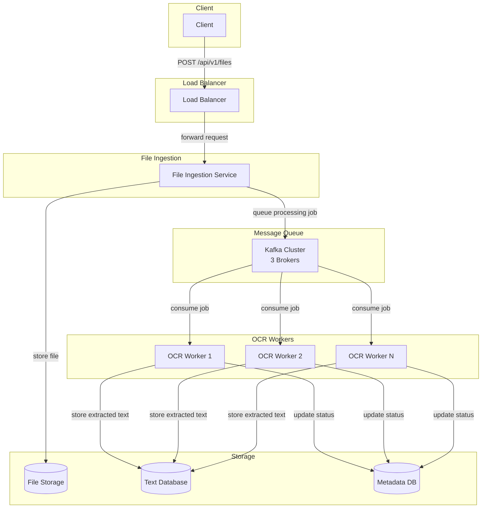
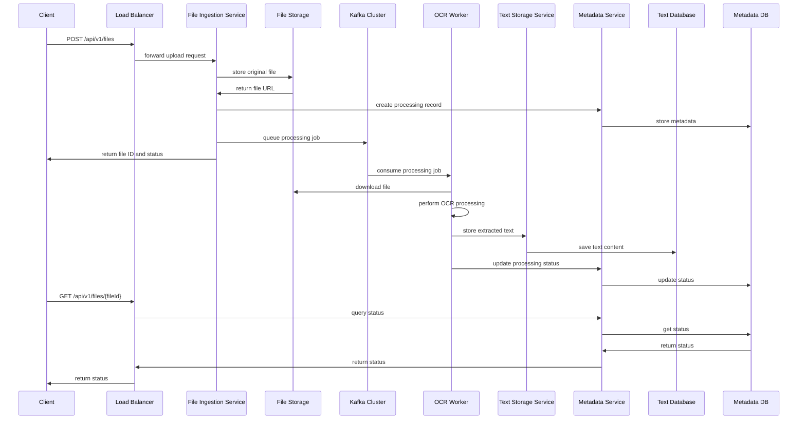

# OCR File Processing System

Design a system to process 100,000 files per hour using OCR to extract text from PDF documents (scanned and native non-scanned PDFs).

## 1. Clarify Requirements

### Functional Requirements

- **Core Features**
  - Process PDF files using OCR to extract text
  - Handle both scanned PDFs (images) and native PDFs (text-based)
  - Store extracted text in searchable format
  - Support file ingestion from multiple sources
  - Provide processing status and results

- **Use Cases**
  - Users upload PDF files for text extraction
  - System processes files asynchronously
  - Users retrieve extracted text and processing status
  - Batch processing of large file collections

- **Data Operations**
  - Store original PDF files
  - Store extracted text content
  - Track processing status and metadata
  - Handle file metadata (size, type, processing time)

### Non-Functional Requirements

- **Scalability**: Handle 100,000 files/hour normal load, 500,000 files/hour peak
- **Performance**:
  - Process files within 2-5 minutes average latency
  - Support concurrent processing of multiple files
- **Availability**: 99.9% uptime
- **Consistency**: Eventual consistency acceptable for processing status

### Constraints & Assumptions

- **Technical Constraints**
  - Files range from 1MB to 100MB in size
  - OCR processing is CPU and memory intensive
  - Text extraction accuracy must be >95%
  - Support for multiple languages

- **Assumptions**
  - Average file size: 10MB
  - OCR processing time: 30-60 seconds per file
  - Peak traffic occurs during business hours
  - Files are processed once and stored permanently

### Out of Scope

- **Features not included**
  - Real-time file processing (synchronous)
  - Image processing beyond OCR
  - File format conversion beyond PDF

## 2. Resource Estimation

### Scale Assumptions

- **Normal Load**: 100,000 files/hour
- **Peak Load**: 500,000 files/hour (5x normal)
- **Average File Size**: 10MB
- **Processing Time**: 45 seconds per file average

### Traffic Estimation

- **File Ingestion Rate**
  - Normal: 100,000 files/hour = ~28 files/second
  - Peak: 500,000 files/hour = ~139 files/second
- **Data Volume**
  - Normal: 100,000 × 10MB = 1TB/hour
  - Peak: 500,000 × 10MB = 5TB/hour

### Storage Estimation

- **Original Files**: 1TB/hour × 24 hours × 365 days = ~8.8PB/year
- **Extracted Text**: ~10% of original size = ~880TB/year
- **Metadata**: ~1KB per file × 100,000 files/hour × 24 hours × 365 days = ~876GB/year
- **Total Storage**: ~9.7PB/year

### Processing Estimation

- **OCR Workers Needed**
  - Normal: 28 files/sec × 45 sec = 1,260 concurrent workers
  - Peak: 139 files/sec × 45 sec = 6,255 concurrent workers

- **CPU Requirements**: 4 cores per worker = 25,020 cores at peak

**Notes**:

- In any given 45-second window, 28 × 45 = 1260 files arrive. **1260 workers ensures finishing all those 1260 files within the same 45 seconds** they arrive
- The maximum worker calculation assumes **zero backlog** processing (real-time)
- **Alternative approach**: Allow some backlog (e.g., 2-3x processing time) to reduce costs
- **Cost-optimized**: 500-800 workers can handle normal load with acceptable 2-5 minute latency
- **Peak handling**: Auto-scale to 6,255 workers only during traffic spikes

### Bandwidth Estimation

- **Ingestion Bandwidth**: 139 files/sec × 10MB = 1.39GB/second
- **Storage Bandwidth**: 2.78GB/second (read + write)
- **Total Bandwidth**: ~4.2GB/second at peak

## 3. Core System Components

### System Components

- **Core Services**
  - File Ingestion Service: Handles file uploads and validation
  - OCR Processing Workers: Performs text extraction with consumer groups
  - Metadata Service: Manages file metadata and processing status
  - Text Storage Service: Stores extracted text content

- **Data Layer**
  - File Storage: Object storage for PDF files
  - Text Database: Database for extracted text
  - Metadata Database: Processing status and file information
  - Message Queue: Asynchronous processing coordination

- **Infrastructure**
  - Load Balancer: Distributes file upload requests
  - Auto-scaling Groups: Dynamic worker scaling
  - Monitoring: System health and performance tracking

### API Design

- **RESTful Endpoints**
  - `POST /api/v1/files` - Upload file for processing
  - `GET /api/v1/files/{fileId}` - Get processing status
  - `GET /api/v1/files/{fileId}/text` - Get extracted text
  - `GET /api/v1/files/{fileId}/download` - Download original file

- **Request/Response Format**: JSON for API responses

#### API Endpoints Schemas

```plaintext
POST /api/v1/files

Content-Type: multipart/form-data
Status: 202 Accepted

Request:
- file: PDF file (multipart)

Response:
{
  "fileId": "file_123456",
  "status": "processing",
  "estimatedCompletionTime": "2024-01-01T12:05:00Z"
}
```

```plaintext
GET /api/v1/files/{fileId}

Content-Type: application/json
Status: 200 OK

Response:
{
  "fileId": "file_123456",
  "status": "completed",
  "originalFileName": "document.pdf",
  "fileSize": 10485760,
  "processingTime": 45,
  "extractedTextLength": 50000,
  "createdAt": "2024-01-01T12:00:00Z",
  "completedAt": "2024-01-01T12:00:45Z"
}
```

```plaintext
GET /api/v1/files/{fileId}/text

Content-Type: application/json
Response Status: 200 OK

Response:
{
  "fileId": "file_123456",
  "extractedText": "This is the extracted text content...",
  "confidence": 0.95,
  "language": "en"
}
```

## 4. High-Level Design

### Component Diagram



### System Flow

Here is the flow of how the system works:



### Data Flow

- **Request Flow**
  1. Client uploads file to load balancer
  2. File ingestion service validates and stores file
  3. Processing job queued for OCR workers
  4. Response with file ID returned to client

- **Processing Flow**
  1. OCR worker picks up job from queue
  2. Downloads file from storage
  3. Performs OCR text extraction
  4. Stores extracted text and updates status

- **Background Processing**
  1. Auto-scaling monitors queue depth
  2. Workers scaled up/down based on load
  3. Monitoring tracks processing metrics

### Scalability Strategy

- **Horizontal Scaling**: Add more OCR workers based on queue depth
- **Vertical Scaling**: Increase worker CPU/memory for faster processing
- **Storage Scaling**: Distributed object storage with replication

## 5. Detailed Design

### Database Design

- **Database Choice**:
  - File Storage: Object storage (S3, GCS) for PDF files
  - Text Database: NoSQL (MongoDB) for extracted text
  - Metadata Database: PostgreSQL for processing status
  - Message Queue: Kafka for asynchronous processing

- **Schema Design**:
  - Files table: File metadata and processing status
  - Text collection: Extracted text content
  - Processing logs: Audit trail and monitoring

- **Indexing Strategy**:
  - Primary index on fileId
  - Secondary index on processing status
  - Compound index on created_at and status

#### Example Schema

| Field               | Type     | Description                | Example                |
|---------------------|----------|----------------------------|------------------------|
| fileId              | String   | Primary key                | "file_123456"          |
| originalFileName    | String   | Original file name         | "document.pdf"         |
| fileSize            | Integer  | File size in bytes         | 10485760               |
| status              | String   | Processing status          | "completed"            |
| extractedTextLength | Integer  | Length of extracted text   | 50000                  |
| processingTime      | Integer  | Processing time in seconds | 45                     |
| createdAt           | DateTime | Upload timestamp           | "2024-01-01T12:00:00Z" |
| completedAt         | DateTime | Completion timestamp       | "2024-01-01T12:00:45Z" |

### Core Algorithms

#### OCR Processing

```python
from abc import ABC, abstractmethod

class OCREngine(ABC):
    @abstractmethod
    def extract_text(self, file_path: str) -> [str, int, str]:
        """Extract text from PDF file, return the extracted text, the confidence and the language"""
        pass

class OCRProcessor:
    def __init__(self, ocr_engine: OCREngine):
        self.ocr_engine = ocr_engine
    
    def process_pdf(self, file_path: str) -> dict:
        """Process PDF file and extract text"""
        try:
            extracted_text, confidence, language = self.ocr_engine.extract_text(file_path)
            return {
                "text": extracted_text,
                "confidence": 0.95,
                "language": "en",
                "status": "success"
            }
        except Exception as e:
            return {
                "text": "",
                "confidence": 0.0,
                "language": "unknown",
                "status": "failed",
                "error": str(e)
            }
```

## 6. Scalability & Reliability

### Scaling Strategies

#### Horizontal Scaling

**Scaling Behavior**:

- **Scale Out**: During peak hours, scale out to handle traffic spikes
- **Conservative Scale In**: Scale in gradually to avoid thrashing and maintain processing capacity
- **Minimum Workers**: Always maintain at least 10 workers to handle baseline load
- **Maximum Workers**: Cap at 6,255 workers to prevent resource exhaustion
- **Cooldown Periods**: 5-minute cooldown between scaling actions to prevent oscillation

**Auto-scaling based on queue depth**:

- **Target Workers**: Max(Min((Queue Depth × Processing Time) / Target Processing Time, 6255), 10)
  - **Queue Depth**: Number of messages in Kafka partition
  - **Processing Time**: Average time to process one file (45 seconds)
  - **Target Processing Time**: Desired processing time (e.g., 30 seconds)

**Example**:

- Queue Depth: 1000 messages
- Processing Time: 45 seconds
- Target Processing Time: 30 seconds
- Target Workers: Max(Min((1000 × 45) / 30, 6255), 10) = 1,500 workers

**Scaling Triggers**:

- Scale Out: Queue depth > 500 messages
- Scale In: Queue depth < 100 messages
- Scale Out: CPU utilization > 80%
- Scale In: CPU utilization < 30%

#### Vertical Scaling

**CPU/Memory scaling based on processing performance**:

- **New Instance Size**: Current Size × (Target Processing Time / Current Processing Time)
  - **Target Processing Time**: Desired processing time
  - **Current Processing Time**: Measured processing time

**Example**:

- Current: 4 cores, 8GB RAM, 45 seconds processing
- Target: 30 seconds processing
- New Size: 4 × (45/30) = 6 cores, 12GB RAM

#### Storage Scaling

- **Object Storage**: Auto-scaling with CDN for file distribution
- **Database Scaling**: Read replicas and sharding for metadata

### Reliability & Fault Tolerance

- **Data Replication**: 3x replication for file storage
- **Failover Mechanisms**:
  - Dead letter queues for failed processing
  - Circuit breakers for external services
- **Consistency vs Availability**: Eventual consistency for processing status

### Performance Optimization

- **Caching**:
  - Cache frequently accessed extracted text
  - CDN for file downloads
  - Redis for processing status
- **Bottlenecks**:
  - OCR processing CPU/memory usage
  - File I/O bandwidth
  - Database connection limits
- **Mitigation Strategies**:
  - GPU acceleration for OCR
  - Batch file processing optimization

### Monitoring

- **Processing Metrics**:
  - Files processed per minute
  - Average processing time
  - OCR accuracy rate
  - Failed processing rate
- **System Metrics**:
  - Queue depth (the number of messages in the queue waiting to be processed)
  - Worker CPU/memory utilization
  - Auto-scaling events
  - Error rates by service
- **Business Metrics**:
  - Total files processed
  - Processing latency percentiles

## 7. Trade-offs & Discussion

### Design Decisions

- **Technology Choices**
  - **Object Storage over File System**: Better scalability and durability
  - **Message Queue over Direct Processing**: Decouples ingestion from processing
  - **NoSQL for Text Storage**: Better performance for large text documents

- **Architecture Trade-offs**
  - **Asynchronous Processing**: Higher latency but better scalability
  - **Auto-scaling**: Cost optimization vs processing speed

### Alternative Approaches

- **Other Solutions**
  - **Real-time Processing**: Lower latency but limited scalability
  - **Batch Processing**: Better resource utilization but higher latency
  - **Stream Processing**: Real-time but complex implementation

- **Why Not Chosen**
  - Real-time processing doesn't scale to 500K files/hour
  - Batch processing has too high latency
  - Stream processing adds unnecessary complexity

### Future Considerations

- **Scalability Limits**: System can handle 10x growth with horizontal scaling
- **Feature Extensions**:
  - Multi-language OCR support
  - Advanced text analysis
  - Real-time processing for small files
  - Integration with document management systems

## Summary

This OCR file processing system provides:

- **High Throughput**: Handles 100K-500K files/hour with auto-scaling
- **Reliability**: 99.9% availability with fault tolerance
- **Cost Efficiency**: Optimized resource usage with auto-scaling
- **Scalability**: Horizontal scaling to handle traffic spikes
