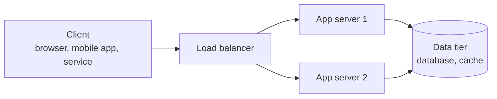

# Client-server model

The client-server model is an architecture where clients (requesters) and servers (providers) communicate over a network to share resources and services.

Almost every system design question starts from this shape, so it is worth being precise about what each side owns.

**Core characteristics:**

- **Role separation**: The client handles user interaction; the server owns data and business logic
- **Request-response interaction**: Clients initiate, servers respond. The server does not call the client unprompted
- **Independent scaling**: Clients and servers are deployed, versioned, and scaled separately

The last point is the reason the model dominates: because the server side is shared infrastructure, it can be scaled, secured, and fixed without touching the millions of clients in the field.

## Client-server vs peer-to-peer

The main alternative is peer-to-peer, where every node acts as both client and server.

| Aspect         | Client-server                                  | Peer-to-peer                                          |
| -------------- | ---------------------------------------------- | ----------------------------------------------------- |
| Roles          | Fixed: requester and provider                  | Every node is both                                    |
| Authority      | Server is the source of truth                  | No single authority; state is replicated among peers  |
| Scaling cost   | Grows with the operator's infrastructure spend | Grows with the number of participants                 |
| Failure impact | Server outage takes everyone down              | Loss of individual peers is usually tolerable         |
| Typical use    | Web apps, APIs, databases, mobile backends     | BitTorrent, blockchain networks, some CDNs and caches |

Interview systems are almost always client-server. Peer-to-peer is worth mentioning only when distribution cost is the dominant constraint (large file distribution, trustless networks); see [peer-to-peer networks](../advanced/04-peer-to-peer-networks.md) for how those systems actually find and exchange data.

## Roles in the model

### Client

- Initiates requests and waits for a response
- Renders the user experience and validates input for usability (never for security)
- Owns local state: UI state, caches, offline data, credentials
- Handles unreliability: timeouts, retries with backoff, and degraded rendering when a call fails

### Server

- Exposes an API contract that clients program against
- Executes business logic and enforces authorization (the client cannot be trusted)
- Reads and writes persistent data
- Is usually one of many identical instances behind a load balancer

### The network between them

The network is the part designers most often forget to budget for. It:

- Resolves a hostname to an address (DNS), then routes packets over IP to a port on the target machine
- Adds latency on every call, and can drop, reorder, or duplicate packets
- Can fail in the ambiguous way: a client that times out does not know whether the server processed the request

The mechanics of resolution, connection setup, and the protocol stack are covered in [network protocols](02-network-protocols.md); the cost of each round trip is covered in [latency and throughput](03-latency-and-throughput.md).

Because a timed-out request may or may not have been applied, write endpoints should be idempotent (or made idempotent with a client-supplied request key) so a retry cannot double-charge a card or create two orders.

## Tiers on the server side

"Server" is rarely a single machine. The common decomposition is three tiers, each scaled and failed over independently.

- **Presentation tier**: The client itself, plus any server-rendered UI or edge/CDN layer in front of it
- **Application tier**: Stateless app servers running business logic. Scaled horizontally by adding instances
- **Data tier**: Databases, caches, and object storage. Scaled with replicas, partitioning, or bigger instances

The tiers matter because they saturate at different times and for different reasons. Adding app servers does nothing if the bottleneck is a single primary database, so a good answer names which tier is the constraint before proposing to scale anything.

## State management

The key question is where per-user session and workflow state lives. "Stateless" refers to this session state, not to data in general: a stateless server still reads and writes a database, it just keeps nothing about a specific client between requests.

### Stateless servers

Each request carries all the context needed to serve it, for example an auth token plus parameters.

Pros:

- Any instance can serve any request, so load balancing and horizontal scaling are trivial
- Failover, autoscaling, and rolling deploys are just adding and removing instances
- No session data is lost when an instance dies

Cons:

- Metadata such as tokens and identifiers is repeated on every request
- Context that would have been cached in memory must be re-fetched or re-validated per request

### Stateful servers

The server keeps session or workflow state in memory between requests.

Pros:

- Avoids re-fetching context on every request
- Necessary for genuinely long-lived connections such as WebSockets, game sessions, or streaming

Cons:

- Requests must be routed back to the instance holding the state
- Losing an instance loses the sessions it held
- Scaling and deploys are disruptive, because draining an instance means migrating or dropping live sessions

### Where session state can live

| Approach             | Where state lives                                                   | Trade-off                                                                 |
| -------------------- | ------------------------------------------------------------------- | ------------------------------------------------------------------------- |
| In-process memory    | The instance that handled the request                               | Fastest, but the session dies with the instance                           |
| Sticky sessions      | In-process, with the load balancer pinning a client to one instance | Keeps the speed, but skews load and still loses state on instance failure |
| Shared session store | An external cache or database (Redis, DynamoDB)                     | Any instance can serve any request; adds a network hop and a dependency   |
| Client-held token    | The client, in a signed token or cookie                             | No server storage at all; hard to revoke early and limited in size        |

The usual default is a shared session store or a signed token, which keeps app servers stateless. Sticky sessions are a fallback when neither is practical.

## Interview talking points

- Who is the client, and what are the request patterns (requests per second, burstiness, payload sizes)?
- Where does session state live, and what breaks when an app server is lost?
- How are ambiguous failures handled (timeouts, retries with backoff, idempotency keys)?
- Which tier saturates first, and how do the application and data tiers scale independently?
- Does anything require a long-lived connection, and does that force statefulness?
