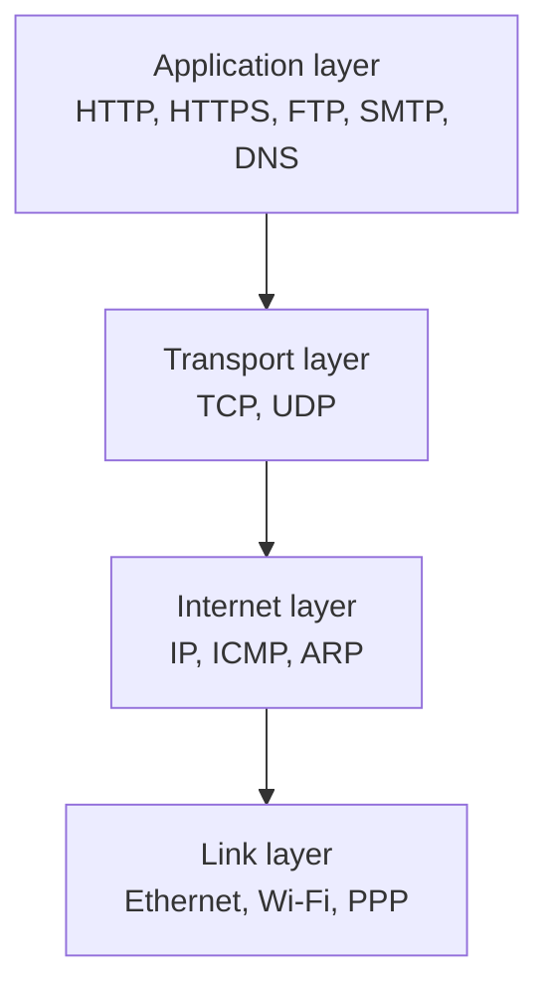
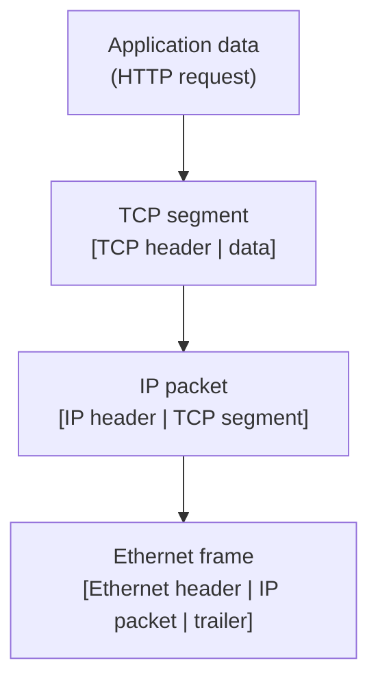
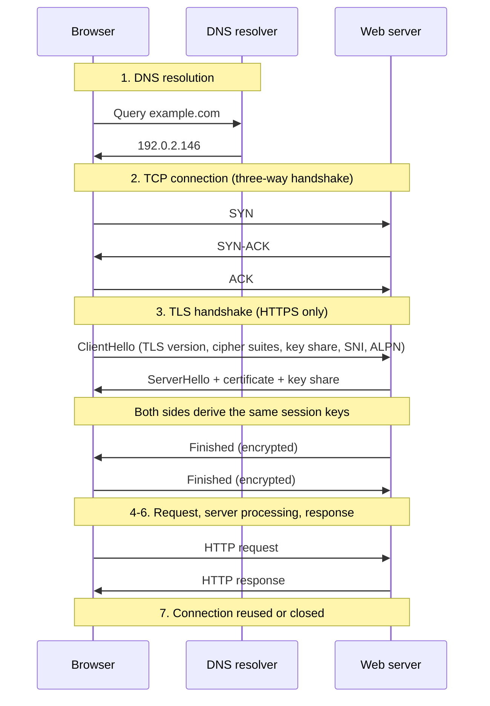

# Network protocols

Network protocols define how two machines exchange data across a network. The [client-server model](01-client-server.md) assumes a network sits between the client and the server; this note is about what that network actually does, and what it costs.

Two things matter most in a design discussion: which transport you pick (TCP or UDP), and how many round trips you spend before the first byte of useful data arrives.

## TCP/IP network model

The TCP/IP model splits communication into four layers. Each layer talks only to the layer directly above and below it, so a change at one layer (swapping Wi-Fi for Ethernet, or TCP for QUIC) does not force changes everywhere else.

### The four layers

| Layer       | Responsibility                                                                          | Addresses by     | Protocols                       |
| ----------- | --------------------------------------------------------------------------------------- | ---------------- | ------------------------------- |
| Application | Defines message semantics and data formats for a specific service                       | Hostname and URL | HTTP/HTTPS, FTP, SMTP, DNS, SSH |
| Transport   | Delivers data to the right process on the host; adds ordering, flow control, or neither | Port number      | TCP (reliable), UDP (fast)      |
| Internet    | Routes packets hop by hop across networks; handles addressing and fragmentation         | IP address       | IP (IPv4/IPv6), ICMP, ARP       |
| Link        | Moves frames across one physical hop                                                    | MAC address      | Ethernet, Wi-Fi, PPP            |

The OSI model is the older seven-layer version of the same idea. Interviewers occasionally ask for it, but real systems are described in TCP/IP terms, and "layer 4" (transport) and "layer 7" (application) are the two labels that come up constantly when discussing [load balancers](13-load-balancing.md) and [proxies](12-proxies.md).

## TCP vs UDP

The transport layer is the first real design choice. TCP gives you a reliable, ordered byte stream at the cost of setup and retransmission; UDP gives you unreliable datagrams and lets the application decide what reliability it actually needs.

| Aspect             | TCP                                                | UDP                                                    |
| ------------------ | -------------------------------------------------- | ------------------------------------------------------ |
| Connection         | Handshake before any data is sent                  | Connectionless; send immediately                       |
| Delivery           | Guaranteed, retransmitted on loss                  | Best effort; packets may be lost                       |
| Ordering           | Bytes arrive in send order                         | No ordering guarantee                                  |
| Congestion control | Built in; slows down under loss                    | None by default; the application must behave           |
| Overhead           | 20-byte header plus connection state per peer      | 8-byte header, no per-peer state                       |
| Failure mode       | Delay (a lost packet stalls everything behind it)  | Loss (missing data simply never arrives)               |
| Typical use        | HTTP/1.1 and HTTP/2, databases, RPC, file transfer | DNS, video and voice, gaming, metrics, QUIC and HTTP/3 |

The distinction that matters in an interview is the failure mode, not the feature list. TCP converts packet loss into latency, because everything behind a lost segment waits for the retransmission. UDP converts packet loss into missing data, which is the right trade for a live voice call where a 200 ms-old audio frame is worthless anyway.

"UDP is unreliable" does not mean "UDP is unusable". QUIC, the transport under [HTTP/3](04-http-versions.md), runs on UDP and rebuilds reliability, ordering, and congestion control in user space, where it can apply them per stream instead of to one connection-wide byte stream.

## Data encapsulation

Data travels down the stack on the way out and back up on the way in. Each layer wraps the unit from the layer above with its own header (and, at the link layer, a trailer), then hands it down.

| Layer       | Unit             | Key header fields                                                             | What those fields buy                         |
| ----------- | ---------------- | ----------------------------------------------------------------------------- | --------------------------------------------- |
| Application | Message          | Protocol-specific (HTTP method, path, headers)                                | Service semantics                             |
| Transport   | Segment/datagram | Source and destination ports, sequence and ACK numbers, window size, checksum | Delivery to a process, ordering, flow control |
| Internet    | Packet           | Source and destination IP, TTL, protocol, fragment info                       | End-to-end routing across networks            |
| Link        | Frame            | Source and destination MAC, frame type, CRC                                   | Delivery across one physical hop              |

Two practical consequences:

- First, headers are pure overhead: a 100-byte API response carries about 40 bytes of TCP and IPv4 headers on top of it, more with IPv6 or TCP options, which is why chatty protocols waste bandwidth (see [goodput](03-latency-and-throughput.md)).
- Second, every link has a maximum transmission unit (typically 1500 bytes on Ethernet); packets larger than the smallest MTU on the path get fragmented or dropped, which is a classic source of "works on my network" bugs.

## What happens when you type `example.com` in your browser?

This is the most common networking interview question, and it is really a question about how many round trips a page load costs.

### Step 1: DNS resolution

The browser needs an IP address before it can open a connection. It checks a chain of caches first: browser cache, OS resolver cache, then the configured recursive resolver (usually the router or the ISP). Only a cache miss goes to the network.

On a miss, the recursive resolver walks the hierarchy: a root server points it at the `.com` TLD servers, which point it at the authoritative name server for `example.com`, which returns the A record (IPv4) or AAAA record (IPv6). Each record carries a TTL that controls how long it can be cached — short TTLs make failover and traffic shifting fast, long TTLs cut resolution latency.

DNS runs over UDP by default, precisely because a single small query and reply do not justify a TCP handshake.

### Step 2: TCP connection establishment

The three-way handshake (SYN, SYN-ACK, ACK) synchronizes sequence numbers and confirms both directions work before any application data is sent. It costs one round trip: the client can send its request along with the final ACK.

### Step 3: TLS handshake (HTTPS only)

TLS negotiates a cipher suite, authenticates the server through its certificate chain, and derives session keys. TLS 1.3 completes this in one round trip (TLS 1.2 needed two), and can resume a previous session in zero round trips.

Two fields in the `ClientHello` matter for system design:

- **SNI (Server Name Indication)**: Names the host being requested, so one IP can terminate TLS for many domains
- **ALPN (Application-Layer Protocol Negotiation)**: Agrees on the application protocol during the handshake, which is how a client and server settle on HTTP/2 instead of HTTP/1.1 without an extra round trip

### Steps 4-6: Request, processing, response

The browser sends an HTTP request (method, path, and headers such as `Host`, `Accept`, cookies, and auth tokens). The server routes it, runs business logic, queries databases and caches, and returns a status code, headers, and body. The browser then follows redirects, applies caching directives, decompresses the body (gzip or brotli), and parses and renders it, issuing further requests for the subresources it discovers.

### Step 7: Connection reuse or close

Modern clients keep the connection open and send subsequent requests on it, because the DNS, TCP, and TLS costs above are paid per connection, not per request. How that reuse works — keep-alive, multiplexed streams, or QUIC — is what separates the HTTP versions, covered in [HTTP versions evolution](04-http-versions.md).

### The round-trip budget

Adding it up on a link with a 50 ms round-trip time (RTT), a cold HTTPS page load spends roughly:

| Phase                     | Round trips                | Cost at 50 ms RTT |
| ------------------------- | -------------------------- | ----------------- |
| DNS resolution            | 1 (0 when cached)          | 50 ms             |
| TCP handshake             | 1                          | 50 ms             |
| TLS 1.3 handshake         | 1 (0 on resumption)        | 50 ms             |
| HTTP request and response | 1                          | 50 ms             |
| Total before first byte   | 4 (1 when fully warmed up) | 200 ms            |

That is 200 ms of pure waiting before the server has done any work at all, and it is why connection reuse, DNS and TLS session caching, and edge termination via a [CDN](34-cdn.md) move the needle so much. See [latency and throughput](03-latency-and-throughput.md) for how to reason about these numbers.

## Interview talking points

- Does this workload want TCP or UDP, and is the tolerable failure mode delay or loss?
- How many round trips does a cold request cost, and which of them can be cached, reused, or moved to the edge?
- What DNS TTL does failover require, and what does that TTL cost in resolution latency?
- Where is TLS terminated — at the edge, at the load balancer, or at the origin — and is traffic re-encrypted after that?
- Is the bottleneck the network path itself or the server behind it? Naming the wrong one leads to the wrong fix.

## Reference materials

- [RFC 9293 - Transmission Control Protocol (TCP)](https://www.rfc-editor.org/rfc/rfc9293)
- [RFC 768 - User Datagram Protocol (UDP)](https://www.rfc-editor.org/rfc/rfc768)
- [RFC 791 - Internet Protocol (IPv4)](https://www.rfc-editor.org/rfc/rfc791)
- [RFC 8200 - Internet Protocol, Version 6 (IPv6)](https://www.rfc-editor.org/rfc/rfc8200)
- [RFC 1034 - Domain Names: Concepts and Facilities](https://www.rfc-editor.org/rfc/rfc1034)
- [RFC 1035 - Domain Names: Implementation and Specification](https://www.rfc-editor.org/rfc/rfc1035)
- [RFC 8446 - The Transport Layer Security (TLS) Protocol Version 1.3](https://www.rfc-editor.org/rfc/rfc8446)
- [RFC 9000 - QUIC: A UDP-Based Multiplexed and Secure Transport](https://www.rfc-editor.org/rfc/rfc9000)
