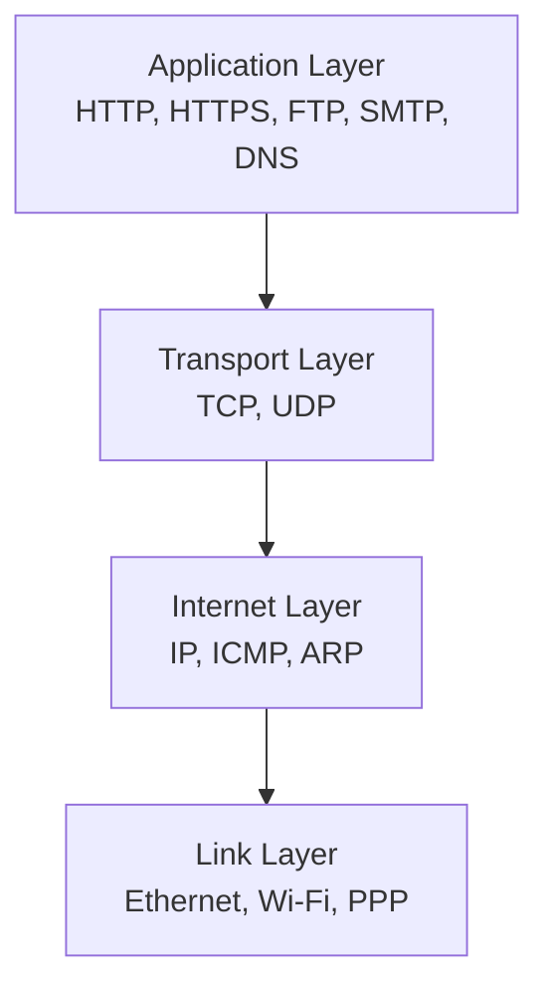
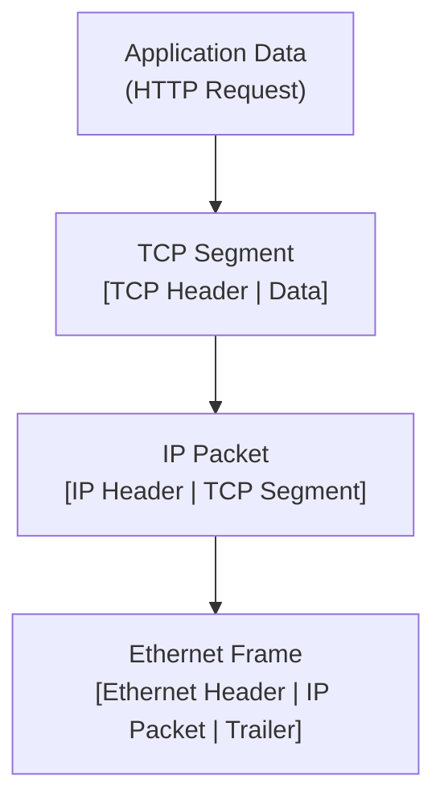
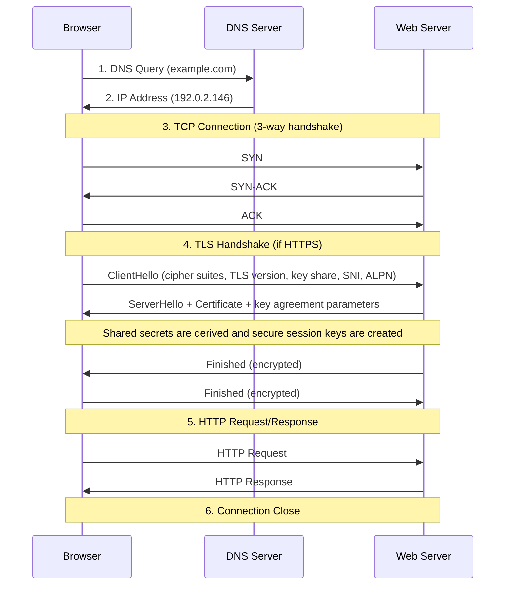

# Network protocols

Network protocols define how devices communicate across networks.

## TCP/IP network model

The TCP/IP model provides a layered approach to network communication, with each layer serving specific functions.

### The four layers

| Layer       | Function                                                                                       | Protocols                       |
| ----------- | ---------------------------------------------------------------------------------------------- | ------------------------------- |
| Application | Provides network services to applications; handles user interfaces and data formatting         | HTTP/HTTPS, FTP, SMTP, DNS, SSH |
| Transport   | Ensures reliable end-to-end communication; handles flow control, error detection, and recovery | TCP (reliable), UDP (fast)      |
| Internet    | Routes packets across networks; handles addressing and fragmentation                           | IP (IPv4/IPv6), ICMP, ARP       |
| Link        | Manages physical network connections; handles frame transmission and error detection           | Ethernet, Wi-Fi, PPP            |

## Data encapsulation process

Each layer adds its own header (and sometimes trailer) to the data from the layer above.

### Encapsulation steps

**1. Application Layer**

- **Data**: HTTP request, email message, file content
- **Format**: Protocol-specific (JSON, HTML, binary)

**2. Transport Layer**

- **TCP segments**: Include sequence numbers, acknowledgment numbers, window size
- **UDP datagrams**: Include source/destination ports, length, checksum
- **Adds**: Port information, flow control, error detection

**3. Internet Layer**

- **IP packets**: Include source/destination IP addresses, TTL, protocol type
- **Adds**: Routing information, fragmentation control, quality of service

**4. Link Layer**

- **Frames**: Include source/destination MAC addresses, frame type, CRC
- **Adds**: Physical addressing, error detection, frame boundaries

## What happens when you type `example.com` in your browser?

### Detailed steps

**1. DNS Resolution**

- Browser checks cache (browser → OS → router → ISP)
- DNS query for A record (IPv4) or AAAA record (IPv6)

**2. TCP Connection Establishment**

- Three-way handshake (SYN → SYN-ACK → ACK)
- Establishes reliable communication channel

**3. TLS Handshake (HTTPS only)**

- Certificate verification and cipher negotiation
- Establishes encrypted communication (TLS 1.3 in modern deployments)

**4. HTTP Request**

- Includes headers (Host, User-Agent, Accept, etc.)
- May include cookies, authentication tokens

**5. Server Processing**

- Route handling, business logic execution
- Database queries, cache lookups

**6. HTTP Response**

- Status code, headers, body content
- Caching directives, content encoding

**7. Response Processing**

- Parse headers (redirects, caching, compression)
- Decompress content (gzip, brotli)
- Render content (HTML parsing, CSS, JavaScript)

**8. Connection Management**

- **HTTP/1.1**: Keep-alive or close
- **HTTP/2**: Multiplexed streams
- **HTTP/3**: QUIC protocol over UDP

## Reference materials

- [RFC 9293 - Transmission Control Protocol (TCP)](https://www.rfc-editor.org/rfc/rfc9293)
- [RFC 768 - User Datagram Protocol (UDP)](https://www.rfc-editor.org/rfc/rfc768)
- [RFC 791 - Internet Protocol (IPv4)](https://www.rfc-editor.org/rfc/rfc791)
- [RFC 8200 - Internet Protocol, Version 6 (IPv6)](https://www.rfc-editor.org/rfc/rfc8200)
- [RFC 1034 - Domain Names: Concepts and Facilities](https://www.rfc-editor.org/rfc/rfc1034)
- [RFC 1035 - Domain Names: Implementation and Specification](https://www.rfc-editor.org/rfc/rfc1035)
- [RFC 8446 - The Transport Layer Security (TLS) Protocol Version 1.3](https://www.rfc-editor.org/rfc/rfc8446)
- [RFC 9110 - HTTP Semantics](https://www.rfc-editor.org/rfc/rfc9110)
- [RFC 9114 - HTTP/3](https://www.rfc-editor.org/rfc/rfc9114)
- [RFC 9000 - QUIC: A UDP-Based Multiplexed and Secure Transport](https://www.rfc-editor.org/rfc/rfc9000)
