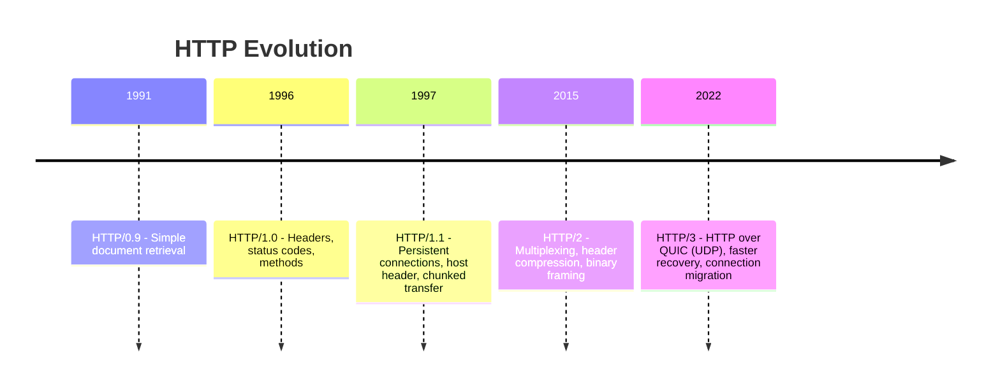

# HTTP Versions Evolution

HTTP has evolved from a simple text protocol to a multiplexed, secure, low-latency transport for modern web applications.

This note summarizes what each major version introduced and why it matters in system design.

## Version Timeline

## HTTP/0.9

**What it introduced:**

- Single method: `GET`
- Response body only (no headers, no status codes)
- One request per TCP connection

**Why it matters:**

- Established the basic client-server request-response model for the web
- Too limited for modern APIs and rich metadata

## HTTP/1.0

**What it introduced:**

- Multiple methods (`GET`, `POST`, `HEAD`)
- Request/response headers
- Status codes (for example, `200`, `404`)
- Media type handling via `Content-Type`

**Why it matters:**

- Made HTTP practical for dynamic content and APIs
- Still inefficient because connections were typically short-lived

## HTTP/1.1

**What it introduced:**

- Persistent connections (`keep-alive` by default)
- `Host` header for virtual hosting (many domains on one IP)
- Chunked transfer encoding (stream without known full size)
- Better caching and conditional requests (`ETag`, `If-Modified-Since`)
- Range requests for partial content delivery

**Why it matters:**

- Became the long-term default web protocol
- Major performance improvement over HTTP/1.0
- Still suffers from head-of-line blocking at application layer when pipelining is not effective

### Persistent Connections (HTTP/1.1)

Instead of opening a new TCP connection for every request, client and server reuse the same connection for multiple requests.

- Why useful: avoids repeated TCP/TLS setup cost
- Impact: lower latency and less CPU/network overhead

### Chunked Transfer Encoding (HTTP/1.1)

Server sends a response in pieces ("chunks") when total response size is unknown at start.

- Example: streaming generated HTML/report rows while backend is still computing
- Why useful: user starts receiving data earlier

### HTTP Pipelining (HTTP/1.1, rarely used)

Client can send multiple requests on one connection without waiting for each response first.

- Limitation: responses must still return in order
- Practical issue: one slow response can block later ones (application-layer HOL blocking)

## HTTP/2

**What it introduced:**

- Binary framing (instead of plain text)
- Multiplexing many streams over one TCP connection
- Header compression (HPACK)
- Stream prioritization and server push (push has seen limited practical adoption)

**Why it matters:**

- Reduced latency and overhead for pages with many assets
- Better network utilization than HTTP/1.1 in most real scenarios
- Still inherits TCP head-of-line blocking under packet loss

### Multiplexing (HTTP/2)

Many request/response streams share one connection concurrently.

- Unlike pipelining, responses can interleave by stream
- Why useful: page assets (CSS/JS/images/API calls) can flow in parallel

### Binary Framing (HTTP/2)

HTTP/2 encodes messages as compact binary frames instead of plain text lines.

- Why useful: easier and faster for machines to parse
- Enables stream management features such as multiplexing and prioritization

### Header Compression (HTTP/2 - HPACK)

Repeated headers are compressed across requests on the same connection.

- Example: headers like `Cookie`, `User-Agent`, and auth metadata repeat often
- Why useful: significantly reduces overhead for chatty web/app traffic

### TCP Head-of-Line Blocking (HTTP/2 limitation)

Even with HTTP/2 multiplexing, all streams still ride on one TCP connection.
If one TCP packet is lost, later data waits for retransmission.

- Result: tail latency spikes under packet loss

## HTTP/3

**What it introduced:**

- HTTP semantics over QUIC (runs on UDP)
- Independent streams without TCP-level head-of-line blocking
- Faster handshake behavior with TLS 1.3 integrated into QUIC
- Connection migration support (for example, Wi-Fi to mobile network)

**Why it matters:**

- Better tail latency and resilience on lossy/mobile networks
- Improved user experience for real-time and globally distributed workloads
- Operational changes required (UDP handling, middlebox behavior, observability updates)

### QUIC Streams and No TCP HOL Blocking (HTTP/3)

HTTP/3 uses QUIC over UDP with independent streams. Packet loss on one stream does not block unrelated streams.

- Why useful: better performance on lossy/mobile networks

### Connection Migration (HTTP/3/QUIC)

A connection can survive client IP/network changes (for example Wi-Fi -> 5G).

- Why useful: fewer broken sessions during network handoffs

## Interview Talking Points

- HTTP/1.1 -> HTTP/2 mostly improves efficiency through multiplexing and compression.
- HTTP/2 -> HTTP/3 mostly improves behavior under loss and mobility via QUIC.
- HTTP versions keep application semantics familiar while changing transport behavior.
- In practice, systems often run mixed versions based on client and CDN/proxy support.

## Reference Materials

- [RFC 1945 - HTTP/1.0](https://www.rfc-editor.org/rfc/rfc1945)
- [RFC 9112 - HTTP/1.1](https://www.rfc-editor.org/rfc/rfc9112)
- [RFC 7540 - HTTP/2](https://www.rfc-editor.org/rfc/rfc7540)
- [RFC 9114 - HTTP/3](https://www.rfc-editor.org/rfc/rfc9114)
- [RFC 9000 - QUIC Transport](https://www.rfc-editor.org/rfc/rfc9000)
