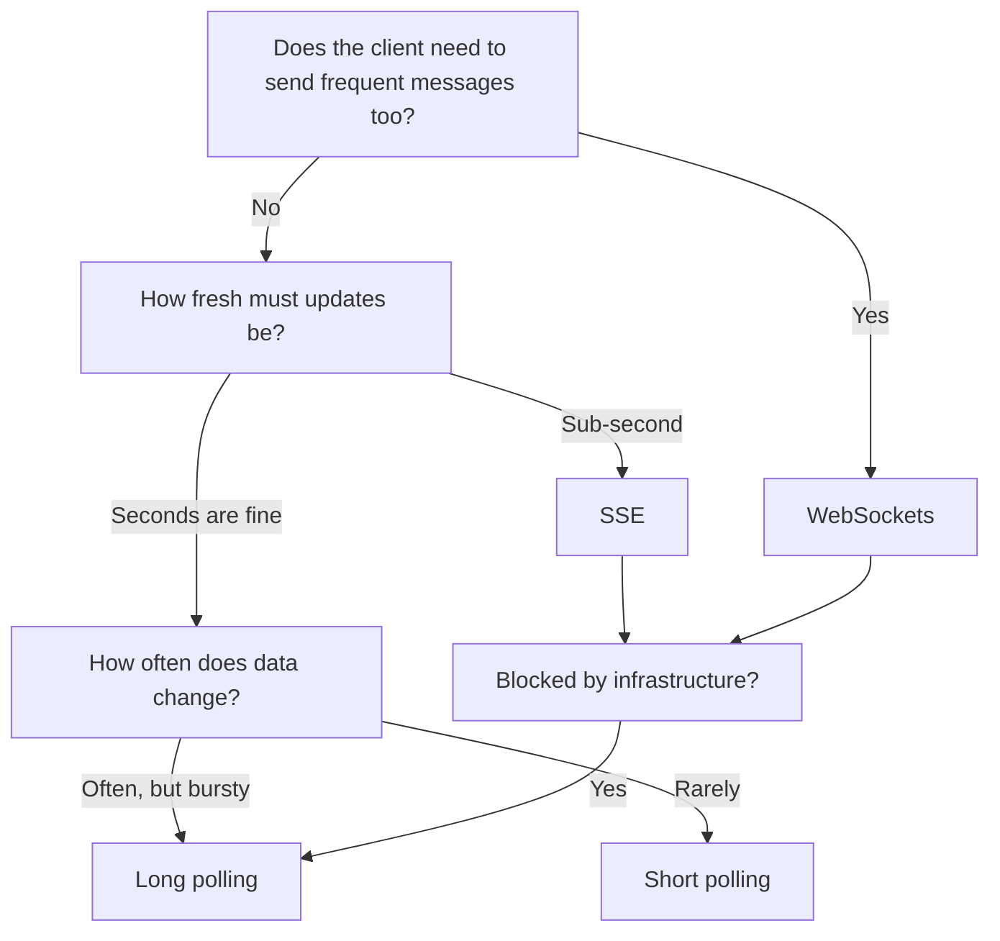
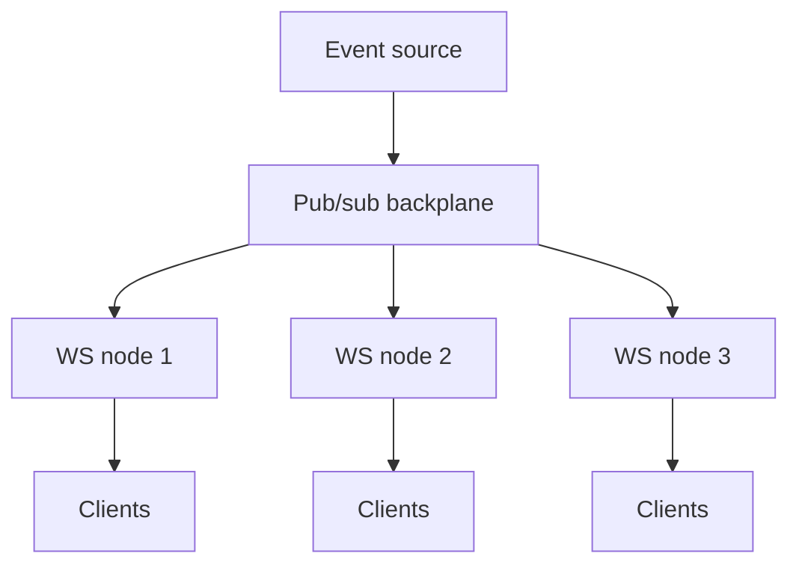

# Real-time communication patterns

HTTP is request-response: the client asks, the server answers. That is a problem when only the server knows there is news. Real-time patterns are the four ways to bridge that gap:

- Ask repeatedly (**short polling**)
- Ask once and let the server hold the request until it has an answer (**long polling**)
- Keep one connection open for server-to-client messages (**Server-Sent Events**)
- Keep one connection open for messages in both directions (**WebSockets**)

They form a ladder: each step lowers update latency and per-message overhead, and each step adds connection state you now have to manage. This document covers the four patterns, how to choose between them, and what breaks in production. For where they sit among all communication patterns, see [Communication Patterns](./06-communication-patterns.md).

## At a glance

| Pattern       | Direction     | Connection      | Update latency     | Server cost per client | Browser support        |
| ------------- | ------------- | --------------- | ------------------ | ---------------------- | ---------------------- |
| Short polling | Client pull   | New per request | Up to the interval | Request rate           | Any HTTP client        |
| Long polling  | Client pull   | Held open       | Near-immediate     | One held request       | Any HTTP client        |
| SSE           | Server push   | Persistent      | Near-immediate     | One open connection    | Native (`EventSource`) |
| WebSockets    | Bidirectional | Persistent      | Near-immediate     | One open connection    | Native (`WebSocket`)   |

## Short polling

The client sends an HTTP request on a fixed interval (for example, every 2-5 seconds).

How it works:

1. Client sends `GET /updates?since=<cursor>`
2. Server returns whatever changed since the cursor, or an empty response
3. Client waits for the interval, then repeats

**Pros:**

- Easiest to implement, debug, and cache; every request is an ordinary stateless HTTP call
- Works through any proxy, firewall, or corporate network that allows HTTP
- No server-side connection state, so any instance can serve any poll

**Cons:**

- Most requests return nothing, wasting bandwidth and backend capacity
- Update delay is bounded by the interval, so lowering latency means multiplying request volume
- Cost scales with clients multiplied by frequency, independent of how often data actually changes

**Best fit:** Low-frequency updates, admin dashboards, integrations where a few seconds of delay is acceptable.

Send a cursor or `If-None-Match` so unchanged polls return `304 Not Modified` with no body. That removes most of the bandwidth cost, though not the request cost.

## Long polling

The client opens a request and the server holds it open until an update exists or a timeout fires. The client then immediately opens the next request.

How it works:

1. Client sends `GET /updates?since=<cursor>`, and the server does not respond yet
2. Server waits for a matching event, or until its timeout (commonly 30-60 seconds)
3. Server responds with the update, or an empty response on timeout
4. Client immediately issues the next request

**Pros:**

- Near-immediate delivery without a new protocol; it is still plain HTTP
- Far fewer empty responses than short polling
- Degrades gracefully: a timeout looks like an ordinary slow request

**Cons:**

- The server holds an open request per client, so it needs asynchronous request handling rather than a thread per connection
- Every delivered message costs a full HTTP round trip to re-establish the next poll, which is wasteful at high message rates
- Proxy and load balancer idle timeouts must be longer than the server's hold time, or requests get cut mid-wait

**Best fit:** Notification feeds and status pages where updates are infrequent, or as a fallback when infrastructure blocks persistent connections.

## Server-sent events (SSE)

A persistent one-way HTTP stream from server to client using the `text/event-stream` content type. The connection stays open and the server writes events into it as they occur.

How it works:

1. Client opens `GET /events` (the browser's `EventSource` sets `Accept: text/event-stream`)
2. Server responds with `Content-Type: text/event-stream` and keeps the response body open
3. Server writes events as they happen, each as `id:`, `event:`, and `data:` lines
4. On a dropped connection the browser reconnects automatically, sending `Last-Event-ID` so the server can resume

**Pros:**

- Native browser support with automatic reconnection and built-in resume via event IDs
- Ordinary HTTP: works with existing auth, compression, and observability, and needs no protocol upgrade
- Much cheaper than long polling at high message rates, since one connection carries many events

**Cons:**

- One-way only; client-to-server actions still go over normal HTTP requests
- Text only (UTF-8), so binary payloads must be encoded, for example as base64
- Over HTTP/1.1 a browser allows only about six connections per origin, and an open stream occupies one of them. HTTP/2 multiplexing removes that limit, so serve SSE over HTTP/2 where possible (see [HTTP Versions](./04-http-versions.md))
- Intermediaries that buffer responses will hold events back, so buffering must be disabled on the path

**Best fit:** Live dashboards, price tickers, notification feeds, progress and log streams, LLM token streaming. Any case where the server does the talking and the client occasionally acts through REST.

## WebSockets

A full-duplex, persistent, message-oriented connection established by upgrading an HTTP request.

How it works:

1. Client sends a `GET` with `Upgrade: websocket` and `Connection: Upgrade`
2. Server accepts with `101 Switching Protocols`, and the TCP connection leaves HTTP behind
3. Both sides send framed messages at any time, text or binary
4. Either side closes, or the connection dies and the client reconnects

**Pros:**

- Lowest per-message overhead: a few bytes of framing instead of HTTP headers
- Genuinely bidirectional, so client-initiated events do not need a separate request path
- Carries binary frames natively, which suits protocols like Protobuf and MessagePack

**Cons:**

- No automatic reconnection, no resume, and no message acknowledgement; you build all of it
- The connection is stateful, so scaling requires sticky routing or a shared fan-out layer, and deploys drop every live connection
- HTTP semantics are gone after the upgrade: no per-message caching, status codes, or standard retry behavior
- Some corporate proxies still block or mangle the upgrade

**Best fit:** Chat, collaborative editing, multiplayer games, trading interfaces, anything with frequent client-initiated messages.

## How to choose

Practical defaults:

- Start with short polling. It is the cheapest thing that can work, and it is often enough.
- Move to SSE when updates must feel instant and the flow is server-to-client. It is the least expensive step up.
- Reach for WebSockets only when the client also sends frequently. Bidirectionality is the deciding factor, not latency.
- Keep long polling as the compatibility fallback when persistent connections are blocked.

Questions worth asking before deciding:

- One-way or two-way?
- Required freshness: seconds or milliseconds?
- Message frequency and payload size, and whether payloads are binary
- Client environment: browser, mobile, or server-to-server
- Infrastructure constraints: proxies, load balancer idle timeouts, corporate firewalls

## Scaling persistent connections

Polling scales like any stateless HTTP endpoint. Persistent connections do not, because each client is now pinned to one server process.

Two problems appear together:

- **Connection capacity**: each open connection costs a file descriptor plus socket and application buffers, so a single node typically handles tens of thousands of idle connections, not millions. Capacity planning is connection count first, message rate second.
- **Fan-out across nodes**: an event produced on node A must reach subscribers connected to nodes B and C. Nodes do not know each other's clients.

The standard answer is a shared pub/sub backplane. Application servers publish events to a broker and each node forwards only to the clients it holds, so no node needs the full connection table.

See [Pub/Sub](./30-pub-sub.md) for the fan-out model and [Load Balancing](./13-load-balancing.md) for connection-aware routing.

Related scaling notes:

- Balance on connection count, not request count; least-connections beats round robin when connections are long-lived
- Sticky sessions keep a client on one node, but they make deploys and node loss more disruptive; a backplane is usually the better default
- Deploys and scale-in events disconnect everyone at once, so stagger restarts and add jitter to client reconnects

## Operational considerations

- **Idle timeouts**: proxies, load balancers, and NAT devices close connections that look idle. Set the timeout above your heartbeat interval on every hop; see [Proxies](./12-proxies.md).
- **Heartbeats**: send a periodic ping (a WebSocket ping frame, or an SSE comment line such as `: keep-alive`) so both sides detect a dead peer and intermediaries see traffic.
- **Reconnect with backoff and jitter**: after a node restart, every client reconnects at once. Exponential backoff plus randomized jitter prevents the thundering herd.
- **Resume, do not restart**: track a cursor or event ID per client so a reconnect replays only what was missed. SSE gives this with `Last-Event-ID`; WebSocket applications must implement it.
- **Backpressure**: a slow client cannot drain its buffer. Bound the per-connection queue and choose a policy explicitly: drop intermediate updates, coalesce to the latest state, or disconnect the client. An unbounded buffer turns one slow client into an out-of-memory failure.
- **Authentication and expiry**: a connection authenticated once can outlive its token. Re-authenticate periodically or cap connection lifetime, and remember that browsers cannot set headers on `EventSource` or `WebSocket` handshakes, so tokens travel as cookies, query parameters, or a first message.
- **Observability**: track open connections, connect and disconnect rates, messages per second, per-connection queue depth, and reconnect storms.

## Interview talking points

- Frame the choice by directionality first: one-way is SSE, two-way is WebSockets. Latency alone does not justify WebSockets.
- Say why polling is not free: cost scales with clients multiplied by interval, whether or not anything changed.
- Persistent connections turn a stateless tier into a stateful one; call out the backplane, sticky routing, and deploy impact.
- Mention connection lifecycle explicitly: heartbeat, timeout, reconnect with jitter, and resume from a cursor.
- Give a capacity number: connections per node times node count, and message fan-out rate.

## Reference materials

- [MDN - Server-sent events](https://developer.mozilla.org/en-US/docs/Web/API/Server-sent_events)
- [MDN - The WebSocket API](https://developer.mozilla.org/en-US/docs/Web/API/WebSockets_API)
- [RFC 6455 - The WebSocket Protocol](https://www.rfc-editor.org/rfc/rfc6455)
- [WHATWG HTML - Server-sent events](https://html.spec.whatwg.org/multipage/server-sent-events.html)
