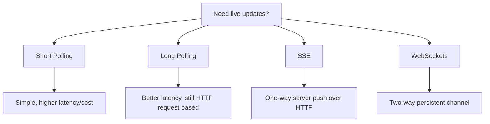

# Real-time communication patterns

Real-time communication patterns let clients receive updates quickly without constantly reloading pages or polling aggressively.

The main choice is how the client gets new data:

- Pull repeatedly (polling)
- Hold a request open until data arrives (long polling)
- Keep a persistent connection for server push (SSE/WebSockets)

## Pattern overview

## Short polling

Client sends HTTP requests on a fixed interval (for example, every 2-5 seconds).

How it works:

1. Client: `GET /updates`
2. Server returns current state (or empty)
3. Client waits interval, repeats

Pros:

- Easiest to implement and debug
- Works everywhere (HTTP, proxies, firewalls)

Cons:

- Wasted requests when nothing changed
- Update delay bounded by polling interval
- Higher server load at scale

Best fit:

- Admin dashboards with low update frequency
- Simple integrations where near-real-time is enough

## Long polling

Client opens a request, and the server holds it open until an update exists (or a timeout occurs). The client then immediately opens another request.

How it works:

1. Client: `GET /updates` (kept open)
2. Server waits until event arrives or timeout
3. Server responds with update (or heartbeat)
4. Client immediately sends next long poll request

Pros:

- Lower latency than short polling
- Fewer empty responses
- Still uses plain HTTP

Cons:

- Many open connections to manage
- Timeouts/reconnect logic needed
- Less efficient than true push channels at very high scale

Best fit:

- Notification feeds, live status pages
- When WebSockets are hard due to infrastructure constraints

## Server-sent events (SSE)

Persistent one-way HTTP stream from server to client using `text/event-stream`.

How it works:

1. Client opens `GET /events` with SSE headers
2. Server keeps connection open
3. Server pushes events as they happen
4. Browser/client auto-reconnects on disconnect

Pros:

- Native browser support
- Simple server-to-client push over HTTP
- Automatic reconnection behavior
- Works well with HTTP/2

Cons:

- One-way only (server -> client)
- Client updates still need normal HTTP requests
- Some proxies/load balancers need careful timeout configuration

Best fit:

- Live dashboards, stock tickers, progress streams
- Server push with occasional client actions via REST

## WebSockets

Full-duplex persistent connection after an HTTP upgrade handshake.

How it works:

1. Client starts with HTTP upgrade request
2. Connection switches to WebSocket protocol
3. Both sides can send messages anytime
4. Connection stays open until closed

Pros:

- Low latency, bidirectional communication
- Efficient for high-frequency messages (chat, games, collaboration)
- Single long-lived connection

Cons:

- More complex connection/state management
- Load balancer sticky sessions or shared pub/sub often needed
- Reconnect, heartbeat, and backpressure handling required

Best fit:

- Chat, collaborative editing, multiplayer apps
- High-frequency two-way messaging

## How to choose

Ask:

- One-way or two-way communication?
- Required update latency (seconds vs milliseconds)?
- Message frequency and payload size?
- Client environment (browser/mobile/IoT)?
- Infrastructure constraints (proxies, LB timeouts, firewalls)?

Practical defaults:

- Start with short/long polling for low complexity
- Use SSE for one-way live feeds
- Use WebSockets when bidirectional low-latency is required

## Operational considerations

- Set connection timeouts correctly on proxies and load balancers
- Implement heartbeat/ping to detect dead connections
- Plan reconnect with exponential backoff
- Use backpressure (queue limits, drop/slow policies) under overload
- Scale with pub/sub fan-out when many connected clients exist

## Interview talking points

- Explain the trade-off between simplicity and latency first.
- Match pattern to directionality: SSE (one-way) vs WebSocket (two-way).
- Mention connection lifecycle: reconnect, heartbeat, timeout, fan-out.
- Avoid defaulting to WebSockets unless the interaction truly needs it.

## Reference materials

- [MDN - Server-sent events](https://developer.mozilla.org/en-US/docs/Web/API/Server-sent_events)
- [MDN - WebSockets API](https://developer.mozilla.org/en-US/docs/Web/API/WebSockets_API)
- [RFC 6455 - The WebSocket Protocol](https://www.rfc-editor.org/rfc/rfc6455)
