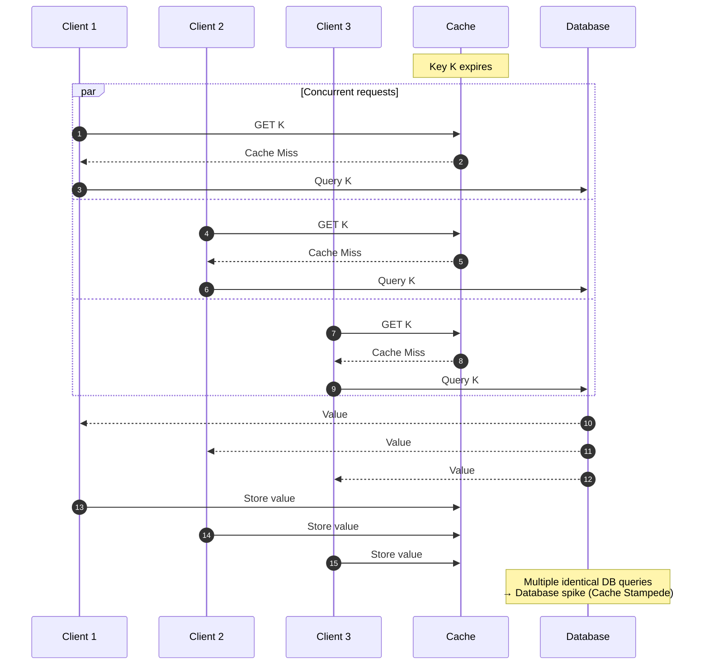
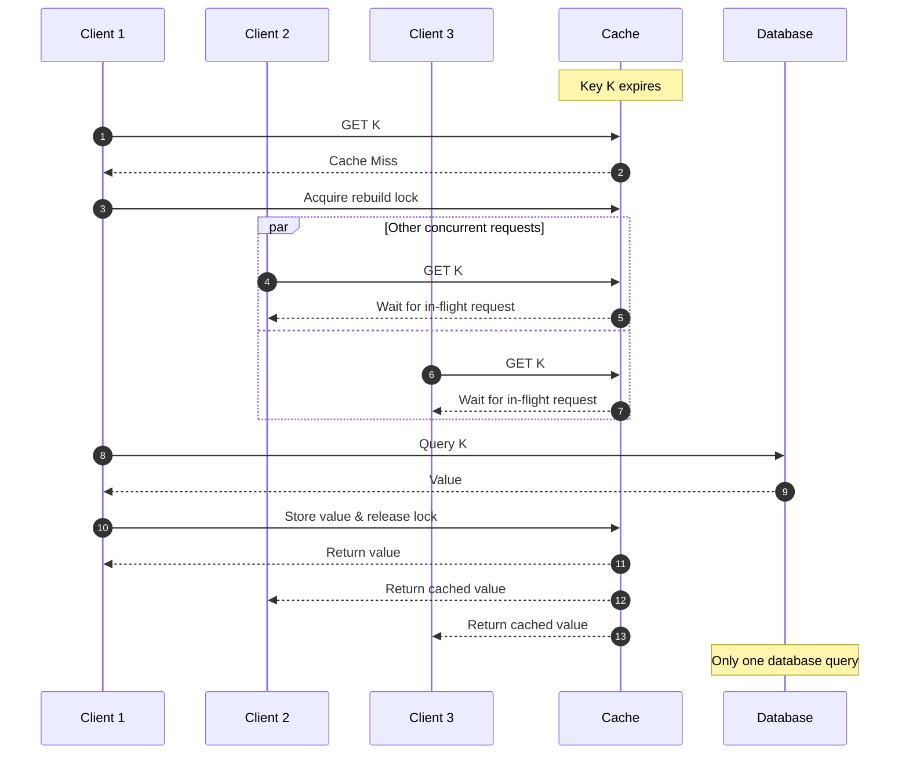

# Caching

Caching stores frequently accessed data in faster storage to reduce latency and backend load.

It is one of the highest-impact performance techniques in system design, but correctness depends on invalidation strategy.

## When to use caching

**Good fit:**

- Read-heavy workloads
- Expensive DB/API/compute reads
- Data that changes slowly or can tolerate staleness

**Poor fit:**

- Strong consistency requirements on every read
- Highly volatile data with low reuse
- Workloads where stale reads cause business risk

## Cache levels

- **Client cache**: Fastest for static assets, limited control
- **CDN/edge cache**: Global read acceleration ([CDN](./34-cdn.md))
- **Application cache**: Redis/Memcached for hot keys
- **Database cache/buffer pool**: Engine-level page caching

## Read patterns

### Cache-aside (lazy loading)

Most common pattern.

1. App checks cache
2. On miss, read DB
3. App writes result to cache
4. Return response

**Pros:**

- Flexible and widely used

**Cons:**

- The application owns cache logic (deciding when and how to update the cache) and consistency

### Read-through

Cache layer loads missing data automatically.

1. App checks cache
2. On miss, cache layer reads data from DB and stores it in the cache
3. Cache layer returns data to app
4. App returns data to client

**Pros:**

- Simpler application code

**Cons:**

- Less control over transformation and failure handling

## Write patterns

### Write-through

Write to cache and DB together.

- Strong freshness
- Higher write latency

### Write-behind (write-back)

Write to cache first, DB asynchronously.

- Better write performance
- Risk during failures if not designed carefully

### Write-around

Write directly to DB, skip cache update.

- Avoids cache pollution for write-heavy, rarely-read data

## Invalidation strategies

- **TTL**: Simple expiration by time
- **Event-based invalidation**: Invalidate on data change events
- **Version/key strategy**: Include version in cache key
- **Manual purge**: For emergency fixes or deploys

Practical approach:

- Use TTL as baseline safety net
- Add explicit invalidation for critical entities

## Replacement policies

When cache is full, choose what to remove:

- **LRU**: Remove least recently used (common default)
- **LFU**: Remove least frequently used
- **TTL-based**: Remove expired entries first

For distributed caches, also plan for hot-key handling and memory limits per node.

## Common cache problems

### Cache penetration

Repeated requests for nonexistent keys bypass the cache and hit the DB.

Mitigation: Bloom filters or negative caching with a short TTL.

> Negative caching means caching the fact that a key does not exist, usually with a short TTL, so repeated requests don't keep hitting the database.

Example for negative caching:

- Request for user: `999999` → DB returns "not found".
- Cache stores "not found" for `30 seconds`.
- Subsequent requests are served from the cache instead of querying the DB again.

### Cache avalanche

Many cached keys expire around the same time (e.g., all with a 1-hour TTL), causing a surge of cache misses and overwhelming the origin data source.

Mitigation:

- TTL jitter: Add a small random offset to expiration times so keys don't expire together.
- Pre-warming: Refresh hot keys before they expire.
- Request coalescing: Let only one request rebuild a missing cache entry while others wait for the result.

### Cache stampede

A cache stampede occurs when a hot (frequently accessed) key expires, causing many concurrent requests to miss the cache and simultaneously query the database to rebuild the same value.

Mitigation:

- Request coalescing / single-flight: Only one request fetches the value; others wait for the result.
- Distributed mutex/lock: Ensure only one process rebuilds the cache entry.
- Stale-While-Revalidate (SWR): Serve stale data while a background task refreshes the cache.
- Pre-warming: Refresh hot keys before they expire.

Example for cache stampede:

With request coalescing:

### Cache pollution

Cache pollution occurs when less frequently accessed data displaces more frequently accessed data in the cache, leading to a reduced cache hit rate.

Mitigation: Eviction policies such as LRU (least recently used) or LFU (least frequently used) help by prioritizing retention of frequently accessed data in the cache.

## Cache metrics

- **Cache hit rate**: The percentage of requests that are served from the cache.
- **Cache miss rate**: The percentage of requests that are not served from the cache.
- **Cache eviction rate**: The percentage of cache entries that are evicted.

## Design guidelines

- Define acceptable staleness per data type
- Keep cache keys deterministic and versioned when needed
- Monitor hit ratio, miss latency, and eviction rate
- Protect origin with timeouts, rate limits, and circuit breakers

## Interview talking points

- Start with read/write ratio and consistency requirements.
- Pick read/write pattern explicitly (usually cache-aside).
- Explain invalidation and failure behavior.
- Mention hot-key and stampede risks for high-traffic systems.
