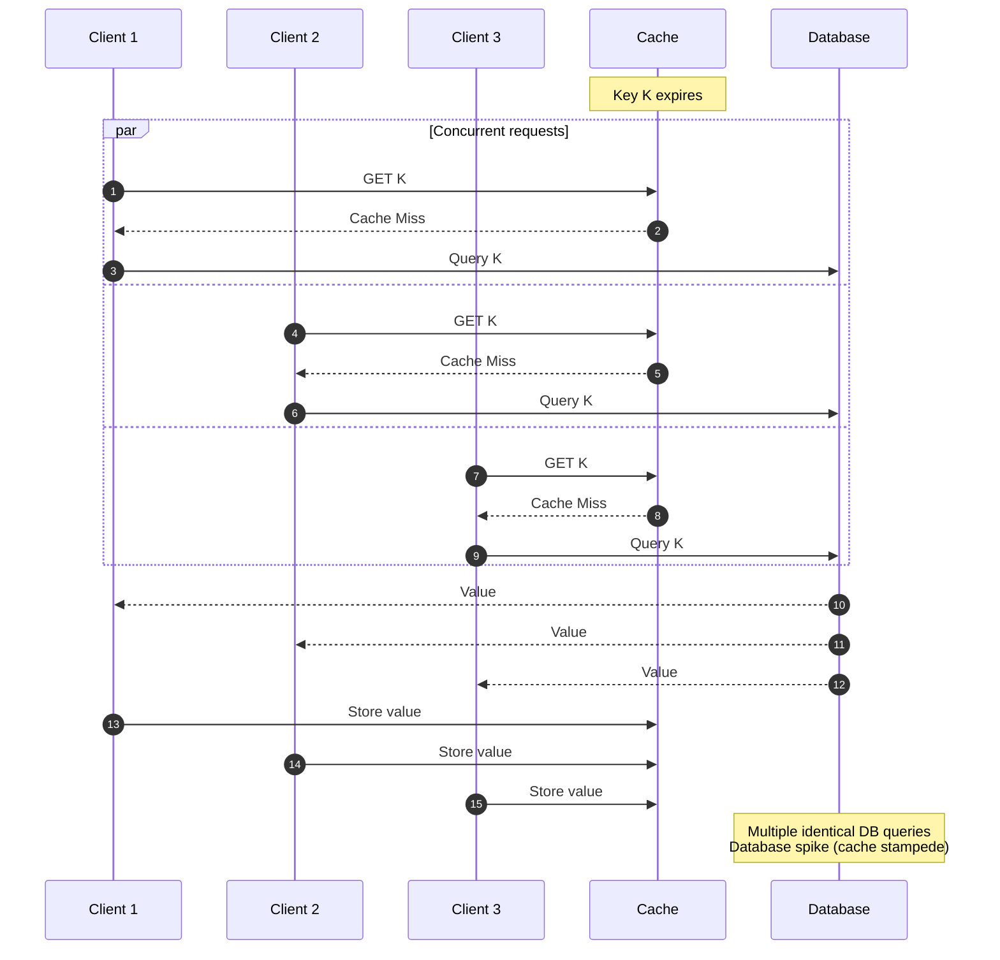
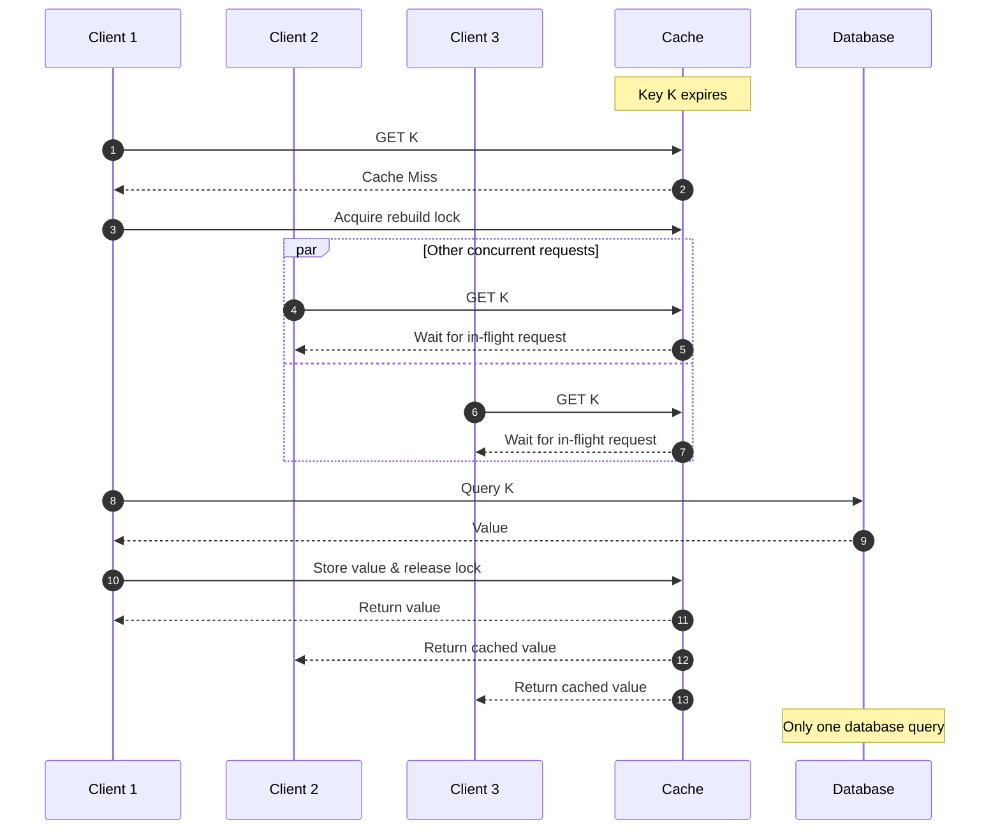

# Caching

Caching keeps a copy of frequently accessed data in faster storage so that reads avoid the slower system that owns it.

It is one of the highest-leverage techniques in system design: it cuts read latency and shields the origin from load, often turning an order-of-magnitude traffic increase into a non-event.

The cost is correctness. A cache is a second copy of the truth, so most cache design decisions are really decisions about how stale that copy may get and who is responsible for fixing it.

## When to use caching

**Good fit:**

- Read-heavy workloads where the same keys are requested over and over
- Expensive reads: multi-join queries, third-party API calls, heavy computation
- Data that changes slowly, or where a few seconds of staleness is acceptable

**Poor fit:**

- Reads that must reflect the latest write, such as a checkout inventory count or a revoked auth token
- Highly volatile data with low reuse, where entries are invalidated before they are ever read again
- Workloads where a stale read creates business or safety risk

Before adding a cache, sanity-check the expected hit rate. A cache that hits 20% of the time buys a small latency win in exchange for an extra network hop, a new failure domain, and a permanent invalidation problem. Caches pay off when the access distribution is skewed — a small set of keys serving most of the traffic.

## Cache levels

A request may pass through several caches before reaching the origin. They trade off in the same direction: the closer a cache sits to the user, the cheaper the hit and the weaker your control over invalidating it.

| Layer                | Where it lives              | Typical contents                       | Invalidation control                                  |
| -------------------- | --------------------------- | -------------------------------------- | ----------------------------------------------------- |
| Client cache         | Browser, mobile app, device | Static assets, API responses           | Weakest: only response headers, no way to force purge |
| CDN / edge cache     | Points of presence          | Static assets, cacheable GET responses | Purge API plus TTL ([CDN](./34-cdn.md))               |
| Application cache    | Shared Redis/Memcached tier | Hot keys, query results, sessions      | Full: the application owns keys and writes            |
| Local process cache  | Application process memory  | Very hot small values, feature flags   | Full, but per-process and hard to purge fleet-wide    |
| Database buffer pool | Database engine memory      | Recently read data and index pages     | None: managed entirely by the engine                  |

Most of this note is about the application cache layer, because that is the one you design explicitly.

## Read patterns

### Cache-aside (lazy loading)

The most common pattern, and the default answer in an interview. The application talks to both the cache and the database.

1. The application checks the cache.
2. On a miss, it reads from the database.
3. It writes the result into the cache with a TTL.
4. It returns the response.

**Pros:**

- Only requested data is cached, so the cache stays small and relevant
- A cache outage degrades to slower reads rather than an outage, since the database path still works

**Cons:**

- The application owns the cache logic and the consistency rules, and every call site must get them right
- Every first read of a key is a miss, so cold starts are slow unless the cache is pre-warmed

### Read-through

The cache sits in front of the database and loads missing data itself, so the application only ever talks to the cache.

1. The application checks the cache.
2. On a miss, the cache layer reads from the database and stores the result.
3. The cache layer returns the value to the application.

**Pros:**

- Simpler application code, with the load logic defined once instead of at every call site
- The cache layer can coalesce concurrent misses for the same key

**Cons:**

- Requires a cache library or proxy that supports it, which is less common than plain cache-aside
- Less control over per-call transformation, timeouts, and failure handling

## Write patterns

### Write-through

Write to the cache and the database in the same operation, and only acknowledge once both succeed.

**Pros:**

- The cache is never stale relative to the database
- Reads after a write always hit

**Cons:**

- Adds the cache write to write latency, and needs a defined behavior when the cache write fails
- Caches data that may never be read, wasting memory on write-heavy workloads

### Write-behind (write-back)

Write to the cache and acknowledge immediately, then flush to the database asynchronously.

**Pros:**

- Very low write latency, and repeated writes to the same key can be batched into one database write

**Cons:**

- Acknowledged writes can be lost if the cache node fails before the flush
- The database is temporarily behind the cache, so anything reading the database directly sees stale data

### Write-around

Write straight to the database and do not populate the cache. The key is loaded on the next read miss.

**Pros:**

- Avoids polluting the cache with write-heavy data that is rarely read back

**Cons:**

- The first read after every write is a miss

### Write-invalidate

Write to the database and delete the cache key rather than updating it. The next read repopulates it through the normal cache-aside path.

This is the pairing most production systems actually use: cache-aside for reads, delete-on-write for writes. Deleting is safer than updating because two concurrent writers cannot leave a stale value behind — the worst case is an extra miss, not a wrong answer.

The remaining race is a read that misses, is overtaken by a write, and then writes its now-stale value into the cache. A short TTL bounds how long that value survives; where it matters, version the cache key or write through a single-flight path.

## Invalidation strategies

- **TTL**: Expire entries after a fixed time. Simple, and it bounds staleness even when every other mechanism fails.
- **Event-based invalidation**: Delete or refresh keys in response to data change events, such as a database change stream or an application event.
- **Versioned keys**: Include a version or content hash in the key, so a new version is a new key and the old one simply ages out. Common for deployable assets and for schema changes.
- **Manual purge**: An operational escape hatch for bad deploys and poisoned entries. Worth building before you need it.

Practical approach: use TTL as the baseline safety net for everything, and add explicit invalidation for the entities where staleness actually hurts. Choosing a TTL means naming the staleness budget for that data — a product catalog can tolerate minutes, a permission check cannot.

## Eviction policies

A cache is a fixed amount of memory, so when it fills, something has to go. This is separate from invalidation: eviction removes entries that are still valid because there is no room for them.

- **LRU**: Evict the least recently used entry. The common default, and a good fit for workloads with temporal locality.
- **LFU**: Evict the least frequently used entry. Better when a stable set of keys is hot over long periods, but slower to adapt to shifts in traffic.
- **FIFO**: Evict the oldest entry regardless of use. Cheap, but it discards hot keys just as readily as cold ones.
- **TTL / random**: Evict expired entries first, then pick victims at random. Cheap to compute and used as a low-overhead approximation of LRU.

A rising eviction rate at a steady hit rate means the working set no longer fits: add memory or shard the tier.

## Distributed cache topology

A single cache node eventually runs out of memory or throughput, so production cache tiers are sharded across nodes. Keys are mapped to nodes with **consistent hashing** rather than `hash(key) % N` (see [Hashing](./16-hashing.md)).

The reason matters for caches specifically. With modulo hashing, adding or losing one node changes `N` and remaps almost every key. Nothing has to physically move, but nearly every key is suddenly looked up on a node that has never seen it, so the tier takes a near-total miss storm and the origin absorbs it all at once. Consistent hashing confines the damage to the keys owned by the departed node.

Other things to plan for in a distributed tier:

- **Hot keys**: Hashing spreads keys uniformly, but it cannot split a single key that is 30% of traffic. Replicate that key across nodes under suffixed aliases, or serve it from a local process cache in front of the shared tier.
- **Per-node memory limits**: Size for the working set plus headroom, and confirm what the eviction policy does when a node fills.
- **Failure behavior**: Decide explicitly whether a cache timeout falls through to the origin or fails the request. Falling through is usually right, but only if the origin has the capacity and the request path has timeouts and circuit breakers ([Resilience](./14-resilience.md)).

## Cache failure modes

### Cache penetration

**Cache penetration** is the failure mode where requests repeatedly ask for keys that do not exist, so every request misses the cache and falls through to the database. Nothing is ever cached, because there is nothing to cache. It shows up naturally with bad client links and deliberately in random-key scans.

Mitigations:

- **Negative caching**: Cache the fact that a key does not exist, with a short TTL so a later insert is picked up quickly.
- **Bloom filter**: Keep an in-memory filter of every key that exists and consult it on a miss, so a "definitely not present" answer short-circuits the database query. See [Bloom Filters](./17-bloom-filters.md) for how the filter works, how to size it, and why deleted keys are the operational catch.
- **Input validation**: Reject structurally impossible identifiers at the edge before they reach the cache at all.

Negative caching example:

- A request arrives for user `999999`; the database returns "not found".
- The cache stores a "not found" marker for that key for 30 seconds.
- Subsequent requests are served from the cache instead of querying the database again.

### Cache stampede

A **cache stampede** happens when a hot key expires and many concurrent requests miss at the same instant, all querying the database to rebuild the same value. The database sees a burst of identical queries for a key that was, moments earlier, costing it nothing.

Mitigations:

- **Request coalescing (single-flight)**: Only the first request rebuilds the value; the rest wait for its result.
- **Distributed lock**: Ensure only one process across the fleet rebuilds a given entry.
- **Stale-while-revalidate**: Serve the expired value while a background task refreshes it, so no request ever waits on the rebuild.
- **Pre-warming**: Refresh hot keys on a schedule shortly before they expire, so they never expire under live traffic.

Without protection, every concurrent miss becomes its own database query:

With request coalescing, one request rebuilds and the rest wait on it:

### Cache avalanche

A **cache avalanche** is the fleet-wide version of a stampede: many unrelated keys expire at roughly the same moment, and the origin absorbs the combined miss traffic for all of them. The usual cause is a bulk load that wrote every key with the same TTL, so they all expire together an hour later. A cache node restarting empty produces the same effect.

Mitigations:

- **TTL jitter**: Add a small random offset to each expiration so keys spread out instead of expiring in lockstep.
- **Pre-warming**: Populate a cold or restarted node before putting it back in rotation.
- **Origin protection**: Rate limits, concurrency caps, and circuit breakers in front of the database so a miss storm degrades service instead of taking the database down ([Rate Limiting](./32-rate-limiting.md), [Resilience](./14-resilience.md)).

Per-key stampede protection also helps here, since an avalanche is many stampedes at once.

### Cache pollution

**Cache pollution** is when infrequently accessed data displaces the hot working set, dropping the hit rate. A one-off analytics scan or a full-table export that reads millions of rows through the cache-aside path is the classic trigger.

Mitigations:

- Prefer an eviction policy that accounts for frequency, such as LFU or a segmented LRU, over plain LRU.
- Route scans and batch jobs around the cache with a write-around or read-around path.
- Give low-value entries a short TTL, or a separate cache namespace with its own memory budget.

## Cache metrics

- **Hit rate**: The share of lookups served from the cache. The headline number, and the one that justifies the cache existing.
- **Miss latency**: How long a miss takes end to end, since it sets the tail latency users actually feel.
- **Eviction rate**: Evictions per second. Rising evictions mean the working set no longer fits in memory.
- **Key count and memory usage**: Tracked against the configured limit, to catch a tier about to start evicting.
- **Origin load**: Queries per second reaching the database. This is what a cache failure shows up in first.

## Design guidelines

- Define an acceptable staleness budget per data type, and let it drive the TTL.
- Keep cache keys deterministic, namespaced, and versioned when the value's schema can change.
- Always set a TTL, even when explicit invalidation exists, so a missed invalidation self-heals.
- Decide up front whether a cache failure falls through to the origin or fails the request, and load-test that path.
- Protect the origin with timeouts, rate limits, and circuit breakers, so a cold cache degrades service instead of ending it.

## Interview talking points

- Start from the read/write ratio and the consistency requirement; they decide whether a cache belongs there at all.
- Name the read and write pattern explicitly. Cache-aside plus delete-on-write is the safe default.
- Say where the cache sits and how entries are invalidated, including what happens when an invalidation is missed.
- Bring up stampede and hot-key risk for high-traffic keys, and consistent hashing as soon as the cache tier is sharded.
- Describe the failure behavior: what the system does when the cache is empty, slow, or unreachable.

## Reference materials

- [Redis Key Eviction Policies](https://redis.io/docs/latest/develop/reference/eviction/)
- [HTTP Caching (RFC 9111)](https://www.rfc-editor.org/rfc/rfc9111.html)
- [Cache Replacement Policies (Wikipedia)](https://en.wikipedia.org/wiki/Cache_replacement_policies)
- [Amazon ElastiCache Caching Strategies](https://docs.aws.amazon.com/AmazonElastiCache/latest/dg/Strategies.html)
