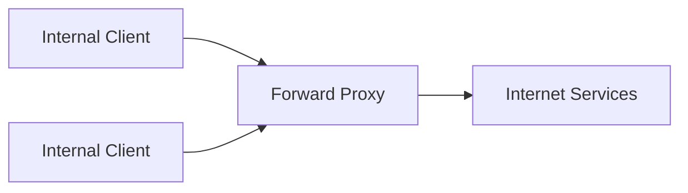
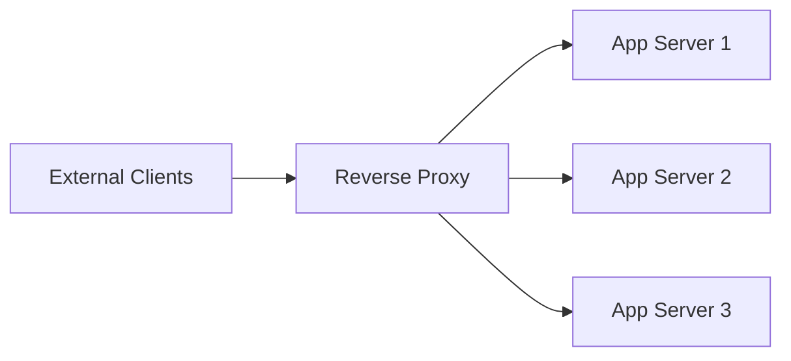

# Proxies

A proxy is an intermediary that sits between clients and servers to control, optimize, or protect traffic.

Proxies are commonly used for security, caching, routing, and protocol handling.

## Forward Proxy vs Reverse Proxy

### Forward Proxy (Client-Side)

Acts on behalf of clients going to the internet.

Typical uses:

- Corporate egress control and filtering
- Hiding internal client identity from external servers
- Centralized outbound policy enforcement

### Reverse Proxy (Server-Side)

Acts on behalf of backend servers facing clients.

Typical uses:

- TLS termination
- Load balancing and health-based routing
- Caching/compression at the edge
- WAF, rate limiting, and request filtering

## CDN (Related Edge Pattern)

A CDN is a geographically distributed reverse-proxy/cache network. For cache keys, pull vs push, origin shields, and invalidation, see [CDN](./32-cdn.md).

Why it helps:

- Serves static and cacheable content closer to users
- Reduces origin load and global latency
- Improves resilience during traffic spikes

## Common Capabilities

- **Security**: Hide backend topology, apply WAF/rate limits
- **Performance**: Cache responses, compress payloads, reuse connections
- **Routing**: Path/host-based routing to different services
- **Observability**: Central request logging and metrics

## Proxy vs Load Balancer

They overlap in practice, but intent differs:

- **Reverse proxy**: Application-aware gateway (security, routing, caching, auth)
- **Load balancer**: Distribute traffic for availability/scale

Many tools (Nginx, HAProxy, Envoy, cloud gateways) can do both.

## Practical Example Flow

1. User requests `https://api.example.com/orders`
2. Reverse proxy terminates TLS
3. Proxy checks auth/rate limits
4. Proxy routes to healthy backend instance
5. Response is cached/compressed if policy allows
6. Client receives response without seeing backend details

## Design Guidelines

- Terminate TLS at edge for operational simplicity
- Keep backend services private where possible
- Use health checks and circuit-aware routing
- Define cache rules explicitly (what can/cannot be cached)
- Log request IDs for traceability across proxy and services

## Interview Talking Points

- Clarify forward vs reverse proxy role in the design.
- Mention why reverse proxy improves security and operability.
- Tie proxy features to latency, availability, and protection goals.
- Distinguish proxy responsibilities from pure load balancing.

## Reference Materials

- [Cloudflare - What is a Reverse Proxy?](https://www.cloudflare.com/learning/cdn/glossary/reverse-proxy/)
- [NGINX Reverse Proxy Guide](https://docs.nginx.com/nginx/admin-guide/web-server/reverse-proxy/)
