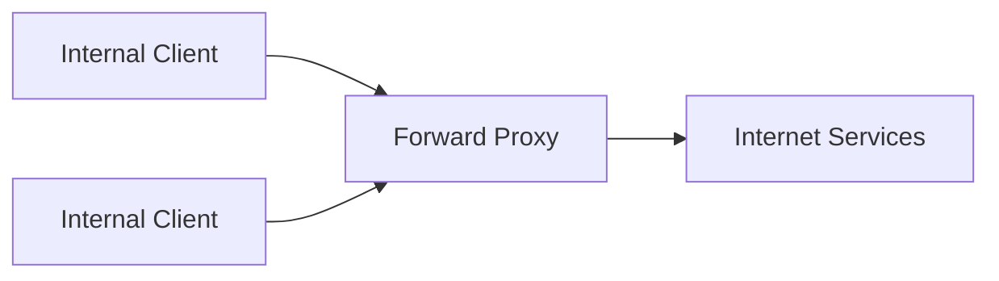
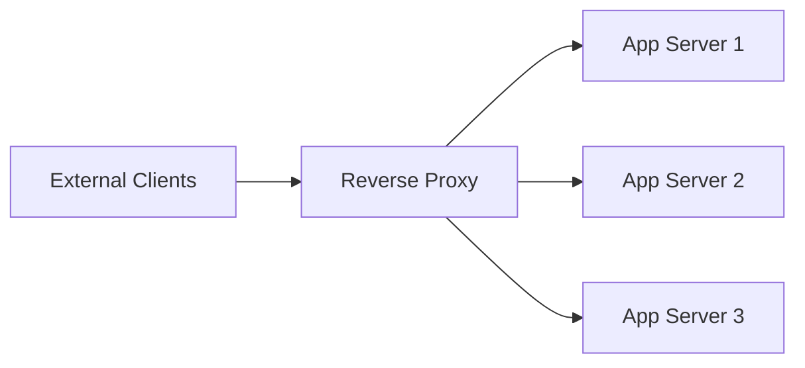
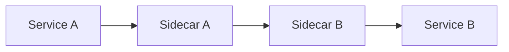

# Proxies

A proxy is an intermediary that sits between clients and servers to control, optimize, or protect traffic.

What distinguishes proxy types is not what they do but *whose behalf they act on*: a forward proxy represents the client, a reverse proxy represents the server, and a sidecar represents one specific service instance.

## Forward proxy (client-side)

A forward proxy acts on behalf of clients making requests to the internet. The external server sees the proxy, not the client.

Typical uses:

- Corporate egress control and filtering
- Hiding internal client identity from external servers
- Centralized outbound policy enforcement, including outbound [rate limits](./32-rate-limiting.md) on third-party APIs

## Reverse proxy (server-side)

A reverse proxy acts on behalf of backend servers, facing clients directly. The client sees the proxy, not the backend topology.

Typical uses:

- TLS termination
- Load balancing and health-based routing
- Caching and compression close to the client
- WAF, rate limiting, and request filtering

This is the type that matters most in system design: it is the single front door where cross-cutting concerns live, so individual services do not each reimplement them.

## Sidecar proxy (per-instance)

A sidecar proxy runs alongside a single service instance and intercepts that instance's inbound and outbound traffic. It is the building block of a service mesh.

Typical uses:

- Mutual TLS between services without changing application code
- Per-call retries, timeouts, and [circuit breaking](./14-resilience.md) applied uniformly across languages
- Consistent traces and metrics for east-west traffic

The trade-off is an extra network hop and process per instance, plus a control plane to operate. Worth it when you have many services in many languages; overkill for a handful.

## Common capabilities

Whatever the type, proxies earn their place through the same four categories:

- **Security**: Hide backend topology, apply WAF and rate limits, enforce auth before traffic reaches a service
- **Performance**: Cache responses, compress payloads, reuse and pool upstream connections
- **Routing**: Path-based, host-based, and header-based routing to different services or versions
- **Observability**: One place that sees every request, so logging, metrics, and request IDs are consistent

## Proxy vs load balancer vs gateway vs CDN edge

These terms describe overlapping points on one spectrum, and interviews often use them interchangeably. The useful distinction is intent:

| Term                                    | Primary intent                                            | Typical scope       |
| --------------------------------------- | --------------------------------------------------------- | ------------------- |
| Reverse proxy                           | Application-aware gateway: TLS, routing, caching          | One entry point     |
| [Load balancer](./13-load-balancing.md) | Spread traffic across replicas for availability and scale | One service pool    |
| API gateway                             | API concerns: auth, quotas, versioning, aggregation       | A whole API surface |
| [CDN](./34-cdn.md) edge                 | Same job, replicated to many points of presence           | Global              |

In practice one component plays several of these roles: an application load balancer *is* a reverse proxy that happens to emphasize distribution, and a CDN PoP is a reverse proxy replicated worldwide. Nginx, HAProxy, Envoy, and cloud gateways can all be configured as any of them. Pick the word that names the responsibility you are talking about, and be explicit when a single box is doing more than one.

For how traffic is actually distributed once it reaches the pool — algorithms, health checks, and redundancy topologies — see [load balancing](./13-load-balancing.md). For the geographically distributed case — cache keys, pull vs push, origin shields, and invalidation — see [CDN](./34-cdn.md).

## Practical example flow

1. User requests `https://api.example.com/orders`
2. Reverse proxy terminates TLS
3. Proxy checks auth and rate limits, rejecting early so no backend capacity is spent on a request that will fail
4. Proxy picks a healthy backend instance for the route
5. Response is cached and compressed if policy allows
6. Client receives the response without ever seeing backend details

## Design guidelines

- Terminate TLS at the edge for operational simplicity, and decide explicitly whether the hop to the backend is re-encrypted
- Keep backend services private, reachable only through the proxy
- Use health checks and circuit-aware routing so a failing backend is removed rather than retried into the ground
- Define cache rules explicitly — state what can and cannot be cached rather than relying on defaults
- Propagate a request ID from the proxy so a single request is traceable across every service it touches
- Run the proxy tier redundantly: a single front door is also a single point of failure

## Interview talking points

- Say which direction the proxy faces — forward (client's agent), reverse (server's agent), or sidecar (one instance's agent).
- Explain why a reverse proxy improves security and operability: one place for TLS, auth, rate limits, and logging.
- Tie each proxy feature to a concrete goal — latency, availability, or protection — rather than listing features.
- Distinguish proxy responsibilities from pure load balancing when the interviewer uses the terms interchangeably.

## Reference materials

- [Cloudflare - What is a Reverse Proxy?](https://www.cloudflare.com/learning/cdn/glossary/reverse-proxy/)
- [NGINX Reverse Proxy Guide](https://docs.nginx.com/nginx/admin-guide/web-server/reverse-proxy/)
