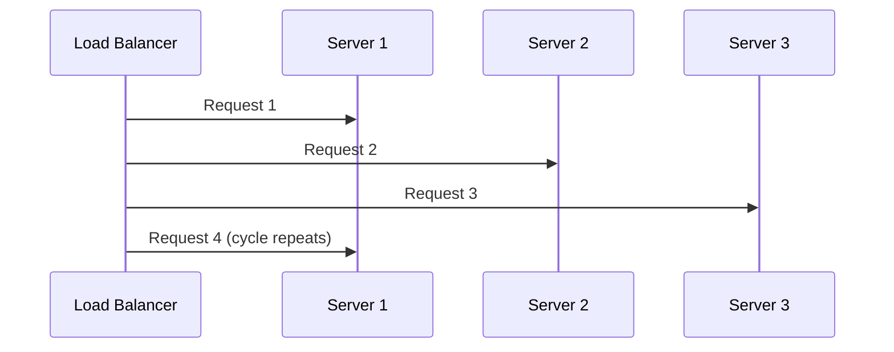
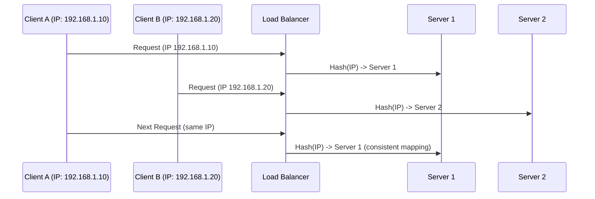
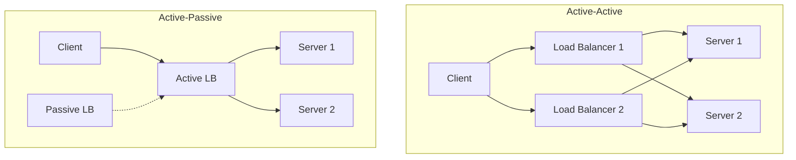

# Load balancing

Load balancing distributes incoming requests across a pool of interchangeable servers so no single server becomes the bottleneck or the single point of failure.

Structurally, a Layer 7 load balancer *is* a [reverse proxy](./12-proxies.md) — same position in the path, same TLS termination, same ability to inspect requests. The difference is emphasis: a reverse proxy is described by the cross-cutting concerns it owns, a load balancer by how it chooses a backend. This document is about that choice.

**Core benefits:**

- Prevents any one server from being overloaded while others sit idle
- Improves availability: a failed backend is detected and removed from rotation
- Makes [horizontal scaling](./10-scalability.md) usable — adding a machine actually adds capacity
- Enables zero-downtime deploys by draining and rotating backends

## What load balancing requires from your services

Distribution only works if the backends are genuinely interchangeable. That means the service tier is **stateless**: no per-client data kept in process memory between requests, so any replica can serve any request. Sessions, in-progress uploads, and counters belong in a shared store.

If state cannot be externalized, you fall back to [session affinity](#session-affinity-sticky-sessions), which works but costs you even distribution. See [scalability](./10-scalability.md) for the broader scale-up vs scale-out trade-off that leads here.

## Load balancing algorithms

Algorithms fall into two families:

- **Static**: The mapping from request to server follows fixed rules decided in advance. Cheap, predictable, blind to current conditions.
- **Dynamic**: The decision uses live signals — connection counts, response times, server metrics. More accurate, more overhead.

### Static algorithms

**Round robin**

- Distributes requests sequentially across servers

Pros:

- Simple implementation, predictable distribution
- Works well with homogeneous servers and uniform request cost

Cons:

- Ignores server capacity and current load, so one slow backend still receives its full share

**Use case**: Equal-capacity servers, stateless applications, requests of similar cost.

**Weighted round robin**

- Assigns each server a weight based on its capacity
- More powerful servers receive proportionally more requests

Pros:

- Accounts for heterogeneous server sizes

Cons:

- Static weights do not adapt to real-time conditions, so a struggling large server keeps its large share

**Use case**: Mixed instance types, or gradually shifting traffic to a new version.

**IP hash**

- Hashes the client IP to pick a target server
- The same client deterministically lands on the same server

Pros:

- Maintains affinity without the load balancer storing any session state

Cons:

- Uneven distribution when clients cluster behind NAT or a few large ISPs
- Naive `hash(ip) % N` remaps almost every client when the pool size changes; use [consistent hashing](./16-hashing.md) so a pool change only moves a `1/N` share

**Use case**: Affinity to a local cache or session, and any case where "same key, same backend" improves hit ratio.

### Dynamic algorithms

**Least connections**

- Routes to the server with the fewest active connections

Pros:

- Adapts to varying request processing times without any configuration
- Naturally avoids servers that are stuck on slow requests

Cons:

- Requires per-server connection tracking
- A newly added (empty) server can be flooded until it catches up

**Use case**: Long-lived connections, or endpoints whose cost varies widely per request.

**Least response time**

- Combines active connection count with recently observed response time

Pros:

- Steers away from degraded servers before they fail outright

Cons:

- Higher bookkeeping overhead, and can oscillate if the measurement window is too short

**Use case**: Latency-sensitive services with heterogeneous backend performance.

**Resource-based (adaptive)**

- Uses reported server metrics such as CPU, memory, or a custom load score

Pros:

- The most accurate picture of real capacity
- Adapts to noisy neighbours and heterogeneous hardware

Cons:

- Requires a metrics pipeline and tuning; a stale or wrong metric misroutes everything

**Use case**: Critical services on heterogeneous infrastructure where the cheaper signals are not good enough.

> **Tip:**
> "Power of two choices" is a common middle ground: sample two servers at random and send the request to the less loaded one.
> It gets most of the benefit of least-connections with almost none of the global-state cost.

## Load balancer types

The same pool can be fronted by very different load balancers. Four independent axes matter.

### By decision layer

**Layer 4 (transport layer)**

- Routes using network information only: source/destination IP, port, and protocol (TCP/UDP)
- Forwards the connection without parsing the application payload

Pros:

- Very high throughput and low added latency
- Works for any TCP/UDP protocol, not just HTTP

Cons:

- No visibility into HTTP paths, headers, or cookies, so no content-based routing
- Cannot retry a failed request, because it does not understand request boundaries

**Layer 7 (application layer)**

- Routes HTTP/HTTPS requests using URL path, host header, cookies, or other request metadata

Pros:

- Enables path-based routing, API version routing, canary and blue/green releases
- Can terminate TLS and integrate WAF, auth checks, [rate limiting](./32-rate-limiting.md), and per-request observability
- Can retry an idempotent request on another backend when one fails

Cons:

- More CPU per request (parsing, buffering, TLS) and higher added latency than Layer 4

### By deployment model

**Hardware load balancers**

- Dedicated physical appliances (F5, Citrix NetScaler)

Pros:

- High throughput with offload for TLS and packet processing

Cons:

- Expensive, with vendor lock-in and a fixed capacity ceiling you must buy ahead of

**Software load balancers**

- Applications running on standard servers (Nginx, HAProxy, Envoy)

Pros:

- Cost-effective, configurable, and versionable alongside the rest of your infrastructure

Cons:

- Bounded by the host's capacity, and you own the patching and operations

**Cloud load balancers**

- Managed services (AWS ALB/NLB, Google Cloud Load Balancer)

Pros:

- Fully managed and auto-scaling, integrated with the provider's health checks, certificates, and logging

Cons:

- Vendor lock-in, per-request pricing, and less control over edge-case configuration

### By traffic visibility

**External (public) load balancers**

- Internet-facing entry point for web and mobile clients
- Usually handle TLS termination, DDoS protection, and DNS integration
- Expose only the required public endpoints, hiding backend node details

**Internal (private) load balancers**

- Route traffic inside private networks (service-to-service, or east-west, traffic)
- Not reachable from the public internet
- Useful for microservices and tier-to-tier communication

### By geographic scope

**Regional load balancers**

- Route traffic within one region across availability zones
- Simpler to operate, with no cross-region data transfer cost
- If the whole region fails, recovery depends on a separate disaster-recovery plan

**Global load balancers**

- Steer traffic across regions using geo, latency, or policy-based rules, typically via anycast or GeoDNS
- Provide automatic multi-region failover and a better experience for a global user base
- Add operational complexity and make data-locality and consistency decisions unavoidable

Global load balancing is the same **user to region** decision a [CDN](./34-cdn.md) makes, and often the same infrastructure. The difference is what happens after: a CDN tries to answer at the edge, a global load balancer forwards to a regional origin.

## Health checks

An algorithm is only as good as its list of healthy backends. Health checking is what turns "distribute traffic" into "improve availability".

- **Active checks**: The load balancer probes each backend on an interval (for example `GET /healthz` every 5s). Detects a dead backend even when no user traffic is flowing.
- **Passive checks (outlier detection)**: The load balancer watches real traffic and ejects a backend that returns errors or times out. Free, and reflects what users actually experience.

Most production setups run both: active checks for reachability, passive ejection for the failures a synthetic probe never reproduces.

**What the endpoint should report:**

- **Liveness**: Is the process alive? Failing this should restart the instance.
- **Readiness**: Can it serve traffic *right now*? Failing this should only remove it from rotation — for example during warm-up, or while a connection pool is exhausted.

Keep the check shallow enough that a shared dependency cannot fail every backend at once. A readiness probe that queries the primary database makes one database blip look like a total outage.

**Tuning that matters:**

- **Thresholds**: Require N consecutive failures before ejection and N successes before return, so a single blip does not flap a backend in and out of rotation.
- **Connection draining**: On removal or deploy, stop sending new requests but let in-flight ones finish before terminating.
- **Slow start**: Ramp traffic to a returning or newly added backend rather than sending it a full share while caches and pools are cold.
- **Panic mode**: If nearly all backends look unhealthy, send traffic to everything anyway. A broken health check should degrade the service, not black-hole it.

## Session affinity (sticky sessions)

Affinity pins a client to one backend for the duration of a session.

- **Cookie-based**: The load balancer sets its own cookie naming the chosen backend. Precise, and survives client IP changes on mobile networks.
- **IP hash**: No cookie needed, but breaks for clients behind shared NAT and for clients whose IP changes mid-session.

Affinity is a workaround, not a goal. It costs you even distribution, it strands session state when a backend dies, and it makes deploys and autoscaling visibly disruptive. Prefer externalizing state to a shared store and keeping the tier stateless; use affinity only when that is genuinely impractical, or when you want cache locality rather than correctness.

## Redundancy topologies

Redundancy defines how multiple load balancers are arranged so the load balancer itself is not the single point of failure.

### Active-active

**Model**: Two or more load balancers serve traffic simultaneously, with clients spread across them by DNS or anycast/BGP.

- Delivers strong availability and higher aggregate throughput
- Uses infrastructure efficiently because no node sits idle
- Requires consistent configuration across nodes and careful health checking
- Partial failures are harder to reason about: some clients are affected and some are not

### Active-passive

**Model**: One load balancer serves traffic while a secondary stays on standby, promoted on failure.

- Simpler to operate and reason about
- Standby capacity is idle and paid for during normal operation
- Recovery time is bounded by failure detection plus promotion, so it is never instant

In both cases the client is steered by something above the load balancer — DNS, anycast, or a virtual IP. That layer has its own failover time, and it is frequently the real recovery bottleneck: a DNS record with a 300s TTL cannot fail over faster than its TTL.

## Interview talking points

- Name the layer first: Layer 4 for raw throughput and non-HTTP protocols, Layer 7 for anything that needs to look at the request.
- Say that Layer 7 load balancing and reverse proxying are the same component wearing different hats, then pick which responsibility you mean.
- Justify the algorithm with the traffic shape: uniform cheap requests suit round robin, variable-cost or long-lived connections suit least connections.
- Do not stop at the algorithm — health checks, draining, and slow start are what actually deliver the availability benefit.
- Call out statelessness as the precondition, and treat sticky sessions as a trade-off you are consciously accepting.
- Remember the load balancer is itself a single point of failure, and say how it is made redundant and how fast that failover is.

## Reference materials

- [DNS Support for Load Balancing (RFC 1794)](https://datatracker.ietf.org/doc/html/rfc1794)
- [Google SRE - Load Balancing at the Frontend](https://sre.google/sre-book/load-balancing-frontend/)
- [Google SRE - Load Balancing in the Datacenter](https://sre.google/sre-book/load-balancing-datacenter/)
