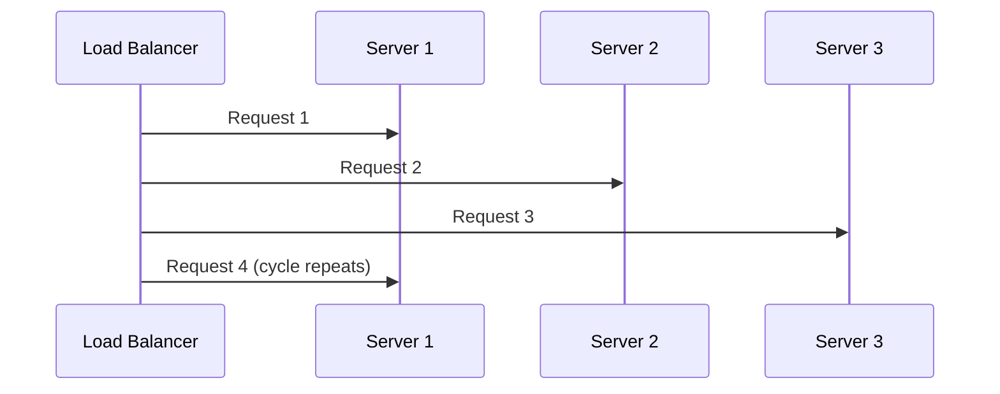
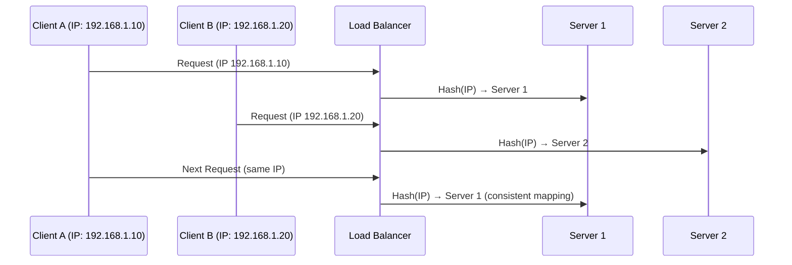
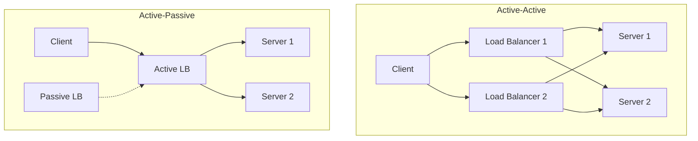

# Load balancing

Load balancing distributes incoming requests across multiple servers to prevent any single server from becoming overwhelmed.

**Core benefits:**

- Prevents server overload and bottlenecks
- Improves application availability and fault tolerance
- Enables horizontal scaling for growing traffic
- Optimizes resource utilization across infrastructure

## Scaling strategies

### Vertical scaling (scale up)

**Approach**: Add more compute resources to existing machines.

- Upgrade CPU, memory, and storage on a single server

Pros:

- Simple to implement, with no architecture changes
- No load balancing complexity

Cons:

- Hardware limits and diminishing returns
- Expensive at scale

### Horizontal scaling (scale out)

**Approach**: Add more machines to the resource pool.

- Distribute load across multiple servers

Pros:

- Nearly unlimited scaling potential
- Better fault tolerance and redundancy
- Cost-effective with commodity hardware

Cons:

- Increased complexity and coordination
- Requires load balancing and state management

## Load balancing algorithms

Different algorithms optimize for various factors like simplicity, performance, and session management.

Load balancing algorithms can be categorized into two types:

- **Static algorithms**: The mapping of requests to servers is determined in advance using fixed rules.
- **Dynamic algorithms**: Decisions are made in real time, based on current server load or performance metrics.

### Static algorithms

**Round Robin**

- Distributes requests sequentially across servers

Pros:

- Simple implementation, predictable distribution
- Works well with homogeneous servers

Cons:

- Doesn't consider server capacity or current load

**Use case**: Equal-capacity servers, stateless applications.

**Weighted Round Robin**

- Assigns weights based on server capacity
- More powerful servers receive proportionally more requests

Pros:

- Accounts for different server capacities

Cons:

- Static weights don't adapt to real-time conditions

**Use case**: Heterogeneous server configurations.

**IP Hash (Consistent Assignment)**

- Uses the client IP to determine the target server
- The same client always routes to the same server

Pros:

- Maintains session affinity without sticky sessions

Cons:

- Uneven distribution if clients cluster by IP

**Use case**: Session-dependent applications, caching benefits.

### Dynamic algorithms

**Least Connections**

- Routes to the server with the fewest active connections

Pros:

- Better load distribution than round robin
- Adapts to varying request processing times

Cons:

- Requires connection tracking overhead

**Use case**: Long-lived connections, varying request complexity.

**Least Response Time**

- Considers both connection count and response time
- Routes to the server with the fastest response and fewest connections

Pros:

- Optimizes for performance

Cons:

- Higher computational overhead

**Use case**: Performance-critical applications.

**Resource-Based (Adaptive)**

- Uses real-time server metrics (CPU, memory, custom metrics)

Pros:

- Most intelligent load distribution
- Adapts to server health and capacity

Cons:

- Complex implementation and monitoring required

**Use case**: Critical applications, heterogeneous environments.

## Load balancer types

Load balancers can be implemented at different layers and using various technologies.

### By decision layer

**Layer 4 Load Balancers (Transport Layer)**

- Route traffic using network information like IP, port, and protocol (TCP/UDP)
- Fast and efficient because they do not inspect full application payloads

Pros:

- Best fit for high-throughput services, raw TCP services, and low-latency routing

Cons:

- Limited visibility into HTTP paths, headers, or cookies

**Layer 7 Load Balancers (Application Layer)**

- Route HTTP/HTTPS requests using URL path, host header, cookies, or request metadata

Pros:

- Enable advanced behaviors like path-based routing, API version routing, and canary releases
- Commonly terminate TLS and integrate with WAF, auth checks, and observability tools

Higher flexibility, with more processing overhead than Layer 4.

### By deployment model

**Hardware Load Balancers**

- Dedicated physical appliances (F5, Citrix NetScaler)

Pros:

- High performance and throughput
- Advanced features and optimization

Cons:

- Expensive and vendor lock-in
- Limited scalability and flexibility

**Software Load Balancers**

- Applications running on standard servers (Nginx, HAProxy)

Pros:

- Cost-effective and flexible
- Easy to scale and customize

Cons:

- Limited by server hardware capacity
- Requires more management overhead

**Cloud Load Balancers**

- Managed services (AWS ALB/ELB, Google Cloud Load Balancer)

Pros:

- Fully managed, auto-scaling
- Integrated with cloud ecosystem

Cons:

- Vendor lock-in and pricing concerns
- Less control over configuration

### By traffic visibility

**External (Public) Load Balancers**

- Internet-facing entry point for web or mobile clients
- Commonly handle TLS termination, DDoS protection, and global DNS integration
- Expose only required public endpoints while hiding backend node details

**Internal (Private) Load Balancers**

- Route traffic inside private networks (service-to-service or east-west traffic)
- Not directly reachable from the public internet
- Useful for microservices, internal APIs, and tier-to-tier communication

### By geographic scope

**Regional Load Balancers**

- Route traffic within one region to nearby availability zones or instances
- Simpler to operate, with lower cross-region complexity and cost
- If the region fails, failover depends on a separate disaster recovery setup

**Global Load Balancers**

- Distribute traffic across multiple regions using geo/latency/policy-based routing
- Improve resilience with automatic multi-region failover
- Deliver a better global user experience, with higher operational complexity

## Load balancer redundancy topologies

Redundancy topology defines how multiple load balancers are arranged to avoid a single point of failure.

### Active-active

**Model**: Two or more load balancers serve traffic at the same time.

- Traffic is distributed across all active nodes (for example, via DNS or anycast/BGP)
- Delivers strong availability and better aggregate throughput
- Uses infrastructure more efficiently because no node sits idle
- Requires careful health checks, config consistency, and traffic steering
- Can increase operational complexity during partial failures

### Active-passive

**Model**: One load balancer is active while a secondary node stays on standby.

- Normal traffic flows through the primary node only
- On failure, a failover mechanism promotes the standby node
- Easier to reason about and operate than active-active
- Standby capacity is idle during normal operation
- Recovery depends on failover detection and promotion time

## Reference materials

- [DNS Support for Load Balancing (RFC 1794)](https://datatracker.ietf.org/doc/html/rfc1794)
