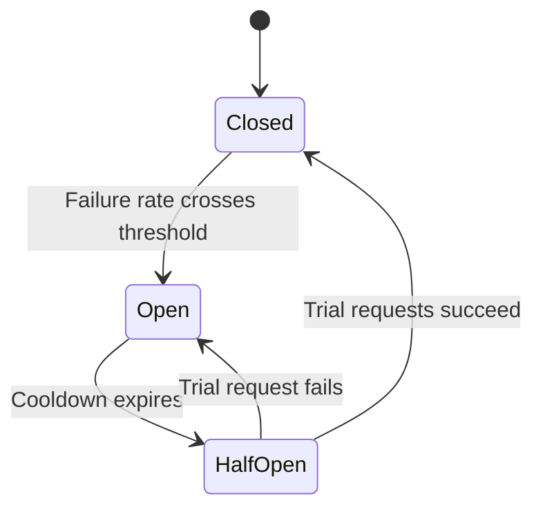

# Resilience

Resilience is a system's ability to keep delivering acceptable service while parts of it are failing, and to recover quickly afterwards.

It starts from the assumption that failures *will* happen and asks how to contain them, rather than trying to prevent every one. Availability and reliability are the outcomes you want; resilience is the collection of mechanisms that protects them under failure. See [Availability](./08-availability.md) for the reference comparison of the three terms.

## How a small failure becomes an outage

Most large outages start as a small, local problem that the system amplifies. The usual sequence:

1. One dependency slows down (a bad deploy, a hot shard, a GC pause)
2. Callers hold threads and connections open waiting on it, because there is no timeout
3. Those callers exhaust their own thread pool and start failing requests unrelated to that dependency
4. Clients retry the failures, multiplying load on an already saturated system
5. Retries arrive in step with each other, so recovery attempts get knocked down again

Retry amplification is easy to underestimate. Three layers of services, each retrying three times, can turn a single user request into up to 27 backend calls at exactly the moment the backend has least capacity.

Every pattern below exists to break one link in that chain: stop waiting (timeouts), stop hammering (backoff, circuit breakers), stop spreading (bulkheads), or stop accepting (load shedding).

## Common failure types

- **Dependency slowness and partial outages**: The most common trigger, and worse than a clean failure
- **Traffic spikes and resource saturation**: Thread pools, connections, memory, or queue capacity run out
- **Network partitions and packet loss**: Calls that neither succeed nor fail promptly
- **Bad deploys and misconfiguration**: Self-inflicted, and usually the fastest to fix by rolling back
- **Infrastructure and regional failures**: Host, zone, or region loss

## Resilience patterns

### Timeouts

- Set an explicit timeout on **every** remote call; the default in most clients is "wait forever"
- Base the value on the dependency's observed p99, not on a round number picked by feel
- Budget timeouts down the call chain: if the user-facing request has a 2s budget, an inner call cannot be allowed 5s
- Pair with cancellation, so abandoning a request actually frees the downstream work

A missing timeout is the single most common cause of a cascading failure, because it converts a slow dependency into exhausted resources everywhere upstream.

### Retries and backoff

- Retry only **transient** failures (timeouts, `503`, connection resets), never validation or authorization errors
- Use **exponential backoff with jitter**, so clients that failed together do not retry together
- Cap total attempts and honor an overall deadline, so retries cannot outlive the user's request
- Retry at one layer, not at every layer, to avoid multiplying load
- Consider a **retry budget**: allow retries only while they are a small fraction of total traffic, and stop when the dependency is broadly failing

Retries are only safe on idempotent operations. That pairing is covered in [Reliability](./09-reliability.md).

### Circuit breakers

A circuit breaker watches the error rate of calls to one dependency and, once it crosses a threshold, stops sending traffic there for a cooldown period. Callers fail fast (or fall back) instead of queueing up behind a dependency that cannot answer, which both protects the caller's resources and gives the dependency room to recover.

- **Closed**: Normal operation, calls pass through, failures are counted
- **Open**: Calls fail immediately without touching the dependency
- **Half-open**: A limited number of trial requests probe whether the dependency has recovered

Tuning notes: trip on error *rate* over a minimum request volume rather than a raw count, so a quiet service does not trip on two failures; and keep the half-open probe small, since sending full traffic at a recovering dependency simply re-opens the circuit.

### Bulkheads

Named after a ship's watertight compartments: partition resources so one flooded compartment does not sink the vessel.

- Give each dependency or workload its own thread pool, connection pool, or queue
- Separate critical from non-critical traffic, so a slow analytics call cannot consume the capacity that checkout needs
- At a coarser grain, shard customers into isolated cells so one tenant's load cannot affect everyone

Example: a checkout service calls both payments and a recommendations API from one shared 200-thread pool. Recommendations slows to 10s, absorbs every thread, and checkout stops even though payments is healthy. Capping recommendations at 20 threads limits the damage to the feature that is actually broken.

### Fallbacks and graceful degradation

- Serve cached or stale data when the live dependency is down
- Return a reduced or default response (empty recommendations, a generic ranking) instead of an error
- Disable non-critical features under stress and preserve the critical user journeys

A fallback must be cheaper and more reliable than the call it replaces. A "fallback" that calls another live service just moves the failure.

### Load shedding and backpressure

When demand exceeds capacity, something has to give. It is better to choose what.

- **Rate limiting** bounds incoming traffic per client so no one caller can saturate the service. See [Rate limiting](./32-rate-limiting.md)
- **Load shedding** rejects low-priority work quickly once the service is saturated, protecting the latency of high-priority traffic. Shed based on a live signal such as queue depth or latency, and reject early and cheaply
- **Backpressure** propagates "slow down" upstream instead of silently buffering. Bounded queues are the simplest form: when the queue is full, the producer blocks or is rejected

The failure mode this prevents is the unbounded queue, where work is accepted faster than it can be processed until memory is exhausted or every queued item has already timed out.

## Failover and recovery

- **Health checks** (liveness, readiness, startup) so unhealthy instances stop receiving traffic. See [Load balancing](./13-load-balancing.md)
- **Automated failover** for critical stateful components, with fencing so the old primary cannot keep writing
- **Fast, tested rollback** as the default incident response for a bad deploy
- **Redundancy topology** (active-active, active-passive, multi-AZ, multi-region) is covered in [Availability](./08-availability.md)

## Validating resilience

Untested resilience is a guess. These mechanisms only run during failures, so they are the code most likely to be broken without anyone knowing.

- **Failure injection and chaos experiments**: Deliberately add latency, return errors, or kill instances in a controlled window, with a hypothesis and an abort condition
- **Game days**: Rehearse a realistic incident end to end, including paging, diagnosis, and the runbook
- **Disaster-recovery drills**: Actually fail over, and measure the time it took against your RTO
- **Load testing to the breaking point**: Find where the system sheds load, and confirm it degrades rather than collapses

## Measuring resilience

- **MTTR**: How fast correct service is restored, defined in [Reliability](./09-reliability.md)
- **Blast radius**: What fraction of users or tenants an incident affected
- **Error budget burn rate**: How fast an incident consumed the budget, defined in [Availability](./08-availability.md)
- **Degraded-mode success rate**: How much of the critical journey still worked while a dependency was down
- **Drill outcomes**: Failover success rate and the gap between drill results and target RTO

Most of these come from telemetry rather than intuition. See [Observability](./15-observability.md) for how to collect them.

## Common pitfalls

- **No timeout, or a timeout longer than the caller's own deadline**: The default failure mode of most clients
- **Retries at every layer**: Turns one user request into a load multiplier during an incident
- **Retries without jitter**: Synchronized clients re-create the spike they are recovering from
- **Shared pools across unrelated workloads**: One slow dependency takes down everything
- **Unbounded queues**: Convert a short overload into a memory exhaustion event
- **Fallbacks that depend on the failing path**: A cache fallback that reads through to the dead database is not a fallback
- **Untested failover**: Discovering the standby was misconfigured during the actual outage

## Interview talking points

- Resilience is about surviving failure, not preventing all failure.
- Start from failure modes, then map each one to a specific mitigation, rather than listing patterns generically.
- Walk the cascade explicitly: no timeout leads to resource exhaustion leads to retry storm.
- Cover detect, isolate, and restore, not just prevention.
- Name the trade-offs: added complexity, added cost, and a degraded user experience during failure.

## Reference materials

- [Google SRE - Addressing Cascading Failures](https://sre.google/sre-book/addressing-cascading-failures/)
- [AWS Builders Library - Timeouts, retries, and backoff](https://aws.amazon.com/builders-library/timeouts-retries-and-backoff-with-jitter/)
