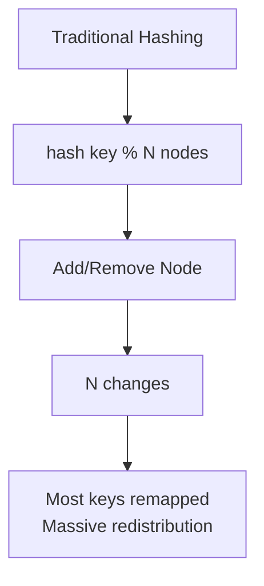
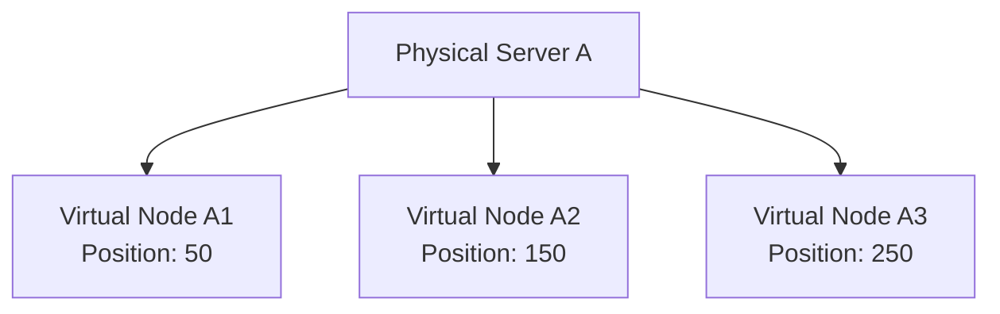
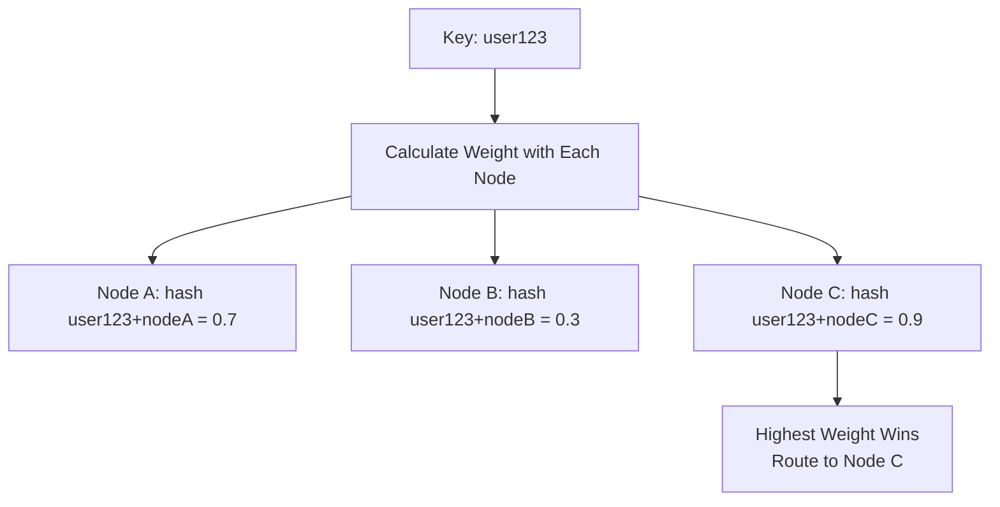

# Hashing

Hashing maps input data of any size to a fixed-size value using a deterministic function.

In distributed systems it is the default answer to "which node owns this key?" — for cache shards, load balancers, and database partitions.

This note covers what makes a hash function good, the two families of hash functions, and the distribution schemes that survive nodes joining and leaving.

Related: [Caching](./11-caching.md), [Bloom Filters](./17-bloom-filters.md), [Checksums](./18-checksums.md), [Load Balancing](./13-load-balancing.md), [Database Partitioning](./24-database-partitioning.md).

## What makes a hash function good?

- **Deterministic**: The same input always produces the same output, on every node and every process restart.
- **Uniform distribution**: Hash values spread evenly across the output space, so buckets fill at roughly the same rate.
- **Fixed output size**: The output length is constant regardless of input size.
- **Avalanche effect**: Flipping one input bit changes about half the output bits, so similar keys (`user_1`, `user_2`) land far apart.

The last two properties are why you hash the key instead of using it directly: sequential or clustered keys become evenly scattered bucket assignments.

## Three jobs hashing does

The same primitive shows up in three different roles, and mixing them up is a common interview stumble. Each row answers a different question:

| Job              | Question it answers                           | Typical functions                       | Covered in                             |
| ---------------- | --------------------------------------------- | --------------------------------------- | -------------------------------------- |
| **Distribution** | Which node or bucket owns key `K`?            | MurmurHash, xxHash, CityHash            | This note                              |
| **Membership**   | Could key `K` exist at all?                   | Several cheap hashes over one bit array | [Bloom Filters](./17-bloom-filters.md) |
| **Integrity**    | Did these bytes change in transit or at rest? | CRC32, SHA-256, HMAC                    | [Checksums](./18-checksums.md)         |

Distribution wants speed and uniformity. Integrity wants collision resistance, and — if an attacker is in the threat model — a key. Membership trades a controlled error rate for memory. Picking a function only makes sense once you know which job you are doing.

## Cryptographic hash functions

**Purpose**: Security, integrity verification, digital signatures.

These are designed so that finding two inputs with the same digest, or reversing a digest, is computationally infeasible. That guarantee costs CPU time.

| Algorithm   | Output size | Security status | Use cases                                                 |
| ----------- | ----------- | --------------- | --------------------------------------------------------- |
| **MD5**     | 128-bit     | Broken          | Legacy checksums only, never security                     |
| **SHA-1**   | 160-bit     | Deprecated      | Avoid for new systems                                     |
| **SHA-256** | 256-bit     | Secure          | Digital signatures, content addressing, blockchain        |
| **SHA-3**   | Variable    | Secure          | Modern applications, different internal design from SHA-2 |

MD5 and SHA-1 are broken for *collision resistance*, which matters for signatures and deduplication. They are still occasionally used as fast non-security checksums, but there is no reason to pick them over a purpose-built non-cryptographic hash.

## Non-cryptographic hash functions

**Purpose**: Fast hashing for hash tables, sharding, and load balancing.

| Algorithm      | Speed          | Distribution quality | Use cases                          |
| -------------- | -------------- | -------------------- | ---------------------------------- |
| **MurmurHash** | Very fast      | Good                 | Hash tables, caches, Bloom filters |
| **CityHash**   | Fast           | Good                 | Google's general-purpose hashing   |
| **xxHash**     | Extremely fast | Excellent            | High-throughput pipelines          |

**Trade-offs:**

Pros:

- Orders of magnitude faster than cryptographic hashes
- Good distribution properties for real-world key shapes

Cons:

- Not collision resistant against an adversary who chooses the inputs
- Unsafe for signatures, tokens, or anything security-sensitive

The adversarial case is not theoretical: a client that can pick keys can deliberately collide them and turn a hash table into a linked list. Server-side hash tables exposed to user input should use a seeded or randomized hash.

## Hash distribution and uniformity

A good hash function spreads values uniformly across the output space, which minimizes collisions and keeps load balanced across buckets.

**Factors affecting distribution:**

- **Input data patterns**: Real-world keys are rarely random. Timestamps, auto-increment IDs, and shared prefixes all cluster.
- **Hash function quality**: Weak functions preserve input structure and create clustering.
- **Output space size**: More buckets means fewer collisions, but also more per-bucket overhead.
- **Key skew**: Even a perfect hash function cannot fix a key that is genuinely hot. If one celebrity account is 30% of traffic, hashing sends 30% of traffic to one node. That is a key-design problem, not a hash-function problem.

## Distributed hashing

Assigning keys to nodes is easy until the set of nodes changes. These schemes differ in how much data moves when it does.

### Why modulo hashing breaks



`hash(key) % N` is simple and perfectly uniform, but `N` appears in the formula. Change `N` from 4 to 5 and roughly 80% of keys map somewhere new.

For a database that means a mass data migration. For a cache it is worse in a subtler way: nothing needs to *move*, but almost every key is suddenly looked up on a node that has never seen it, so the cluster takes a near-total miss storm and the origin absorbs it all at once.

Modulo hashing is still the right choice when the node count is fixed, or when it only ever changes by splitting a bucket in half.

### Consistent hashing

Consistent hashing removes `N` from the mapping so that node changes affect only a slice of the keyspace.

Both nodes and keys are hashed into the same circular space (typically `0 .. 2^32-1`). A key belongs to the first node found walking clockwise from the key's position:

```plaintext
hash space 0 .. 2^32-1, wrapping around at the end

  0 ........ N1 ......... N2 ............... N3 ........ 2^32-1
       ^           ^             ^
    hash(a)     hash(b)       hash(c)
       |           |             |
       v           v             v
      N1          N2            N3       (first node clockwise)
```

When `N2` leaves the ring, only the keys between `N1` and `N2` move — they now walk clockwise to `N3`. Every other key keeps its owner. Adding a node is the mirror image: it claims one arc from its clockwise neighbor and nothing else changes.

**Benefits:**

- Adding or removing a node only remaps the keys in the adjacent arc
- Roughly `K/N` keys move per node change, where `K` is the total key count and `N` the node count
- Load stays balanced as long as enough virtual nodes are used

#### Virtual nodes

With one ring position per server, arcs are uneven by chance and removing a node dumps its entire arc on a single neighbor. The fix is to give each physical node many positions on the ring:



Each physical node now owns many small arcs scattered around the ring, so arc sizes average out and a departing node's load is spread across all remaining nodes rather than one. Virtual nodes also make heterogeneous hardware easy: give a machine with twice the memory twice the ring positions.

**Example implementation** (a handful of virtual nodes for readability — production systems use 100-200 per physical node):

```python
import bisect

class ConsistentHash:
    def __init__(self, vnodes=3):
        self.vnodes = vnodes
        self.ring = {}
        self.sorted_keys = []

    def add_node(self, node):
        for i in range(self.vnodes):
            key = self.hash(f"{node}:{i}")
            self.ring[key] = node
            bisect.insort(self.sorted_keys, key)

    def remove_node(self, node):
        for i in range(self.vnodes):
            key = self.hash(f"{node}:{i}")
            del self.ring[key]
            self.sorted_keys.remove(key)

    def get_node(self, key):
        if not self.ring:
            return None

        hash_key = self.hash(key)
        # First virtual node clockwise, wrapping to the start of the ring
        idx = bisect.bisect_left(self.sorted_keys, hash_key)
        if idx == len(self.sorted_keys):
            idx = 0
        return self.ring[self.sorted_keys[idx]]
```

Consistent hashing is what backs partitioning in Amazon DynamoDB and Apache Cassandra, and it is the standard way to shard a Memcached or Redis cache tier.

### Rendezvous hashing (HRW)

Rendezvous hashing (highest random weight) reaches the same goal without a ring: hash the key together with each node, and the highest score wins.



**Example implementation:**

```python
def get_node_hrw(key, nodes):
    max_weight = -1
    selected_node = None

    for node in nodes:
        # Combine key and node, then hash
        weight = hash(f"{key}:{node}")
        if weight > max_weight:
            max_weight = weight
            selected_node = node

    return selected_node
```

Removing a node only changes the winner for keys where that node was ranked first, so redistribution is minimal for the same reason it is on a ring. Ranking the top `r` nodes instead of just the top one gives you replica placement for free.

**Rendezvous vs consistent hashing:**

| Aspect           | Consistent hashing             | Rendezvous hashing                 |
| ---------------- | ------------------------------ | ---------------------------------- |
| **Simplicity**   | More complex (ring management) | Simpler (direct calculation)       |
| **Performance**  | O(log N) lookup                | O(N) calculation per lookup        |
| **Load balance** | Good (with virtual nodes)      | Excellent (mathematically uniform) |
| **Node changes** | Minimal redistribution         | Minimal redistribution             |
| **Use cases**    | Large-scale systems            | Smaller node counts                |

## Choosing a hash function

**For security:**

- Use SHA-256 or SHA-3 for signatures, content addressing, and tamper-evident integrity
- Avoid MD5 and SHA-1 in new applications

**For performance:**

- Use MurmurHash3 or xxHash for hash tables, sharding, and Bloom filters
- Consider CityHash for compatibility with existing Google-derived systems

**For distributed placement:**

- Modulo hashing when the node count is fixed or only grows by splitting
- Consistent hashing for clusters that scale in and out, or where a node loss must not invalidate the whole cache tier
- Rendezvous hashing for smaller, stable clusters, or when you need a ranked replica list

## Common pitfalls

**Poor hash distribution:**

- Sequential or prefixed keys create hotspots when the hash function is weak
- Use a compound key or add a salt to break up naturally clustered keys

**Node imbalance:**

- Use enough virtual nodes (100-200 per physical node is a common starting point)
- Monitor per-node key counts and request rates, and adjust ring weights based on real load

**Inconsistent hash configuration:**

- Every client must use the same hash function, seed, and ring membership, or they will disagree about ownership
- Changing the hash function or seed is equivalent to rebuilding the entire ring

**Cascading failures:**

- A node that drops out hands its keys to neighbors, which can push them over their own limits
- Add health checks, failover, and enough headroom to absorb a neighbor's share

## Interview talking points

- Say which job you are hashing for — distribution, membership, or integrity — before naming an algorithm.
- Reach for consistent hashing the moment nodes can join or leave, and mention virtual nodes in the same breath.
- Be explicit that hashing fixes *uniform* key distribution, not *hot* keys; those need replication or a separate hot-key path.
- Know the cost of a resharding event: with modulo hashing it is a full migration, with consistent hashing it is one arc.

## Reference materials

- [Hashing Algorithms Overview](https://jscrambler.com/blog/hashing-algorithms)
- [Consistent Hashing Deep Dive](https://www.toptal.com/big-data/consistent-hashing)
- [Consistent Hashing Tradeoffs](https://dgryski.medium.com/consistent-hashing-algorithmic-tradeoffs-ef6b8e2fcae8)
- [Amazon DynamoDB Partitioning](https://docs.aws.amazon.com/amazondynamodb/latest/developerguide/HowItWorks.Partitions.html)
- [Cassandra Dataset Partitioning using Consistent Hashing](https://cassandra.apache.org/doc/latest/cassandra/architecture/dynamo.html#dataset-partitioning-consistent-hashing)
