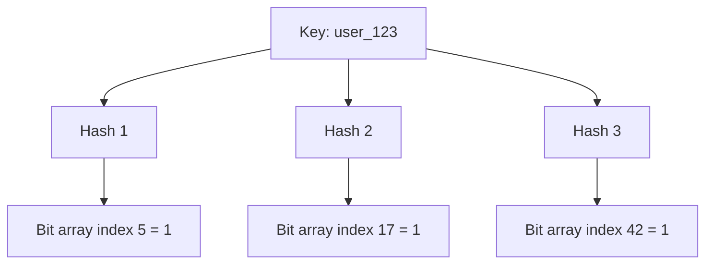

# Bloom filters

A Bloom filter is a space-efficient probabilistic data structure for membership tests: "might be in set" or "definitely not in set."

It is widely used in distributed systems to avoid expensive lookups (e.g. database or cache) when the answer is likely "not present."

## Core properties

- **No false negatives**: If the filter says "not present," the item is definitely absent.
- **Possible false positives**: If the filter says "present," the item may still be absent.
- **Fixed memory footprint**: Memory is allocated up front.
- **No deletes in standard form**: Basic Bloom filters support insert and query only.

## How it works

Insert:

1. Hash the item with `k` hash functions.
2. Set the corresponding bit positions to `1`.

Query:

1. Hash the item with the same `k` functions.
2. If any bit is `0`, the item is definitely not present.
3. If all bits are `1`, the item may be present.

## Why Bloom filters are useful

- Fast negative checks before hitting the DB, cache, or disk.
- Significant memory savings versus storing full keys.
- Great fit for high-throughput systems with many misses.

## Common system design use cases

### Cache penetration protection

Cache penetration happens when requests repeatedly ask for keys that do not exist.

Without protection, every miss can bypass the cache and hit the database.

- Put a Bloom filter in front of the DB lookup path.
- On a request for key `K`, check the Bloom filter first.
- If the filter says "definitely not present," return a miss immediately.
- If the filter says "maybe present," continue to cache/DB for confirmation.

Result: the DB is protected from high-miss traffic (including malicious random-key scans), while valid keys still follow the normal cache + DB flow.

### Storage engine read path

In LSM storage engines, data is spread across many immutable files (often called SSTables).

A lookup might otherwise check many files before finding the key or confirming it is absent.

- Each file keeps a Bloom filter for keys that might exist in that file.
- On a read for key `K`, the engine checks Bloom filters first, then opens only candidate files.
- If the filter says "definitely not in this file," that file is skipped without a disk read.

Result: far fewer disk I/O operations and faster tail latency, especially for missing keys.

### Distributed data sync

When two nodes reconcile data, sending all keys is expensive.

Bloom filters are used as a quick first pass to find obvious differences.

1. A has 10 million keys, B has 10.1 million keys.
2. A sends a Bloom summary (small) instead of all keys (huge).
3. B marks keys "definitely not in A" as clear diffs or missing candidates.
4. The final sync transfers only confirmed differences.
5. Remaining uncertain keys are handled by a second pass (range sync, Merkle tree, or periodic anti-entropy).

Result: big bandwidth savings, while a lightweight second pass covers keys hidden by false positives.

## Sizing and false positive rate

Given:

- `n` = expected number of inserted items
- `m` = bit array size
- `k` = number of hash functions
- `p` = false positive probability

Useful formulas:

- `m = -(n * ln p) / (ln 2)^2`
- `k = (m / n) * ln 2`
- Approximate optimal bits per item: `m / n ~= 1.44 * log2(1/p)`

Rule of thumb:

- About **10 bits/item** gives roughly **1%** false positive rate.
- As the filter fills up beyond the planned `n`, false positives rise quickly.

## Trade-offs

**Pros:**

- Very memory efficient.
- O(k) insert/query with small constants.
- Excellent for reducing expensive negative lookups.

**Cons:**

- False positives require downstream confirmation.
- A standard Bloom filter cannot delete safely.
- Requires capacity planning (`n`, `p`) up front.

## Variants

- **Counting Bloom Filter**: Supports deletes using counters instead of bits.
- **Scalable Bloom Filter**: Adds new filters as the dataset grows.
- **Partitioned Bloom Filter**: Splits the bit array for better cache locality.

## Interview talking points

- Bloom filters are for **pre-check optimization**, not authoritative existence checks.
- They are most valuable when negative lookups are frequent and expensive.
- Correctness comes from the downstream store; the Bloom filter only reduces work.
- Always mention false positives and capacity planning trade-offs.

## Reference materials

- [Bloom Filter (Wikipedia)](https://en.wikipedia.org/wiki/Bloom_filter)
- [Apache Cassandra Bloom Filters](https://cassandra.apache.org/doc/4.0/cassandra/operating/bloom_filters.html)
