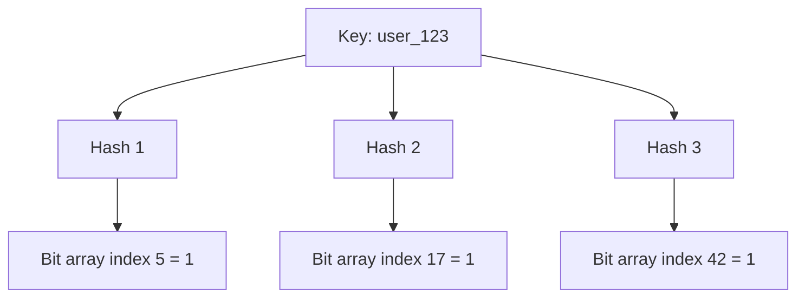

# Bloom filters

A Bloom filter is a space-efficient probabilistic data structure that answers one question: is this item in the set?

It gives one of two answers — "definitely not in the set" or "might be in the set" — and it is small enough to keep in memory for datasets far too large to hold as a key list.

That asymmetry is the whole point. A cheap, certain "no" lets you skip an expensive lookup entirely: a disk read, a database query, a network round trip.

## Core properties

- **No false negatives**: If the filter says "not present," the item is definitely absent.
- **Possible false positives**: If the filter says "present," the item may still be absent, so the answer must be confirmed downstream.
- **Fixed memory footprint**: The bit array is allocated up front and does not grow with the data.
- **No deletes in standard form**: Basic Bloom filters support insert and query only.

Because every "maybe" has to be confirmed against the real store, a Bloom filter is never the source of truth. It is a filter in front of one.

## How it works

A Bloom filter is an `m`-bit array plus `k` independent hash functions. In practice the `k` functions are cheap non-cryptographic hashes (see [Hashing](./16-hashing.md)) — often two real hashes combined arithmetically to synthesize the rest, since collision resistance is irrelevant here and speed is not.

Insert:

1. Hash the item with `k` hash functions.
2. Set the corresponding bit positions to `1`.

Query:

1. Hash the item with the same `k` functions.
2. If any bit is `0`, the item is definitely not present — no other item could have set that bit.
3. If all bits are `1`, the item may be present. Those bits may have been set by other items that happened to overlap.

Bits are only ever set, never cleared, which is exactly why a standard filter cannot support deletion: clearing a bit for one item would silently remove every other item that shares it, and that would create false negatives.

## Common system design use cases

The pattern is always the same: a fast in-memory "definitely not" short-circuits a slow authoritative lookup.

### Cache penetration protection

**Cache penetration** is the failure mode where requests repeatedly ask for keys that do not exist, so every request misses the cache and falls through to the database. See [Caching](./11-caching.md) for how it sits alongside the other cache failure modes and for the negative-caching alternative.

A Bloom filter holding every key that exists in the database guards the fall-through path:

1. Read the cache. On a hit, return it — the filter is not consulted.
2. On a miss, check the Bloom filter before querying the database.
3. "Definitely not present" means the key does not exist. Return "not found" without touching the database.
4. "Maybe present" means fall through to the database as usual, which gives the authoritative answer.

Result: the database is shielded from high-miss traffic, including malicious random-key scans, while valid keys follow the normal cache-then-database flow. False positives cost only the database query you would have made anyway.

The operational cost is keeping the filter current. It must be populated with every existing key, so it is built by a full scan and updated on insert. Deletes are the hard part: a standard filter cannot remove a key, so deleted keys stay as permanent false positives. Either accept that drift and rebuild the filter periodically, or use a counting Bloom filter that supports removal.

### Storage engine read path

In LSM storage engines, data is spread across many immutable files (SSTables), and a point lookup might otherwise check many of them before finding the key or confirming it is absent.

- Each file keeps a Bloom filter over the keys it contains.
- On a read for key `K`, the engine checks the filters first and opens only candidate files.
- "Definitely not in this file" skips the file without a disk read.

Result: far fewer disk I/O operations and much better tail latency, especially for keys that do not exist. This is why Bloom filters are standard in RocksDB, LevelDB, Cassandra, and HBase. Immutable files make this an easy fit — the filter is written once alongside the file and never needs updating.

### Distributed data sync

When two nodes reconcile their data, sending every key is expensive. A Bloom filter works as a cheap first pass to find obvious differences.

1. Node A has 10 million keys, node B has 10.1 million.
2. A sends a Bloom summary (small) instead of all its keys (huge).
3. B tests its own keys against the summary and flags anything "definitely not in A" as a confirmed difference.
4. Only those confirmed differences are transferred.
5. Keys hidden by false positives are caught by a second pass — range sync, a Merkle tree comparison, or the next periodic anti-entropy round.

Result: large bandwidth savings, with a lightweight second pass covering what the false positives hid.

## Sizing and false positive rate

Given:

- `n` = expected number of inserted items
- `m` = bit array size
- `k` = number of hash functions
- `p` = false positive probability

Useful formulas:

- `m = -(n * ln p) / (ln 2)^2`
- `k = (m / n) * ln 2`
- Approximate optimal bits per item: `m / n ~= 1.44 * log2(1/p)`

Rule of thumb:

- About **10 bits/item** gives roughly a **1%** false positive rate, and about **15 bits/item** gives roughly **0.1%**.
- Each additional ~4.8 bits per item divides the false positive rate by ten, so precision gets expensive fast.
- Once the filter holds more than the planned `n` items, the false positive rate climbs sharply. Size for peak, and monitor fill.

**Worked example** — 10 million user IDs at a 1% false positive rate:

- `m ~= 96 million bits ~= 12 MB`, `k ~= 7`
- Storing the same 10 million 20-byte IDs in a hash set would cost roughly 200 MB before per-entry overhead
- The trade: about 1 in 100 nonexistent keys still reaches the database, which is a rounding error compared to all of them

Note that memory depends on the number of items and the target error rate, not on how large each item is. A filter over 10 million 2 KB documents is the same 12 MB, because only the hash of each item is ever stored.

## Trade-offs

**Pros:**

- Very memory efficient, and the footprint is independent of item size
- O(k) insert and query with small constants, and no comparisons or pointer chasing
- Excellent for eliminating expensive negative lookups

**Cons:**

- False positives require downstream confirmation, so it can never be the authoritative answer
- A standard Bloom filter cannot delete, which makes it a poor fit for churning key sets
- Requires capacity planning (`n`, `p`) up front, and degrades badly when the estimate is too low
- Cannot enumerate its contents — you can only test keys you already have

## Variants

- **Counting Bloom filter**: Replaces bits with small counters so items can be removed, at roughly 3-4x the memory.
- **Scalable Bloom filter**: Chains additional filters as the dataset grows past the original `n`, keeping the overall error rate bounded.
- **Partitioned Bloom filter**: Gives each hash function its own slice of the bit array, improving cache locality.
- **Cuckoo filter**: A different structure with comparable space usage that supports deletion and often better lookup performance at low error rates.

## Interview talking points

- Bloom filters are a **pre-check optimization**, not an authoritative existence check. Correctness always comes from the store behind them.
- They pay off when negative lookups are frequent *and* expensive. If nearly every key exists, the filter just adds work.
- Always name the false positive rate and the memory it buys, and say how the filter is populated and kept current.
- Deletes are the usual gotcha: standard filters cannot remove keys, so plan on periodic rebuilds or a counting variant.

## Reference materials

- [Bloom Filter (Wikipedia)](https://en.wikipedia.org/wiki/Bloom_filter)
- [Apache Cassandra Bloom Filters](https://cassandra.apache.org/doc/4.0/cassandra/operating/bloom_filters.html)
- [RocksDB Bloom Filter Design](https://github.com/facebook/rocksdb/wiki/RocksDB-Bloom-Filter)
