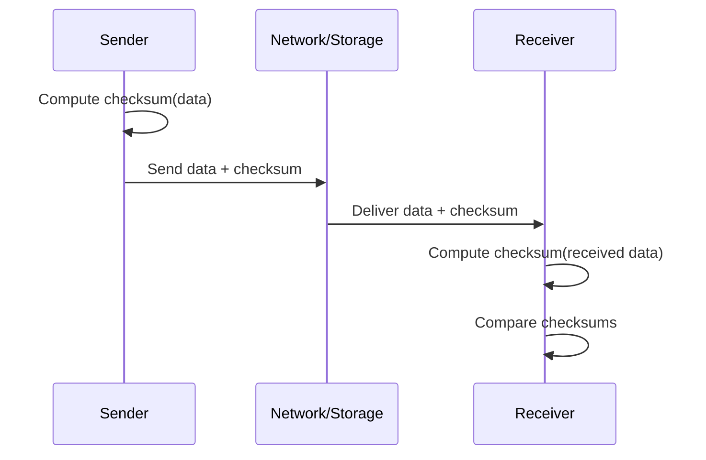

# Checksums

Checksums are compact values computed from data to detect accidental corruption during storage or transmission.

In distributed systems, checksums are widely used for integrity checks in files, network packets, replication streams, and backups.

**Core idea:**

- Sender computes checksum from data
- Sender sends data + checksum
- Receiver recomputes checksum and compares
- Match means data is likely intact; mismatch means corruption is detected

## How checksums work

Checksums detect random errors well, but they are not designed to resist intentional tampering.

## Checksum vs hash vs MAC

| Technique    | Goal                     | Protects Against             | Example     |
| ------------ | ------------------------ | ---------------------------- | ----------- |
| **Checksum** | Accidental corruption    | Random bit flips/noise       | CRC32       |
| **Hash**     | Integrity fingerprinting | Collisions (depends on hash) | SHA-256     |
| **MAC**      | Integrity + authenticity | Active tampering without key | HMAC-SHA256 |

**Rule of thumb:**

- Use checksums for transport/storage error detection
- Use cryptographic hashes for stronger integrity guarantees
- Use MAC/signatures when security and authenticity are required

## Where do checksums appear in systems?

### Network communication

- Link and transport protocols detect corrupted packets
- Corrupted segments are dropped or retransmitted

### Storage systems

- Databases and file systems store checksums per page/block
- Background scrubbing jobs detect latent disk corruption

### Replication and backups

- Source and destination compare checksums after copy
- Mismatches trigger repair, replay, or re-transfer

### API and file upload workflows

- Clients upload checksum metadata with payload
- Servers verify integrity before persisting or processing

## Trade-offs

**Pros:**

- Low compute overhead and simple implementation
- Early detection of data corruption

**Cons:**

- No protection against malicious modification (e.g., a checksum can be recomputed by the attacker after the data is corrupted)
- Stronger algorithms add CPU cost on high-throughput paths

## Common pitfalls

- Relying on checksums alone for security-sensitive data
- Not validating checksums end-to-end across hops
- Mixing algorithms across producers and consumers
- Ignoring rare collision risk in critical workflows

## Interview talking points

- Checksums are for **error detection**, not **security**
- End-to-end integrity often combines checksum + retry/repair logic
- Storage and replication pipelines should verify data after transfer
- Security-sensitive integrity requires MACs or digital signatures

## Reference materials

- [CRC (Cyclic Redundancy Check) Overview](https://en.wikipedia.org/wiki/Cyclic_redundancy_check)
- [TCP Checksum (RFC 793)](https://datatracker.ietf.org/doc/html/rfc793)
- [HMAC (RFC 2104)](https://datatracker.ietf.org/doc/html/rfc2104)
