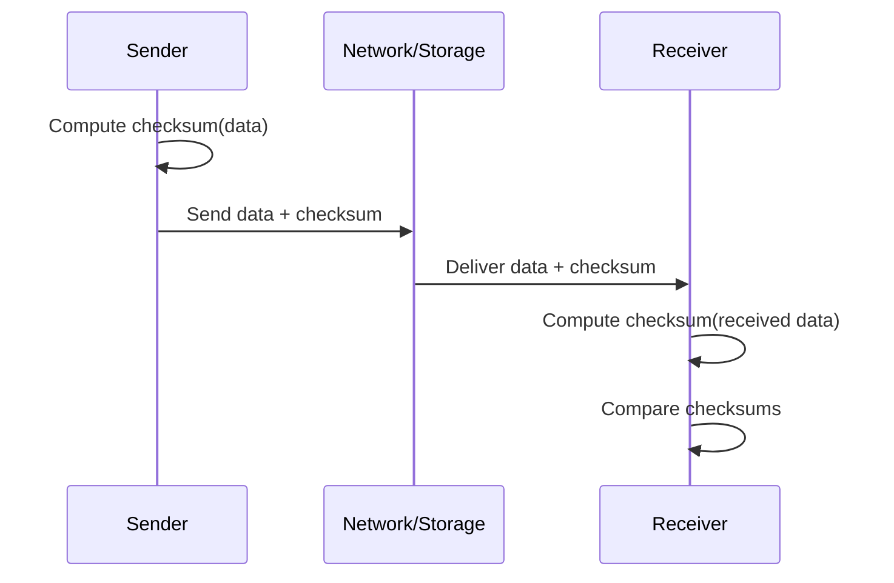

# Checksums

A checksum is a small fixed-size value computed from a block of data so that accidental corruption can be detected later.

Checksums are hashing put to work on the **integrity** job — answering "did these bytes change?" — rather than the distribution job that spreads keys across nodes or the membership job that a Bloom filter does (see [Hashing](./16-hashing.md) for the three roles side by side). The job changes what you want from the function: distribution wants speed and uniformity, integrity wants a high probability that any change to the data changes the digest.

**Core idea:**

- The sender computes a checksum over the data.
- The data and the checksum travel or are stored together.
- The receiver recomputes the checksum over what it actually got.
- Equal means the data is almost certainly intact; unequal means corruption has been detected.

Note the asymmetry. A mismatch is proof that something is wrong. A match is only strong evidence that nothing is, which is why the choice of algorithm is really a choice about how strong that evidence needs to be.

## How checksums work

A mismatch only tells you that the data is bad, not which bits are wrong or how to fix them. Recovery comes from somewhere else: retransmit the segment, read the other replica, or rebuild the block from parity. Error-*correcting* codes such as ECC memory and Reed-Solomon go further and repair the damage, at the cost of extra redundancy.

## What checksums do and do not catch

Detection strength depends on the algorithm, and the differences are large enough to matter in a design discussion.

- **CRC** (cyclic redundancy check) is designed for the error patterns real hardware produces. A CRC-32 catches every single-bit error, every burst of up to 32 corrupted bits, and any odd number of flipped bits. For corruption that does not fit those patterns, the residual chance of a collision is roughly `2^-32`, about one in four billion.
- **Simple additive checksums** such as the 16-bit one's-complement sum used by IP, TCP, and UDP are far weaker. They are cheap enough to compute in a hot packet path, but they miss whole classes of errors, including reordered 16-bit words.
- **Cryptographic hashes** such as SHA-256 make it computationally infeasible to find any two inputs with the same digest, so they detect adversarial as well as accidental change.

No checksum stops deliberate tampering on its own. An attacker who modifies the data simply recomputes the checksum over the new bytes and replaces it. Detecting that requires a secret the attacker does not have, which is what a MAC or a digital signature provides.

## Checksum vs hash vs MAC

| Technique    | Goal                     | Protects against             | Typical cost           | Example     |
| ------------ | ------------------------ | ---------------------------- | ---------------------- | ----------- |
| **Checksum** | Accidental corruption    | Random bit flips and bursts  | Negligible             | CRC32C      |
| **Hash**     | Integrity fingerprinting | Any change, including chosen | Moderate CPU           | SHA-256     |
| **MAC**      | Integrity + authenticity | Tampering without the key    | Moderate CPU plus keys | HMAC-SHA256 |

**Rule of thumb:**

- Use a checksum for transport and storage error detection on high-throughput paths.
- Use a cryptographic hash when the fingerprint also identifies the content, as in deduplication, content addressing, or artifact verification.
- Use a MAC or a digital signature whenever an attacker, rather than a faulty cable, is in the threat model.

## Common algorithms

| Algorithm          | Output size   | Speed          | Use it for                                                                          |
| ------------------ | ------------- | -------------- | ----------------------------------------------------------------------------------- |
| **CRC32 / CRC32C** | 32-bit        | Very fast      | Packets, storage blocks, log records; CRC32C is hardware-accelerated on modern CPUs |
| **Adler-32**       | 32-bit        | Very fast      | Legacy compressed streams such as zlib; weaker than CRC32 on short inputs           |
| **xxHash**         | 32/64/128-bit | Extremely fast | Bulk in-memory verification where speed dominates                                   |
| **MD5**            | 128-bit       | Moderate       | Legacy integrity fields only; broken for anything security-related                  |
| **SHA-256**        | 256-bit       | Moderate       | Content addressing, artifact and backup verification                                |
| **HMAC-SHA256**    | 256-bit       | Moderate       | Integrity plus authenticity, using a shared secret                                  |

CRC32C is the usual default for new systems that need pure error detection: it has CRC-32's detection properties and a dedicated CPU instruction on x86-64 and ARM, so it is effectively free on the data path.

## Where do checksums appear in systems?

### Network communication

- Ethernet appends a CRC-32 frame check sequence, and corrupted frames are dropped by the receiving NIC.
- IP, TCP, and UDP carry a 16-bit checksum; a failed TCP checksum drops the segment and the sender retransmits it.
- TLS goes further, using authenticated encryption so that both accidental corruption and tampering are rejected.

### Storage systems

- Databases and file systems store a checksum per page or block. PostgreSQL can enable per-page checksums, and ZFS keeps a checksum of every block in the block pointer that refers to it.
- Background scrubbing jobs re-read cold data and verify those checksums, so latent disk corruption is found before someone needs the data.
- With redundancy in place, a detected bad block can be rebuilt from a replica or from parity rather than merely reported.

### Replication and backups

- A replication or copy pipeline compares checksums at the source and the destination, and a mismatch triggers repair, replay, or re-transfer ([Database Replication](./23-database-replication.md)).
- Kafka stores a CRC32C over each record batch, so a broker or consumer detects a corrupted batch instead of serving it.
- Backup tools record a checksum per file or chunk, which is also what makes an incremental backup able to tell changed data from unchanged data.

### API and file upload workflows

- Clients send a checksum alongside the payload, such as an S3 upload with a `Content-MD5` or CRC32C header, and the server rejects the object if its own computation disagrees.
- Multipart uploads checksum each part independently, so a single bad part is retried instead of the whole transfer.

## End-to-end integrity

Every checksum above covers one hop or one layer.
A TCP checksum protects a segment on the wire, and an Ethernet CRC protects a frame between two adjacent devices.
Neither covers the data while it:

- Sits in a router's memory
- Passes through a proxy that terminates and re-establishes the connection
- Is copied between application buffers

Corruption introduced in those gaps is faithfully re-checksummed by the next hop and forwarded as if it were correct.

This is why serious storage and data pipelines compute a checksum at the original producer, carry it with the data, and verify it at the final consumer, independently of whatever per-hop checks happen in between. The per-hop checks are still worth having, because they catch errors early and cheaply; they just cannot be the only line of defense.

## Trade-offs

**Pros:**

- Very low compute overhead, and hardware-accelerated for the common algorithms
- Detects corruption early, close to where it happened, instead of at the point where it causes a wrong answer
- Small and self-contained: a few bytes stored or transmitted alongside the data

**Cons:**

- No protection against malicious modification, since an attacker recomputes the checksum after changing the data
- Detects but does not repair, so it is only useful next to a retry, replica, or parity path
- Stronger algorithms cost real CPU on high-throughput paths
- Verification is only as good as its coverage: a checksum that is never checked, or checked only at one hop, provides no guarantee

## Common pitfalls

- **Treating a checksum as a security control**: Error detection is not authentication. Use a MAC or a signature when tampering matters.
- **Verifying at only one hop**: Per-hop checks leave gaps at every boundary, so add an end-to-end check for data that must not silently corrupt.
- **Mixing algorithms across producers and consumers**: Both sides must agree on the algorithm, the byte range covered, and the seed, or every comparison fails, or worse, silently succeeds against the wrong bytes.
- **Storing the checksum with no independent path to fix a mismatch**: Detection without a replica or parity source turns silent corruption into a loud outage instead of a repair.
- **Ignoring residual collision risk at scale**: A one-in-four-billion chance per block becomes routine across petabytes, so use a wider digest where a missed corruption would be unacceptable.

## Interview talking points

- Checksums are for **error detection**, not security; say MAC or signature the moment an attacker enters the threat model.
- Name where the checksum is computed and where it is verified. End-to-end verification is the interesting answer; per-hop is the default.
- Pair detection with a recovery path: retransmit, read another replica, or rebuild from parity.
- CRC32C is the sensible default for throughput-sensitive paths; SHA-256 when the digest also has to identify the content.
- Storage systems need background scrubbing, because corruption that is never read is never detected.

## Reference materials

- [CRC (Cyclic Redundancy Check) Overview](https://en.wikipedia.org/wiki/Cyclic_redundancy_check)
- [TCP Checksum (RFC 9293)](https://datatracker.ietf.org/doc/html/rfc9293)
- [HMAC (RFC 2104)](https://datatracker.ietf.org/doc/html/rfc2104)
- [PostgreSQL Data Checksums](https://www.postgresql.org/docs/current/checksums.html)
