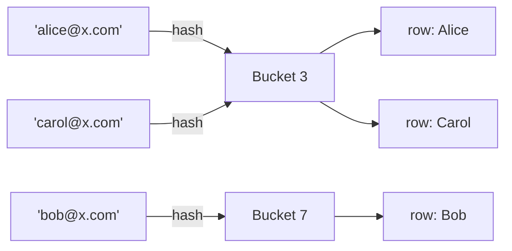
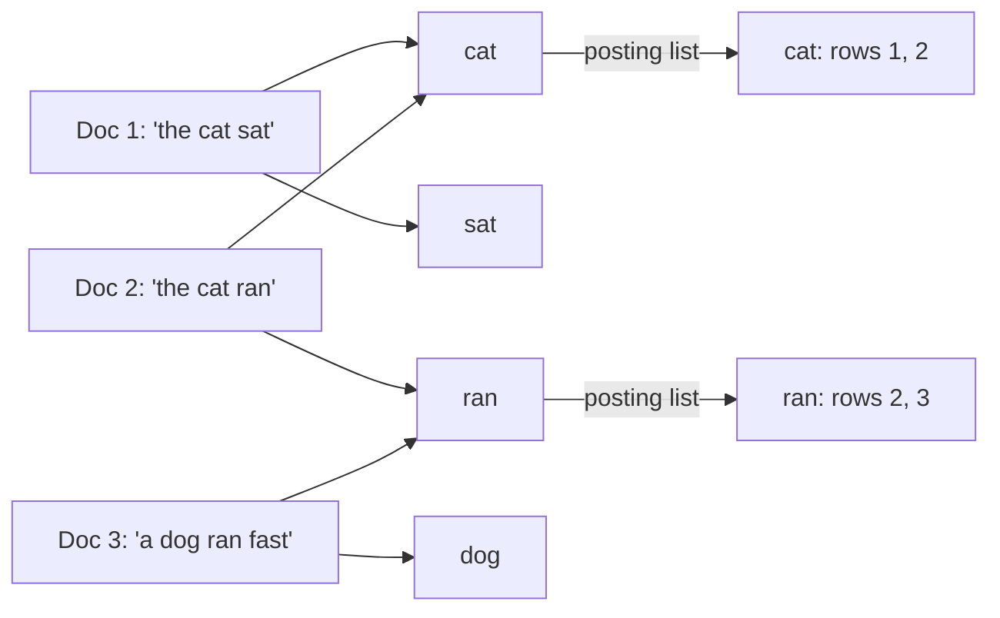

# Database indexes

An index is a **side structure** that finds rows without scanning the whole table.

You pay for it on every write. You pay for it in disk and memory. You get cheaper reads when the predicate matches the index.

This note covers the index structures, how they are implemented, when the query planner will refuse to use them, and how the same structures show up in non-relational stores. The examples are relational because that is where the vocabulary comes from, but almost none of it is specific to SQL.

## What problem does an index solve?

Without an index, `WHERE user_id = 42` reads every row (sequential scan).

With an index on `user_id`, the engine jumps to the matching keys and then to the rows.

```plaintext
table (heap or clustered)
  row, row, row, ...     ← sequential scan: O(n)

index
  sorted keys → row pointers
  lookup 42 → a few pages   ← typically O(log n)
```

Indexes do not help if:

- You still need most of the table (`WHERE year = 2024` on a table that is 90% 2024)
- The predicate does not match how keys are stored (`WHERE YEAR(created_at) = 2024` on a B-tree of `created_at`, unless you have an expression index)
- You index the wrong column for the `WHERE` / `JOIN` / `ORDER BY`

That last case is the common one: an index answers the query it was built for, and no other.

## Types of indexes

Think of indexes as falling into three memorable buckets:

1. **What the database guarantees:** Primary and unique indexes. These enforce rules like "no duplicates here."
2. **How and where is the data organized?** These shape how fast you can find your data e.g. clustered, non-clustered (secondary), composite, covering, and partial indexes. Each changes how your data is mapped for quicker access.
3. **When you need a whole new approach:** Sometimes, the classic B-tree just isn't enough. For specialized questions, you reach for full-text, hash, bitmap, or geospatial indexes. These are the purpose-built tools for searching text, handling coordinates, or managing bitwise queries.

## B-tree / B+tree

The B+tree is the default index type for almost every OLTP workload (`=`, `<`, `>`, `BETWEEN`, `ORDER BY`, or a prefix of a composite key). Everything later in this note is a specialization for a workload the B+tree handles badly, so start here.

### B+tree structure

A **B+tree** keeps all row pointers in the **leaves**. Internal nodes only have separator keys and child pointers.

```plaintext
                 [Root page: 50 | 90]
                  /      |         \
            [20 | 40]  [70]    [100 | 120]
              /          |            \
    [10,20,30,40] --> [50,60,70] --> [90,100,110,120]

Leaf pages (left to right):
[10,20,30,40] --> [50,60,70] --> [90,100,110,120]
```

A lookup for key `65` walks root → `[50, 90]` picks the middle child (50 ≤ 65 < 90) → `[70]` picks the left child (65 < 70) → the leaf `50, 60, 70`: three page reads regardless of table size, as long as the tree stays this shallow.

**The leaf chain**: each leaf points to the next one, so a range scan (`created_at > yesterday`) walks forward through leaves without ever going back up to the root.

**B-tree** (without the plus) can store records in internal nodes too. The storage engines that matter in practice are B+tree-like, and "B-tree index" in everyday usage means this structure.

### Why B+trees stay shallow

Each node is a **page** (often 8KB or 16KB), and fanout — how many separator keys and child pointers fit in one page — is usually in the hundreds, because a key is small (an 8-byte integer, say) next to an 8KB page.

Concretely, with a conservative fanout of 100 and roughly 100 rows per leaf page:

| Level    | Pages at this level | Cumulative rows reachable |
| -------- | ------------------- | ------------------------- |
| Root     | 1                   | —                         |
| Internal | ~100                | —                         |
| Internal | ~10,000             | —                         |
| Leaves   | ~1,000,000          | ~100,000,000              |

Three hops from root to leaf (`100 x 100 x 100` = one million leaf pages) at `100` rows per leaf already reaches **100 million rows** in a **4-level** tree. Real fanout is usually well above 100 — a narrow integer key can fit 500+ entries in an 8KB page — which is why a production table with a few hundred million rows is typically only 3-4 levels deep, and growing to a billion rows costs at most one more level.

That is the whole reason a B+tree lookup is described as "a handful of page reads": the height grows **logarithmically**, not linearly, with row count, and the upper levels are small enough (a few thousand pages at most) to stay cached in memory, so most lookups only pay for the leaf read.

### Writes and page splits

Insert finds the leaf and puts the key there.

If the leaf is full, it **splits**: half the keys move to a new page, and the parent gets a new separator key. Splits can cascade to the root, growing the tree by one level.

Random inserts (for example UUIDv4 as the primary key of a clustered table) split constantly and fragment pages. Append-ish keys (`bigserial`, a time-ordered ULID or UUIDv7) land on the right edge instead, which is cheaper and keeps the index dense.

When rows are deleted, the space they occupied in the index's leaf pages becomes unused—these are called "holes." Over time, as deletes and updates occur, these holes accumulate, making the index take up much more space than it needs for the actual data it contains. This wasted, unused space is what creates a **bloated index**: an index that is larger and less efficient than necessary because of leftover gaps.

Engines can compact a bloated index—using techniques like lowering the fillfactor, running `VACUUM`, or merging pages—but if left unchecked, index bloat can degrade read and write performance and waste storage.

### What queries does a B+tree support?

- **Equality**: `user_id = 42`
- **Range**: `created_at > yesterday`
- **Sort**: `ORDER BY created_at`, when the index order matches the requested order
- **Prefix**: the longest left prefix of a composite index (see below)

It does not turn `WHERE LOWER(email) = ...` into a seek unless you indexed `LOWER(email)`.

## Clustered vs secondary indexes

The B+tree above describes the shape. Where the **row data** sits relative to it is a separate decision, and it is the one that decides how many hops a lookup costs.

**Clustered index:** the table **is** the index.

Rows are stored in key order in the leaves. InnoDB's primary key is clustered, so a lookup by primary key goes through one structure instead of index-then-heap.

**Secondary (non-clustered) index:** a separate tree whose leaves hold `(indexed columns) → row locator`.

- **Postgres**: The locator is the `ctid` (heap file and offset); the table heap is unordered.
- **InnoDB**: The locator is the **primary key**, so a secondary lookup goes index → primary key → clustered row, one extra hop.

This is why a wide primary key is expensive in InnoDB: every secondary index stores a copy of it.

**Index-only scan:** the index leaf already holds every column the query needs, so the engine never touches the table. Postgres can skip the heap only if the visibility map says the page is all-visible.

**Covering indexes** (`INCLUDE`d extra columns, or extra columns in a composite key) exist to make this possible, at the cost of a fatter index and slower writes.

## Composite indexes and the left prefix

Index `(user_id, created_at)` is one B-tree on the pair, sorted by `user_id` first.

It can seek:

- `user_id = 42`
- `user_id = 42 AND created_at > t`

It generally **cannot** seek:

- `created_at > t` alone

The left column is the first sort key, and skipping it is like searching a phone book with no last name.

`ORDER BY user_id, created_at` can ride this index. `ORDER BY created_at` cannot.

Put equality columns first, then the range column, matching the query — or create a second index for the other shape.

## Unique, partial, and expression indexes

- **Unique index**: A lookup structure **and** a constraint. Two rows with the same key cannot both commit, which is how a relational engine enforces "unique email."
- **Partial index**: Indexes only the rows matching a predicate, for example `WHERE status = 'open'`. Much smaller on a table where 1% of rows are open, but only queries that imply that predicate can use it.
- **Expression / functional index**: Built on a computed value, for example `LOWER(email)` or `(data->>'sku')`. The query has to use the same expression verbatim to benefit.

The B+tree family above covers almost every OLTP need. The structures below exist for the workloads it handles badly: pure equality at memory speed, low-cardinality analytics, many values per row, and write-heavy ingest.

## Hash indexes

The key is hashed into a **bucket**. Equality only (`=`).



`alice@x.com` and `carol@x.com` hash into the same bucket (a collision) — a lookup for either one scans that bucket's short chain of entries to find the exact match. Buckets have no order relative to each other, which is exactly why this structure cannot serve a range or `ORDER BY`: there's nothing to walk between "bucket 3" and "bucket 4."

No order, no range scans, and no `ORDER BY` served from the index.

Useful for exact-match dictionaries, and less useful as a general-purpose index, since a B-tree also answers equality and answers everything else too. Postgres hash indexes exist and have been crash-safe since they became WAL-logged, but they are still not the usual default. InnoDB's adaptive hash index is an in-memory accelerator on top of the B-tree, not a durable index you create.

**Creating one:**

```sql
-- Postgres: an explicit, durable hash index
CREATE INDEX idx_users_email_hash ON users USING HASH (email);
```

MySQL's default engine (InnoDB) does not let you create a hash index at all — only its internal, automatic adaptive hash index exists, and there is no DDL that targets it. The `HASH` index type is only available on the `MEMORY` storage engine, which is not durable (the table's contents do not survive a restart):

```sql
CREATE TABLE session_cache (
    session_id VARCHAR(64) PRIMARY KEY,
    user_id BIGINT,
    INDEX idx_user_id (user_id) USING HASH
) ENGINE = MEMORY;
```

## Bitmap indexes

For each distinct value, the index keeps a **bit vector**: one bit per row, set to `1` wherever that row has that value.

```plaintext
Rows:                1  2  3  4  5  6  7  8
---------------------------------------------
status='open':       1  0  1  1  0  1  0  1
region='eu':         1  1  0  1  0  0  1  1
---------------------------------------------
AND (both = 1):      1  0  0  1  0  0  0  1
                     ^        ^           ^
                   row 1    row 4       row 8

Rows 1, 4, and 8 are the only ones where both bitmaps have `1`s (i.e., both conditions are true).
```

`status = 'open' AND region = 'eu'` becomes two bitmaps **ANDed** together bit by bit — rows 1, 4, and 8 come out as matches, found without reading a single row of the table yet.

Good when:

- Cardinality is **low** (status, country, boolean) — a handful of bitmaps, each cheap to store and AND
- Reads are analytical
- Updates are rare, because flipping a bit inside a huge bitmap locks and rewrites a large chunk of it

That last point rules them out for an OLTP primary key.

**Creating one:** genuine stored bitmap indexes exist in Oracle and a few analytical databases:

```sql
-- Oracle
CREATE BITMAP INDEX idx_orders_status ON orders (status);
```

**Neither Postgres nor MySQL let you create one.** MySQL has no bitmap index type at all — every access goes through a B-tree or a full scan. Postgres has no stored bitmap index either, but its planner *builds one on the fly, in memory* from ordinary B-tree indexes whenever that's the cheapest available plan. That on-the-fly version is the "bitmap scan" below, and it needs no special DDL — it just happens when the planner decides it's worthwhile.

### How a Postgres bitmap scan actually works

Given two ordinary B-tree indexes, `idx_orders_status` and `idx_orders_region`, this query:

```sql
SELECT * FROM orders WHERE status = 'open' AND region = 'eu';
```

can produce a plan shaped like this (real `EXPLAIN` output, trimmed):

```plaintext
Bitmap Heap Scan on orders
  Recheck Cond: (status = 'open' AND region = 'eu')
  ->  BitmapAnd
        ->  Bitmap Index Scan on idx_orders_status
              Index Cond: (status = 'open')
        ->  Bitmap Index Scan on idx_orders_region
              Index Cond: (region = 'eu')
```

Read it bottom-up, in the order Postgres actually executes it:

1. Bitmap Index Scan on `idx_orders_status`: Walk that B-tree, and instead of fetching rows, record the *location* (`ctid`) of every row where `status = 'open'` into an in-memory bitmap.
2. Bitmap Index Scan on `idx_orders_region`: Same thing for `region = 'eu'`, from the separate `idx_orders_region` B-tree, into a second bitmap.
3. `BitmapAnd` AND the two bitmaps together: the result is exactly the row locations matching both conditions, and no heap page has been touched yet.
4. `Bitmap Heap Scan`: Sort those surviving locations by physical page order, then read each needed heap page **once**, even if several matching rows live on it.

Step 4 is the entire payoff: an ordinary index scan would jump to the heap once per matching row, in whatever order the B-tree happens to visit them — for a few hundred scattered matches, that is a few hundred random reads. The bitmap scan turns the same work into one sequential-ish pass over only the pages that actually contain a match.

`Recheck Cond` exists because a very large bitmap can be compressed down to whole pages instead of individual rows once it outgrows `work_mem`; in that case Postgres re-checks the real row against the condition after fetching the page, rather than trusting a bit that only means "this page has a match somewhere."

## Inverted indexes (GIN, full-text, JSON)

One row has **many** index entries: words in a document, elements of an array, keys in a JSON blob. A B-tree maps one row to one entry; an inverted index flips that around — it is built from the *values inside* a row, and each value points back to every row that contains it.

### How it's built

1. **Extract terms** from each row's value: split text into words (tokenize), pull elements out of an array, or flatten a JSON document's keys and values.
2. **Normalize** text terms: lowercase, strip punctuation, and usually stem (`running` → `run`) and drop stopwords (`the`, `a`) — this is what makes a full-text search for `run` also match `running`.
3. **Build a posting list per term**: for every distinct term, keep a sorted list of the row IDs that contain it.



That is a **GIN** (Generalized Inverted Index) in Postgres, or a Lucene segment in Elasticsearch — same idea, different engine.

### How a query uses it

`body @@ 'cat & ran'` (documents containing both "cat" and "ran") intersects the two posting lists: `cat: [1, 2]` and `ran: [2, 3]` share only row `2`. Postgres represents a large posting list internally as a compressed bitmap, so this intersection is the same AND-of-bitmaps operation the [bitmap scan](#how-a-postgres-bitmap-scan-actually-works) above does — an inverted index and a bitmap index are solving related problems with the same trick.

- **Cheap**: Answering "which rows contain `error` and `timeout`?" by intersecting two posting lists
- **Expensive**: Updating a document, since one row touches many posting lists — a 50-word document means up to 50 posting-list updates for a single row write

### Creating one

```sql
-- Postgres: full-text search over a text column
CREATE INDEX idx_docs_body_fts ON documents USING GIN (to_tsvector('english', body));

-- Postgres: indexing the keys/values inside a JSONB column
CREATE INDEX idx_docs_data_gin ON documents USING GIN (data jsonb_path_ops);
```

MySQL has no index type named `GIN`, but its `FULLTEXT` index is the same underlying idea — a posting list per word, built and queried the same way:

```sql
CREATE FULLTEXT INDEX idx_docs_body_ft ON documents (body);
SELECT * FROM documents WHERE MATCH(body) AGAINST('cat ran' IN BOOLEAN MODE);
```

**GiST** is a generalized tree for types a B-tree does not order well (geometry, ranges, nearest-neighbour searches). Think "pluggable B-tree," not "inverted" — it does not build posting lists at all.

## LSM trees (write-optimized stores)

A B+tree updates a page **in place**: finding the right leaf and mutating it means random disk I/O, and a full page means a split. A **log-structured merge (LSM) tree** avoids that by never updating in place at all — every write is an append, and the structure is reorganized later, in the background.

Used by Cassandra, RocksDB, LevelDB, Lucene, and as the storage engine inside many other systems. It is a great fit for write-heavy workloads where the data is append-only (time series, logs, wide-column stores) and the reads are relatively rare.

### How it's built: the write path

```plaintext
 +--------+           +--------------------+
 | Write  |---+-----> | Memtable (RAM,     |
 +--------+   |       |  sorted, mutable)  |
              |       +--------------------+
              |            |
              v            |
    +----------------+     |
    | Write-ahead    |     |
    | log (WAL,      |     |
    | append-only,   |     |
    | on disk)       |     |
    +----------------+     |
                           v
                [memtable full: flush]
                           |
                           v
                +-------------------------------+         
                | SSTable, level 0              |         
                | (immutable, sorted, on disk)  |         
                +-------------------------------+
                           |
                       [compact]
                           |
                           v
                +-------------------------------+         
                | SSTable, level 1 (fewer,      |         
                | larger, still sorted)         |         
                +-------------------------------+
                           |
                       [compact]
                           |
                           v
                +-------------------------------+         
                | SSTable, level 2 ...          |         
                +-------------------------------+
```

1. A write goes to the **write-ahead log** (for crash durability) and into the **memtable**, an in-memory sorted structure. The memtable stores key-value pairs and keeps them sorted by key, so you can quickly look up, insert, or merge entries in key order. Both the WAL and memtable are pure appends: no disk seeking, and no B-tree page splits.
2. When the memtable fills up, it is **flushed** to disk as an **SSTable** (sorted string table): an immutable, already-sorted file. Immutable is the key word — once written, an SSTable is never edited again, only eventually deleted.
3. Flushing repeatedly produces many small SSTables. A background process **compacts** them: it merges several sorted SSTables into fewer, larger ones — the same merge step as merge-sort — dropping any key that a newer SSTable has since overwritten or deleted.

A delete does not remove anything immediately either: it writes a **tombstone**, a marker meaning "this key is gone," which is itself just another entry that compaction removes once it has merged past every older copy of that key.

### How a read works, and why it costs more

A key can exist in the memtable and in several SSTables at once — the true value is whichever copy is newest. A point read checks, from newest to oldest, until it finds the key or runs out of places to look:

1. The memtable (RAM, checked first — it always has the most recent data)
2. SSTable level 0 (possibly several, since level-0 files can have overlapping key ranges)
3. SSTable level 1, then level 2, and so on

Checking every level on every read would be slow, so each SSTable keeps a [Bloom filter](./17-bloom-filters.md) of the keys it contains — a fast, definite "not in this file" check that lets a read skip most SSTables without opening them.

### The trade-off

- **Writes are fast**: sequential appends only, no in-place mutation, no page splits — the opposite of a B+tree's random-write cost.
- **Reads do more work**: a hot B+tree answers a read in one page fetch; an LSM tree may check the memtable plus several SSTables, even with Bloom filters cutting most of them out.
- **Compaction is the hidden cost**: background disk and CPU work that competes with live traffic, and until it runs, overwritten or deleted data still occupies disk — "write amplification," because the same logical write gets physically rewritten to disk again each time it moves to a lower level.

This is why LSM trees show up in high-ingest, write-heavy stores (time series, logs, wide-column stores) rather than as the default for a general OLTP table, where a B+tree's balance of read and write cost usually wins.

## What does amplification mean?

Amplification is the "hidden tax" of an index or data structure, where you pay extra IO and storage to gain query flexibility or throughput at steady state.

- **Write Amplification:** The ratio of physical bytes written to storage, to logical bytes the application actually wanted to write. If you update a row and, due to the index or storage engine structure (e.g., LSM or B+tree), the database ends up writing the data several times (logs, indexes, compaction), write amplification is greater than 1. LSM trees, for instance, can have higher write amplification due to compactions and rewriting data as SSTables advance through levels.

- **Storage Amplification:** The ratio of the total bytes on disk to the logical size of the data. Overwrites, deleted-but-not-yet-compacted tombstones, and extra copies in indexes all increase storage amplification. A system with lots of versions, uncollected garbage, or highly-redundant indexes can store several times the "true" dataset size.

- **Read Amplification:** The number of physical reads (IO operations) per logical read the application asked for. If getting a row always causes a disk seek plus several index page reads (B+tree), or if an LSM engine has to check the memtable and multiple levels of SSTables, that's read amplification. Bloom filters and caches can help reduce it, but never eliminate it.

**Rule of thumb:**  
Amplification is the "hidden tax" of an index or data structure, where you pay extra IO and storage to gain query flexibility or throughput at steady state.

## Indexes in non-relational stores

None of the structures above are specific to SQL. What changes in a [non-relational store](./20-non-relational-databases.md) is who maintains the index and how far a lookup has to travel:

- **Document stores**: A secondary index on `status` or `email` is a B-tree over the collection, exactly as it would be over a table.
- **Key-value stores**: The value is opaque, so the key is the only thing indexed. Any other lookup means lifting the field into the key or maintaining a separate index collection yourself.
- **Wide-column stores**: The partition key and clustering columns **are** the primary index, and they fix placement and sort order at design time. An index on any other column is partition-local, so the coordinator has to fan out to every node.
- **Search engines**: The inverted index is the entire product rather than an option — Elasticsearch is the GIN section above, run as its own cluster.
- **LSM-backed engines**: Secondary indexes live in the same SSTable machinery, so index writes are cheap and index reads pay the same multi-level lookup.

The one decision with no single-node relational equivalent is **local vs global** secondary indexes, which a partitioned store forces on you: a local index is cheap to write and expensive to query without the partition key, a global index is the reverse.
See [secondary indexes and the second access path](./20-non-relational-databases.md#secondary-indexes-and-the-second-access-path) for that trade-off and [Partitioning](./24-database-partitioning.md) for how index partitions are placed and resharded.

## Cost model

Every `INSERT` / `UPDATE` / `DELETE` of an indexed column maintains every matching index.

Costs:

- Extra WAL and disk
- Slower writes
- More cache pressure (index pages competing with table pages)
- Longer autovacuum and rebuild windows

**Selectivity** decides whether the index is used at all. An index on a boolean `is_deleted` column where 99% of rows are `false` is useless for `WHERE is_deleted = false` — the planner will read the table instead, correctly. The same index is valuable for `WHERE is_deleted = true`, which is what a partial index exists for.

Too many indexes is a write-latency bug. Too few is a read-latency bug. `EXPLAIN ANALYZE` decides which one you have, not a rule of thumb like "index every foreign key."

## Planner choices

- **Index seek / range scan**: Few rows, good selectivity
- **Bitmap index scan**: Several indexes combined, then heap fetch in physical order
- **Sequential scan**: Cheap when the table is small or most rows qualify
- **Index-only scan**: Every needed column is in the index and visibility allows it

If the row-count estimate is wrong (stale statistics), the planner picks the wrong strategy even with the right index available. `ANALYZE` is part of index operations, not an afterthought.

## Interview talking points

- **Index**: A maintained copy of keys for lookups; every write pays for it.
- **Default (B+tree)**: Short tree, range scans via linked leaves, splits on full pages, and a preference for append-ish keys.
- **Clustered vs secondary**: InnoDB's primary key *is* the table; Postgres uses a heap plus secondary indexes that point into it.
- **Composite indexes**: Follow the leftmost prefix rule — equality columns first, then the range column.
- **Covering / index-only scans**: Avoid the heap entirely, at the cost of a fatter index.
- **Hash vs bitmap**: Hash indexes serve equality only; bitmap indexes suit low-cardinality analytics, not OLTP.
- **LSM vs inverted**: LSM trees suit write-heavy engines; inverted and GIN indexes suit many-values-per-row data.
- **Non-relational stores index too**: The same structures, plus a local vs global choice once the data is partitioned.
