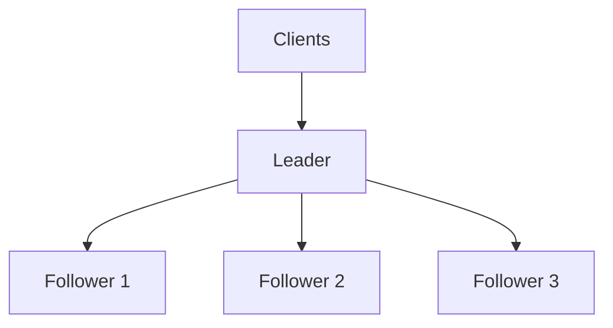

# Leader election

Some jobs only work if exactly one process is doing them: ordering writes to a replica set, running a cron task, assigning partitions to consumers, holding a distributed lock. The leader-follower pattern designates one node as the coordinator (the leader) and the rest as replicas or workers (followers).

Leader election is the mechanism that picks that one node, and picks a new one when the current leader crashes, hangs, or becomes unreachable.

Why a system accepts a single leader:

- **One write coordinator**: All updates pass through one node, so there are no concurrent conflicting writes to reconcile.
- **A natural ordering point**: The leader assigns a single order to operations, which is what replication and log-based systems need.
- **Automatic failover**: Leadership is a role, not a machine, so it can be reassigned in seconds without human intervention.
- **Read scalability**: Followers can serve reads (at the cost of some staleness) while the leader handles writes.

## Leader-follower pattern



**Leader responsibilities:**

- Accepts writes or control-plane operations.
- Coordinates replication and decides the order of updates.
- Sends periodic heartbeats so followers know it is alive.

**Follower responsibilities:**

- Apply updates from the leader.
- Serve reads, in architectures that allow it.
- Detect leader silence and participate in the next election.

## Leader election vs consensus

These two are constantly conflated because Raft does both, so it is worth drawing the line precisely.

- **Leader election** answers "who is allowed to propose right now?" It agrees on a role assignment: one node, for one period of time.
- **[Consensus](./29-consensus.md)** answers "which value or log entry is committed?" It agrees on data, repeatedly, in a fixed order.

The confusing part is that the dependency runs in both directions:

- **Safe election is a consensus problem.** Agreeing on "N3 is the leader for term 7" is agreeing on a single value, so any election that must never produce two leaders needs the same machinery consensus needs: a majority quorum, or an external service that already runs one.
- **Practical consensus uses a leader.** Raft and Multi-Paxos elect a leader so that only one node proposes, which turns the steady state into a single round trip instead of a bidding war between duelling proposers.

The cleanest way to separate them is by what each one is responsible for:

| Question                              | Leader election                             | Consensus                                                  |
| ------------------------------------- | ------------------------------------------- | ---------------------------------------------------------- |
| What is being agreed on               | A role, for a bounded term or lease         | A value, and the position of that value in an ordered log  |
| How often it runs                     | Rarely — only on failure or handoff         | On every committed write                                   |
| What it buys you                      | Liveness and efficiency: one clear proposer | Safety: committed entries never diverge                    |
| What happens if it briefly goes wrong | Two nodes both think they lead              | Two nodes commit different values at the same log position |

That last row is the important one. In a log-replication protocol like Raft, **a brief double-leader situation is not a safety violation**. A stale leader that has lost contact with the majority can still believe it leads, but it cannot commit anything, because commitment requires acknowledgements from a majority quorum and the majority has already moved to a higher term. Safety comes from the quorum rule, not from the election being perfect.

That guarantee only covers state inside the replicated log. The moment the leader has side effects *outside* the protocol — writing to object storage, calling a payment API, mutating a shared database — a stale leader can do real damage, and you need fencing (below) to stop it.

## When an election is triggered

- **Heartbeat timeout**: Followers hear nothing from the leader for a configured window. This is by far the most common trigger.
- **Health check failure**: An external supervisor or the coordination service declares the leader unhealthy.
- **Network partition**: The leader is alive but cut off from a majority, so the majority side elects a replacement.
- **Voluntary handoff**: Planned maintenance, a rolling upgrade, or a rebalance transfers leadership deliberately, which is much faster than waiting for a timeout.

Failure detection is the weak point in all of this.
A distributed system cannot distinguish "the leader crashed" from "the leader is slow" or "the network to the leader is slow" — see [Resilience](./14-resilience.md).
Every election protocol therefore guesses, using a timeout, and the timeout length is a direct trade-off:

- **Short timeouts**: Fail over quickly, but trigger spurious elections during a GC pause or a latency spike.
- **Long timeouts**: Stable, but leave the system leaderless for longer.

## Common election approaches

### Majority-vote election

The cluster elects its own leader by voting, with no external dependency.

- A node that stops hearing heartbeats increments a term (or epoch) number and becomes a candidate.
- The candidate requests votes from every peer.
- Each node votes at most once per term, and only for a candidate whose log is at least as up to date as its own.
- A candidate that collects votes from a **majority quorum** (more than half of all nodes) becomes leader and starts sending heartbeats.

Because a majority is required and every node votes once per term, two candidates cannot both win the same term — any two majorities of the same cluster share at least one node. This is the election mechanism inside Raft; see [Consensus](./29-consensus.md) for the rest of the protocol.

Concretely, in a 5-node cluster the quorum is 3. If the cluster splits 3/2, only the 3-node side can gather 3 votes, so the 2-node side cannot elect anyone no matter how long it waits.

### Lease-based election

Leadership is delegated to an external store that already solves agreement — etcd, ZooKeeper, Consul, or even a database row or blob with a conditional-write primitive.

- A node acquires a lease (a key it owns) with a TTL.
- Only the holder can act as leader, and it must renew the lease before the TTL expires.
- If the holder crashes or stalls, the lease expires and any other node can claim it.

```mermaid
sequenceDiagram
    participant N1 as Node 1
    participant N2 as Node 2
    participant S as Lease Store

    N1->>S: Acquire lease (TTL=10s)
    S-->>N1: Granted
    N2->>S: Acquire lease
    S-->>N2: Denied (held by Node 1)
    N1->>S: Renew lease
    Note over N1: Node 1 stalls; lease expires
    N2->>S: Acquire lease
    S-->>N2: Granted (new fencing token)
```

This is the right default for application-level leadership, such as picking one instance of a service to run a scheduled job. The store's own consensus protocol does the hard part, and the application only has to handle "I hold the lease" and "I do not". The catch is that the lease is a *time-based* guarantee: a leader that is paused by a long GC cycle can wake up believing it still holds a lease that expired several seconds ago.

### Choosing between them

| Approach      | Where agreement lives                  | Use when                                                                             |
| ------------- | -------------------------------------- | ------------------------------------------------------------------------------------ |
| Majority-vote | Inside the cluster's own protocol      | The cluster already replicates a log and cannot depend on an outside service         |
| Lease-based   | In an external coordination service    | You need one active instance of an application and a coordination service exists     |
| Static/manual | In configuration or an operator's head | Failover is rare and a human is expected to approve it (some primary-replica setups) |

Static assignment is listed for completeness — it is the pattern behind manual database failover. It has no split-brain risk from bad failure detection, because there is no automatic detection, and it trades that for minutes of downtime.

## Split-brain and fencing

Split-brain is the failure where two nodes simultaneously believe they are the leader and both act on it.

A typical way it happens with no network partition at all:

1. Leader `N1` holds a 10-second lease and is writing to shared storage.
2. `N1` hits a 15-second stop-the-world GC pause. It is not dead, just frozen.
3. The lease expires. `N2` acquires it and starts writing.
4. `N1` resumes, unaware that any time has passed, and completes the write it was in the middle of.
5. `N2`'s write is silently overwritten by a leader that stopped being the leader five seconds ago.

Longer timeouts do not fix this, they only make it rarer. The fix is **fencing**: make the shared resource reject work from a stale leader instead of trusting the leader to know it is stale.

- **Fencing token**: The election hands each new leader a number that only ever increases (a Raft term, a ZooKeeper `zxid`, an etcd revision, a lease generation). The leader includes it in every request to the shared resource.
- **The resource enforces it**: Storage remembers the highest token it has seen and rejects anything with a lower one. In the example above, `N1` returns with token 7, the storage has already accepted token 8 from `N2`, and `N1`'s write is refused.
- **STONITH as a blunt alternative**: When the resource cannot check tokens, the surviving side forcibly powers off or isolates the old leader before taking over. Common in traditional HA clusters.

The critical point for interviews is that fencing has to be enforced by the *resource being protected*. A leader checking its own lease before writing does not help, because the pause can happen between the check and the write.

## What clients see during an election

Leadership changes are a write-availability event. The gap has three parts:

1. **Detection**: The heartbeat timeout has to elapse before anyone reacts.
2. **Election**: Candidates request votes and one gathers a majority. Randomized timeouts keep candidates from repeatedly splitting the vote and forcing another round.
3. **Catch-up**: The new leader may have to bring followers into line and commit an entry from its own term before it can safely serve reads.

The size of that window is a design choice, not a constant. Raft's paper suggests heartbeats on the order of tens of milliseconds and randomized election timeouts of a few hundred, giving sub-second failover on a low-latency network. MongoDB, by contrast, defaults its election timeout to around 10 seconds, deliberately preferring stability over speed because a spurious failover of a database primary is expensive.

Applications should handle the gap explicitly rather than assume it away:

- Retry writes with backoff and jitter instead of failing the user request on the first error.
- Make writes idempotent, since a client cannot tell "the old leader never committed this" from "it committed and the response was lost".
- Refresh cached leader addresses on error; do not pin a client to a leader forever.

## Leader election and CAP

A leader-based system with majority-vote election is **CP** in [CAP terms](./27-cap-and-pacelc-theorems.md): during a partition, the minority side has no leader and refuses writes, while the majority side elects one and keeps serving.

That is a deliberate choice, and it shows up in two places:

- **A leader that loses the majority must step down.** Otherwise it would keep accepting writes on the minority side while a new leader accepts different writes on the majority side — split-brain by design.
- **The minority side stays leaderless.** It cannot gather a quorum of votes, so it correctly refuses to invent a leader.

A system that instead lets both sides keep accepting writes has chosen **AP**, and it needs conflict resolution rather than an election — this is why leaderless designs such as Dynamo-style stores have no leader election at all.

## Design guidelines

- **Randomize election timeouts**: Identical timeouts make every follower become a candidate at once, split the vote, and force repeated rounds.
- **Never decide leadership with a single node**: A single arbiter is a single point of failure and a single point of wrong answers. Use a majority quorum or a service that runs one.
- **Fence at the resource**: Assume the old leader will come back and try to write. Token checks belong in the storage layer, not the application.
- **Size the cluster odd**: 3 or 5 nodes. An even cluster costs a node without improving the number of failures it can survive — see [Consensus](./29-consensus.md).
- **Tune timeouts to the real latency profile**: A cross-region cluster needs different values than a single-rack one, and GC or disk stalls, not the network, are usually what trips detection.
- **Keep leader work small**: The leader is a throughput ceiling. Move reads to followers or shard by key so each shard elects its own leader.
- **Drill failover**: Kill the leader in a controlled way on a schedule. Failover paths that are never exercised are the ones that fail.

## Real-world examples

- **Kubernetes controllers**: Each controller instance races to hold a `Lease` object in the API server; the holder is active and the rest idle. Textbook lease-based election on top of etcd.
- **etcd and Consul**: Elect their own leader with Raft, then expose leases and locks so applications can do lease-based election without implementing a protocol.
- **Kafka**: The controller is elected through the cluster's metadata quorum, and each partition has a leader replica that handles all its produce and fetch traffic.
- **MongoDB replica sets**: Secondaries hold an election when the primary's heartbeats stop, and writes pause until a new primary exists.
- **Primary-replica SQL**: An external orchestrator (Patroni for PostgreSQL, Orchestrator for MySQL) watches the primary and promotes a replica, usually backed by etcd or ZooKeeper for the agreement part.

## Interview talking points

- State the boundary first: election picks who proposes, consensus decides what commits. Then say Raft does both.
- Default to "use etcd, ZooKeeper, or Consul" for application-level leadership. Rolling your own election is a red flag unless the system genuinely cannot depend on an external service.
- Bring up split-brain before the interviewer does, and describe fencing tokens enforced by the resource — not a longer timeout — as the fix.
- Quantify the failover window: detection plus election plus catch-up, and say which one dominates in your design.
- Note that the leader is a write bottleneck, and that the answer is partitioning with a leader per partition rather than a faster leader.
- Connect it back to CAP: automatic majority-based failover is the CP posture, and the minority side losing writes is the price.

## Reference materials

- [Leader Election pattern (Azure Architecture Center)](https://learn.microsoft.com/en-us/azure/architecture/patterns/leader-election)
- [How to do distributed locking (Martin Kleppmann)](https://martin.kleppmann.com/2016/02/08/how-to-do-distributed-locking.html)
- [etcd leader election API](https://etcd.io/docs/latest/dev-guide/api_concurrency_reference_v3/)
