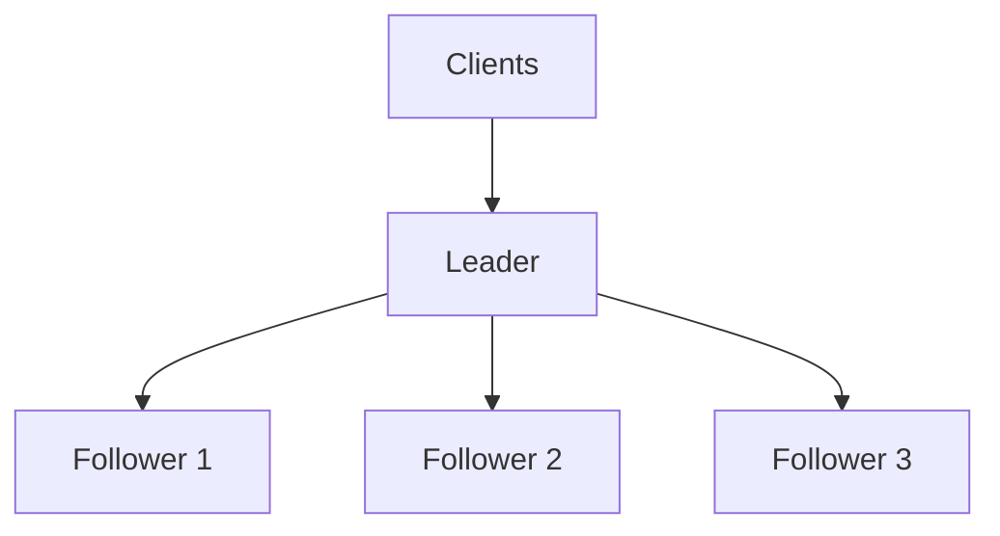
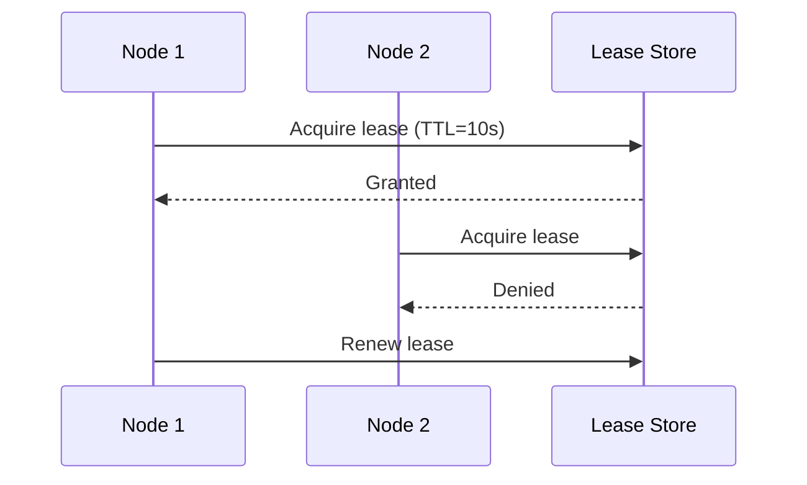

# Leader Election

The leader-follower pattern assigns one node as coordinator (leader) and others as replicas/workers (followers).

Leader election is the mechanism that selects a new leader when the current one fails or becomes unreachable.

**Why this pattern is used:**

- **Single write coordinator**: Reduces conflicting updates
- **Fast failover**: New leader can be promoted automatically
- **Scalability**: Followers can handle reads or parallel work

## Leader-Follower Pattern

### Typical Responsibilities

**Leader**

- Accepts writes or control-plane operations
- Coordinates replication and ordering
- Sends heartbeats to show liveness

**Followers**

- Replicate leader updates
- Serve reads in some architectures
- Participate in election when leader is unavailable

## Election Triggers

Leader election usually starts when:

- Heartbeats from leader stop for a timeout window
- Health checks detect leader failure
- Network partition isolates the current leader
- Planned maintenance requires leadership transfer

## Common Election Approaches

### Quorum Voting (Majority-Based)

- Candidate requests votes from peer nodes
- Node with majority votes becomes leader
- Prevents multiple leaders in normal conditions
- Widely used in production systems

### Lease-Based Election

- Leadership is tied to a renewable lease with TTL
- If lease expires, other nodes can acquire leadership
- Simple mental model with automatic expiration
- Needs careful timeout and clock-skew handling

## Failure Modes and Trade-offs

**Pros:**

- ✅ Clear coordination boundary
- ✅ Easier conflict handling for writes
- ✅ Predictable failover path

**Cons:**

- ❌ Leader can become bottleneck under heavy write load
- ❌ Election periods can cause short unavailability
- ❌ Split-brain risk if failure detection is weak

## Design Guidelines

- Keep election timeouts randomized to avoid vote collisions
- Use quorum rules; avoid leadership decisions by a single node
- Fence old leaders after failover to prevent double-writes
- Tune heartbeat and timeout values for your network latency profile
- Test failover regularly with chaos/fault-injection drills

## Real-World Examples

- **Kubernetes control plane**: Controllers use leader election for active coordinator selection
- **etcd/Consul-backed services**: Use leases and quorum-based elections
- **Primary-replica databases**: Promote a replica when primary fails

## Related Topic

Leader election decides *who leads*. Consensus decides *what value/state the cluster accepts*.

See [Consensus](./29-consensus.md) for the agreement protocol side.

## Reference Materials

- [Implementing Lease-Based Leader Election Using Azure Blob Storage](https://learn.microsoft.com/en-us/azure/architecture/patterns/leader-election)
