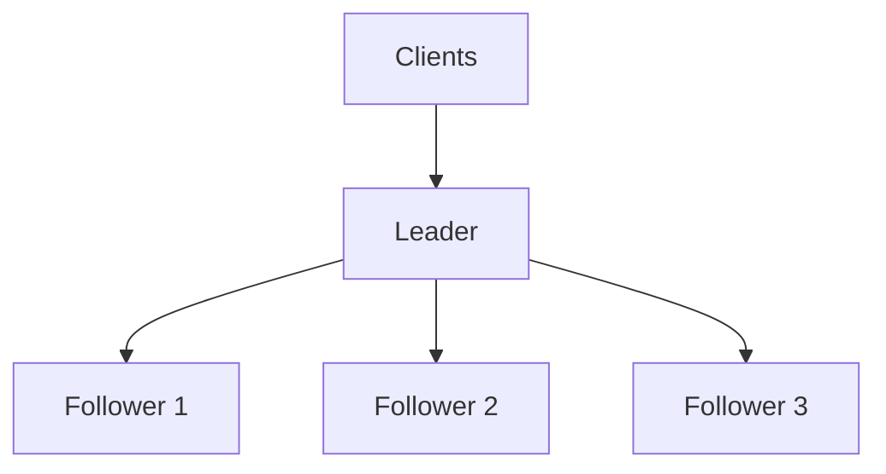
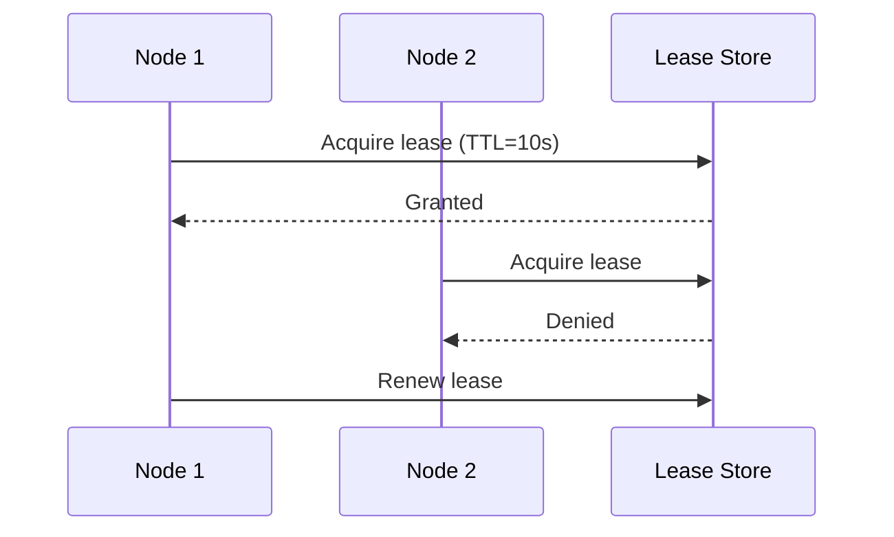

# Leader election

The leader-follower pattern assigns one node as coordinator (leader) and the others as replicas or workers (followers).

Leader election is the mechanism that selects a new leader when the current one fails or becomes unreachable.

**Why this pattern is used:**

- **Single write coordinator**: Reduces conflicting updates
- **Fast failover**: A new leader can be promoted automatically
- **Scalability**: Followers can handle reads or parallel work

## Leader-follower pattern

### Typical responsibilities

**Leader**

- Accepts writes or control-plane operations
- Coordinates replication and ordering
- Sends heartbeats to show liveness

**Followers**

- Replicate leader updates
- Serve reads in some architectures
- Participate in election when the leader is unavailable

## Election triggers

Leader election usually starts when:

- Heartbeats from the leader stop for a timeout window
- Health checks detect leader failure
- A network partition isolates the current leader
- Planned maintenance requires a leadership transfer

## Common election approaches

### Quorum voting (majority-based)

- A candidate requests votes from peer nodes
- The node with a majority of votes becomes leader
- Prevents multiple leaders under normal conditions
- Widely used in production systems

### Lease-based election

- Leadership is tied to a renewable lease with a TTL
- If the lease expires, other nodes can acquire leadership
- Simple mental model with automatic expiration
- Needs careful timeout and clock-skew handling

## Failure modes and trade-offs

**Pros:**

- Clear coordination boundary
- Easier conflict handling for writes
- Predictable failover path

**Cons:**

- The leader can become a bottleneck under heavy write load
- Election periods can cause short unavailability
- Split-brain risk if failure detection is weak

## Design guidelines

- Keep election timeouts randomized to avoid vote collisions
- Use quorum rules; avoid leadership decisions by a single node
- Fence old leaders after failover to prevent double-writes
- Tune heartbeat and timeout values for your network's latency profile
- Test failover regularly with chaos/fault-injection drills

## Real-world examples

- **Kubernetes control plane**: Controllers use leader election to select the active coordinator
- **etcd/Consul-backed services**: Use leases and quorum-based elections
- **Primary-replica databases**: Promote a replica when the primary fails

## Leader election vs consensus

Leader election decides *who leads*. Consensus decides *what value or state the cluster accepts*.

See [Consensus](./29-consensus.md) for the agreement protocol side.

## Reference materials

- [Implementing Lease-Based Leader Election Using Azure Blob Storage](https://learn.microsoft.com/en-us/azure/architecture/patterns/leader-election)
