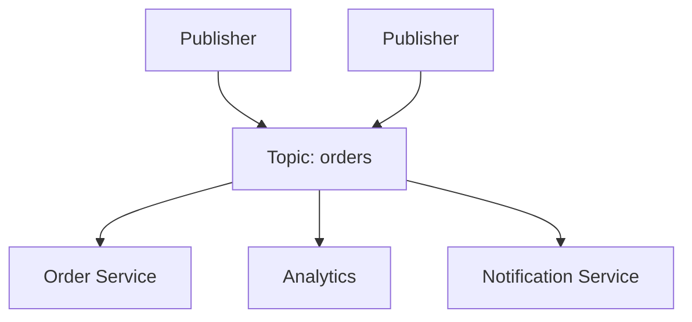

# Pub/Sub (Publish/Subscribe)

Pub/Sub decouples message producers (publishers) from consumers (subscribers) through a broker/topic layer.

Publishers send events to topics without knowing subscribers. Subscribers receive only topics they care about.

## Why Use Pub/Sub

- Loose coupling between services
- Easy fan-out to multiple consumers
- Async processing and better burst handling
- Simple extension (add new subscriber without changing publisher)

## Core Components

- **Publisher**: Sends messages/events to a topic
- **Topic**: Named channel for routing
- **Subscriber**: Consumes messages from subscribed topics
- **Broker**: Routes, buffers, and delivers messages (Kafka, SNS/SQS, RabbitMQ exchanges, etc.)

## Typical Use Cases

- Event-driven microservices (order created, payment completed)
- Real-time analytics and audit pipelines
- Notifications and activity feeds
- Data replication/sync fan-out

## Delivery Semantics

### At-Most-Once

- Message may be lost, no duplicates
- Fastest, least reliable
- Use for metrics/non-critical telemetry

### At-Least-Once

- Message delivered one or more times
- Requires ack + retry
- Most common in production systems
- Consumers must be idempotent

### Exactly-Once

- Delivered once with no loss/duplication
- Hard and expensive end-to-end
- Usually achieved by combining at-least-once + idempotency + dedup keys

## Idempotency (Critical)

Because duplicates happen, handlers should be safe to rerun.

Patterns:

- Idempotency keys per business action
- Conditional updates (`WHERE version = ...`)
- State checks before side effects

Example:

- Payment event `pay_123` processed twice should charge once only

## Pub/Sub vs Message Queue

- **Pub/Sub**: One event, many subscribers (broadcast/fan-out)
- **Queue**: One message, one consumer (work distribution)

Use pub/sub when multiple systems must react to the same event.  
Use queues when tasks should be processed once by one worker.

## Common Challenges

- **Ordering**: Hard to guarantee global order across partitions
- **Backpressure**: Slow consumers can lag or overload broker
- **Debugging**: Async flows need strong tracing/logging
- **Schema evolution**: Event contracts must be managed carefully

## Design Guidelines

- Define clear event schemas and versioning
- Include correlation IDs for traceability
- Set retention and replay policies intentionally
- Monitor consumer lag and dead-letter queues
- Design consumers for retries and poison-message handling

## Interview Talking Points

- Pub/sub is for decoupling and fan-out, not point-to-point task routing.
- State delivery semantics explicitly (usually at-least-once + idempotency).
- Mention ordering, lag, replay, and failure handling.
- Distinguish pub/sub from simple job queues.

## Reference Materials

- [Enterprise Integration Patterns - Publish-Subscribe Channel](https://www.enterpriseintegrationpatterns.com/patterns/messaging/PublishSubscribeChannel.html)
