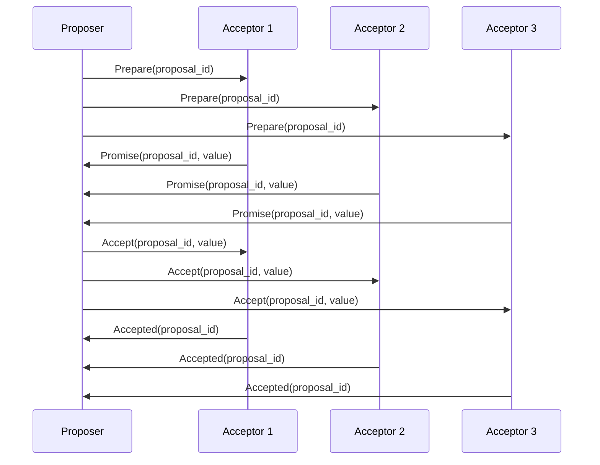
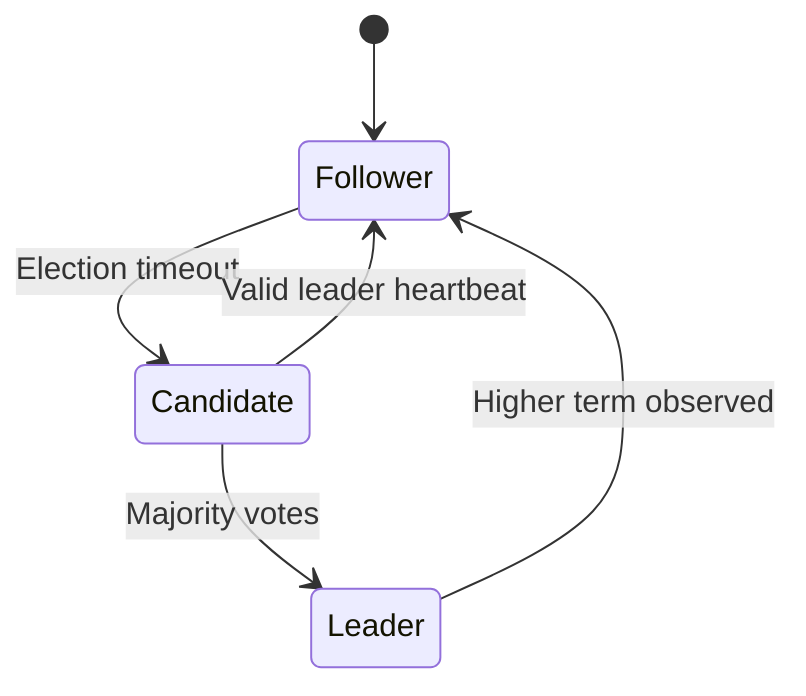
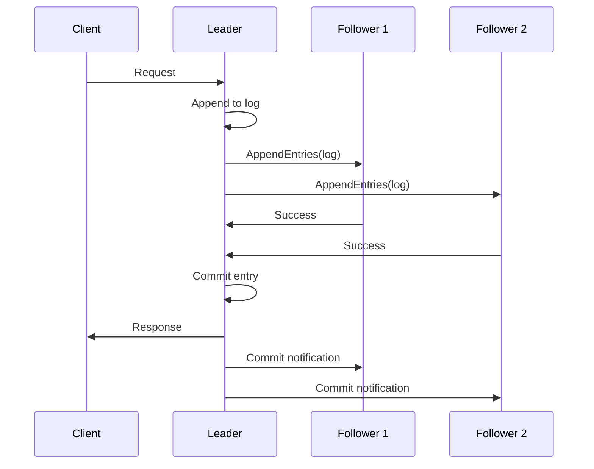

# Consensus

Consensus is the process by which distributed nodes agree on a single value or ordered log of values, despite failures.

It is a core building block for strongly consistent systems such as metadata stores, distributed databases, and control planes.

**Core goals:**

- **Safety**: Nodes do not commit conflicting decisions
- **Liveness**: System can continue making progress when quorum is available
- **Fault tolerance**: Works despite crash failures and message delays

## Why consensus is needed

Without consensus, replicas can diverge under concurrent writes, retries, or network partitions.

Consensus provides:

- A consistent source of truth for cluster state
- Deterministic ordering of commands/transactions
- Safe failover with preserved committed history

## Quorum concept

Most consensus systems rely on quorum (majority agreement).

With 5 nodes, any 3-node quorum overlaps with any other 3-node quorum, which protects safety.

### Why an odd number of nodes is better

Compare two cluster sizes:

| Cluster size | Quorum | Tolerates failure of |
| ------------ | ------ | -------------------- |
| 4 nodes      | 3      | 1 node               |
| 5 nodes      | 3      | 2 nodes              |

Notice something strange? Going from 4 nodes to 5 nodes does not change the quorum size, but it does increase how many failures the system can tolerate.

So, 5 nodes gives us better fault tolerance than 4 nodes, for almost the same cost.

This is why distributed systems usually pick odd numbers of nodes: 3, 5, 7, etc.

### `R + W > N` rule

In quorum systems, choose read quorum `R` and write quorum `W` such that:

- `R + W > N` (read and write quorums always overlap)
- Usually also `W > N/2` (any two write quorums overlap)

Why this matters:

- A read must intersect with the latest successful write, so it can return fresh data
- If `R + W <= N`, read and write sets can be disjoint, which allows stale reads

**Example (`N = 5`)**:

- **Safe**: `R = 2`, `W = 4` -> `2 + 4 = 6 > 5`
- **Unsafe**: `R = 2`, `W = 3` -> `2 + 3 = 5` (can be non-overlapping in edge cases)

#### Overlap alone is not enough

`R + W > N` guarantees that a read quorum intersects the latest write quorum, but it does not by itself identify which returned value is newest.

**Demonstration (`N = 5`, `R = 3`, `W = 3`)**:

1. Client writes `X = "v2"` with version `102`
2. Write is acknowledged by nodes `A, B, C` (quorum met)
3. Due to delay/partial propagation:
   - `A` stores `(v2, 102)`
   - `B` stores `(v2, 102)`
   - `C` stores `(v2, 102)`
   - `D` still has `(v1, 101)`
   - `E` still has `(v1, 101)`
4. A reader queries quorum `B, D, E` and gets mixed results:
   - `B -> (v2, 102)`
   - `D -> (v1, 101)`
   - `E -> (v1, 101)`
5. Reader picks the value with highest version (`102`) => return `v2`
6. Optional read repair updates `D` and `E` toward `(v2, 102)`

**Key point**: Quorum overlap ensures *at least one* replica in the read set can expose the latest committed write, but *version metadata* (timestamp, term/index, vector clock, etc.) is what lets the system choose it correctly.

## Consensus lifecycle (simplified)

1. A leader proposes a log entry/value
2. Replicas acknowledge the proposal
3. Once quorum acknowledges, entry is committed
4. Committed entry is applied to state machines in order

## Main algorithm families

### Paxos

**Mental model**: Paxos gets a majority of nodes to "promise" a proposal order, then "accept" one value for that order.

- Foundational consensus protocol family with strong safety guarantees
- Very robust, but usually harder to implement and explain than Raft
- In practice, systems often use Multi-Paxos to avoid repeating full setup each time

**Step-by-step example (single value, 3 acceptors A/B/C, quorum=2):**

1. Proposer `P1` wants to commit value `X` with proposal number `10`
2. `P1` sends `Prepare(10)` to A/B/C
3. A and B reply `Promise(10)` (and include any previously accepted value if they had one)
4. Now `P1` has a quorum of promises, so it sends `Accept(10, X)` to A/B/C
5. A and B accept, giving quorum again; value `X` is now chosen
6. Learners/replicas are informed and apply `X`

**Important rule**: If any acceptor already accepted an older value, the proposer must carry that value forward instead of inventing a new one — this is the key safety idea that prevents conflicting decisions.

### Raft

**Mental model**: Raft elects one leader, and all writes flow through that leader into a replicated log.

- Designed to be easier to understand operationally than Paxos
- Separates concerns clearly: election, log replication, safety
- Widely used in etcd, Consul, and many control-plane systems

**Node states**:

- **Leader**: Handles all client requests and log replication
- **Follower**: Receives commands from leader, votes in elections
- **Candidate**: Requests votes during leader election

**Step-by-step election example (5 nodes, quorum=3):**

1. Leader crashes; followers stop receiving heartbeats
2. Node `N3` timeout expires first, so it becomes candidate for term `T`
3. `N3` requests votes from all nodes
4. Nodes vote once in term `T`, usually for the most up-to-date log
5. `N3` gets at least 3 votes and becomes leader
6. `N3` immediately sends heartbeats so others step down to followers

**Step-by-step write example:**

1. Client sends write to leader
2. Leader appends entry to its local log
3. Leader sends `AppendEntries` to followers
4. Once quorum acknowledges, leader marks entry committed
5. Leader applies entry to state machine and replies to client
6. Followers apply the entry after they learn commit index

**Why this is safe:**

- **Election Safety**: At most one leader per term
- **Leader Append-Only**: Leader never overwrites or deletes log entries
- **Log Matching**: If two logs contain entry with same index and term, they're identical
- **Leader Completeness**: Committed entries from previous terms are preserved
- **State Machine Safety**: Applied state machine commands are identical across nodes

### Zab and similar protocols

- ZooKeeper Atomic Broadcast (Zab) and related protocols focus on ordered broadcast and coordination use cases
- Same high-level aim: safe agreement on ordered updates

## Trade-offs

**Pros:**

- Strong consistency guarantees
- Safe failover with durable committed state
- Predictable behavior under node failures

**Cons:**

- Higher write latency due to quorum round trips
- Lower availability for writes when quorum is lost
- Operational complexity in multi-region deployments

## Consensus vs leader election

- **Leader election** answers: "Who is the current coordinator?"
- **Consensus** answers: "What exact value/order is committed by the cluster?"

Election is often part of consensus systems, but consensus is broader than election.

## Where consensus appears

- Configuration stores (cluster membership, feature flags, service registry)
- Distributed SQL metadata and transaction logs
- Control planes for orchestration systems
- Coordinated lock/lease services

## Practical design notes

- Use odd-sized clusters (3 or 5) for better quorum efficiency
- Keep nodes in low-latency network paths when possible
- Treat quorum loss as a write unavailability event
- Plan snapshots/log compaction for long-running clusters

## Reference materials

- [In Search of an Understandable Consensus Algorithm (Raft Paper)](https://raft.github.io/raft.pdf)
- [Paxos Made Moderately Complex](https://paxos.systems/how/)
- [ZooKeeper Atomic Broadcast (Zab)](https://cwiki.apache.org/confluence/display/zookeeper/zab1.0)
