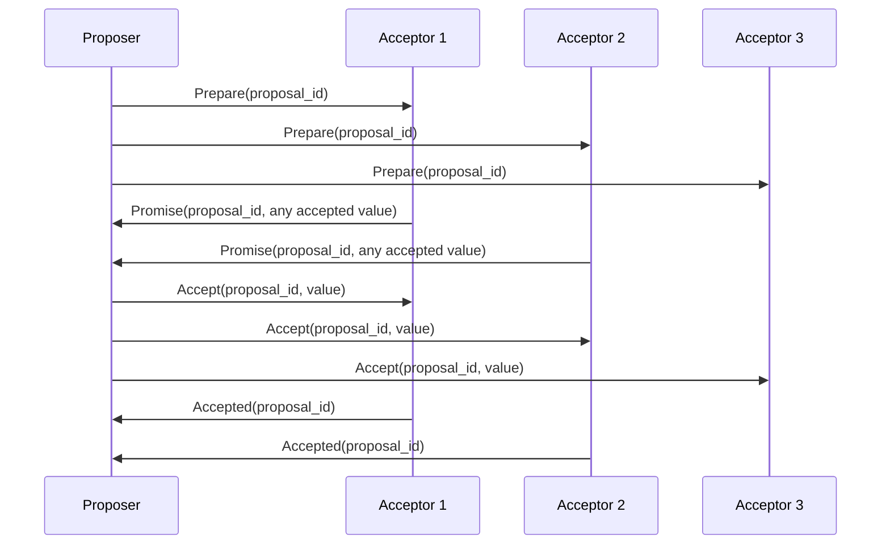
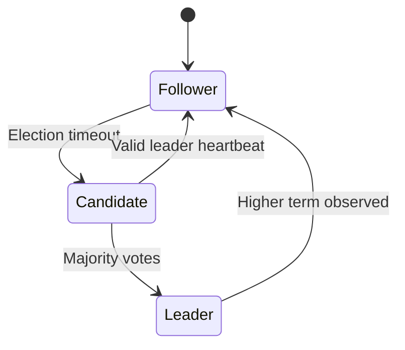
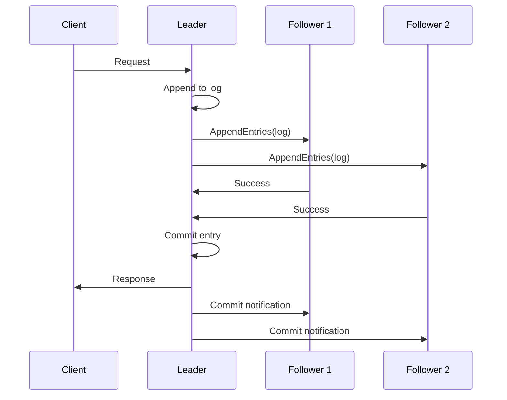

# Consensus

Consensus is how a set of nodes agrees on a single value — and, applied repeatedly, on an ordered log of values — even though nodes crash and messages are delayed, reordered, or lost.

It is the foundation under anything that has to be authoritative: cluster membership, configuration, distributed locks, transaction logs, and the metadata layer of most distributed databases. When a system needs one answer that everybody believes, consensus is what produces it.

A consensus protocol is judged on three properties:

- **Safety**: Two nodes never commit different values at the same position. This must hold always, including during partitions and arbitrary message delays.
- **Liveness**: The cluster keeps making progress as long as a majority of nodes are up and can talk to each other.
- **Fault tolerance**: Nodes may crash, restart, and lose in-flight messages without breaking either property.

Safety is non-negotiable; liveness is conditional. That asymmetry is the whole design philosophy — a consensus system would rather stop accepting writes than commit two conflicting ones.

## Why consensus is needed

Without it, replicas diverge. Two clients write different values concurrently, a retry arrives after a failover, or a partition lets two halves accept different updates, and there is no principled way to say which history is the real one.

Consensus gives you three things that plain replication does not:

- **A single source of truth for cluster state**: Who is the leader, which nodes are members, which shard owns which key range.
- **A total order over operations**: Every replica applies the same commands in the same sequence, so they end in the same state — this is **state machine replication**.
- **Failover without losing committed history**: A new leader is guaranteed to already hold every entry that was acknowledged as committed.

### What consensus cannot do

Consensus cannot make an asynchronous network agree in bounded time. The **FLP impossibility** result says no deterministic protocol can guarantee both safety and liveness in a fully asynchronous system where even one node may crash, because a crashed node and an infinitely slow one are indistinguishable.

Every real protocol works around this the same way: it uses timeouts as an imperfect failure detector, keeps safety unconditional, and accepts that liveness only holds when the network eventually behaves. A pathologically flaky network can keep a Raft cluster electing and re-electing forever without ever committing anything — and it will still never commit two conflicting entries.

Consensus also assumes nodes are **crash-faulty, not malicious**. Paxos, Raft, and Zab all trust the messages they receive. Tolerating nodes that lie requires Byzantine fault tolerance, which needs `3f + 1` nodes to survive `f` faulty ones instead of `2f + 1`, and is normally only worth it across trust boundaries such as blockchains.

## Quorums

A quorum is a set of nodes large enough to act on the cluster's behalf. Two different things go by that name, and mixing them up is a common interview mistake.

### Majority quorum (what consensus uses)

Consensus protocols require a **majority quorum**: more than half the nodes, `floor(N/2) + 1`.

Majority is not an arbitrary threshold. It is the smallest size with the property the protocol depends on: **any two majorities of the same cluster share at least one node**. That single overlapping node is what makes it impossible for two disjoint groups to each commit something, and it is also what guarantees a new leader has seen every previously committed entry.

### Why an odd number of nodes is better

| Cluster size | Majority quorum | Tolerates failure of |
| ------------ | --------------- | -------------------- |
| 3 nodes      | 2               | 1 node               |
| 4 nodes      | 3               | 1 node               |
| 5 nodes      | 3               | 2 nodes              |
| 6 nodes      | 4               | 2 nodes              |

Going from 3 to 4 nodes raises the quorum size without improving fault tolerance: the fourth node adds a machine that can fail and a machine whose vote you may now need, and cancels itself out. The same holds from 5 to 6.

So clusters are sized odd — 3, 5, or 7. Beyond 7, every write waits on more acknowledgements while fault tolerance grows slowly, which is why large systems shard across many small consensus groups rather than running one big one.

### Read and write quorums (`R + W > N`)

Leaderless replication in the Dynamo style also uses quorums, but tunable ones. Each read waits for `R` replicas and each write for `W` replicas, out of `N` copies, and the rule is:

- `R + W > N` guarantees the read set and the latest write set overlap in at least one replica.
- `W > N / 2` additionally guarantees any two write sets overlap, preventing two concurrent writes from both succeeding without seeing each other.

**Example (`N = 5`):**

- **Overlapping**: `R = 2`, `W = 4` — `2 + 4 = 6 > 5`, so any read touches a node that saw the write.
- **Not overlapping**: `R = 2`, `W = 3` — `2 + 3 = 5`, so a read can hit two replicas that both missed the write.

This is the mechanism behind Cassandra's tunable consistency levels, described in [CAP and PACELC](./27-cap-and-pacelc-theorems.md).

#### Overlap alone is not enough

`R + W > N` guarantees a read intersects the latest write, but it does not tell the reader *which* of the values it got back is the newest. Version metadata does that.

**Walkthrough (`N = 5`, `R = 3`, `W = 3`):**

1. A client writes `X = "v2"` with version `102`.
2. Nodes `A`, `B`, and `C` acknowledge, so the write quorum is met and the write succeeds.
3. Propagation to the rest is still in flight: `D` and `E` still hold `(v1, 101)`.
4. A reader queries `B`, `D`, `E` and gets mixed results — `B` returns `(v2, 102)`, `D` and `E` return `(v1, 101)`.
5. The reader compares versions, takes the highest (`102`), and returns `v2`.
6. Read repair optionally pushes `(v2, 102)` back to `D` and `E`.

**Key point**: Quorum overlap guarantees that *at least one* replica in the read set can expose the latest write. Version metadata — a timestamp, a Raft term and index, or a vector clock — is what lets the system pick it correctly.

### Quorum replication is not consensus

This distinction matters and is easy to blur:

| Aspect              | Majority quorum consensus                           | `R + W > N` quorum replication                             |
| ------------------- | --------------------------------------------------- | ---------------------------------------------------------- |
| Produces            | A totally ordered, committed log                    | A latest-value-per-key answer                              |
| Concurrent writes   | Serialized by the leader into one order             | Both may succeed and must be reconciled afterwards         |
| Conflict resolution | Impossible by construction — there are no conflicts | Required: last-write-wins, vector clocks, or merge (CRDTs) |
| Typical guarantee   | Linearizable                                        | Strong-ish per key, not linearizable in general            |
| Typical systems     | etcd, ZooKeeper, Consul, Spanner                    | Cassandra, Riak, DynamoDB                                  |

Setting Cassandra to `QUORUM` reads and writes gets you overlap, which is much stronger than the default — but it still does not give you an agreed total order across keys, and it is not the same thing as running Raft.

## How a consensus round works

Stripped of protocol detail, every leader-based consensus system does the same four things:

1. The leader appends the proposed entry to its own log at the next position.
2. The leader replicates the entry to followers and waits.
3. Once a majority quorum (including the leader itself) has persisted it, the entry is **committed** — the point of no return, after which it will survive any tolerated failure.
4. Each node applies committed entries to its state machine in log order, so all replicas reach identical state.

The word "committed" is doing a lot of work in step 3. Before it, the entry may vanish in a failover; after it, no future leader may drop or reorder it.

## Main algorithm families

### Paxos

**Mental model**: Get a majority to promise not to accept anything older, then get a majority to accept your value.

- The foundational family, with the strongest formal pedigree, and notoriously hard to translate into working code.
- Split into roles: proposers suggest values, acceptors vote, learners observe the outcome.
- Basic Paxos agrees on one value with two round trips. **Multi-Paxos** keeps a stable leader so the first round trip can be skipped for a whole run of entries — which is what production systems actually deploy.

**Walkthrough (one value, acceptors A/B/C, quorum = 2):**

1. Proposer `P1` wants to commit value `X`, using proposal number `10`.
2. `P1` sends `Prepare(10)` to A, B, and C.
3. A and B reply `Promise(10)`, meaning they will ignore anything numbered below 10. Each includes any value it has already accepted.
4. That is a quorum of promises, so `P1` sends `Accept(10, X)`.
5. A and B accept — a quorum again — and `X` is chosen.
6. Learners are informed and apply `X`.

**The safety rule**: If any promise came back carrying a previously accepted value, `P1` must propose *that* value instead of `X`. A proposer is not allowed to invent a new value once one might already have been chosen, and this single rule is what prevents two proposers from committing different values.

Basic Paxos can also livelock: two proposers can keep out-bidding each other's proposal numbers and neither ever finishes. Multi-Paxos avoids it by electing a leader, which is exactly the concession Raft makes explicit.

### Raft

**Mental model**: Elect one leader, push every write through its log, and commit once a majority has it.

- Designed for understandability, and deliberately factored into three separable pieces: leader election, log replication, and safety.
- The default choice in modern infrastructure: etcd, Consul, CockroachDB, TiKV, and many control planes.

**Node states:**

- **Leader**: Handles all client requests, and is the only node that appends to the log.
- **Follower**: Applies what the leader sends, and votes in elections.
- **Candidate**: A follower that timed out and is campaigning for votes.

Time is divided into **terms**, each with at most one leader. A term number attached to every message is how a node detects that it has fallen behind: any node seeing a higher term immediately steps down to follower.

Raft's election is the majority-vote election described in [Leader election](./28-leader-election.md); the rest of this section covers what the leader does once it has won.

**Write path:**

1. The client sends a write to the leader (followers redirect it there).
2. The leader appends the entry to its local log — uncommitted for now.
3. The leader sends `AppendEntries` to all followers.
4. Once a majority has persisted the entry, the leader marks it committed.
5. The leader applies it to its state machine and answers the client.
6. Followers apply it once they learn the new commit index, on the next heartbeat.

In a 5-node cluster the leader needs 2 follower acknowledgements, not 4. It can answer the client while the two slowest replicas are still catching up, which is why a straggler does not slow down the cluster.

**The properties that make it safe:**

- **Election safety**: At most one leader is elected per term.
- **Leader append-only**: A leader never overwrites or deletes entries in its own log.
- **Log matching**: If two logs contain an entry with the same index and term, the logs are identical up to that point.
- **Leader completeness**: A node cannot win an election unless its log already contains every committed entry, because voters refuse candidates whose logs are less up to date than their own.
- **State machine safety**: If a node applies an entry at a given index, no other node ever applies a different entry at that index.

Leader completeness is the one worth being able to explain: it is why a failover cannot silently lose an acknowledged write, and it is enforced during the election rather than after it.

### Zab and Viewstamped Replication

- **Zab** (ZooKeeper Atomic Broadcast) is what ZooKeeper runs. It is leader-based like Raft and adds *primary order*: updates from a single leader are delivered in the order that leader issued them, which is what ZooKeeper needs to provide ordered, watchable state changes.
- **Viewstamped Replication** predates Paxos in publication order and is structurally close to Raft — views correspond to terms, and a view change corresponds to an election.

The takeaway is that the leader-based protocols have converged on the same shape: a term or view number, a majority quorum, an append-only log, and a rule that a new leader must inherit all committed entries.

## Consensus and CAP

A consensus cluster is **CP** by construction, and **PC/EC** in [PACELC terms](./27-cap-and-pacelc-theorems.md):

- **During a partition**, the side without a majority cannot commit anything and refuses writes. It has chosen consistency over availability. A 5-node cluster split 3/2 keeps serving on the 3-node side only.
- **When the network is healthy**, every write still waits for a majority to acknowledge, paying a round trip it could have skipped. It has chosen consistency over latency.

This is why consensus is used for the small, valuable slice of state — cluster metadata, locks, configuration, partition ownership — and not for the bulk data path. The usual architecture puts a consensus group in charge of deciding *who owns what*, and lets cheaper replication move the actual bytes.

The cost is concentrated in geography. A single consensus group spanning three regions pays inter-region latency on every write, because a majority necessarily includes a remote node.

## Trade-offs

**Pros:**

- Strong consistency: a linearizable, totally ordered history.
- Failover that provably preserves every acknowledged write.
- Predictable, well-understood behavior under crash failures.

**Cons:**

- Every write costs at least one majority round trip.
- Writes stop entirely when a majority is unreachable — availability is traded away deliberately.
- Write throughput does not improve by adding nodes; it usually gets slightly worse.
- Operationally demanding across regions, and sensitive to disk fsync latency on the log.

## Consensus vs leader election

- **Leader election** decides *who may propose*. It exists for liveness and efficiency.
- **Consensus** decides *what is committed, and in what order*. It is what provides safety.

Raft ships them together, but they are separable: safety in Raft comes from majority quorums and term numbers, not from the election being flawless. A stale leader that has lost the majority cannot commit anything, no matter how strongly it believes it is still in charge.

See [Leader election](./28-leader-election.md) for the full boundary, including split-brain and fencing.

## Where consensus appears

- **Coordination services**: ZooKeeper, etcd, and Consul exist to run consensus so other systems do not have to.
- **Cluster metadata**: Membership, shard-to-node assignments, and leader records — Kafka's metadata quorum, and the control plane of most distributed databases.
- **Distributed SQL**: CockroachDB and TiDB run a Raft group per data range, so consensus scales by sharding.
- **Locks and leases**: Any lock service that must never hand the same lock to two holders.
- **Orchestration control planes**: Kubernetes stores all cluster state in etcd.

## Practical design notes

- **Keep clusters odd and small**: 3 or 5 members. Scale by running many consensus groups, not one large one.
- **Keep members close**: Put voting members in the same region, and use non-voting learners or observers for remote read replicas so they do not enter the quorum path.
- **Treat quorum loss as a write outage**: Alert on it, and know in advance whether the runbook is "wait" or "recover from a snapshot with data loss".
- **Route reads deliberately**: Reading from the leader's memory is not automatically linearizable, because the leader may already have been replaced. Protocols use a leader lease or a quorum check (Raft's `ReadIndex`) to make reads safe; reading from any follower gives stale data.
- **Plan snapshots and log compaction**: The log grows forever otherwise, and restart and catch-up times grow with it.
- **Do not implement it yourself**: Use etcd, ZooKeeper, or a well-tested Raft library. Consensus implementations fail in ways that only show up under rare partition timings.

## Interview talking points

- Define it in one sentence — agreement on an ordered log despite failures — then say what it is used for: metadata, locks, and leader records, not the bulk data path.
- Explain the majority quorum through overlap: any two majorities share a node, so two conflicting commits are impossible. Use 5 nodes, quorum 3, tolerates 2 failures.
- Be ready for "why odd numbers?" with the 4-versus-5 comparison.
- Separate election from commitment: election is liveness, quorum plus terms is safety.
- Name the price out loud — a majority round trip per write, and no writes at all without a majority — and connect it to the CP and PC/EC labels.
- Prefer "put it in etcd" over "we would run Paxos". Knowing not to implement consensus is a stronger signal than reciting the protocol.
- If asked to scale it, shard into multiple consensus groups rather than growing one.

## Reference materials

- [In Search of an Understandable Consensus Algorithm (Raft paper)](https://raft.github.io/raft.pdf)
- [Paxos Made Moderately Complex](https://paxos.systems/how/)
- [ZooKeeper Atomic Broadcast (Zab)](https://cwiki.apache.org/confluence/display/zookeeper/zab1.0)
- [Impossibility of Distributed Consensus with One Faulty Process (FLP)](https://groups.csail.mit.edu/tds/papers/Lynch/jacm85.pdf)
