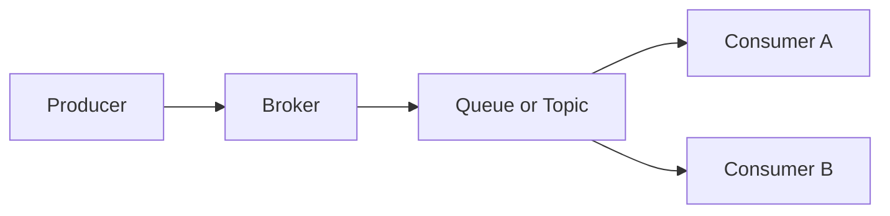
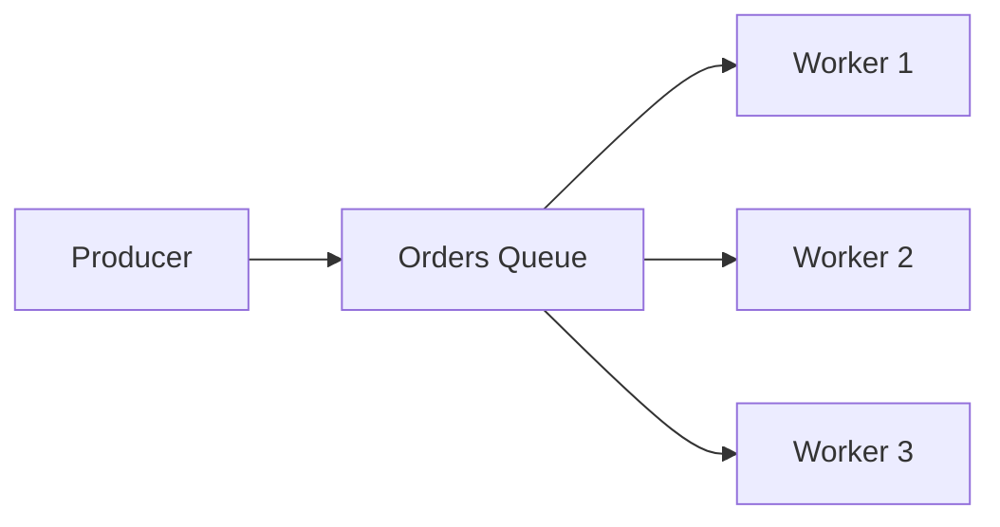
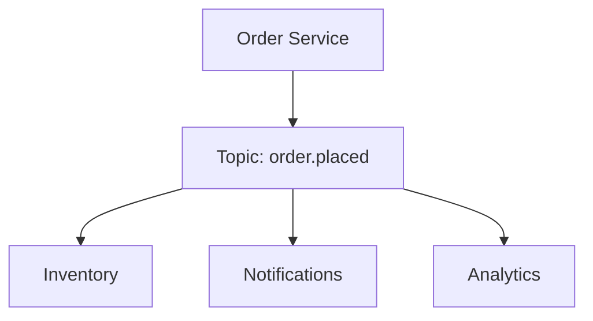
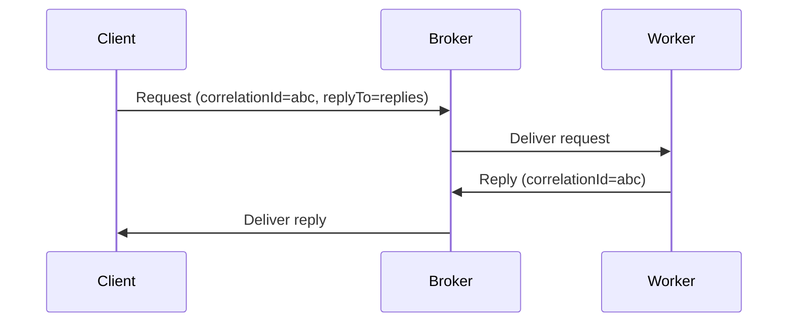
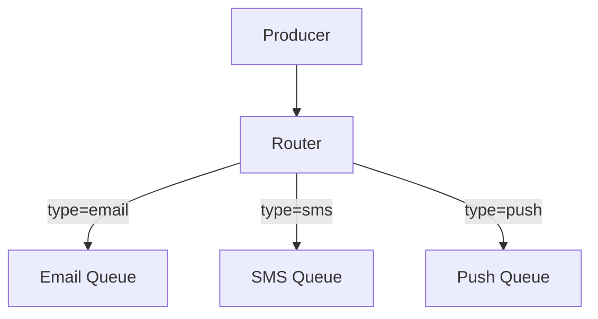

# Messaging Patterns

Messaging lets services communicate asynchronously through a broker, so producers and consumers do not need to be online at the same time or know each other's location.

The goal of this document is not to pick a single broker, but to choose the right channel, routing, and delivery semantics for latency, scale, and failure handling.

For the broader sync vs async choice, see [Communication Patterns](./06-communication-patterns.md). For fan-out specifically, see [Pub/Sub](./28-pub-sub.md).

## Why Messaging

- Decouples producer and consumer availability
- Buffers traffic spikes instead of dropping or blocking work
- Enables independent scaling of producers and consumers
- Supports retries, dead-lettering, and delayed processing

Messaging is a poor fit when the caller needs an immediate, strongly consistent answer and cannot tolerate eventual processing.

## Core Building Blocks

- **Producer**: Sends a message to a channel
- **Consumer**: Reads and processes messages
- **Broker**: Routes, buffers, and delivers messages
- **Queue**: Point-to-point channel; each message is processed by one consumer
- **Topic**: Publish-subscribe channel; each message can be delivered to many consumers
- **Message**: Payload plus headers/metadata (id, type, timestamp, correlation id)

## Channel Patterns

### Point-to-Point (Work Queue)

Producer sends work to a queue. Each message is delivered to **one** consumer.

**Strengths:**

- Smooths bursts by buffering work
- Easy to scale by adding competing consumers
- Natural fit for retries and dead-letter queues

**Trade-offs:**

- Processing is asynchronous, so the producer does not know when work finishes
- Ordering across multiple consumers is usually not guaranteed

**Best fit:** Background jobs, order processing, email/notification pipelines, image/video processing.

### Publish-Subscribe

Producer publishes an event to a topic. Every interested subscriber receives a copy.

**Strengths:**

- One event can drive many independent workflows
- New subscribers can be added without changing the producer

**Trade-offs:**

- Harder end-to-end tracing and debugging
- Requires idempotent consumers and schema discipline

**Best fit:** Event-driven architectures, analytics fan-out, integrations. See [Pub/Sub](./28-pub-sub.md).

### Request-Reply

Producer sends a request and waits for a response on a reply channel, matching messages with a correlation id.

**Strengths:**

- Caller still gets a result, while workers scale independently
- Useful when the work is slow but the API contract is request-response

**Trade-offs:**

- Timeouts, correlation, and abandoned replies add complexity
- The caller is blocked or polling, which reduces some of messaging's decoupling benefit

**Best fit:** RPC-style work that is too slow or bursty for a direct HTTP call (report generation, payments with an async provider).

### Fire-and-Forget

Producer sends a message and does not wait for processing or a reply.

**Strengths:**

- Lowest coupling and lowest producer latency
- Simple to operate when loss is acceptable or retries happen elsewhere

**Trade-offs:**

- No confirmation that work completed
- Failures are visible only through consumer metrics, DLQs, or downstream effects

**Best fit:** Telemetry, audit logs, non-critical notifications.

## Competing Consumers

Multiple workers consume from the same queue so work is processed in parallel.

This is the usual way to scale point-to-point processing: add workers, not partitions, unless you also need ordering.

Design implications:

- Assume any worker can get any message
- Do not rely on global order
- Limit prefetch so one slow worker does not grab too much work
- Make handlers idempotent; redelivery will happen

**Best fit:** CPU/IO-bound job processing with no strict per-entity order.

## Delivery Semantics

### At-Most-Once

Deliver, then forget. A crash can lose the message.

Use for metrics or other data that is cheap to drop.

### At-Least-Once

Deliver, wait for ack, retry on failure. Duplicates are possible.

This is the default in production systems. Consumers must be idempotent.

### Exactly-Once

Appear to process each message once, with no loss.

End-to-end exactly-once is expensive. In practice it is at-least-once delivery plus idempotent writes and deduplication keys.

## Reliability Patterns

### Acknowledgments and Retries

The consumer acks only after it has finished (or durably recorded) the work.

- Retry transient failures with backoff
- Cap retries so poison messages cannot block the queue forever
- Distinguish retryable errors (timeouts) from permanent ones (bad payload)

### Dead Letter Queue (DLQ)

Messages that fail repeatedly are moved to a DLQ instead of being retried forever.

Use a DLQ to:

- Unblock the main queue
- Inspect and replay poison messages
- Alert when failure rate spikes

### Idempotent Consumer

Because at-least-once delivery creates duplicates, processing the same message twice must not create duplicate side effects.

Common techniques:

- Idempotency keys stored per business action
- Conditional writes (`WHERE version = ...`)
- Dedup table keyed by message id with a TTL

Example: payment event `pay_123` processed twice should charge once.

### Poison Messages

A message that can never succeed (invalid schema, missing required field, failed business invariant).

Handle by sending it to the DLQ quickly, not by retrying it on the same backoff path as timeouts.

## Routing Patterns

### Direct Routing

Send to a named queue. The producer chooses the destination.

Simple and explicit. Tightens coupling to queue names.

### Fan-out

Broker copies the message to every bound queue.

Same intent as pub/sub: one produce, many independent consumers.

### Topic Routing

Route by a routing key or subject (`orders.created`, `orders.*`).

Useful when consumers want a subset of events without a separate topic per event type.

### Content-Based Routing

Inspect the payload (or headers) and send the message to different consumers.

Flexible, but the router becomes a coupling point and a failure domain. Prefer it when routing rules are a business concern, not when a topic key would suffice.

## Ordering, Partitioning, and Backpressure

**Ordering**

- Global order across all messages is expensive and rarely needed
- Per-key order (all events for `order_id=123` in sequence) is the usual requirement
- Preserve per-key order with a partition or shard key, and a single consumer per partition

**Partitioning**

- Spread load across partitions for throughput
- Choose a key with even distribution; a hot key creates a hot partition

**Backpressure**

- Slow consumers create lag; unbounded queues hide the problem until memory or disk blows up
- Bound queue depth, monitor lag, and apply load shedding or scale-out before the broker saturates
- Prefetch/QoS limits how many unacked messages a consumer can hold

## Queues vs Event Streams

These are often used as "messaging," but they solve different problems.

| | Work queue (RabbitMQ, SQS) | Event stream (Kafka, Kinesis) |
| --- | --- | --- |
| Model | Message is consumed and removed | Append-only log; consumers keep an offset |
| Typical use | Task distribution | Event history, fan-out, replay |
| Retention | Until acked (plus a short retry window) | Hours to days (or longer) by policy |
| Replay | Limited; usually needs a DLQ/replay tool | First-class: rewind the offset |
| Competing consumers | Native | Consumer groups (one owner per partition) |

Use a **queue** when a unit of work should be processed once by one worker.

Use a **stream** when multiple consumers need the same events, and you want retention and replay.

For why a stream looks like a partitioned commit log, and which of those decisions transfer to other systems, see [Kafka Architecture](../advanced/05-kafka-architecture.md).

## Pattern Selection Checklist

When choosing a pattern, answer:

- Is this a unit of work (queue) or a fact that many systems should see (topic/stream)?
- Does the producer need a reply, or is fire-and-forget enough?
- What delivery guarantee is required: lossy, at-least-once, or effectively exactly-once?
- Is per-key order required, or is unordered parallel processing acceptable?
- What happens on poison messages: retry, DLQ, or drop?
- Can consumers be idempotent? If not, messaging will create duplicate side effects.

## Interview Talking Points

- Start from workload: job queue vs event fan-out vs request-reply.
- State delivery semantics explicitly (usually at-least-once + idempotency).
- Distinguish competing consumers (scale workers) from pub/sub (fan-out).
- Mention DLQs, lag/backpressure, and per-key ordering via partitions.
- Call out queue vs log/stream when the interviewer says "Kafka vs RabbitMQ/SQS."

## Reference Materials

- [Enterprise Integration Patterns](https://www.enterpriseintegrationpatterns.com/patterns/messaging/index.html)
- [Application integration patterns for microservices: Fan-out strategies](https://aws.amazon.com/blogs/compute/application-integration-patterns-for-microservices-fan-out-strategies/)
