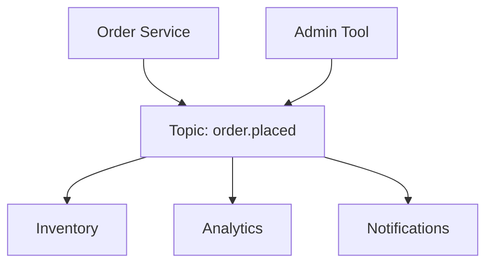
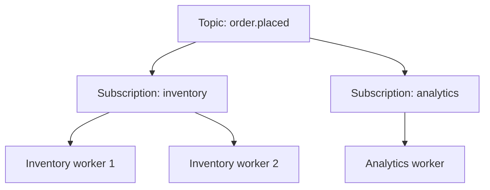

# Pub/Sub

Publish/subscribe decouples producers from consumers through a broker. A publisher writes an event to a **topic** without knowing who reads it; each interested consumer subscribes to that topic and receives its own copy. Adding a consumer requires no change to the publisher, which is the entire point of the pattern.



This document covers the pub/sub model itself: topics and subscriptions, fan-out, delivery mode, retention, and event schema design. For queues, request-reply, routing, delivery semantics, and reliability patterns, see [Messaging Patterns](./31-messaging-patterns.md).

## Why use pub/sub

- **Loose coupling**: The publisher names an event, not a destination, so consumers change independently
- **Fan-out**: One event drives many workflows without the publisher orchestrating them
- **Extensibility**: A new consumer is a new subscription, not a producer deployment
- **Burst absorption**: The broker buffers, so a spike in events does not have to become a spike in consumer load

The cost is that no single call stack spans the flow. Debugging, tracing, and reasoning about end-to-end completion all get harder, and the publisher no longer learns whether anything downstream succeeded.

## Core components

- **Publisher**: Writes an event to a topic. Fire-and-forget beyond the broker's write acknowledgement
- **Topic**: Named channel that events are published to. The unit of routing and, usually, of schema
- **Subscription**: A named consumer's view of a topic, with its own delivery position and acknowledgement state
- **Subscriber**: The application that processes messages from a subscription
- **Broker**: Stores, routes, and delivers messages (Kafka, Google Pub/Sub, SNS with SQS, NATS, RabbitMQ exchanges)

The component people skip is the **subscription**, and it is the one that explains the model. Fan-out happens per subscription, not per connected process.

## Topics and subscriptions

Each subscription gets every message published to the topic. Within a subscription, multiple consumer processes compete: each message goes to exactly one of them. So the same topic supports broadcast across teams and parallelism inside a team at the same time.



An `order.placed` event published once is delivered to the inventory subscription and the analytics subscription. Inventory runs two workers, so each event is handled by exactly one of them, not both.

Different brokers name this differently, but the mechanism is the same:

| Broker         | Topic           | Subscription              | Competing consumers within it |
| -------------- | --------------- | ------------------------- | ----------------------------- |
| Kafka          | Topic           | Consumer group            | One member per partition      |
| Google Pub/Sub | Topic           | Subscription              | Any number of pullers         |
| AWS SNS + SQS  | SNS topic       | One SQS queue per fan-out | Any number of queue consumers |
| RabbitMQ       | Fanout exchange | Bound queue               | Competing consumers per queue |

Because each subscription tracks its own position and acknowledgements, subscriptions fail independently. A broken analytics consumer builds lag on its own subscription; it does not stall inventory, and it does not stop publishers.

## Push versus pull delivery

Brokers deliver in one of two directions, and the choice determines who controls flow.

| Aspect         | Push (broker calls the consumer)           | Pull (consumer fetches from the broker)     |
| -------------- | ------------------------------------------ | ------------------------------------------- |
| Flow control   | Broker's problem; needs consumer feedback  | Consumer's problem; it fetches what it can  |
| Consumer setup | Must expose a reachable endpoint           | Only needs outbound connectivity            |
| Latency        | Lowest; delivered as produced              | Bounded by fetch interval or long poll      |
| Batching       | Harder; often one message per call         | Natural; fetch many messages per round trip |
| Examples       | SNS to HTTP, webhooks, Google Pub/Sub push | Kafka, SQS, Google Pub/Sub pull             |

Pull is the safer default for high-throughput internal consumers, because backpressure is automatic: a saturated consumer simply stops fetching and lag becomes visible. Push suits low-volume delivery to endpoints you do not control, which is what a webhook is.

## Delivery guarantees

Delivery semantics (at-most-once, at-least-once, exactly-once) are the same for topics as for queues, and are covered in [Messaging Patterns](./31-messaging-patterns.md#delivery-semantics). Assume **at-least-once** unless you have deliberately configured otherwise, and make consumers idempotent.

Two things are specific to pub/sub:

- **Guarantees are per subscription.** The same event can be acknowledged by analytics and redelivered to inventory. "Delivered" is never a property of the event, only of an event-subscription pair.
- **Fan-out multiplies duplicates.** With N subscriptions, one publish can produce N sets of retries. Every consumer needs its own deduplication, and side effects that must happen once globally (charging a card, sending an email) must live behind exactly one subscription.

Ordering is likewise a per-partition, per-subscription property. Global order across a topic is not something brokers give you at scale; per-key order via a partition key is, and that is almost always what the requirement actually is. See [Messaging Patterns](./31-messaging-patterns.md#ordering) for the mechanics.

## Retention and replay

A queue holds a message until it is acknowledged. A log-based topic keeps events for a retention window regardless of who has read them, which unlocks capabilities queues do not have:

- **Replay**: Reset a subscription's position to reprocess history after a consumer bug or a schema fix
- **Bootstrap**: A new subscriber can read from the beginning instead of needing a separate backfill pipeline
- **Independent recovery**: A consumer that was down for hours catches up from where it stopped

Decisions to make deliberately:

- **Retention window**: Long enough to survive a weekend outage and to bootstrap a new consumer, short enough to control storage cost
- **Replay safety**: Replay re-triggers side effects. Consumers that send emails or move money need a guard, such as a processed-event table or an effective date check
- **Starting position**: New subscriptions read from the earliest or latest offset. Getting this wrong either floods a new consumer or silently skips events

For how a partitioned commit log implements this, see [Kafka Architecture](../advanced/05-kafka-architecture.md).

## Event schema design

The topic's schema is the contract between teams, and it outlives any individual service. It deserves more design attention than the broker choice.

A workable event envelope separates metadata from payload:

```json
{
  "eventId": "evt_01H8X...",
  "eventType": "order.placed",
  "eventVersion": 1,
  "occurredAt": "2026-01-15T10:32:04Z",
  "correlationId": "req_9f2c...",
  "data": {
    "orderId": "ord_123",
    "customerId": "cus_456",
    "totalCents": 4200,
    "currency": "USD"
  }
}
```

- `eventId` gives consumers a natural deduplication key
- `eventType` and `eventVersion` let a consumer route and reject what it does not understand
- `occurredAt` is when the fact happened, which is not when the message was delivered
- `correlationId` is what makes an asynchronous flow traceable end to end

Design guidelines:

- **Name events as facts in the past tense** (`order.placed`, `payment.settled`). An event that reads like an instruction (`send.email`) is a command aimed at one consumer, and belongs on a queue
- **Evolve additively**: New optional fields are safe; removing or renaming a field, or narrowing a type, is a new version. Consumers must ignore unknown fields for this to hold
- **Version explicitly** and publish both versions during a migration, since you cannot redeploy every consumer at once
- **Enforce schemas at publish time** with a registry or shared definitions, rather than discovering breakage in a consumer at 3am

### Thin versus fat events

How much state to put in the event is the recurring design argument:

- **Thin event (notification)**: Carries identifiers only, and the consumer calls back to fetch details. Keeps payloads small and the data authoritative, but reintroduces a synchronous dependency on the publisher and can produce a read storm on fan-out.
- **Fat event (event-carried state transfer)**: Carries the state the consumer needs. Consumers stay independent and can process history offline, at the cost of larger payloads, duplicated state, and a wider contract to maintain.

A practical middle ground is to carry the fields that consumers demonstrably need plus the identifiers to fetch the rest, and to remember that a thin event's callback may return state that has already moved on since the event was published.

## Pub/Sub versus queues

| Aspect            | Pub/Sub (topic)                      | Queue                                |
| ----------------- | ------------------------------------ | ------------------------------------ |
| Delivery          | Every subscription gets a copy       | One consumer gets each message       |
| Semantics         | A fact that happened                 | A unit of work to perform            |
| Producer intent   | Announce; does not know the audience | Dispatch; knows work must be done    |
| Adding a consumer | New subscription, no producer change | Splits the existing work, not a copy |

Use pub/sub when several systems must react to the same fact. Use a queue when a task should be performed once by one worker. The two compose naturally: a topic fans out to per-consumer queues, each of which is then a normal work queue. See [Messaging Patterns](./31-messaging-patterns.md) for the queue side and the queue-versus-stream comparison.

## Common pitfalls

- **Using a topic as a command channel**: Publishing `send.welcome.email` and letting exactly one service subscribe is a queue wearing a topic's clothes. It breaks the moment a second subscriber appears
- **Unbounded fan-out**: Every new subscription multiplies broker load and duplicate handling; subscriptions need the same review a new API client would get
- **Ignoring consumer lag**: Lag is the primary health signal for a subscription, and it is invisible unless you alert on it
- **No dead-letter path**: Without one, a poison message either blocks the subscription or is silently dropped
- **Untraceable flows**: Without a correlation ID propagated through every hop, an asynchronous failure is nearly impossible to reconstruct; see [Observability](./15-observability.md)

## Interview talking points

- Pub/sub is for decoupling and fan-out; point-to-point task routing is a queue. Say which one the requirement is.
- Explain fan-out through subscriptions: broadcast across subscriptions, competing consumers within one.
- State delivery semantics explicitly (at-least-once plus idempotent consumers) and note that guarantees are per subscription.
- Mention retention and replay as the capability that separates a log-based topic from a queue.
- Treat the event schema as a public contract: envelope, versioning, additive evolution.

## Reference materials

- [Enterprise Integration Patterns - Publish-subscribe channel](https://www.enterpriseintegrationpatterns.com/patterns/messaging/PublishSubscribeChannel.html)
- [Martin Fowler - What do you mean by "event-driven"?](https://martinfowler.com/articles/201701-event-driven.html)
