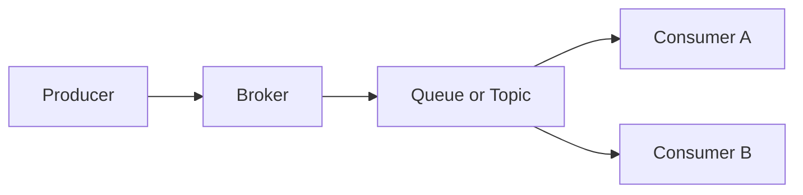
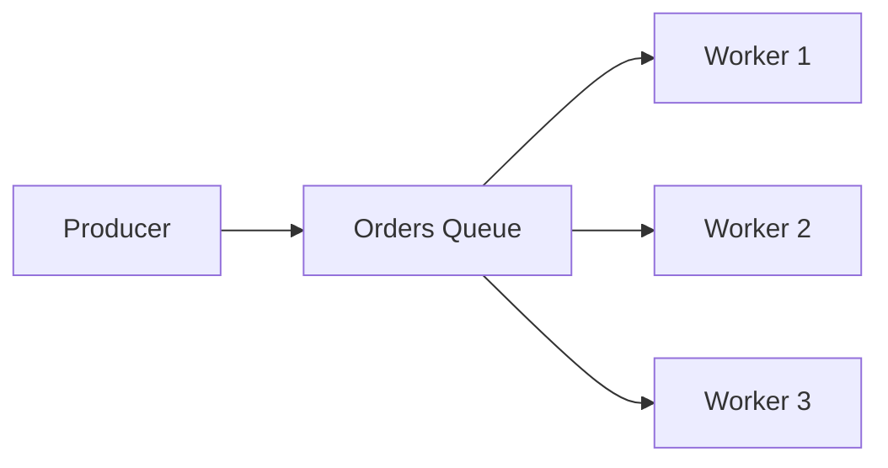
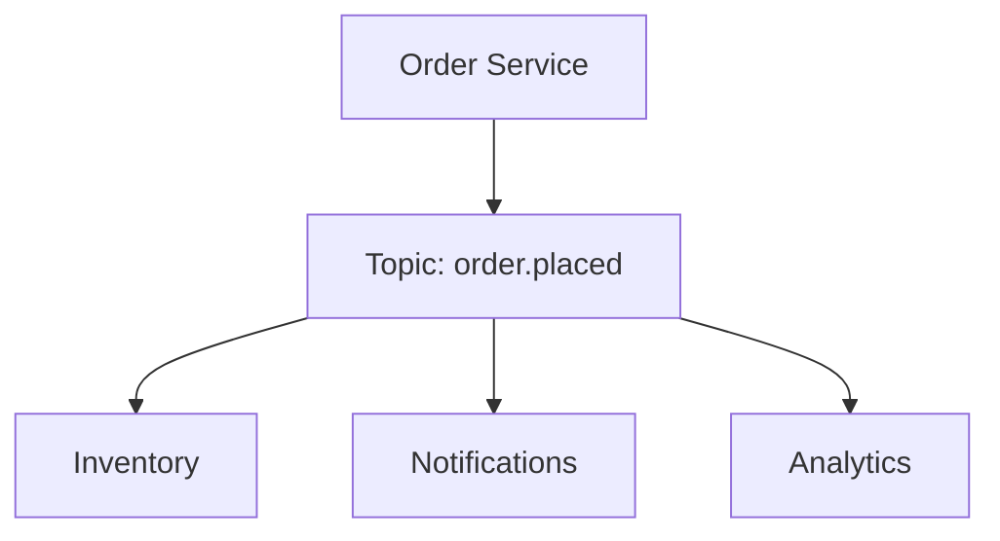
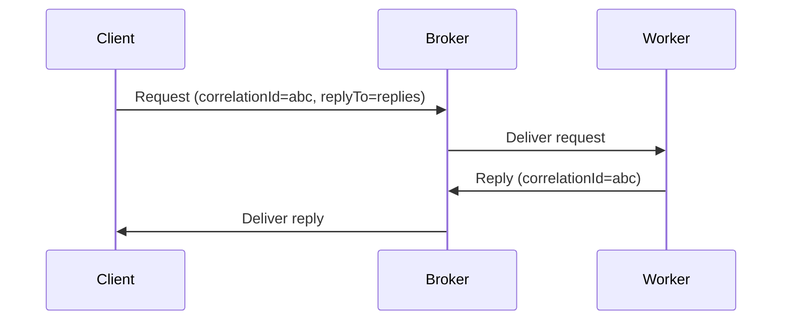
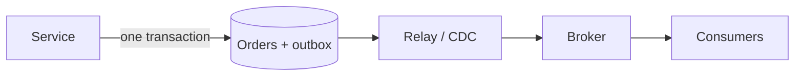
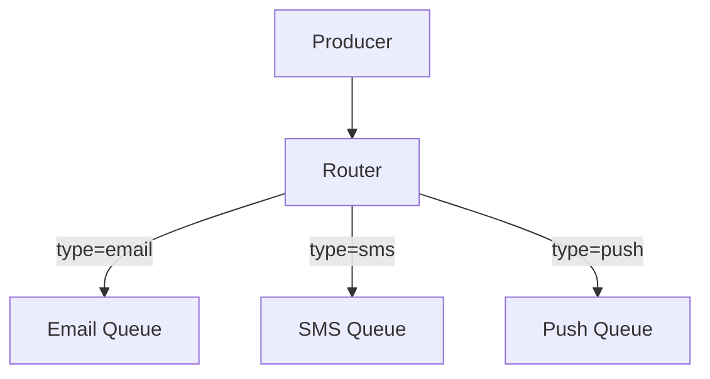

# Messaging patterns

Messaging lets services communicate asynchronously through a broker, so producers and consumers do not need to be online at the same time or know each other's location.

The goal of this document is not to pick a single broker, but to choose the right channel, routing, and delivery semantics for latency, scale, and failure handling.

For the broader synchronous versus asynchronous choice, see [Communication Patterns](./06-communication-patterns.md). For topics, subscriptions, retention and replay, and event schema design, see [Pub/Sub](./30-pub-sub.md). This document is the canonical place for delivery semantics and reliability patterns, which apply to queues and topics alike.

## Why use messaging?

- Decouples producer and consumer availability
- Buffers traffic spikes instead of dropping or blocking work
- Enables independent scaling of producers and consumers
- Supports retries, dead-lettering, and delayed processing

Messaging is a poor fit when the caller needs an immediate, strongly consistent answer and cannot tolerate eventual processing.

## Core building blocks

- **Producer**: Sends a message to a channel
- **Consumer**: Reads and processes messages
- **Broker**: Routes, buffers, and delivers messages
- **Queue**: Point-to-point channel; each message is processed by one consumer
- **Topic**: Publish-subscribe channel; each message can be delivered to many consumers
- **Message**: Payload plus headers/metadata (id, type, timestamp, correlation id)

## Channel patterns

### Point-to-point (work queue)

Producer sends work to a queue. Each message is delivered to **one** consumer.

**Pros:**

- Smooths bursts by buffering work
- Easy to scale by adding competing consumers
- Natural fit for retries and dead-letter queues

**Cons:**

- Processing is asynchronous, so the producer does not know when work finishes
- Ordering across multiple consumers is usually not guaranteed

**Best fit:** Background jobs, order processing, email/notification pipelines, image/video processing.

### Publish-subscribe

Producer publishes an event to a topic. Every interested subscriber receives a copy.

**Pros:**

- One event can drive many independent workflows
- New subscribers can be added without changing the producer

**Cons:**

- Harder end-to-end tracing and debugging
- Requires idempotent consumers and schema discipline

**Best fit:** Event-driven architectures, analytics fan-out, integrations. See [Pub/Sub](./30-pub-sub.md).

### Request-reply

Producer sends a request and waits for a response on a reply channel, matching messages with a correlation id.

**Pros:**

- Caller still gets a result, while workers scale independently
- Useful when the work is slow but the API contract is request-response

**Cons:**

- Timeouts, correlation, and abandoned replies add complexity
- The caller is blocked or polling, which reduces some of messaging's decoupling benefit

**Best fit:** RPC-style work that is too slow or bursty for a direct HTTP call (report generation, payments with an async provider).

### Fire-and-forget

Producer sends a message and does not wait for processing or a reply.

**Pros:**

- Lowest coupling and lowest producer latency
- Simple to operate when loss is acceptable or retries happen elsewhere

**Cons:**

- No confirmation that work completed
- Failures are visible only through consumer metrics, DLQs, or downstream effects

**Best fit:** Telemetry, audit logs, non-critical notifications.

## Competing consumers

Multiple workers consume from the same queue so work is processed in parallel.

This is the usual way to scale point-to-point processing: add workers, not partitions, unless you also need ordering.

Design implications:

- Assume any worker can get any message
- Do not rely on global order
- Limit prefetch so one slow worker does not grab too much work
- Make handlers idempotent; redelivery will happen

**Best fit:** CPU/IO-bound job processing with no strict per-entity order.

## Delivery semantics

Delivery semantics describe what the system guarantees when something fails mid-flight. They apply the same way to queues and to topics; for a topic, the guarantee holds per subscription rather than per event.

The whole distinction comes down to **when the consumer acknowledges** relative to when it does the work. The network cannot tell a lost message from a lost acknowledgement, so you choose which error you prefer: losing messages, or seeing them twice.

| Guarantee     | Ack timing        | Failure result   | Cost                                     |
| ------------- | ----------------- | ---------------- | ---------------------------------------- |
| At-most-once  | Before processing | Message lost     | Cheapest; no retry machinery             |
| At-least-once | After processing  | Message repeated | Retries, redelivery, idempotent handlers |
| Exactly-once  | Coordinated       | Neither          | Transactions or deduplication state      |

### At-most-once

The consumer acknowledges on receipt and then processes. A crash between the two loses the message permanently, and nothing retries it.

Use it when the data is cheap to drop and volume is high: metrics samples, non-critical telemetry, best-effort presence updates.

### At-least-once

The consumer acknowledges only after the work is done (or durably recorded). If it crashes first, the broker redelivers, so the same message can be processed more than once.

This is the default in essentially every production system, and the guarantee you should assume unless told otherwise. It shifts the correctness burden onto the consumer, which must be idempotent.

### Exactly-once

Each message appears to be processed exactly once: no loss, no duplicate effect. Genuine end-to-end exactly-once delivery is not achievable across an unreliable network, because the acknowledgement itself can be lost.

What systems actually provide is exactly-once *processing*, built from at-least-once delivery plus one of:

- **Idempotent writes**: The duplicate produces the same final state (an upsert keyed by event ID, a conditional update on a version)
- **Deduplication**: A store of processed message IDs consulted before the side effect
- **Transactional coupling**: The broker offset and the state change commit together, which is what Kafka's transactional producer and consumer offsets give you, and only within that system's boundary

The moment the side effect leaves that boundary (an email, a card charge, a third-party API call), you are back to at-least-once plus idempotency. Say that explicitly in an interview rather than claiming exactly-once.

## Reliability patterns

### Acknowledgments and retries

The consumer acks only after it has finished (or durably recorded) the work.

- Retry transient failures with backoff
- Cap retries so poison messages cannot block the queue forever
- Distinguish retryable errors (timeouts) from permanent ones (bad payload)

### Dead letter queue (DLQ)

Messages that fail repeatedly are moved to a DLQ instead of being retried forever.

Use a DLQ to:

- Unblock the main queue
- Inspect and replay poison messages
- Alert when failure rate spikes

### Idempotent consumer

Because at-least-once delivery creates duplicates, processing the same message twice must not create duplicate side effects.

Common techniques:

- Idempotency keys stored per business action
- Conditional writes (`WHERE version = ...`)
- Dedup table keyed by message id with a TTL

Example: a payment event `pay_123` processed twice should still result in a single charge.

### Poison messages

A message that can never succeed (invalid schema, missing required field, failed business invariant).

Handle by sending it to the DLQ quickly, not by retrying it on the same backoff path as timeouts.

### Transactional outbox

Everything above is consumer-side. The matching producer-side failure is the **dual write**: a service commits a row to its database and then publishes an event, and the two are not atomic. If the process dies between them, the database says the order exists and no consumer ever hears about it. Publishing first has the mirror problem: consumers react to an order that was never committed.

The outbox pattern removes the second write from the critical path:

1. In the same database transaction as the business change, insert the event into an `outbox` table
2. A separate relay (a poller, or change-data-capture on the outbox table) reads unpublished rows and publishes them
3. The relay marks rows as published after the broker acknowledges

The relay can crash after publishing but before marking a row, so it republishes: the outbox gives at-least-once publishing, not exactly-once. Consumers still need to be idempotent, which the event ID from the outbox row makes straightforward.

## Routing patterns

### Direct routing

Send to a named queue. The producer chooses the destination.

Simple and explicit. Tightens coupling to queue names.

### Fan-out

Broker copies the message to every bound queue.

Same intent as pub/sub: one message published, many independent consumers.

### Topic routing

Route by a routing key or subject (`orders.created`, `orders.*`).

Useful when consumers want a subset of events without a separate topic per event type.

### Content-based routing

Inspect the payload (or headers) and send the message to different consumers.

Flexible, but the router becomes a coupling point and a failure domain. Prefer it when routing rules are a business concern, not when a topic key would suffice.

## Ordering, partitioning, and backpressure

### Ordering

- Global order across all messages requires a single writer and a single consumer, which throws away the parallelism you came for. It is expensive and rarely the actual requirement
- Per-key order (all events for `order_id=123` in sequence) is what requirements usually mean, and it is affordable
- Preserve per-key order with a partition or shard key, and exactly one active consumer per partition
- Retries break order: a message sent to a DLQ or retried later arrives after messages that came behind it. If order must survive failures, pause the partition instead of skipping ahead

### Partitioning

- Spread load across partitions for throughput; total consumer parallelism is capped by partition count
- Choose a key with even distribution. A hot key (one large tenant, one popular product) creates a hot partition that no amount of scaling fixes
- Partition count is hard to change after the fact, because rehashing moves keys and breaks per-key ordering during the transition

### Backpressure

- Slow consumers create lag; unbounded queues hide the problem until memory or disk runs out
- Lag (messages behind, or age of the oldest unprocessed message) is the primary health metric; alert on its trend, not a single threshold, and see [Observability](./15-observability.md)
- Bound queue depth, and apply load shedding or scale-out before the broker saturates
- Prefetch or QoS limits how many unacked messages a consumer can hold, which stops one worker from claiming a batch it cannot finish

## Queues vs event streams

These are often used as "messaging," but they solve different problems.

| Aspect              | Work queue (RabbitMQ, SQS)               | Event stream (Kafka, Kinesis)             |
| ------------------- | ---------------------------------------- | ----------------------------------------- |
| Model               | Message is consumed and removed          | Append-only log; consumers keep an offset |
| Typical use         | Task distribution                        | Event history, fan-out, replay            |
| Retention           | Until acked (plus a short retry window)  | Hours to days (or longer) by policy       |
| Replay              | Limited; usually needs a DLQ/replay tool | First-class: rewind the offset            |
| Competing consumers | Native                                   | Consumer groups (one owner per partition) |

Use a **queue** when a unit of work should be processed once by one worker.

Use a **stream** when multiple consumers need the same events, and you want retention and replay.

For why a stream looks like a partitioned commit log, and which of those decisions transfer to other systems, see [Kafka Architecture](../advanced/05-kafka-architecture.md).

## Pattern selection checklist

When choosing a pattern, answer:

- Is this a unit of work (queue) or a fact that many systems should see (topic/stream)?
- Does the producer need a reply, or is fire-and-forget enough?
- What delivery guarantee is required: lossy, at-least-once, or effectively exactly-once?
- Is per-key order required, or is unordered parallel processing acceptable?
- What happens on poison messages: retry, DLQ, or drop?
- Can consumers be idempotent? If not, messaging will create duplicate side effects.

## Interview talking points

- Start from the workload: job queue, event fan-out, or request-reply.
- State delivery semantics explicitly (usually at-least-once plus idempotency), and resist the claim of true exactly-once delivery.
- Distinguish competing consumers (scaling workers) from pub/sub (fan-out to independent systems).
- Mention DLQs, lag and backpressure, and per-key ordering via a partition key.
- Raise the dual-write problem and the outbox pattern when a service both writes to a database and publishes an event.
- Call out queue versus log/stream when the interviewer says "Kafka vs RabbitMQ/SQS."

## Reference materials

- [Enterprise Integration Patterns](https://www.enterpriseintegrationpatterns.com/patterns/messaging/index.html)
- [Application integration patterns for microservices: Fan-out strategies](https://aws.amazon.com/blogs/compute/application-integration-patterns-for-microservices-fan-out-strategies/)
