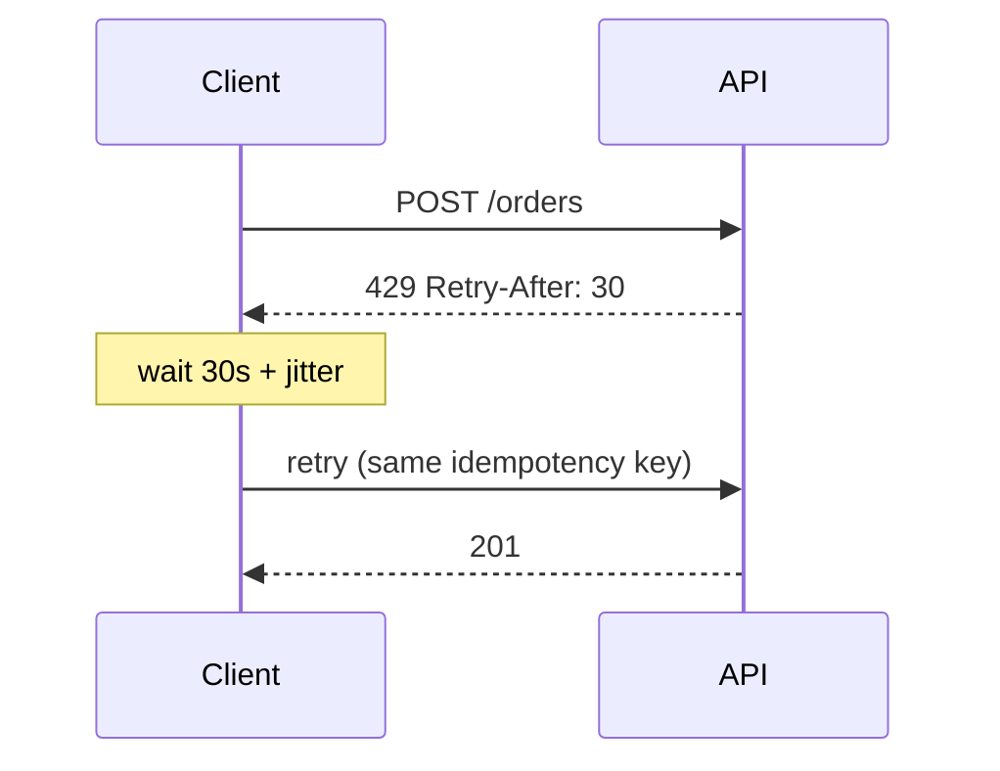
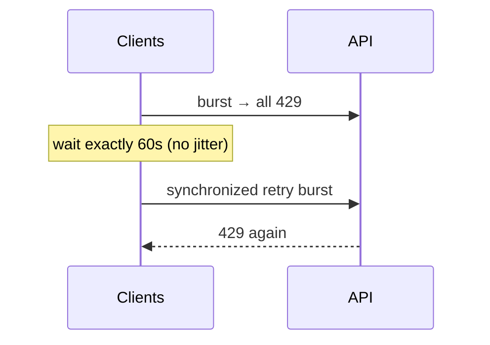
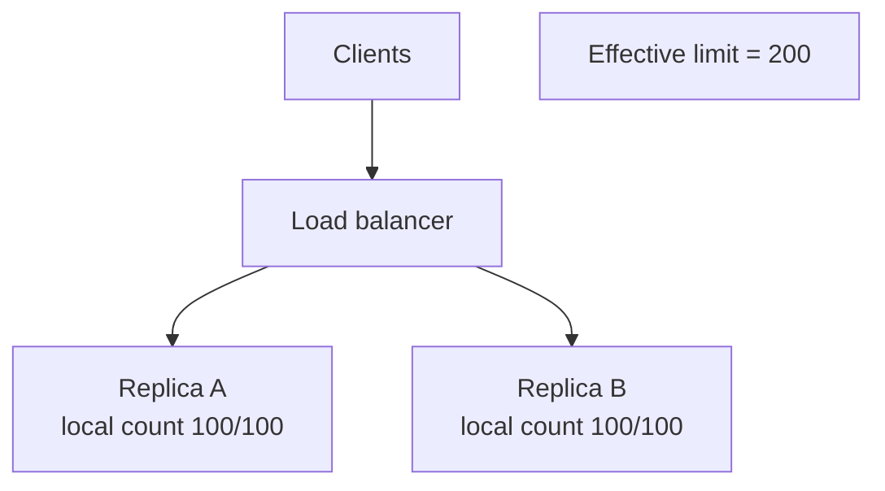

# Rate limiting

Rate limiting caps how often a client can perform an action, so one user, IP, or integration cannot consume a disproportionate share of capacity.

It is a fairness and protection tool, not a substitute for [load shedding](./14-resilience.md) when the system is already overloaded.

## Why rate limit

- **Protect capacity**: Bound QPS to what origin, DB, or a downstream API can actually serve
- **Fairness**: Stop one noisy client from starving everyone else
- **Abuse**: Slow brute-force login, scraping, and credential stuffing
- **Cost and quotas**: Enforce free vs paid tiers, and cap calls to expensive third parties
- **Product rules**: Inventory grabs, invite spam, SMS/email send limits

Rate limiting answers "is this *caller* allowed to do this *now*?" Load shedding answers "can *the system* take more work?"
Use both: identity-based limits at the edge, and overload protection deeper in.

## What you are bounding

These are easy to conflate and should be named separately.

| Mechanism             | Bounds                           | Example                          |
| --------------------- | -------------------------------- | -------------------------------- |
| **Rate limit**        | Events per time window           | 100 requests / minute            |
| **Quota**             | Events over a billing period     | 10,000 API calls / month         |
| **Concurrency limit** | In-flight work                   | 20 simultaneous uploads          |
| **Load shedding**     | Total accepted work under stress | Drop 20% of low-priority traffic |

A client can be inside its per-minute rate, over its monthly quota, and still be rejected by a concurrency cap on a slow endpoint.

Weighted limits charge different endpoints different costs (search = 10 units, `GET /health` = 0). That matches reality better than a single QPS number when some calls are cheap and some run a multi-second query.

## Who and where to enforce limits

### Identity (the key)

- **User / account**: Fair quotas and paid tiers. Requires auth; unauthenticated traffic still needs another key.
- **API key / app**: Partner integrations, service accounts, mobile apps.
- **IP**: Brute-force and pre-auth traffic. Collides users behind NAT; IPv6 and CGNAT make this a blunt instrument.
- **Resource**: Per-object caps (one listing, one inbox) so a hot item cannot be hammered through many identities.

Production systems stack keys: **global IP limit (abuse) + per-user limit (fairness) + per-endpoint limit (expensive paths)**. A request must pass all of them.

### Placement

- **Edge / gateway**: Cheapest place to reject, as it sees all public traffic. Coarse (per IP, per key, per route).
- **Service**: Enforces what the gateway cannot see (per-resource, after auth, after a cache hit).
- **Outbound**: When *you* call Stripe, GitHub, or SMS, you need a limiter on the way out so retries do not ban the whole fleet.
- **Client-side**: A local token bucket improves UX and cuts useless 429s. It is **not** enforcement, as malicious clients skip it.

## Algorithms

Pick an algorithm for the *shape* of traffic you want, then worry about distribution.

### Fixed window

Count requests in a clock-aligned window (for example, 4 per minute). Reset to zero at the boundary.

```plaintext
Limit = 4 / window

  12:00:00                 12:01:00                 12:02:00
       |------------------------|------------------------|
         ✓  ✓  ✓  ✓  ✗            ✓  ✓
         1  2  3  4  reject       1  2
                       ↺ counter back to 0
```

The counter does not slide. At `12:01:00` the client gets a full new budget, even if they just spent the previous one:

```plaintext
Limit = 4 / window

  12:00:00                          12:01:00
       |----------- window 1 -----------|----------- window 2 -----------|
                            ✓ ✓ ✓ ✓      ✓ ✓ ✓ ✓
                            last ~1s     first ~1s
                            |<—— 8 allows in ~1s = 2× the limit ——>|
```

**Example:** limit = 4 requests per 60 seconds, user `42`.

The window id is `floor(now / 60)`. That id is **part of the key**, so a new minute is a new counter. You do not trim members; the previous key is simply no longer read, and `EXPIRE` deletes it.

- Key: `rl:user:42:{window}` — e.g. `rl:user:42:12:00`, then `rl:user:42:12:01`
- Value: integer count

On every request (atomic `INCR`; set TTL only when the key is born):

1. `window = floor(now / 60)`, key = `rl:user:42:{window}`
2. `count = INCR <key>`
3. If `count == 1` → `EXPIRE <key> 60` so a quiet user does not leave the key forever
4. If `count > 4` → **reject**
5. If `count ≤ 4` → **allow**

`INCR` of a missing key starts at 1, which is how the "reset" happens: you never reset `12:00`, you start incrementing `12:01`.

| now      | window | key                | `INCR` | decision   |
| -------- | ------ | ------------------ | ------ | ---------- |
| 12:00:10 | 12:00  | `rl:user:42:12:00` | 1      | allow      |
| 12:00:20 | 12:00  | `rl:user:42:12:00` | 2      | allow      |
| 12:00:40 | 12:00  | `rl:user:42:12:00` | 3      | allow      |
| 12:00:50 | 12:00  | `rl:user:42:12:00` | 4      | allow      |
| 12:00:55 | 12:00  | `rl:user:42:12:00` | 5      | **reject** |
| 12:01:05 | 12:01  | `rl:user:42:12:01` | 1      | allow      |

The interesting rows are **12:00:55** and **12:01:05**:

```plaintext
t=12:00:55  key=rl:user:42:12:00
            INCR  →  5  > 4  →  429
            rl:user:42:12:00 stays at 5 until EXPIRE (still unread after 12:01)

t=12:01:05  key=rl:user:42:12:01     ← different key
            INCR  →  1  (missing key starts at 1)
            EXPIRE rl:user:42:12:01 60
            allow
            old rl:user:42:12:00 is not deleted by hand; TTL finishes it
```

> **Note:**
> `INCR <key>` increments an integer and returns the new value. A missing key is treated as 0, so the first increment returns 1.
> `EXPIRE <key> <seconds>` sets a TTL. For a fixed window, TTL = window length (here 60s).

**Pros:**

- Cheap (one counter per key)

**Cons:**

- Boundary burst

**Best fit:** Coarse quotas, dashboards, places where a 2× spike is acceptable.

### Sliding window log

Store a timestamp per allowed request. On each arrival, drop anything older than `now - window`, then count what is left. The window is always "the last N seconds from now," not "this clock minute."

**Example:** limit = 3 requests per 10 seconds, user `42`.

In Redis that log is **one sorted set**, not one key per timestamp:

- Key: `rl:user:42`
- Score and member: the request timestamp (append a uuid to the member if two requests can share the same millisecond)

On every request, in this order (one Lua script / pipeline so two replicas cannot both see `count=2`):

1. `ZREMRANGEBYSCORE rl:user:42 -inf <cutoff>` — remove members with score ≤ `now − 10` (aged-out requests)
2. `ZCARD rl:user:42` — how many timestamps still in the window
3. If `count ≥ 3` → **reject**, do not write
4. If `count < 3` → `ZADD rl:user:42 <now> <now>` then `EXPIRE rl:user:42 10` → **allow** ... the TTL is a safety net so a quiet user does not leave the key forever.

> **Note:**
> The `ZREMRANGEBYSCORE` command removes all members with a score less than or equal to the given score. `ZREMRANGEBYSCORE <key> <minimum score> <maximum score>`
> The `ZCARD` command returns the number of members in the sorted set. `ZCARD <key>`
> The `ZADD` command adds a member to the sorted set with the given score. `ZADD <key> <score> <member>`
> The `EXPIRE` command sets the expiration time for the key in seconds. `EXPIRE <key> <seconds>`

Each row is one arrival. Cutoff is `now − 10`. Only timestamps **strictly after** the cutoff count.

| now | cutoff (`now−10`) | `ZREMRANGEBYSCORE -inf <cutoff>`         | `rl:user:42` after trim | `ZCARD` | decision   | write                     |
| --- | ----------------- | ---------------------------------------- | ----------------------- | ------- | ---------- | ------------------------- |
| 0s  | −10s              | nothing to drop                          | `{}`                    | 0       | allow      | `ZADD 0` → `{0}`          |
| 2s  | −8s               | nothing to drop                          | `{0}`                   | 1       | allow      | `ZADD 2` → `{0, 2}`       |
| 5s  | −5s               | nothing to drop                          | `{0, 2}`                | 2       | allow      | `ZADD 5` → `{0, 2, 5}`    |
| 8s  | −2s               | nothing to drop (`0` is still in window) | `{0, 2, 5}`             | 3       | **reject** | no `ZADD`                 |
| 11s | 1s                | drops `0`                                | `{2, 5}`                | 2       | allow      | `ZADD 11` → `{2, 5, 11}`  |
| 12s | 2s                | drops `2`                                | `{5, 11}`               | 2       | allow      | `ZADD 12` → `{5, 11, 12}` |
| 13s | 3s                | nothing to drop                          | `{5, 11, 12}`           | 3       | **reject** | no `ZADD`                 |

The interesting rows are **8s** and **11s**:

```plaintext
t=8s   cutoff=-2
       ZREMRANGEBYSCORE rl:user:42 -inf -2   →  {0, 2, 5} unchanged
       ZCARD                                 →  3  ≥ 3  →  429, leave the set alone

t=11s  cutoff=1
       ZREMRANGEBYSCORE rl:user:42 -inf 1    →  removes 0, left {2, 5}
       ZCARD                                 →  2  < 3  →  ZADD rl:user:42 11 11
                                                         EXPIRE rl:user:42 10
                                                         allow
```

```plaintext
  time    0    2    5    8         11   12   13
          ✓    ✓    ✓    ✗          ✓    ✓    ✗
          |------- 3 in 10s -------|
                         at 8s the oldest (0) is still
                         inside the window, so 4th is denied

                    at 11s, cutoff=1 → ZREMRANGEBYSCORE drops 0
                    only 2 and 5 remain → room for one more
```

A **fixed window** of 10s would have reset at t=10 and allowed the request at t=8's "neighbor" times with a full new budget. The log does not: at t=11 you still carry `2` and `5` from the previous 10 seconds.

Memory is one sorted-set member per request in the window (here at most 3). At high QPS that is the cost of exactness.

**Pros:**

- Accurate; no boundary spike

**Cons:**

- Memory grows with request rate (`limit` members per key, or worse)

**Best fit:** Low-volume, strict accuracy (login, OTP).

### Sliding window counter

Approximate a sliding window with two fixed windows: `previous_count × (overlap fraction) + current_count`.

At 30s into a 60s window, half of the previous window still overlaps the sliding 60s lookback, so it is counted at 50% weight.

```plaintext
                 previous (80 reqs)                  current (20 reqs)
    |<-------------- 60s --------------->|<-------------- 60s --------------->|
    12:00                                12:01              now              12:02
                                                            30s in
                                         |<-- overlap = 30/60 = 0.5 --------->|

    estimate = 80 × 0.5  +  20  =  60
               prev×weight    current
```

Those two integers are the same fixed-window keys as above. At 12:01:30:

```plaintext
  GET rl:user:42:12:00  →  80   (previous, weight 0.5)
  GET rl:user:42:12:01  →  20   (current,  weight 1.0)
  estimate = 80 × 0.5 + 20 = 60
  if 60 < limit → INCR rl:user:42:12:01
```

**Example:** limit = 5 requests per 10 seconds, user `42`. Window id = `floor(now / 10)`.

- Previous key: `rl:user:42:{window - 1}`
- Current key: `rl:user:42:{window}`

You still need the previous key **after that window has ended**, so `EXPIRE` must be `2 × window` (20s), not 10s. A fixed-window TTL of 10s would delete the previous count before you can weight it.

On every request (Lua / pipeline so `GET` + `INCR` cannot race):

1. `curr_id = floor(now / 10)`, `prev_id = curr_id - 1`
2. `elapsed = now % 10`, `weight = 1 − elapsed / 10`
3. `prev = GET rl:user:42:{prev_id}` or 0, `curr = GET rl:user:42:{curr_id}` or 0
4. `estimate = prev × weight + curr`
5. If `estimate ≥ 5` → **reject**, do not `INCR`
6. If `estimate < 5` → `INCR rl:user:42:{curr_id}`, `EXPIRE rl:user:42:{curr_id} 20` → **allow**

Notes:

- `elapsed` is "how many seconds into the current 10s bucket am I?" `now % 10` is the remainder after dividing by the window: at `now=14`, `14 % 10 = 4`, so you are 4 seconds into window `1` (`[10s, 20s)`).
- `weight` is the fraction of the **previous** bucket that is still inside the sliding last-10-seconds. A lookback of 10s from t=14 starts at t=4, so it still covers 6s of window `0`.
  That is `(10 − elapsed) / 10 = 1 − elapsed / 10 = 0.6`:

```plaintext
window 0 [0, 10)              window 1 [10, 20)
|-----------------------------|-----------------------------|
0                            10         14                  20
                              |<- elapsed=4 ->|
               |<------- sliding last 10s ------->|
               4              10         14

previous overlap = [4, 10) = 6s out of 10s  →  weight = 0.6
count previous at 60%, current at 100%
```

Early in the new window, `elapsed` is small, `weight` is close to 1 (almost all of the previous burst still counts). Late in the window, `elapsed` is large, `weight` goes toward 0 (previous burst has aged out).

Worked requests. Window `0` is `[0s, 10s)`, window `1` is `[10s, 20s)`.

| now | window | elapsed | weight (`1−elapsed/10`) | `GET` prev `rl:user:42:0` | `GET` curr `rl:user:42:1` | estimate          | decision   | write            |
| --- | ------ | ------- | ----------------------- | ------------------------- | ------------------------- | ----------------- | ---------- | ---------------- |
| 1s  | 0      | 1s      | — (no previous)         | —                         | 0                         | 0                 | allow      | `INCR` `…:0` → 1 |
| 3s  | 0      | 3s      | —                       | —                         | 1                         | 1                 | allow      | `INCR` `…:0` → 2 |
| 5s  | 0      | 5s      | —                       | —                         | 2                         | 2                 | allow      | `INCR` `…:0` → 3 |
| 8s  | 0      | 8s      | —                       | —                         | 3                         | 3                 | allow      | `INCR` `…:0` → 4 |
| 11s | 1      | 1s      | 0.9                     | 4                         | 0                         | 4×0.9+0 = **3.6** | allow      | `INCR` `…:1` → 1 |
| 12s | 1      | 2s      | 0.8                     | 4                         | 1                         | 4×0.8+1 = **4.2** | allow      | `INCR` `…:1` → 2 |
| 13s | 1      | 3s      | 0.7                     | 4                         | 2                         | 4×0.7+2 = **4.8** | allow      | `INCR` `…:1` → 3 |
| 14s | 1      | 4s      | 0.6                     | 4                         | 3                         | 4×0.6+3 = **5.4** | **reject** | no `INCR`        |

At 14s, **current is only 3** — a fixed window would still allow. The weighted previous burst (`4 × 0.6`) pushes the estimate over 5, so you reject. That is the boundary spike being smoothed.

```plaintext
t=14s  curr_id=1  prev_id=0  elapsed=4  weight=0.6
       GET rl:user:42:0  →  4
       GET rl:user:42:1  →  3
       estimate = 4 × 0.6 + 3 = 5.4  ≥ 5  →  429, leave both keys alone

       rl:user:42:0 expires on its TTL (20s from last INCR in that window)
       rl:user:42:1 stays at 3 until a later allow increments it
```

Two integers of storage instead of every timestamp. The estimate is slightly high or low vs a true log, but the boundary spike is mostly gone.

**Pros:**

- Near-sliding accuracy, two integers of storage

**Cons:**

- Slightly over- or under-counts vs a true sliding log

**Best fit:** Default for HTTP APIs at scale (this is what many Redis implementations actually do, despite the name "sliding window").

### Token bucket

Tokens refill at a steady rate. The bucket has a **capacity** (burst) and a **refill rate** (sustained). A request takes one token (or `cost` tokens). If empty, reject (or wait).

```plaintext
         refill 2 tokens/s
                │
                ▼
           ┌─────────┐
           │ ● ● ● ● │  capacity 4  ← max burst
           │         │
           └────┬────┘
                │ take 1 per request
                ▼
        allow if tokens ≥ 1, else 429
```

A full bucket can be emptied immediately (the burst). After that, allows happen only as fast as refill:

```plaintext
  time     0     1     2     3     4     5     6
  tokens   4     3     2     1     0     1     2
  request  ✓     ✓     ✓     ✓     ✗     ✓     ✓
           |←—— burst of 4 ——→| empty  refill…
```

**Pros:**

- Allows a real burst, then enforces the average
- Maps cleanly to "100/s sustained, burst 500"

**Cons:**

- Two knobs to tune; empty bucket is a hard reject unless you queue

**Best fit:** Public APIs where a short burst is fine but sustained overload is not. Common default (AWS, Stripe-style).

### Leaky bucket

Requests enter a queue (the bucket). They **leave at a constant rate**. If the queue is full, new requests drop (or wait).

```plaintext
   requests arrive at any rate
        ✓ ✓ ✓ ✓ ✓ ✓
           \     /
            \   /     queue depth ≤ 4
             \ /
              |       leak 2/s  (constant, always)
              ▼
           backend sees a smooth stream

   queue full → drop (or wait). The backend never sees the burst.
```

**Pros:**

- Smooth, predictable outflow to a fragile backend

**Cons:**

- Bursts turn into latency (if queued) or rejects (if not)

**Best fit:** Protecting a downstream that cannot absorb spikes (legacy DB, pager-duty-sensitive dependency).

Token bucket **shapes the incoming burst** (a short spike of allows, then throttle). Leaky bucket **shapes the outgoing rate** (backend always sees a drip). They are duals. In interviews, say which side you are smoothing.

### Algorithm comparison

| Algorithm       | Accuracy | Memory  | Burst             | Typical use              |
| --------------- | -------- | ------- | ----------------- | ------------------------ |
| Fixed window    | Low      | Lowest  | Boundary spike    | Simple quotas            |
| Sliding log     | Highest  | Highest | Smooth            | Strict, low volume       |
| Sliding counter | High     | Low     | Mostly smooth     | General HTTP             |
| Token bucket    | High     | Low     | Intentional burst | Public APIs              |
| Leaky bucket    | High     | Low     | Queued or dropped | Smoothing a weak backend |

## HTTP contract

Rejected requests should be **machine-readable**, not just a generic 500.

| Signal                                    | Meaning                                                                               |
| ----------------------------------------- | ------------------------------------------------------------------------------------- |
| `429 Too Many Requests`                   | This identity hit a limit. Retrying immediately will fail.                            |
| `503 Service Unavailable`                 | System overloaded or shedding. Not necessarily *this* client's fault.                 |
| `Retry-After`                             | Seconds (or HTTP date) to wait. The most important client hint.                       |
| `RateLimit-Limit` / `Remaining` / `Reset` | Current window budget (IETF `RateLimit` fields. Many APIs still use `X-RateLimit-*`). |

Return 429 for per-client limits and reserve 503 for global overload.

## How clients should retry

A limiter that returns 429 without a retry policy just moves the stampede to `t + 0.1s`.



**Rules that belong in every client and SDK:**

1. **Honor `Retry-After`.** If it is absent, use exponential backoff (for example 1s, 2s, 4s, …) with a cap.
2. **Add jitter** (random delay). Without it, every client that hit the window boundary retries in lockstep and recreates the burst the limiter just stopped.
   See [timeouts, retries, and jitter](https://aws.amazon.com/builders-library/timeouts-retries-and-backoff-with-jitter/).
3. **Cap attempts and total wait.** Infinite retries turn a 429 into a self-inflicted outage.
4. **Retry 429 and 503 and do not blindly retry 400/401/403/404.** Those will not get better with time.
5. **Idempotency for unsafe methods.** A retried `POST` can double-charge if the first request succeeded and the 429/timeout was on the response. Send an idempotency key — rate limiting alone does not make retries safe.
6. **Treat client-side limiting as a courtesy.** Locally wait when `Remaining` is 0 instead of firing and eating 429s.
7. **Backoff on outbound calls too.** If 50 service replicas each retry a third-party at the full quota, the vendor bans the company IP, not the replica.

**Retry storm (what to avoid):**



Server-side, prefer token bucket or sliding windows so the reset is not a cliff. Client-side, jitter is mandatory.

Distinguish **user-visible retry** (show "try again in 30s") from **autonomous retry** (jobs, webhooks, meshes). Autonomous retries need the same policy or they amplify load.

## Distributed rate limiting

Local counters on each replica are wrong once you have more than one process: `N` instances each allowing `L` requests yield `N × L`.



### Approaches

#### Shared counter (usual production choice)

All replicas talk to a fast store (Redis, Memcached, DynamoDB). For a fixed window:

- `INCR key` then `EXPIRE` on first increment
- Reject if the value exceeds `L`

That is atomic enough for a counter. The naive `GET` → check → `SET` (read-modify-write) path from a single-node tutorial **races**: two replicas can both read 99 and both allow.

Use a Lua script or `MULTI`/`INCR` when the algorithm needs compare-and-set (token bucket refill + consume). The extra RTT is the cost of a global limit.

#### Sticky identity

Route the same user/IP to the same replica and limit locally. Simple, no Redis. Breaks on rebalance, many keys, and anycast/HTTP/2 connection changes.

#### Local + async reconciliation

Each replica allows a share (`L / N` or a bit more) and periodically syncs. Low latency, **over-allows** during sync lag or when `N` is wrong (deploys, autoscaling).

Use when slightly exceeding the limit (overshoot) is cheaper than a Redis hop on every request.

#### Two-layer

A cheap in-process limiter (token bucket per replica) plus a slower global quota.

Catches bursts without a network round trip, then settles to the real cap. Same idea as cache-aside: local is the fast path, shared store is the source of truth.

### Design issues specific to distributed rate limiting

- **Fail-open vs fail-closed**: If Redis is down, do you allow (availability, risk of overload) or reject (safety, outage looks like a mass `429`)?
  Public read APIs often fail open with a tight local cap while login and payments often fail closed to avoid a mass `429`.
- **Hot keys**: One celebrity account is one Redis key. Shard the counter (`user:123:{0..k}` and sum) or keep a local admission cache in front.
- **Multi-region**: A *global* monthly quota needs a global store or a split budget per region (`L / regions`, with a small reserve).
  Per-region rate limits are simpler and usually what you want for abuse; billing quotas are the hard global ones.
- **Clock skew**: Fixed windows aligned to wall clock disagree across hosts. Prefer relative refill (token bucket) or accept small inaccuracy.
- **Cardinality**: A key per IP per minute can explode memory. TTL everything, and cap the number of tracked keys (LRU / approximate).
- **Accuracy vs latency**: Slightly over-allowing is often better than adding `2ms` to every request.

## Operational considerations

- **Shadow mode**: Log "would have 429'd" before enforcing. You will discover bot traffic, NAT collisions, and mis-sized limits without a launch incident.
- **Headers on success, not only on 429**: `Remaining` lets well-behaved clients slow down *before* they fail.
- **Auth order**: If you rate-limit by user, you must authenticate first — but you still need an IP limit *before* auth so login cannot be brute-forced for free.
- **Cache and 429**: Do not cache 429s the same way as 200s at a shared [CDN](./34-cdn.md) unless the cache key includes the identity. A cached 429 for user A must not be served to user B.
- **Idempotent reads vs costly writes**: Tighter limits on `POST /search` or `POST /export` than on `GET /item/:id`.
- **Human vs machine**: Interactive UIs want small bursts (token bucket). Batch jobs should be given a separate key and a leaky-bucket or queued path, not compete with the UI budget.
- **Observability**: Alert on 429 ratio, limiter store latency, and "limit too low" tickets. A spike in 429s can be an attack, a bad client deploy, or an undersized limit after a launch.
- **Legal / privacy**: Storing every request timestamp (sliding log) per IP is a data-retention choice, not only a data-structure choice.

## Design guidelines

- Name the key, the window, the burst, and what happens when the store is down
- Stack coarse edge limits with precise service limits; do not rely on one layer
- Prefer token bucket or sliding counter for APIs; use fixed window only when a boundary spike is acceptable
- Return `429` + `Retry-After` + remaining budget; document it for SDK authors
- Assume clients will retry; design jitter and idempotency into the contract
- Use a shared atomic counter (or accept over-allow) once you have more than one replica
- Shadow-enforce new limits, then tighten

## Interview talking points

- Start from **who** (IP vs user vs key) and **what** (rate vs quota vs concurrency vs shedding).
- Explain the **fixed-window boundary burst**, then say why you would pick token bucket or sliding counter instead.
- For multiple replicas, say **local limits multiply** and describe Redis `INCR` (atomic) vs get-then-set (racy).
- Mention **fail-open vs fail-closed** when the limiter store dies.
- Close the loop with **clients**: `Retry-After`, jitter, retry caps, idempotency keys — otherwise `429`s become a synchronized retry storm.
- **Placement**: Gateway for coarse public traffic, service for per-resource, outbound for third parties.

## Reference materials

- [RFC 6585 - 429 Too Many Requests](https://datatracker.ietf.org/doc/html/rfc6585)
- [IETF RateLimit header fields](https://datatracker.ietf.org/doc/draft-ietf-httpapi-ratelimit-headers/)
- [Cloudflare - Counting things a lot of different things](https://blog.cloudflare.com/counting-things-a-lot-of-different-things/)
